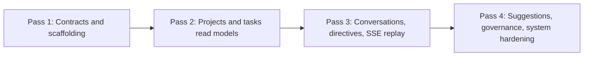

# API and data-model extensions for the Corbusier backend

## Executive summary

The corbusier-mockup front end encodes a data-model-driven UI contract: cards
and screens render from concrete domain entities that already include localized
strings, stable descriptor identifiers (labels, priorities, health statuses),
and structured timelines and dependency graphs. The mockup explicitly expects
project and task primitives, a conversation subsystem with tool-run cards and
slash-command metadata, a directives registry, AI suggestions, and "System"
registry pages (personnel, agent backends, Model Context Protocol (MCP) tool
registry, hooks and policies, monitoring, and tenant management).

The existing Corbusier backend already has several strong anchors: a task
aggregate with a typed state machine and origin metadata, a message subsystem
with immutable messages, polymorphic content parts (text, tool call, tool
result, and attachments), handoff metadata, and a slash-command grammar and
schema validation; plus agent backend registrations, tenant primitives, an MCP
tool registry with lifecycle, health, and audit, and a cross-cutting
`RequestContext` that carries tenant, correlation, causation, user, and session
identifiers.

The gap is not merely "add a couple of HTTP endpoints". The gap is an
orchestration read-model tier: projects, plans, governance, identity, and
suggestions must exist as bounded contexts, and the backend must publish a
stable HTTP+SSE surface designed for TanStack Query caching and keyset/cursor
pagination (as defined in Wildside) while preserving Corbusier's event-driven
design.

Recommendations:

- Extend the domain with new aggregates: **project**, **plan**, **identity**,
  **governance**, **suggestion**, plus **events** (event store + Server-Sent
  Events (SSE)) and **projections** (query-optimized Data Transfer Objects
  (DTOs) matching the mockup cards).
- Preserve the existing aggregates unchanged where possible, and migrate by
  additive schema, backfill, and dual-read.
- Reuse Wildside patterns directly: a reusable cursor-pagination crate API and
  envelope, centralized error schema and idempotency key semantics, and (for
  streaming) explicit event identifiers plus replay semantics compatible with
  EventSource `Last-Event-ID`.

### Assumptions

The auth scheme, user directory, and tenant model are not fixed by this
document. The following assumptions apply:

- Initial "single owning user per tenant" remains true.
- API auth starts with a session cookie or API key.
- The system tolerates initially sparse localization (en-GB only), while
  keeping the schema capable of multi-locale payloads.

## Front-end contract distilled from corbusier-mockup

The mockup's site map and card inventory make the backend expectations
unusually concrete:

- **Dashboard**: system health, Key Performance Indicator (KPI) panels, recent
  activity feed, agent utilization summary; explicitly fed by SSE from
  `/api/v1/events`.
- **My Tasks**: filterable task list; task detail view expects state-machine
  controls based on validity (`can_transition_to`), dependency panels, a
  hierarchy view (Goal, Idea, Step, Task), branch and Pull Request (PR)
  association, and an activity timeline built from domain events filtered by
  aggregate and task identifier.
- **Projects**: project list cards, a project landing with multiple views
  (backlog, Kanban, calendar, list, timeline/Gantt), plus a dedicated "Task
  Dependencies" view and project-scoped conversations and directives.
- **Conversations**: message timeline with role-colouring, tool execution
  cards, slash-command input and parameter forms, and handoff annotations when
  the agent backend changes mid-stream.
- **AI Suggestions**: suggestion cards with confidence, priority grouping,
  recommended assignees, and "Add to Backlog" or "Dismiss" actions.
- **System pages**: personnel directory, agent backend registry, MCP tool
  registry with server lifecycle plus tool catalogue plus health history, hooks
  and policies, monitoring, tenant management, plus settings pages for auth and
  session management.

The v2a (df12 Productions' pattern for offline-first progressive web
applications) stack document clarifies why the backend surface must be designed
for reuse: the intended "full v2a" application stack uses Zustand for client
and UI state and TanStack Query for server state, with Dexie and XState in the
wider architecture. That implies the backend should provide: stable
resource-shaped endpoints, cache-friendly list and detail separation,
cursor-pagination, and event-driven invalidation signals.

Finally, the data-model-driven card architecture document sets a strict rule:
entity models carry their own localized names, descriptions, and badges, and
numeric values should be stored in Système international (SI) base units; UI
chrome remains in the translation bundles. This drives both persistence choices
(likely JSONB localization blocks) and DTO composition (entities arrive "fully
formed").

## Existing Corbusier artefacts and the design gaps they imply

### Artefacts to keep

These already exist in Corbusier today and should remain the backbone of the
extended system:

- **task** -- Task aggregate, origin from external issues, branch and PR
  association, typed state transitions, and lifecycle timestamps. See
  corbusier-design.md SS4.3.1.2.
- **message** -- Message aggregate with immutable messages, conversation and
  turn identifiers, role typing, structured content parts, metadata (tool
  audits, agent backend, handoffs, slash-command expansion), and a
  slash-command subdomain (definition, schema, parser, and execution). See
  corbusier-design.md SS2.2.1 and SS2.1.1.
- **agent_backend** -- Agent backend registration aggregate with lifecycle
  status and capabilities. See corbusier-design.md SS2.2.3.
- **tenant** -- Tenant aggregate with "one owning user per tenant" shape and
  lifecycle status. See corbusier-design.md SS2.2.5.
- **tool_registry** -- MCP server registration (transport, lifecycle, and
  health), tool definitions with schema, policy decision types, and rich
  tool-call audit records. See corbusier-design.md SS2.2.4.
- **request_context** -- Cross-cutting context with tenant, correlation,
  causation, user, and session identifiers; already intended to be required by
  tenant-owned operations. See corbusier-design.md SS2.2.5.

This matches Corbusier's own architectural intent: event-driven plus hexagonal
boundaries, tenant-scoped persistence concepts, and SSE stream event types
already sketched in the design document.

### Gaps relative to the mockup contract

The mockup expects first-class **project**, **plan**, **identity/personnel**,
**governance (hooks/policies)**, and **suggestions** artefacts, and it expects
query projections that return composite "cards" (task list cards, dependency
cards, project cards, suggestion cards, and activity entries). None of those
are currently modelled as aggregates in Corbusier code.

The second gap is **API formalization**: Wildside already publishes an OpenAPI
schema with a centralized error type and a session-cookie security scheme, plus
idempotency headers on mutation endpoints. Corbusier should adopt the same
rigour early to keep the v2a front-end reusable across apps.

The third gap is **pagination and streaming semantics**: Wildside has an
explicit design for a reusable keyset pagination crate (opaque cursors,
envelope format, hypermedia links, and "no total counts"). The mockup requires
this for task and project lists and activity feeds; the backend should
implement it in a reusable crate and expose the envelope contract in OpenAPI.

## Proposed new modules and domain extensions

### Module inventory

The proposed additions are:

- **project** -- project aggregate, membership, status, date range, and task
  grouping.
- **plan** -- planning artefacts: plan documents, plan steps, plan reviews,
  plan execution binding to tasks.
- **review** -- canonical review threads, anchors, sync checkpoints,
  verification state, and outbound reply workflows backed by Frankie adapter
  services.
- **projections** -- read models and DTOs optimized for mockup screens and card
  rendering.
- **governance** -- hooks, policies, policy decisions, and compliance/audit
  readouts.
- **identity** -- users, roles, sessions, and API keys (backing "personnel" and
  "settings/auth").
- **suggestion** -- AI suggestions and their accept/dismiss lifecycle.
- **api/http** -- versioned REST surface plus OpenAPI generation and shared
  error contract.
- **events** -- persisted domain events plus SSE streaming (with replay
  support).

### Guiding principle

Aggregates remain write-side consistency boundaries; projections are read-side
shapes designed to match the v2a card models and TanStack Query caches.

### Task domain

#### Current model (keep, then extend)

Corbusier currently has:

- `Task { id, origin, branch_ref, pull_request_ref, state, created_at,
  updated_at }`
- `TaskOrigin::Issue { issue_ref, metadata }`
- `TaskState` with `Draft`, `InProgress`, `InReview`, `Paused`, `Done`,
  `Abandoned` and a typed transition matrix (`can_transition_to`).

See corbusier-design.md SS4.3.1.2.

#### Problem

The mockup's Kanban expects a "Planned" column distinct from "To-Do (draft)"
and also expects hierarchy, subtasks, dependencies, priority, labels, assignee,
due date, estimate, and an activity log.

#### Task aggregate model

```rust,no_run
use chrono::{DateTime, Utc};
use serde::{Deserialize, Serialize};
use serde_json::Value;
use uuid::Uuid;

#[derive(Debug, Clone, Copy, PartialEq, Eq, Hash, Serialize, Deserialize)]
#[serde(rename_all = "snake_case")]
pub enum TaskStateV2 {
    Draft,
    Planned,
    InProgress,
    InReview,
    Paused,
    Done,
    Abandoned,
}

#[derive(Debug, Clone, Copy, PartialEq, Eq, Hash, Serialize, Deserialize)]
#[serde(rename_all = "snake_case")]
pub enum TaskPriority {
    P0,
    P1,
    P2,
    P3,
}

#[derive(Debug, Clone, PartialEq, Eq, Serialize, Deserialize)]
pub struct LocalizedStringSet {
    pub name: String,
    pub description: Option<String>,
    pub short_label: Option<String>,
}

/// Constrained at validation boundary.
pub type LocaleCode = String;
pub type EntityLocalizations =
    std::collections::BTreeMap<LocaleCode, LocalizedStringSet>;

#[derive(Debug, Clone, PartialEq, Eq, Serialize, Deserialize)]
pub struct TaskLabels {
    /// Resolved via descriptor registry.
    pub label_ids: Vec<String>,
}

#[derive(Debug, Clone, PartialEq, Eq, Serialize, Deserialize)]
pub struct TaskAssignment {
    pub assignee_user_id: Option<Uuid>,
}

#[derive(Debug, Clone, PartialEq, Eq, Serialize, Deserialize)]
pub struct TaskScheduling {
    pub due_date: Option<DateTime<Utc>>,
    pub planned_start: Option<DateTime<Utc>>,
    pub planned_end: Option<DateTime<Utc>>,
    /// Keep as string initially to match mockup.
    pub estimate: Option<String>,
}

#[derive(Debug, Clone, PartialEq, Eq, Serialize, Deserialize)]
pub struct TaskLinks {
    pub branch_ref: Option<String>,
    pub pull_request_ref: Option<String>,
}

#[derive(Debug, Clone, PartialEq, Eq, Serialize, Deserialize)]
pub struct TaskHierarchyRef {
    pub goal_id: Option<Uuid>,
    pub idea_id: Option<Uuid>,
    pub step_id: Option<Uuid>,
    pub parent_task_id: Option<Uuid>,
}

#[derive(Debug, Clone, PartialEq, Eq, Serialize, Deserialize)]
pub struct TaskAggregateV2 {
    pub id: Uuid,
    pub tenant_id: Uuid,
    pub project_slug: String,

    /// Preserve existing JSONB origin model; validate schema.
    pub origin: Value,
    pub localizations: EntityLocalizations,

    pub state: TaskStateV2,
    pub priority: TaskPriority,

    pub labels: TaskLabels,
    pub assignment: TaskAssignment,
    pub scheduling: TaskScheduling,
    pub links: TaskLinks,
    pub hierarchy: TaskHierarchyRef,

    pub created_at: DateTime<Utc>,
    pub updated_at: DateTime<Utc>,
}
```

#### Task invariants

- `project_slug` is required and immutable once a task becomes `Planned` or
  later.
- `localizations` must include at least `en-GB.name`; additional locales are
  optional at first but the schema is capable of multi-locale payloads (the
  mockup requires entities "own their names/descriptions per locale").
- `TaskStateV2` transition rules must remain explicit and unit-tested
  (mirroring the existing `can_transition_to` ethos). See corbusier-design.md
  SS4.3.1.2.
- `Planned` implies `planned_start` or `planned_end` is set (otherwise it is
  indistinguishable from `Draft` in the UI).
- `Paused` is non-terminal and must preserve prior "working state" so "resume"
  returns to the correct state (implementation: store
  `paused_from: Option<TaskStateV2>` in persistence, not necessarily in the
  DTO).

#### Lifecycle and transition rules

- `Draft` to `Planned` when a human (or policy) schedules and commits the
  task.
- `Planned` to `InProgress` when work starts.
- `InReview` to `InProgress` when changes are requested.
- `Done` and `Abandoned` are terminal (carried over from existing semantics).
  See corbusier-design.md SS4.3.1.2.

#### Projection DTOs required by mockup pages

The mockup enumerates these task-facing projections:

- `TaskCardDto` for task list and Kanban cards: title and description, state,
  priority, category and labels, progress percentage, assignee avatars, and
  task identifier.
- `TaskDetailDto`: header, metadata panel, dependency panels, state-machine
  controls, activity timeline, branch and PR refs, subtasks list, hierarchy
  breadcrumb, and "related tasks in same step".
- `TaskDependenciesDto`: hierarchy view, dependency graph, and current focus
  panel.

Concretely:

```rust,no_run
#[derive(Debug, Clone, Serialize)]
pub struct TaskCardDto {
    /// For example, "TASK-1001" (mockup convention).
    pub id: String,
    pub localizations: EntityLocalizations,
    pub state: TaskStateV2,
    pub priority: TaskPriority,
    pub project_slug: String,
    pub assignee: Option<UserBadgeDto>,
    pub progress_percent: u8,
    pub label_ids: Vec<String>,
}

#[derive(Debug, Clone, Serialize)]
pub struct TaskDetailDto {
    pub task: TaskCardDto,
    /// ISO 8601 to match mockup.
    pub due_date: Option<String>,
    pub estimate: Option<String>,
    pub branch_ref: Option<String>,
    pub pull_request_ref: Option<String>,

    pub hierarchy: TaskHierarchyDto,
    pub subtasks: Vec<SubtaskDto>,
    pub dependencies: TaskDependenciesPanelDto,

    pub valid_transitions: Vec<TaskStateV2>,
    pub activity: Vec<ActivityEventDto>,
}
```

#### Current versus proposed task states

_Table 1.1.1: Current versus proposed task states._

| Aspect                    | Current (`TaskState`) | Proposed (`TaskStateV2`) | UI implication                                |
| ------------------------- | --------------------- | ------------------------ | --------------------------------------------- |
| Unscheduled backlog       | `draft`               | `draft`                  | "To-Do" column / backlog list                 |
| Scheduled but not started | _missing_             | `planned`                | Needed for explicit "Planned" column          |
| Active work               | `in_progress`         | `in_progress`            | "In Progress" column                          |
| Review                    | `in_review`           | `in_review`              | "In Review" column                            |
| Paused                    | `paused`              | `paused`                 | Filter/badge; not necessarily a Kanban column |
| Completed                 | `done`                | `done`                   | "Done" column                                 |
| Abandoned                 | `abandoned`           | `abandoned`              | Hidden by default; terminal                   |

#### Migration strategy from current models

- Schema: add new columns and tables rather than rewriting the existing task
  table. Corbusier's design already anticipates JSONB origins and tenant
  scoping; keep origin as-is and add the missing fields as additive JSONB or
  columns.
- Backfill: derive `localizations["en-GB"].name` from the stored
  `IssueSnapshot` title in `TaskOrigin::Issue` (existing metadata snapshot).
- State: map old `Draft`, `InProgress`, `InReview`, `Paused`, `Done`,
  `Abandoned` to `TaskStateV2` directly; introduce `Planned` only for tasks
  that receive scheduling data. Until then, the Kanban "Planned" column can be
  empty without breaking old tasks.

### Review domain

#### Guiding rule

Keep `TaskState` coarse. The task aggregate should continue to signal broad
workflow status such as `InReview`, while review-specific detail lives in a
sibling review bounded context and its projections.

#### Proposed write-side model

```rust,no_run
use std::path::PathBuf;

use chrono::{DateTime, Utc};
use serde::{Deserialize, Serialize};
use serde_json::Value;
use uuid::Uuid;

#[derive(Debug, Clone, PartialEq, Eq, Serialize, Deserialize)]
#[serde(rename_all = "snake_case")]
pub enum ReviewThreadStatus {
    Open,
    AwaitingAgent,
    AwaitingReviewer,
    Resolved,
    Closed,
}

/// Verification status for a review comment or thread.
/// Maps to the `review_verification_results.status` column CHECK constraint.
#[derive(Debug, Clone, Copy, PartialEq, Eq, Serialize, Deserialize)]
#[serde(rename_all = "snake_case")]
pub enum ReviewVerificationStatus {
    Pending,
    Verified,
    Rejected,
    Error,
}

#[derive(Debug, Clone, PartialEq, Eq, Serialize, Deserialize)]
pub struct ReviewSyncCheckpointEnvelope {
    pub version: u16,
    pub provider: String,
    pub payload: Value,
}

/// Anchor metadata derived from review-comment file position.
/// Definitive field-level documentation: corbusier-design.md §6.3.2
/// (Review Comment Processing, `ReviewAnchor` struct).
#[derive(Debug, Clone, PartialEq, Eq, Serialize, Deserialize)]
pub struct ReviewAnchor {
    pub commit_sha: String,
    pub file_path: PathBuf,
    pub original_line: u32,
    pub diff_hunk: Option<String>,
}

#[derive(Debug, Clone, PartialEq, Eq, Serialize, Deserialize)]
pub struct ReviewThreadAggregate {
    pub id: Uuid,
    pub tenant_id: Uuid,
    pub task_id: Uuid,
    pub conversation_id: Option<Uuid>,
    pub pull_request_ref: String,
    pub provider: String,
    pub external_root_comment_id: String,
    pub status: ReviewThreadStatus,
    pub anchor: Option<ReviewAnchor>,
    pub verification_status: ReviewVerificationStatus,
    pub pending_outbound_reply: Option<String>,
    pub last_reviewer_action: Option<String>,
    pub last_synced_checkpoint: Option<ReviewSyncCheckpointEnvelope>,
    pub created_at: DateTime<Utc>,
    pub updated_at: DateTime<Utc>,
}
```

#### Key invariants

- Corbusier owns the canonical review workflow projection and its durability.
- Frankie remains an adapter for GitHub review sync, context materialization,
  verification, and reply submission.
- The durable thread identity is tenant-scoped and provider-scoped:
  `(tenant_id, provider, pull_request_ref, external_root_comment_id)` must be
  unique even though the storage model also keeps `(id, tenant_id)` available
  for composite foreign keys.
- Persistent review-thread status values must use the same snake_case enum
  vocabulary in SQL and Rust: `open`, `awaiting_agent`, `awaiting_reviewer`,
  `resolved`, and `closed`.
- Sync checkpoints must be stored as a versioned provider envelope rather than
  an unstructured JSON blob, so migrations and sync debugging can reason about
  the provider payload shape.
- Review-linked conversation messages must preserve structured linkage under
  the reserved, versioned key `"review.linkage.v1"` inside
  `MessageMetadata.extensions` rather than flattening anchor metadata into the
  top-level JSON object or into free text.  The extensions map must be
  serialized as an explicit `"extensions"` field (not via `serde(flatten)`) so
  that workflow-specific keys never collide with known struct fields.

#### Projection DTOs

- `ReviewThreadDto` for task and PR detail screens: root comment, replies,
  reviewer identity, anchor, verification state, and pending reply status.
  Returned by `GET /api/v1/reviews/threads/{thread_id}`.
- `ReviewInboxDto` for review queues: open-thread counts, unresolved anchors,
  and last sync checkpoint per pull request.  Returned by
  `GET /api/v1/reviews/inbox?limit=&cursor=` (paginated, user-scoped).  The
  inbox is implicitly scoped to `RequestContext.user_id` (the authenticated
  principal); the server enforces that the query reflects the principal's
  review queue.  Admin-only override: users with the `review-admin` role may
  specify `user={user_id}` to view another user's inbox; regular users receive
  a 403 Forbidden if they attempt to supply a `user` parameter.

### Project domain

#### Project write-side model

Projects appear in multiple screens with a stable `slug` and localized name and
description, plus lead, date range, status, and team.

```rust,no_run
#[derive(Debug, Clone, Copy, PartialEq, Eq, Serialize, Deserialize)]
#[serde(rename_all = "snake_case")]
pub enum ProjectStatus {
    Active,
    Inactive,
    Completed,
}

#[derive(Debug, Clone, Serialize, Deserialize)]
pub struct ProjectAggregate {
    pub tenant_id: Uuid,
    /// Stable URL key.
    pub slug: String,

    pub localizations: EntityLocalizations,

    pub lead_user_id: Option<Uuid>,
    pub team_user_ids: Vec<Uuid>,

    pub start_date: Option<DateTime<Utc>>,
    pub end_date: Option<DateTime<Utc>>,

    pub status: ProjectStatus,

    pub created_at: DateTime<Utc>,
    pub updated_at: DateTime<Utc>,
}
```

#### Project invariants

- `slug` is unique per tenant and immutable after creation.
- If `status == Completed` then `end_date` should be set (or the UI cannot
  render the "date range" robustly).
- Team membership must be a subset of valid tenant users (identity domain).

#### Lifecycle rules

`Active` may transition to `Inactive`, `Inactive` to `Active` or `Completed`;
`Completed` is terminal absent explicit "reopen" semantics.

#### Project projections

- `ProjectCardDto` (project list): slug, localized name, lead badge, date
  range, status badge, and team avatar stack.
- `ProjectLandingDto`: header plus counts per task state and available views.
- `ProjectKanbanDto`: five columns with tasks in each.

#### Project migration

No current project model exists; bootstrap by creating one "default project"
per tenant and attaching existing tasks to it (or infer from the repository or
provider in the issue origin).

### Plan domain

This domain exists because the product requires a reviewed plan-building phase
distinct from execution. The mockup already implies "steps" and hierarchy
(Goal, Idea, Step, Task), and the earlier process review implies a first-class
bucket a developer can pull from.

#### Plan write-side model

```rust,no_run
#[derive(Debug, Clone, Copy, PartialEq, Eq, Serialize, Deserialize)]
#[serde(rename_all = "snake_case")]
pub enum PlanStatus {
    Draft,
    InReview,
    Approved,
    Superseded,
    Abandoned,
}

#[derive(Debug, Clone, Serialize, Deserialize)]
pub struct PlanStep {
    pub step_id: Uuid,
    pub localizations: EntityLocalizations,
    pub order: i32,
    /// Short rationale.
    pub intent: String,
    pub acceptance_criteria: Vec<String>,
    /// Generated tasks.
    pub task_ids: Vec<Uuid>,
}

#[derive(Debug, Clone, Serialize, Deserialize)]
pub struct PlanAggregate {
    pub id: Uuid,
    pub tenant_id: Uuid,
    pub project_slug: String,

    /// Plan name and summary per locale.
    pub localizations: EntityLocalizations,

    pub status: PlanStatus,
    /// Monotonically increasing per project.
    pub version: i32,
    pub author_user_id: Option<Uuid>,

    pub steps: Vec<PlanStep>,
    pub governance: PlanGovernance,

    pub created_at: DateTime<Utc>,
    pub updated_at: DateTime<Utc>,
}

#[derive(Debug, Clone, Serialize, Deserialize)]
pub struct PlanGovernance {
    pub required_reviewers: Vec<Uuid>,
    pub approvals: Vec<PlanApproval>,
}

#[derive(Debug, Clone, Serialize, Deserialize)]
pub struct PlanApproval {
    pub reviewer_user_id: Uuid,
    pub approved_at: DateTime<Utc>,
    pub note: Option<String>,
}
```

#### Plan invariants

- Exactly one `Approved` plan per `(tenant_id, project_slug)` at a time.
- `Approved` plans are immutable in content (only superseded).
- Ordering: `PlanStep.order` must be contiguous and unique within the plan.

#### Plan lifecycle

`Draft` to `InReview` to `Approved` to `Superseded`, with `Abandoned` reachable
from non-terminal states.

#### Plan statuses

_Table 1.1.2: Plan statuses and allowed transitions._

| Plan status  | Meaning                           | Allowed transitions                 | Developer-facing implication  |
| ------------ | --------------------------------- | ----------------------------------- | ----------------------------- |
| `draft`      | Plan is being constructed         | to `in_review`, `abandoned`         | Not pullable for execution    |
| `in_review`  | Awaiting human review             | to `approved`, `draft`, `abandoned` | Review workflow, comments     |
| `approved`   | Execution-ready and frozen        | to `superseded`                     | "Planned bucket" to pull from |
| `superseded` | Replaced by a newer approved plan | terminal                            | Keep for audit/history        |
| `abandoned`  | Discarded                         | terminal                            | Visible only in history       |

#### Plan projections

- `PlanSummaryDto` per project: current plan status, last updated, step count,
  and unassigned tasks count.
- `HierarchyDto` to drive Goal, Idea, and Step breadcrumbs for the task detail
  and dependency views.

#### Plan migration

Create a baseline `Approved` plan per project containing "legacy tasks" as a
single step, then evolve as planning features ship.

### Conversation domain

Corbusier's message domain already provides the core primitives needed for the
conversation UI: immutable messages with roles, structured content parts
(including tool call and tool result parts), metadata including agent backend
and handoff metadata, and turn and session identifiers. See corbusier-design.md
SS2.2.1.

The missing piece is a conversation aggregate to link conversations to tasks
and projects and to provide list and detail query surfaces.

#### Write-side model (new module, reuse existing identifiers)

```rust,no_run
#[derive(Debug, Clone, Copy, PartialEq, Eq, Serialize, Deserialize)]
#[serde(rename_all = "snake_case")]
pub enum ConversationStatus {
    Active,
    Archived,
}

#[derive(Debug, Clone, Serialize, Deserialize)]
pub struct ConversationAggregate {
    /// Or reuse ConversationId inner UUID.
    pub id: uuid::Uuid,
    pub tenant_id: Uuid,

    pub project_slug: String,
    pub task_id: Option<Uuid>,

    /// Optional; can be derived.
    pub title: Option<String>,
    pub status: ConversationStatus,

    pub created_at: DateTime<Utc>,
    pub updated_at: DateTime<Utc>,
}
```

#### Conversation invariants

- `(tenant_id, id)` uniquely identifies a conversation; messages reference
  conversations with tenant consistency (matching Corbusier design intent).
- Messages are append-only and ordered by `SequenceNumber` (already a domain
  rule).

#### Conversation projections

- `ConversationListItemDto`: conversation identifier, associated task
  identifier (if any), last message preview, last updated, and agent/backend
  badge.
- `ConversationDetailDto`: message timeline rendering-ready: each message plus
  role plus content parts plus tool audit metadata plus handoff markers plus
  slash command expansion.

#### Conversation migration

Backfill conversations by grouping existing messages by `conversation_id`
(already present on `Message`). Where no conversation row exists, create it
lazily on first query.

### Directives domain

The UI's "Directives Registry" is functionally a persisted, queryable registry
of `SlashCommandDefinition` objects, scoped at least to project and tenant. The
message domain already provides the definition and parser primitives (the
grammar `/ key=value key2="quoted value"`), and schema validation for
parameters. See corbusier-design.md SS2.1.1.

#### Directive write-side model

```rust,no_run
#[derive(Debug, Clone, Serialize, Deserialize)]
pub struct DirectiveAggregate {
    pub id: Uuid,
    pub tenant_id: Uuid,
    /// `None` means global directive.
    pub project_slug: Option<String>,

    /// No leading slash, lowercased.
    pub command: String,
    pub definition:
        corbusier::message::domain::SlashCommandDefinition,

    pub enabled: bool,
    pub created_at: DateTime<Utc>,
    pub updated_at: DateTime<Utc>,
}
```

#### Directive invariants

- Unique `(tenant_id, project_slug, command)` among enabled directives.
- `definition.validate_schema()` must pass at write time (reusing existing
  message-domain schema checks).

#### Directive lifecycle

Enable and disable; "delete" becomes "disabled" to preserve auditability.

#### Directive projections

- `DirectiveCardDto`: name, required and optional params, example expansions,
  and template preview.

#### Directive migration

Seed directives from the existing in-memory registry (if present) or ship with
core directives (`/task`, `/review`) as bootstrap; the mockup explicitly
expects a registry view.

### Identity domain

The mockup includes a personnel directory and settings for auth and sessions
(API keys and tokens). Corbusier currently has `UserId` in `RequestContext`,
and tenants have an `owner_user_id`, but there is no first-class user
aggregate. See corbusier-design.md SS2.2.5.

#### Identity write-side model

```rust,no_run
#[derive(
    Debug, Clone, Copy, PartialEq, Eq, Serialize, Deserialize,
)]
#[serde(rename_all = "snake_case")]
pub enum UserRole {
    User,
    TeamLead,
    Admin,
}

#[derive(Debug, Clone, Serialize, Deserialize)]
pub struct UserAggregate {
    pub id: Uuid,
    pub tenant_id: Uuid,

    pub display_name: String,
    pub email: Option<String>,
    pub avatar_url: Option<String>,

    pub role: UserRole,

    pub created_at: DateTime<Utc>,
    pub updated_at: DateTime<Utc>,
    pub last_active_at: Option<DateTime<Utc>>,
}

#[derive(Debug, Clone, Serialize, Deserialize)]
pub struct ApiKey {
    pub id: Uuid,
    pub tenant_id: Uuid,
    pub user_id: Uuid,

    pub name: String,
    /// Never store raw keys.
    pub key_hash: String,
    pub created_at: DateTime<Utc>,
    pub last_used_at: Option<DateTime<Utc>>,
    pub revoked_at: Option<DateTime<Utc>>,
}
```

#### Identity invariants

- User identifiers are unique per tenant and must align with the
  `RequestContext.user_id` space.
- API keys are write-once; "revoke" sets `revoked_at` and blocks use.

#### Identity migration

Create the tenant owner user as the first `UserAggregate` row for each tenant.

### Governance domain

The mockup expects hooks and policies editor pages and compliance reporting.
Corbusier's design document already frames hooks, policies, and audit/event
capture as core "tool plane and workflow governance" work, and the tool
registry already produces auditable tool call records and policy decisions. See
corbusier-design.md SS2.1.3 and SS6.4.2.

#### Write-side model (minimal v1)

```rust,no_run
#[derive(Debug, Clone, Serialize, Deserialize)]
pub struct PolicyAggregate {
    pub id: Uuid,
    pub tenant_id: Uuid,
    pub project_slug: Option<String>,

    pub name: String,
    pub description: String,
    pub enabled: bool,

    /// Keep policy language flexible initially.
    pub rules_json: serde_json::Value,
    pub created_at: DateTime<Utc>,
    pub updated_at: DateTime<Utc>,
}

#[derive(Debug, Clone, Serialize, Deserialize)]
pub struct HookAggregate {
    pub id: Uuid,
    pub tenant_id: Uuid,
    /// For example, "pr_opened", "merge", or "deploy".
    pub trigger: String,
    pub enabled: bool,

    pub predicate_json: serde_json::Value,
    pub actions_json: serde_json::Value,

    pub created_at: DateTime<Utc>,
    pub updated_at: DateTime<Utc>,
}

#[derive(Debug, Clone, Serialize, Deserialize)]
pub struct PolicyViolation {
    pub id: Uuid,
    pub tenant_id: Uuid,
    pub occurred_at: DateTime<Utc>,

    pub policy_id: Uuid,
    /// For example, "task", "conversation", or "tool_call".
    pub subject_type: String,
    pub subject_id: Uuid,

    pub reason: String,
    pub details: serde_json::Value,
}
```

#### Governance projections

- `HookCardDto`, `PolicyCardDto`, and `ComplianceReportDto` for system pages.
- Audit trail report from `domain_events` and `audit_logs` tables (already
  envisaged). See corbusier-design.md SS6.4.2.5.

#### Governance migration

Start by only recording policy decisions and tool call audits (already
available), then add hook and policy Create, Read, Update, Delete (CRUD) behind
admin roles.

### Suggestions domain

The UI demands a suggestion list grouped by priority, each suggestion
containing project badge, tags, confidence, rationale, dependency context,
estimated duration, suggested assignees, and actions.

#### Suggestion write-side model

```rust,no_run
#[derive(
    Debug, Clone, Copy, PartialEq, Eq, Serialize, Deserialize,
)]
#[serde(rename_all = "snake_case")]
pub enum SuggestionStatus {
    Proposed,
    /// Converted into a backlog task.
    Accepted,
    Dismissed,
}

#[derive(
    Debug, Clone, Copy, PartialEq, Eq, Serialize, Deserialize,
)]
#[serde(rename_all = "snake_case")]
pub enum SuggestionPriority {
    High,
    Medium,
    Low,
}

#[derive(Debug, Clone, Serialize, Deserialize)]
pub struct SuggestionAggregate {
    pub id: Uuid,
    pub tenant_id: Uuid,
    pub project_slug: String,

    pub localizations: EntityLocalizations,
    pub priority: SuggestionPriority,
    /// Range 0.0 to 1.0 inclusive.
    pub confidence: f32,

    pub category_tags: Vec<String>,
    pub rationale: String,
    pub dependency_context: serde_json::Value,

    pub estimated_duration: Option<String>,
    pub suggested_assignee_user_ids: Vec<Uuid>,

    pub status: SuggestionStatus,
    pub created_at: DateTime<Utc>,
    pub updated_at: DateTime<Utc>,
}
```

#### Suggestion invariants

- `confidence` in `[0.0, 1.0]`.
- Once `Accepted`, record the created `task_id` (either as a field or in an
  event) and prevent further edits besides archival metadata.

#### Suggestion projections

- `SuggestionCardDto` matching the mockup fields, including "Add to Backlog"
  action link.

#### Suggestion migration

Initial implementation can generate suggestions from static rules or offline
analysis jobs; the key is the lifecycle and DTO contract, not the machine
learning sophistication.

## HTTP API surface, pagination, SSE, and error contracts

### Versioning, auth, and request context

**Versioning:** adopt `/api/v1` as the stable prefix, matching Wildside and the
mockup (for example, `GET /api/v1/tasks/:id`, `SSE /api/v1/events`).

**Auth (assumption):** start with a session cookie or API key. Wildside's
OpenAPI uses a cookie-based `SessionCookie` security scheme issued by
`POST /api/v1/login`. This is a pragmatic default because EventSource cannot
reliably set arbitrary `Authorization` headers in browsers, while cookies work
naturally for SSE.

**Tenant scoping:** every tenant-owned endpoint must resolve `RequestContext`
(tenant_id, correlation_id, causation_id, user_id, and session_id) and apply it
consistently, as already required by Corbusier's multi-tenancy design. The
following tenant-isolation rules are non-negotiable:

- `RequestContext.tenant_id` is mandatory for every registry and log/store
  operation; handlers must reject requests where tenant context is absent or
  ambiguous.
- **Tool registry writes** (`ToolRegistry.create`, `ToolRegistry.update`) must
  enforce a uniqueness constraint on `(tenant_id, tool_name)` so that tool
  names are unique within a tenant but may collide across tenants.
- **Tool catalogue and audit reads** must scope queries by
  `RequestContext.tenant_id`; a request must never return tools, audit records,
  or health data belonging to another tenant.
- **Log and store APIs** (`LogStore.put`, `LogStore.get`, and equivalents) must
  prefix or namespace all object keys by `RequestContext.tenant_id` to prevent
  cross-tenant key collision or data leakage. Concrete key format:
  `{tenant_id}/{object_type}/{object_id}`.

### Error and validation contract

Reuse Wildside's centralized error payload pattern:

```json
{
  "code": "invalid_request",
  "message": "missing required field: projectSlug",
  "traceId": "01HZY8B2W6X5Y7Z9ABCD1234",
  "details": {
    "field": "projectSlug"
  }
}
```

Wildside defines a stable enum of error codes (`invalid_request`,
`unauthorized`, `forbidden`, `not_found`, `conflict`, `service_unavailable`,
and `internal_error`) and an Error schema with `code`, `message`, optional
`traceId`, and optional `details`.

Recommendation: define `corbusier_api::ErrorCode` as a superset of Wildside's
set (keep compatibility), and include structured validation errors under
`details` rather than string-parsing on the client.

### Pagination semantics

Adopt the Wildside keyset pagination crate design as the server contract, even
if the first endpoints are simple lists:

- Cursor-based (keyset) pagination, cursor tokens opaque to clients.
- Envelope response containing `data` and pagination metadata.
- Hypermedia "self/next/prev" links.
- Avoid total counts; absence of `next` indicates end-of-list.

Concrete API shape (recommended):

```json
{
  "data": [],
  "limit": 50,
  "links": {
    "self": "/api/v1/tasks?limit=50",
    "next": "/api/v1/tasks?limit=50&cursor=eyJkaXIiOiJOZXh0Iiwia2V5Ijp7...",
    "prev": null
  }
}
```

This maps cleanly onto TanStack Query "infinite queries" and prevents offset
paging anomalies.

### Idempotency for mutation endpoints

Wildside's OpenAPI annotates an `Idempotency-Key` header (UUID) on mutation
endpoints like `POST /api/v1/routes/{route_id}/notes` and
`PUT /api/v1/routes/{route_id}/progress`.

Recommendation: Corbusier should require (or strongly encourage)
`Idempotency-Key` for:

- `POST /api/v1/tasks` (create)
- `POST /api/v1/tasks/{id}/subtasks`
- `POST /api/v1/conversations/{id}/messages`
- `POST /api/v1/suggestions/{id}/accept` (creates a task)
- "start/stop" operations on tool registry servers

This matters because user-driven UIs plus flaky networks plus retries produce
duplicates otherwise.

### SSE event stream and replay semantics

Corbusier's design already sketches SSE streaming for conversation events with
event types like `TurnStarted`, `ToolCallInitiated`, `ToolExecutionComplete`,
`TurnCompleted`, and `Error`. See corbusier-design.md SS6.2.2.

The mockup additionally expects system-wide activity and dashboard updates over
SSE from `/api/v1/events`.

To make SSE robust for real clients, two standards matter:

- The HTML Standard[^1] defines the `Last-Event-ID` request header and the
  server-sent event stream format, including reconnection behaviour.
- The MDN Web Docs[^2] document that including an `id:` field in the stream
  updates the EventSource object's last event identifier, enabling reconnection
  with `Last-Event-ID`.

Additionally, the MCP transport specification explicitly recommends using
`Last-Event-ID` for resuming SSE streams and allows replaying messages after
the last seen identifier. That aligns tightly with Corbusier's "tool plane"
focus and is a good precedent for replay semantics.

#### Recommended SSE endpoints

- `GET /api/v1/events` -- tenant-scoped global stream (dashboard activity,
  system health changes, task, and project changes).
- `GET /api/v1/events/conversations/{conversation_id}` -- conversation-only
  stream (turn, tool, message, and handoff events).
- `GET /api/v1/events/tasks/{task_id}` -- task-specific stream (state
  transitions, dependency changes, and comments). Optional for v1; the
  conversation stream may suffice initially.

#### Event shape

Use a stable event envelope compatible with existing Corbusier `StreamEvent`
tagging:

```json
{
  "event_type": "task_state_changed",
  "data": {
    "tenant_id": "...",
    "task_id": "...",
    "from": "planned",
    "to": "in_progress",
    "timestamp": "2026-03-16T12:34:56Z",
    "correlation_id": "...",
    "causation_id": "..."
  }
}
```

SSE wire format example:

```plaintext
id: 01J123ABCDEF...
event: task_state_changed
data: {"event_type":"task_state_changed","data":{...}}
```

- `id:` must be an event identifier without LF, CR, or NULL constraints per
  the HTML spec; use a Universally Unique Lexicographically Sortable Identifier
  (ULID), UUID, or base64url token.[^1]
- On reconnect, clients send `Last-Event-ID`; the server replays from the next
  event if it still has it, else emits a `stream_reset` event that forces the
  client to refetch canonical state. (The HTML spec does not fully standardize
  "what if it's gone", so define it as part of the contract.)

#### Replay storage

Use the already-intended `domain_events` store (`tenant_id`,
`aggregate_id/type`, `event_type`, `event_data`, and `occurred_at`) as the
durable source for replay and activity timelines.

### Endpoint inventory

This is the minimal surface to support the mockup's screens; each endpoint
returns a projection DTO (not raw persistence rows).

#### Tasks

- `GET /api/v1/tasks?state=&priority=&project=&assignee=&limit=&cursor=` --
  paginated `TaskCardDto[]`.
- `GET /api/v1/tasks/{task_id}` -- `TaskDetailDto`.
- `POST /api/v1/tasks` (idempotent) -- create from issue origin or from plan
  step; minimal required fields: `projectSlug`, `localizations.en-GB.name`, and
  optional `priority`.
- `PATCH /api/v1/tasks/{task_id}/state` (idempotent) -- request body:
  `{ "target": "in_review", "expectedUpdatedAt": "..." }` (optimistic
  concurrency).
- `GET /api/v1/tasks/{task_id}/dependencies` -- `TaskDependenciesDto`.

#### Projects

- `GET /api/v1/projects?limit=&cursor=` -- paginated `ProjectCardDto[]`.
- `GET /api/v1/projects/{slug}` -- `ProjectLandingDto`.
- `GET /api/v1/projects/{slug}/kanban` -- `ProjectKanbanDto`.

#### Conversations and messages

- `GET /api/v1/projects/{slug}/conversations?limit=&cursor=`
- `GET /api/v1/conversations/{conversation_id}`
- `GET /api/v1/conversations/{conversation_id}/messages?limit=&cursor=`
- `POST /api/v1/conversations/{conversation_id}/messages` (idempotent) --
  request body:
  `{ "role": "user", "content": [ { "type": "text", "text": "..." } ] }`
  matching the existing `ContentPart` model.

#### Directives

- `GET /api/v1/projects/{slug}/directives`
- `GET /api/v1/directives/{directive_id}`
- `POST /api/v1/projects/{slug}/directives` (idempotent) -- request body is
  essentially `SlashCommandDefinition` (already serializable).

#### Suggestions

- `GET /api/v1/suggestions?project=&priority=&limit=&cursor=`
- `POST /api/v1/suggestions/{id}/accept` (idempotent) -- creates a draft task
  in backlog.
- `POST /api/v1/suggestions/{id}/dismiss` (idempotent).

#### Reviews

- `GET /api/v1/reviews/threads/{thread_id}` -- `ReviewThreadDto`.  Requires
  tenant-scoped auth.  Returns the root comment, replies, reviewer identity,
  anchor, verification state, and pending reply status for a single review
  thread.
- `GET /api/v1/reviews/inbox?limit=&cursor=` -- paginated `ReviewInboxDto[]`.
  Requires tenant-scoped auth.  The inbox is implicitly scoped to
  `RequestContext.user_id` (the authenticated principal); the server enforces
  this binding.  Returns open-thread counts, unresolved anchors, and last sync
  checkpoint grouped by pull request.  Admin-only override: users with the
  `review-admin` role may supply `user={user_id}` to view another user's inbox;
  all other users receive 403 Forbidden if they attempt to supply a `user`
  parameter.

#### System

- `GET /api/v1/system/personnel?limit=&cursor=`
- `GET /api/v1/system/agents` (agent_backend registry)
- `GET /api/v1/system/tools/servers` and
  `GET /api/v1/system/tools/servers/{name}`
- `POST /api/v1/system/tools/servers/{name}/start` and
  `POST /api/v1/system/tools/servers/{name}/stop` (idempotent)
- `GET /api/v1/system/hooks` and `GET /api/v1/system/policies`
- `GET /api/v1/system/tenants/current` (initially single-tenant readout)

The tool registry projections should be built from the existing
`McpServerRegistration` (lifecycle, transport, and health) and
`McpToolDefinition` plus audit trails. All system endpoints above are
tenant-scoped: `RequestContext.tenant_id` must gate every query and mutation
(see tenant-isolation rules in "Versioning, auth, and request context").

## Recommended crate layout, implementation passes, and testing strategy

### Internal crate layout

The goal is to make reusable primitives emerge naturally by extracting
cross-cutting crates first, leaving domain crates to stabilize after the second
use.

The recommendation is to introduce a Cargo workspace with `crates/` and migrate
incrementally:

- `crates/corbusier_core` -- identifiers, `RequestContext`, tenant, user, and
  session newtypes, and time helpers. Public API: `RequestContext`, typed
  identifiers, and tracing correlation helpers.
- `crates/corbusier_api_contracts` -- shared DTOs, error schema, pagination
  envelope types, and serde policies. Public API: `Error`, `ErrorCode`,
  `Paginated<T>`, and descriptor registry DTOs.
- `crates/corbusier_pagination` -- direct port of the Wildside pagination
  design: cursor encoding and decoding, links builder, and key traits. Public
  API: `Cursor<K>`, `Direction`, `Paginated<T>`, and `PaginationLinks`.
- `crates/corbusier_events` -- domain event store interfaces, event identifier
  type, SSE formatting and replay logic. Public API: `EventId`,
  `EventEnvelope`, `EventStore` trait, SSE helpers, and `Last-Event-ID`
  handling.
- `crates/corbusier_projections` -- read-side query services and DTO assembly;
  depends on domain crates but avoids circular dependencies. Public API:
  `TaskQueries`, `ProjectQueries`, `ConversationQueries`, and others.
- Domain crates once stable: `crates/corbusier_task`,
  `crates/corbusier_project`, `crates/corbusier_plan`,
  `crates/corbusier_identity`, `crates/corbusier_governance`,
  `crates/corbusier_suggestion`, and keep `message`, `tool_registry`, `tenant`,
  and `agent_backend` either as crates or as existing modules until extraction
  is low-risk.

### Incremental implementation plan

Pass goals are ordered to minimize churn: contract first, then core read
models, then streaming, then governance and suggestions hardening.

For screen readers: The following flowchart outlines the four implementation
passes and their constituent tasks.

_Figure 1.1.1: Implementation pass sequence._



#### Pass 1: contracts and scaffolding

- [ ] **1.1** Publish `/api/v1` OpenAPI spec with central error schema.
  Deliver a Wildside-compatible OpenAPI v3.1 document served at `/api/v1`
  containing the `Error` schema (`code`, `message`, `traceId`, `details`),
  `ErrorCode` enum, and `Paginated<T>` envelope. Success criteria: OpenAPI spec
  validates with `openapi-generator validate`, Wildside compliance tests pass,
  and CI job is green. See corbusier-api-design.md §"Error and validation
  contract".
- [ ] **1.2** Implement `corbusier_pagination` crate. Deliver cursor encoding
  and decoding, `Paginated<T>` envelope, `PaginationLinks` builder, and key
  traits. Depends on 1.1 (envelope shape defined in OpenAPI). Success criteria:
  unit tests cover round-trip cursor encoding, direction handling, and
  empty-result edge cases; crate compiles with no warnings. See
  corbusier-api-design.md §"Pagination semantics".
- [ ] **1.3** Add `domain_events` persistence and SSE endpoint skeleton.
  Deliver `domain_events` table, `EventId` type, `EventStore` trait
  implementation, and `GET /api/v1/events` SSE endpoint with `id:` field
  emission and `Last-Event-ID` request header parsing. Depends on 1.1 (error
  schema for SSE error frames). Success criteria: integration test confirms
  event insert, retrieval by identifier, and SSE wire format (`id:`, `event:`,
  `data:` fields); `Last-Event-ID` round-trip validated. See
  corbusier-api-design.md §"SSE event stream and replay semantics".

#### Pass 2: projects and tasks read models

- [ ] **2.1** Add `project` aggregate and seed default project. Deliver
  `ProjectAggregate` table, slug uniqueness constraint per tenant, and a
  migration that creates one default project per tenant and attaches existing
  tasks. Depends on 1.1 (error schema). Success criteria: migration runs
  idempotently; all existing tasks have a non-null `project_slug`; slug
  uniqueness enforced in integration test. See corbusier-api-design.md
  §"Project domain".
- [ ] **2.2** Extend task persistence with v2 fields. Add localization,
  priority, labels, assignment, scheduling, and hierarchy reference columns to
  the task table. Backfill `localizations["en-GB"].name` from `IssueSnapshot`
  title and map existing states to `TaskStateV2`. Depends on 2.1 (project must
  exist for `project_slug` foreign key). Success criteria: backfill migration
  succeeds on existing data; `TaskStateV2` transition matrix unit tests pass
  for all valid and invalid pairs. See corbusier-api-design.md §"Task domain".
- [ ] **2.3** Implement task and project projection endpoints. Deliver
  `GET /api/v1/tasks` (paginated `TaskCardDto[]`),
  `GET /api/v1/tasks/{task_id}` (`TaskDetailDto`), `GET /api/v1/projects`
  (paginated `ProjectCardDto[]`), `GET /api/v1/projects/{slug}`
  (`ProjectLandingDto`), and `GET /api/v1/projects/{slug}/kanban`
  (`ProjectKanbanDto`). Depends on 1.2 (`corbusier_pagination` crate) and 2.2
  (v2 task fields). Success criteria: contract tests validate each DTO shape
  against golden JSON fixtures; pagination cursor round-trips correctly in
  integration tests. See corbusier-api-design.md §"Endpoint inventory — Tasks"
  and §"Endpoint inventory — Projects".
- [ ] **2.4** Add dependency graph storage and task hierarchy nodes. Deliver
  edges table for task dependencies and hierarchy node records (goal, idea, and
  step). Deliver `GET /api/v1/tasks/{task_id}/dependencies`
  (`TaskDependenciesDto`). Depends on 2.2 (hierarchy reference fields). Success
  criteria: integration test confirms cycle detection rejects circular
  dependencies; hierarchy breadcrumb renders correctly in `TaskDetailDto`. See
  corbusier-api-design.md §"Projection DTOs required by mockup pages".

#### Pass 3: conversations, directives, and SSE replay

- [ ] **3.1** Add `conversation` aggregate and list/detail endpoints. Deliver
  `conversation` table linking to project and tasks, backfill from existing
  `conversation_id` on messages, and expose
  `GET /api/v1/projects/{slug}/conversations` and
  `GET /api/v1/conversations/{conversation_id}`. Depends on 2.1 (project
  aggregate for `project_slug`). Success criteria: backfill creates
  conversation rows for all existing message groups; list endpoint paginates
  correctly; detail endpoint returns `ConversationDetailDto` with message
  timeline. See corbusier-api-design.md §"Conversation domain".
- [ ] **3.2** Expose paginated message endpoint. Deliver
  `GET /api/v1/conversations/{conversation_id}/messages` and
  `POST /api/v1/conversations/{conversation_id}/messages`. Reuse existing
  `ContentPart` serialization. Depends on 3.1 (conversation aggregate) and 1.2
  (`corbusier_pagination`). Success criteria: message ordering by
  `SequenceNumber` validated; idempotency-key deduplication test passes. See
  corbusier-api-design.md §"Endpoint inventory — Conversations and messages".
- [ ] **3.3** Persist directives per project and expose registry endpoints.
  Deliver `directive` table with `(tenant_id, project_slug, command)`
  uniqueness, `GET /api/v1/projects/{slug}/directives`, and
  `POST /api/v1/projects/{slug}/directives`. Depends on 2.1 (project
  aggregate). Success criteria: schema validation rejects invalid
  `SlashCommandDefinition`; uniqueness constraint tested. See
  corbusier-api-design.md §"Directives domain".
- [ ] **3.4** Implement full SSE replay semantics. Extend
  `GET /api/v1/events` with replay from `Last-Event-ID`, add
  `GET /api/v1/events/conversations/{conversation_id}`, and define
  `stream_reset` event for expired identifiers. Depends on 1.3 (SSE skeleton)
  and 3.1 (conversation events). Success criteria: reconnection test replays
  events after last seen identifier; expired identifier produces
  `stream_reset`; deterministic ordering validated. See corbusier-api-design.md
  §"SSE event stream and replay semantics".

#### Pass 4: suggestions, governance, and system hardening

- [ ] **4.1** Implement suggestion lifecycle endpoints. Deliver
  `GET /api/v1/suggestions` (paginated, filterable by project and priority),
  `POST /api/v1/suggestions/{id}/accept` (creates draft task in backlog), and
  `POST /api/v1/suggestions/{id}/dismiss`. Depends on 2.2 (task v2 fields for
  created tasks) and 1.2 (`corbusier_pagination`). Success criteria: accept
  creates a `Draft` task linked to the originating suggestion; dismiss is
  idempotent; confidence range `[0.0, 1.0]` enforced in validation test. See
  corbusier-api-design.md §"Suggestions domain".
- [ ] **4.2** Add policy and hook CRUD behind admin roles. Deliver
  `PolicyAggregate` and `HookAggregate` tables, CRUD endpoints at
  `GET/POST /api/v1/system/policies` and `GET/POST /api/v1/system/hooks`, and
  integrate policy decisions with tool executions. Depends on 1.1 (error
  schema) and tenant-isolation rules (see §"Versioning, auth, and request
  context"). Success criteria: non-admin role receives `403 forbidden`; policy
  violation records created on tool execution breach; hook enable/disable is
  idempotent. See corbusier-api-design.md §"Governance domain".
- [ ] **4.3** Add contract tests, multi-tenant isolation tests, and
  projection performance checks. Deliver OpenAPI-driven contract tests for
  every endpoint in the inventory, tenant-isolation integration tests
  confirming no cross-tenant data leakage for tool registry, log store, and all
  projection queries, and performance benchmarks for `TaskDetailDto` and
  `ProjectKanbanDto` assembly. Depends on 4.1 and 4.2 (all endpoints
  implemented). Success criteria: contract tests generated from OpenAPI spec
  pass; isolation tests prove tenant A cannot read tenant B data; projection
  queries complete within 100 ms on a 10 000-row fixture. See
  corbusier-api-design.md §"Test strategy".

### Key risks and mitigations

- **State mismatch between mockup and existing task state machine** (notably
  "Planned"). Mitigation: introduce `Planned` as additive and keep legacy
  mapping; freeze transition rules in unit tests mirroring existing "all
  transition pairs tested" ethos.
- **Projection complexity creep** (the task detail page is the densest).
  Mitigation: treat projections as explicit services with contract tests
  against example fixtures matching card schemas.
- **SSE replay semantics ambiguity** when events are no longer retained.
  Mitigation: define explicit `stream_reset` behaviour and document it; the
  HTML spec itself notes open questions here.[^1]
- **Tenancy and identity coupling**: adding users and roles touches many
  endpoints. Mitigation: start with tenant owner only, then expand; ensure
  every repository layer demands `RequestContext`.

### Test strategy

- **Unit tests (domain invariants)**: state transitions (task and plan), slug
  validation, localization requirements, directive schema validation, and
  idempotency token handling.
- **Integration tests (repositories and migrations)**: Postgres-backed tests
  for pagination ordering guarantees, dependency graph queries, and event store
  replay boundaries.
- **Contract tests (HTTP)**: generate tests from OpenAPI; validate error schema
  stability and pagination envelope shape (critical for TanStack Query caches).
- **Streaming tests (SSE)**: verify `id:` emission, reconnection with
  `Last-Event-ID`, and deterministic replay semantics; include "too old"
  behaviour producing `stream_reset`.
- **Golden DTO fixtures**: store JSON fixtures for each key projection
  (`TaskCardDto`, `TaskDetailDto`, `ProjectCardDto`, `SuggestionCardDto`, and
  `ToolRegistryDto`) aligned with the mockup's entity schema expectations.

______________________________________________________________________

[^1]: [HTML Standard: Server-sent events](https://html.spec.whatwg.org/multipage/server-sent-events.html).

[^2]: [MDN Web Docs: Using server-sent events](https://developer.mozilla.org/en-US/docs/Web/API/Server-sent_events/Using_server-sent_events).
