# Technical Specifications

## 1. Introduction

### 1.1 Executive Summary

#### 1.1.1 Brief Overview of the Project

Corbusier is an innovative AI agent orchestration platform designed to serve as
the "best room" rather than the smartest agent. The platform coordinates
multiple specialized AI agents to accomplish complex workflows that single
agents struggle with, enabling teams of intelligent agents to work together
seamlessly and transforming complex workflows into coordinated, outcome-driven
processes. Built on hexagonal architecture principles, Corbusier owns the
workflow, conversations, tool surface, hooks, and version control system (VCS)
primitives while hosting pluggable agent engines such as Codex CLI App Server
and Claude Code via SDK as backend adapters.

#### 1.1.2 Core Business Problem Being Solved

The traditional approach of cramming more tools and writing more complex system
prompts isn't ideal. As LLM token usage increases, organizations need the most
capable (expensive) models to handle complexity, and there's a practical limit
to how many tasks a single agent can effectively manage. Most organizations
today aren't just experimenting with a single AI model; they're working across
multiple LLMs, legacy systems, and newer AI agents simultaneously. Without
orchestration, that ecosystem risks quickly becoming fragmented, redundant, and
inefficient.

Corbusier addresses this challenge by providing a unified orchestration layer
that enables consistent governance, safety policies, and workflow management
across different AI agent backends, eliminating the brittleness and complexity
of managing multiple disparate AI systems.

#### 1.1.3 Key Stakeholders and Users

| Stakeholder Group          | Primary Interests                                     | Usage Patterns                                             |
| -------------------------- | ----------------------------------------------------- | ---------------------------------------------------------- |
| Software Development Teams | Code generation, review automation, testing workflows | Daily development tasks, PR management, code quality gates |
| DevOps Engineers           | Infrastructure automation, deployment orchestration   | CI/CD pipeline integration, infrastructure management      |
| Engineering Managers       | Team productivity, code quality oversight             | Workflow monitoring, team performance metrics              |

#### 1.1.4 Expected Business Impact and Value Proposition

Industry estimates suggest AI agent orchestration can reduce operational costs
by up to 30% when sales and operations tasks are automated effectively. Early
adopters are already witnessing remarkable results, including a 30-45% boost in
productivity in customer care functions, with some organizations reporting up
to 50% efficiency gains in functions like customer service, sales, and HR
operations.

For software development specifically, Corbusier delivers value through:

- Consistent code quality enforcement across different AI agents
- Reduced context switching between tools and platforms
- Automated workflow governance and safety checks
- Seamless integration with existing development infrastructure

### 1.2 System Overview

#### 1.2.1 Project Context

##### Business Context and Market Positioning

By 2028, 70% of organizations building multi-LLM applications and AI agents
will use integration platforms to optimize and orchestrate connectivity and
data access, compared to less than 5% of similar organizations using AI
integration platforms in 2024. Over 50% of companies are expected to adopt AI
orchestration platforms by 2025, with the AI orchestration market projected to
grow at a CAGR of 23% from 2023 to 2028.

Corbusier positions itself in the emerging "orchestrator" niche,
differentiating from both single-agent solutions and complex multi-agent
frameworks by focusing on workflow ownership and governance rather than agent
intelligence.

##### Current System Limitations

Existing solutions in the market suffer from several key limitations:

- **Agent Fragmentation**: Managing state across multiple agents, handling
  handoffs between specialized systems, and ensuring context doesn't get lost
  as tasks flow between agents
- **Inconsistent Governance**: Different agent backends apply different safety
  and quality policies
- **Tool Surface Inconsistency**: Each agent exposes different capabilities and
  interfaces
- **Workflow Brittleness**: Manual coordination between agents leads to dropped
  tasks and lost context

##### Integration with Existing Enterprise Landscape

Hexagonal architecture aims at creating loosely coupled application components
that can be easily connected to their software environment by means of ports
and adapters, making components exchangeable at any level and facilitating test
automation. Corbusier leverages this architectural approach to integrate
seamlessly with:

- **Version Control Systems**: GitHub, GitLab, and other Git-based platforms
- **Development Tools**: Existing IDE integrations, testing frameworks, and
  build systems
- **Infrastructure**: Container orchestration platforms, cloud services, and
  on-premises systems
- **Communication Platforms**: Slack, Microsoft Teams, and other collaboration
  tools

#### 1.2.2 High-Level Description

##### Primary System Capabilities

Corbusier provides three core capabilities:

1. **Conversation + Task Orchestration**
   - Canonical message history management (user/assistant/tool events)
   - Slash command templating and execution
   - Task lifecycle management with issue/milestone ↔ branch ↔ PR associations

2. **Tool Hosting and Management**
   - MCP (Model Context Protocol) server hosting including Weaver-as-MCP
   - Consistent tool interface presentation across different agent backends
   - Weaver-first file editing with agent-native editing disabled/redirected

3. **Safety, Policy, and Workflow Governance**
   - Consistent hook execution (commit gates, lint/test, policy checks)
     regardless of agent engine
   - Encapsulation boundaries (Podbot) for secure tool and repository operations
   - Audit trails and compliance monitoring

##### Major System Components

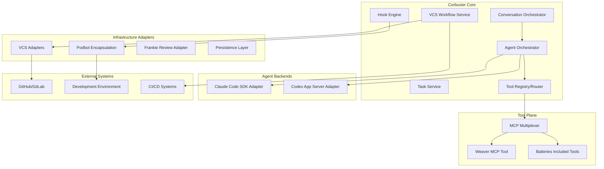

##### Core Technical Approach

The hexagonal architecture, or ports and adapters architecture, is an
architectural pattern used in software design that aims at creating loosely
coupled application components that can be easily connected to their software
environment by means of ports and adapters, making components exchangeable at
any level and facilitating test automation.

Corbusier implements this through:

- **Domain-Driven Core**: Pure business logic for conversations, tasks, and
  workflows
- **Port Definitions**: Clear interfaces for agent hosting, tool execution, and
  infrastructure
- **Adapter Implementation**: Pluggable implementations for different
  technologies and services
- **Dependency Inversion**: Core logic depends only on abstractions, not
  concrete implementations

#### 1.2.3 Success Criteria

##### Measurable Objectives

| Objective            | Target Metric                       | Measurement Method                     |
| -------------------- | ----------------------------------- | -------------------------------------- |
| Development Velocity | 25% reduction in time-to-merge      | Git analytics on PR lifecycle          |
| Code Quality         | 40% reduction in post-merge defects | Issue tracking and regression analysis |
| Agent Utilization    | 90% successful task completion rate | Task outcome tracking and audit logs   |

##### Critical Success Factors

1. **Seamless Agent Backend Integration**: Multiple AI agent engines work
   transparently through Corbusier's orchestration layer
2. **Consistent Tool Experience**: Developers experience uniform tool
   capabilities regardless of underlying agent
3. **Reliable Workflow Governance**: Safety hooks and quality gates execute
   consistently across all workflows
4. **Maintainable Architecture**: Software remains easily modifiable throughout
   its lifetime, structured into components that are isolated from one another
   and can be developed and tested independently

##### Operational Key Performance Indicators (KPIs)

- **System Reliability**: 99.5% uptime for core orchestration services
- **Response Latency**: <2 seconds for tool execution initiation
- **Scalability**: Support for 100+ concurrent agent sessions
- **Integration Success**: <24 hours to onboard new agent backends or tools

### 1.3 Scope

#### 1.3.1 In-Scope

##### Core Features and Functionalities

###### Conversation Management

- Canonical message history with full audit trails
- Slash command system with templating and expansion
- Multi-agent conversation coordination
- Context preservation across agent handoffs

###### Task Orchestration

- Issue-to-branch-to-PR workflow automation
- Milestone-driven task creation and management
- Task state transitions and lifecycle management
- Integration with roadmap parsing and planning tools

###### Tool Orchestration

- MCP server hosting and management
- Weaver-first file editing with change tracking
- Batteries-included development tools (memory, search, testing)
- Tool policy enforcement and access control

###### Workflow Governance

- Pre-commit and post-commit hook execution
- Code quality gates and automated testing
- Review comment ingestion and processing
- Compliance monitoring and audit logging

##### Implementation Boundaries

| Boundary Type   | Coverage                                     | Implementation Approach                                      |
| --------------- | -------------------------------------------- | ------------------------------------------------------------ |
| Agent Backends  | Claude Code SDK, Codex CLI App Server        | Adapter pattern with pluggable implementations               |
| Version Control | GitHub, GitLab primary; extensible to others | VCS adapter interface with provider-specific implementations |
| Encapsulation   | Podbot containers, future VM/sandbox options | Encapsulation port with multiple adapter implementations     |

##### User Groups Covered

- **Software Developers**: Primary users for code generation, review, and
  development workflows
- **DevOps Engineers**: Infrastructure automation and deployment orchestration
- **Team Leads**: Workflow monitoring, policy configuration, and team
  productivity oversight

##### Data Domains Included

- **Conversation Data**: Messages, tool calls, agent responses, and interaction
  metadata
- **Task Data**: Issue tracking, branch management, PR lifecycle, and workflow
  state
- **Code Data**: File changes, diffs, AST modifications, and semantic analysis
- **Audit Data**: Hook execution results, policy violations, and compliance
  records

#### 1.3.2 Out-of-Scope

##### Explicitly Excluded Features/Capabilities

- **Agent Model Training**: Corbusier orchestrates existing agents but does not
  train or fine-tune models
- **Direct Code Execution**: All code execution occurs within encapsulated
  environments (Podbot), not on host systems
- **Real-time Collaboration**: Focus on asynchronous workflow orchestration
  rather than synchronous collaborative editing
- **Custom Agent Development**: Platform hosts existing agent engines rather
  than providing agent development frameworks

##### Future Phase Considerations

###### Phase 2 Enhancements

- Additional agent backend integrations (AutoGPT, LangChain agents)
- Advanced workflow analytics and machine learning insights
- Multi-repository orchestration and cross-project coordination
- Team and organization tenant models beyond the initial user-tenant model
- Enterprise SSO and advanced authentication mechanisms

###### Phase 3 Expansions

- Cloud-native deployment options and managed service offerings
- Advanced AI model routing and load balancing
- Integration with enterprise knowledge management systems
- Custom workflow template marketplace and sharing

##### Integration Points Not Covered

- **Enterprise Identity Providers**: Initial implementation uses basic
  authentication; enterprise SSO deferred to Phase 2
- **Advanced Monitoring Systems**: Basic logging and metrics included;
  enterprise observability platforms in future phases
- **Legacy VCS Systems**: Focus on modern Git-based platforms; legacy systems
  (SVN, Perforce) not initially supported

##### Unsupported Use Cases

- **High-Frequency Trading**: Real-time financial applications requiring
  microsecond latency
- **Safety-Critical Systems**: Medical devices, automotive control systems, or
  other life-critical applications
- **Compliance-Heavy Industries**: Initial version not designed for SOX, HIPAA,
  or similar regulatory requirements
- **Multi-User Tenant Membership**: Initial multi-tenancy is one owning user per
  tenant, with team and organization membership deferred to a later phase
- **Massive Scale Operations**: Designed for teams of 10-100 developers;
  enterprise-scale (1000+) optimization in future phases

## 2. Product Requirements

### 2.1 Feature Catalog

#### 2.1.1 Core Orchestration Features

| Feature ID | Feature Name                | Category           | Priority | Status   |
| ---------- | --------------------------- | ------------------ | -------- | -------- |
| F-001      | Conversation Management     | Core Orchestration | Critical | Proposed |
| F-002      | Task Lifecycle Management   | Core Orchestration | Critical | Proposed |
| F-003      | Agent Backend Orchestration | Core Orchestration | Critical | Proposed |
| F-004      | Slash Command System        | Core Orchestration | High     | Proposed |

##### F-001: Conversation Management

- **Description:** Corbusier provides a standardized way for applications to
  connect LLMs with external data sources and tools through canonical message
  history management. The system maintains a unified conversation format across
  all agent backends while preserving full audit trails and context.
- **Business Value:**
  - Eliminates context loss during agent handoffs
  - Provides consistent conversation experience regardless of underlying agent
  - Enables comprehensive audit trails for compliance and debugging
- **User Benefits:**
  - Seamless transitions between different AI agents
  - Complete conversation history preservation
  - Consistent interface across all agent backends
- **Technical Context:** Implements hexagonal architecture with conversation
  domain at the core, supporting multiple agent adapters through standardized
  ports.
- **Dependencies:**
  - Prerequisite Features: None (foundational)
  - System Dependencies: Persistence layer, message serialization
  - External Dependencies: Agent backend APIs (Claude Code SDK, Codex CLI App
    Server)
  - Integration Requirements: MCP protocol compliance for tool integration

##### F-002: Task Lifecycle Management

- **Description:** Manages the complete lifecycle of development tasks from
  creation through completion, maintaining associations between issues,
  branches, and pull requests while tracking state transitions.
- **Business Value:**
  - Automates workflow coordination between development tools
  - Reduces manual overhead in task management
  - Provides clear traceability from requirements to implementation
- **User Benefits:**
  - Automated branch and PR creation from issues
  - Clear task state visibility and progression
  - Integrated milestone and roadmap support
- **Technical Context:** Domain-driven design with Task aggregate managing state
  transitions and VCS integration through adapter pattern.
- **Dependencies:**
  - Prerequisite Features: F-001 (Conversation Management)
  - System Dependencies: VCS adapters, persistence layer
  - External Dependencies: GitHub/GitLab APIs, issue tracking systems
  - Integration Requirements: Git workflow integration, branch naming policies

##### F-003: Agent Backend Orchestration

- **Description:** Provides pluggable agent engine hosting through standardized
  adapter interfaces, enabling multiple AI agent backends to work transparently
  through Corbusier's orchestration layer.
- **Business Value:**
  - Eliminates vendor lock-in for AI agent selection
  - Enables best-of-breed agent selection per use case
  - Reduces integration complexity for new agent backends
- **User Benefits:**
  - Choice of AI agent backends without workflow changes
  - Consistent tool and capability access across agents
  - Seamless agent switching within conversations
- **Technical Context:** Hexagonal architecture with AgentHostPort defining
  standard interface for all agent backends.
- **Dependencies:**
  - Prerequisite Features: F-001 (Conversation Management)
  - System Dependencies: Tool registry, MCP multiplexer
  - External Dependencies: Claude Code SDK, Codex CLI App Server APIs
  - Integration Requirements: Agent-specific authentication, tool schema
    translation

##### F-004: Slash Command System

- **Description:** Implements a comprehensive command system with templating and
  expansion capabilities, supporting both pure templating commands and
  imperative actions.
- **Business Value:**
  - Standardizes common development workflows
  - Reduces repetitive prompt engineering
  - Provides audit trail for command execution
- **User Benefits:**
  - Quick access to common development tasks
  - Consistent command syntax across all contexts
  - Template-based prompt standardization
- **Technical Context:** Command pattern implementation with pluggable command
  handlers and template engine integration.
- **Dependencies:**
  - Prerequisite Features: F-001 (Conversation Management)
  - System Dependencies: Template engine, command parser
  - External Dependencies: `minijinja`, `sha2` (0.10.9, SHA-256 for
    deterministic call-ID generation per the F-004 implementation decision)
  - Integration Requirements: Task service integration, VCS workflow hooks

###### Implementation decisions (2026-02-26) — roadmap 1.4.1

- Slash-command parsing uses a constrained grammar:
  `/<command> key=value key2="quoted value"` with a required leading slash and
  explicit `key=value` parameter tokens.
- Command definitions are provided through a dedicated `SlashCommandRegistry`
  port so the domain/service layer remains adapter-agnostic.
- Parameter validation is schema-driven and typed (`string`, `number`,
  `boolean`, `select`) with typed errors for unknown parameters, missing
  required parameters, and invalid values.
- Template expansion and tool-argument rendering use `minijinja`.
- Deterministic tool-call identifiers are generated from a canonical payload
  string with this exact order and encoding:
  `command=<value>;index=<value>;tool_name=<value>;parameters=<k=v;...>;arguments=<json>`.
   Parameter entries are emitted in sorted key order from `BTreeMap`, values
  use JSON stringification (`serde_json::Value::to_string()`), and the
  canonical payload is encoded as UTF-8 bytes before hashing.
- Hash algorithm decision: use SHA-256, take the first 8 digest bytes
  (big-endian) as a `u64`, and format as `sc-<index>-<16-hex>`.
- Compatibility note: existing audit records remain immutable. Readers should
  treat historical call IDs as opaque and accept both legacy and
  SHA-256-derived ID forms without migration.
- Execution produces audit metadata via `SlashCommandExpansion` and
  `ToolCallAudit` records.
- Implementation is scoped to existing message metadata storage; no new
  persistence schema changes are required for roadmap 1.4.1.

#### 2.1.2 Tool Orchestration Features

| Feature ID | Feature Name                    | Category           | Priority | Status   |
| ---------- | ------------------------------- | ------------------ | -------- | -------- |
| F-005      | MCP Server Hosting              | Tool Orchestration | Critical | Proposed |
| F-006      | Weaver File Editing Integration | Tool Orchestration | Critical | Proposed |
| F-007      | Tool Registry and Routing       | Tool Orchestration | High     | Proposed |
| F-008      | Batteries-Included Tools        | Tool Orchestration | Medium   | Proposed |

##### F-005: MCP Server Hosting

- **Description:** Hosts and manages Model Context Protocol servers that expose
  tools for AI agents to call during conversations, providing standardized tool
  integration. Supports both embedded Rust tools and spawned process tools
  communicating via MCP over stdio.
- **Business Value:**
  - Enables natural-language discovery and multiclient support without custom
    client code
  - Standardizes tool integration across different agent backends
  - Provides consistent tool policy enforcement and access control
- **User Benefits:**
  - Uniform tool experience regardless of agent backend
  - Simplified tool development and deployment
  - Consistent tool authentication and authorization
- **Technical Context:** MCP serves as the backbone keeping server, model, and
  UI in sync by standardizing wire format, authentication, and metadata.
- **Dependencies:**
  - Prerequisite Features: F-003 (Agent Backend Orchestration)
  - System Dependencies: JSON-RPC 2.0 message standard, transport layer
    (STDIO/HTTP+SSE)
  - External Dependencies: MCP specification compliance
  - Integration Requirements: Tool authentication, workspace boundaries

##### F-006: Weaver File Editing Integration

- **Description:** Integrates Weaver as the authoritative file editing tool,
  preventing "stealth edits" by agent backends and ensuring all file
  modifications go through Weaver's change tracking system.
- **Business Value:**
  - Provides comprehensive change tracking and audit trails
  - Prevents inconsistent file modifications across agents
  - Enables semantic and syntactic change analysis
- **User Benefits:**
  - Complete visibility into all code changes
  - Consistent file editing experience across agents
  - Rich change metadata for review and analysis
- **Technical Context:** Weaver operates as an MCP tool providing structured
  change logs with textual diffs, AST changes, and per-file summaries.
- **Dependencies:**
  - Prerequisite Features: F-005 (MCP Server Hosting)
  - System Dependencies: File system monitoring, git integration
  - External Dependencies: Weaver MCP implementation
  - Integration Requirements: Workspace encapsulation, change reconciliation

##### F-007: Tool Registry and Routing

- **Description:** Manages tool discovery, registration, and execution routing,
  presenting consistent tool interfaces to agents while handling backend-
  specific tool call formats.
- **Business Value:**
  - Centralizes tool management and policy enforcement
  - Enables tool capability discovery and documentation
  - Provides consistent tool execution semantics
- **User Benefits:**
  - Automatic tool discovery and availability
  - Consistent tool behavior across different agents
  - Centralized tool access control and auditing
- **Technical Context:** Registry pattern with pluggable tool providers and
  routing logic that translates between agent-specific and canonical tool call
  formats.
- **Dependencies:**
  - Prerequisite Features: F-005 (MCP Server Hosting)
  - System Dependencies: Tool metadata storage, execution context management
  - External Dependencies: Agent-specific tool call formats
  - Integration Requirements: Tool authentication, workspace isolation

##### F-008: Batteries-Included Tools

- **Description:** Provides essential development tools out-of-the-box including
  memory management, semantic search, repository analysis, test execution, and
  VCS operations.
- **Business Value:**
  - Reduces setup time for common development workflows
  - Provides consistent tool capabilities across deployments
  - Enables immediate productivity without additional tool configuration
- **User Benefits:**
  - Ready-to-use development tools without setup
  - Consistent tool behavior across different projects
  - Integrated tool ecosystem with shared context
- **Technical Context:** Collection of MCP-compliant tools implemented as
  embedded Rust services with shared workspace context.
- **Dependencies:**
  - Prerequisite Features: F-005 (MCP Server Hosting), F-007 (Tool Registry and
    Routing)
  - System Dependencies: Search indexing, test framework integration
  - External Dependencies: Language-specific toolchains
  - Integration Requirements: Workspace encapsulation, shared memory context

#### 2.1.3 Workflow Governance Features

| Feature ID | Feature Name             | Category            | Priority | Status   |
| ---------- | ------------------------ | ------------------- | -------- | -------- |
| F-009      | Hook Engine              | Workflow Governance | Critical | Proposed |
| F-010      | Encapsulation Management | Workflow Governance | Critical | Proposed |
| F-011      | Policy Enforcement       | Workflow Governance | High     | Proposed |
| F-012      | Audit and Compliance     | Workflow Governance | High     | Proposed |

##### F-009: Hook Engine

- **Description:** Implements a comprehensive hook system that executes
  consistent governance policies across all workflows, regardless of agent
  backend, with support for multiple trigger points and configurable actions.
- **Business Value:**
  - Ensures consistent code quality and compliance across all agents
  - Automates governance without manual intervention
  - Provides flexible policy configuration and enforcement
- **User Benefits:**
  - Automated quality gates and compliance checks
  - Consistent workflow behavior across different agents
  - Configurable policies per project or organization
- **Technical Context:** Event-driven architecture with declarative hook
  definitions supporting multiple triggers (TurnStart, ToolCall, PreCommit,
  etc.) and actions (gates, annotations, remediation).
- **Dependencies:**
  - Prerequisite Features: F-001 (Conversation Management), F-006 (Weaver File
    Editing Integration)
  - System Dependencies: Event system, policy engine
  - External Dependencies: Testing frameworks, linting tools
  - Integration Requirements: VCS integration, encapsulation boundaries

##### F-010: Encapsulation Management

- **Description:** Manages containerized workspaces that encapsulate
  applications composed of multiple co-located containers, providing secure
  execution boundaries for tools and repository operations.
- **Business Value:**
  - Provides secure isolation for code execution and tool operations
  - Enables consistent development environments across deployments
  - Supports multiple encapsulation technologies through adapter pattern
- **User Benefits:**
  - Secure code execution without host system access
  - Consistent development environment setup
  - Isolated workspace per task or conversation
- **Technical Context:** Implements Pod-like abstraction with shared storage and
  network resources, co-located and co-scheduled containers running in shared
  context.
- **Dependencies:**
  - Prerequisite Features: F-002 (Task Lifecycle Management)
  - System Dependencies: Container runtime, network policies
  - External Dependencies: Podbot, future VM/sandbox implementations
  - Integration Requirements: Repository mounting, tool execution boundaries

##### F-011: Policy Enforcement

- **Description:** Implements configurable policy enforcement across
  conversations, tools, and workflows with support for project-specific and
  organization-wide policies.
- **Business Value:**
  - Ensures consistent governance across all development activities
  - Enables compliance with organizational standards
  - Provides flexible policy configuration and inheritance
- **User Benefits:**
  - Automated policy compliance without manual oversight
  - Clear policy violation reporting and remediation
  - Configurable policies per project requirements
- **Technical Context:** Policy engine with declarative policy definitions
  supporting inheritance, overrides, and context-specific application.
- **Dependencies:**
  - Prerequisite Features: F-009 (Hook Engine)
  - System Dependencies: Policy storage, evaluation engine
  - External Dependencies: Compliance frameworks
  - Integration Requirements: VCS integration, audit logging

##### F-012: Audit and Compliance

- **Description:** Provides comprehensive audit trails for all system activities
  including conversations, tool executions, hook results, and policy violations
  with compliance reporting capabilities.
- **Business Value:**
  - Enables regulatory compliance and audit requirements
  - Provides complete traceability for all system activities
  - Supports forensic analysis and debugging
- **User Benefits:**
  - Complete activity visibility and traceability
  - Compliance reporting and audit trail generation
  - Debugging support through comprehensive logging
- **Technical Context:** Event sourcing pattern with structured logging, audit
  trail generation, and compliance reporting capabilities.
- **Dependencies:**
  - Prerequisite Features: All core features (audit spans entire system)
  - System Dependencies: Structured logging, event storage
  - External Dependencies: Compliance reporting systems
  - Integration Requirements: Log aggregation, retention policies

#### 2.1.4 Integration Features

| Feature ID | Feature Name              | Category    | Priority | Status   |
| ---------- | ------------------------- | ----------- | -------- | -------- |
| F-013      | VCS Integration           | Integration | Critical | Proposed |
| F-014      | Review Ingestion          | Integration | High     | Proposed |
| F-015      | HTTP API Surface          | Integration | High     | Proposed |
| F-016      | Real-time Event Streaming | Integration | Medium   | Proposed |

##### F-013: VCS Integration

- **Description:** Provides comprehensive version control system integration
  supporting GitHub, GitLab, and other Git-based platforms through pluggable
  adapter architecture.
- **Business Value:**
  - Enables seamless integration with existing development workflows
  - Supports multiple VCS providers without vendor lock-in
  - Automates common VCS operations and state synchronization
- **User Benefits:**
  - Native integration with existing Git workflows
  - Automated branch, PR, and issue management
  - Consistent VCS operations across different providers
- **Technical Context:** Adapter pattern with provider-specific implementations
  supporting common VCS operations through standardized interfaces.
- **Dependencies:**
  - Prerequisite Features: F-002 (Task Lifecycle Management)
  - System Dependencies: Git client libraries, webhook handling
  - External Dependencies: GitHub/GitLab APIs, Git repositories
  - Integration Requirements: Authentication, webhook configuration

##### F-014: Review Ingestion

- **Description:** Integrates with review tools like Frankie to ingest and
  normalize review comments, enabling interactive review workflows and
  automated response to feedback.
- **Business Value:**
  - Automates review feedback processing and response
  - Reduces manual overhead in review workflows
  - Enables consistent review handling across projects
- **User Benefits:**
  - Automated processing of review feedback
  - Consistent review workflow integration
  - Reduced manual review management overhead
- **Technical Context:** Browser-based review integration with comment ingestion
  and normalization through Frankie adapter.
- **Dependencies:**
  - Prerequisite Features: F-013 (VCS Integration)
  - System Dependencies: Comment parsing, normalization engine
  - External Dependencies: Frankie review platform
  - Integration Requirements: Review platform APIs, comment threading

##### F-015: HTTP API Surface

- **Description:** Provides RESTful HTTP API with streaming capabilities for
  external clients to interact with Corbusier's core functionality including
  task management, conversation handling, and system monitoring.
- **Business Value:**
  - Enables integration with external tools and platforms
  - Provides programmatic access to all system capabilities
  - Supports both synchronous and asynchronous interaction patterns
- **User Benefits:**
  - Integration with existing development tools
  - Programmatic automation of common workflows
  - Real-time visibility into system operations
- **Technical Context:** Actix-web based REST API with Server-Sent Events (SSE)
  or WebSocket streaming for real-time updates.
- **Dependencies:**
  - Prerequisite Features: All core features (API exposes system functionality)
  - System Dependencies: HTTP server, authentication middleware
  - External Dependencies: None
  - Integration Requirements: Authentication, rate limiting, API versioning

##### F-016: Real-time Event Streaming

- **Description:** Provides real-time streaming of system events including agent
  turns, tool executions, hook results, and task state changes through
  WebSocket or SSE connections.
- **Business Value:**
  - Enables real-time monitoring and debugging capabilities
  - Supports responsive user interfaces and integrations
  - Provides immediate feedback on system operations
- **User Benefits:**
  - Real-time visibility into system operations
  - Immediate feedback on agent and tool activities
  - Responsive user interface updates
- **Technical Context:** Event-driven architecture with WebSocket/SSE streaming,
  event filtering, and subscription management.
- **Dependencies:**
  - Prerequisite Features: F-015 (HTTP API Surface)
  - System Dependencies: Event bus, streaming infrastructure
  - External Dependencies: None
  - Integration Requirements: Event serialization, client connection management

#### 2.1.5 Tenancy and Identity Features

_Table 2.1.5.1: Tenancy and identity feature catalog._

| Feature ID | Feature Name                          | Category             | Priority | Status   |
| ---------- | ------------------------------------- | -------------------- | -------- | -------- |
| F-017      | Tenant Context and Identity Isolation | Security and Tenancy | Critical | Proposed |

##### F-017: Tenant Context and Identity Isolation

- **Description:** Establishes first-class tenant boundaries so every state
  mutation and lookup executes within a tenant context, with authenticated user
  principals bound to the owning user of that tenant.
- **Business Value:**
  - Prevents cross-tenant data leakage as Corbusier scales
  - Enables a smooth evolution from user tenants to team and organization
    tenants
  - Provides enforceable tenant boundaries in both application and database
    layers
- **User Benefits:**
  - Predictable data isolation per tenant
  - Clear ownership model for workspaces, tasks, and conversations
  - Forward-compatible identity model for future collaborative tenants
- **Technical Context:** Row-level multi-tenancy with `tenant_id` partition keys
  on tenant-owned tables, Rust request-context scoping, and PostgreSQL
  row-level security (RLS) with tenant-consistency constraints.
- **Dependencies:**
  - Prerequisite Features: F-001 (Conversation Management), F-002 (Task
    Lifecycle Management), F-003 (Agent Backend Orchestration)
  - System Dependencies: Diesel repositories, PostgreSQL RLS, audit trigger
    session variables
  - External Dependencies: PostgreSQL 14+ row-level security support
  - Integration Requirements: Authentication middleware, worker/job payload
    propagation, tracing instrumentation

### 2.2 Functional Requirements

#### 2.2.1 Conversation Management Requirements

| Requirement ID | Description                 | Acceptance Criteria                                               | Priority    | Complexity |
| -------------- | --------------------------- | ----------------------------------------------------------------- | ----------- | ---------- |
| F-001-RQ-001   | Canonical Message Format    | System maintains unified message format across all agent backends | Must-Have   | Medium     |
| F-001-RQ-002   | Message History Persistence | All conversation messages stored with full audit trail            | Must-Have   | Low        |
| F-001-RQ-003   | Context Preservation        | Conversation context maintained during agent handoffs             | Must-Have   | High       |
| F-001-RQ-004   | Multi-Agent Coordination    | Support for multiple agents within single conversation            | Should-Have | High       |

##### F-001-RQ-001: Canonical Message Format

- **Technical Specifications:**
  - Input Parameters: Agent-specific message formats, tool call results, user
    inputs
  - Output/Response: Standardized Message objects with role, content, and
    metadata
  - Performance Criteria: <2ms message format conversion latency
  - Data Requirements: Message ID, timestamp, role (User/Assistant/Tool/System),
    content parts
- **Validation Rules:**
  - Business Rules: All messages must have unique IDs and timestamps
  - Data Validation: Message content must be valid JSON with required fields
  - Security Requirements: Message content sanitization and validation
  - Compliance Requirements: Audit trail preservation for all message
    transformations

##### F-001-RQ-002: Message History Persistence

- **Technical Specifications:**
  - Input Parameters: Message objects, conversation context
  - Output/Response: Persistent storage confirmation, retrieval capabilities
  - Performance Criteria: <100ms message persistence latency, 99.9% durability
  - Data Requirements: Append-only message storage with immutable history
- **Validation Rules:**
  - Business Rules: Messages cannot be deleted or modified after persistence
  - Data Validation: Message integrity verification on storage and retrieval
  - Security Requirements: Encrypted storage for sensitive conversation content
  - Compliance Requirements: Retention policies and audit log maintenance

##### F-001-RQ-003: Context Preservation

- **Technical Specifications:**
  - Input Parameters: Conversation state, agent transition requests
  - Output/Response: Complete context transfer to new agent backend
  - Performance Criteria: <5s context transfer time, 100% context fidelity
  - Data Requirements: Conversation metadata, tool state, workspace context
- **Validation Rules:**
  - Business Rules: No context loss during agent transitions
  - Data Validation: Context integrity verification after transfer
  - Security Requirements: Secure context transfer between agent backends
  - Compliance Requirements: Context transfer audit logging

##### F-001-RQ-004: Multi-Agent Coordination

- **Technical Specifications:**
  - Input Parameters: Multiple agent session requests, coordination policies
  - Output/Response: Coordinated agent responses with conflict resolution
  - Performance Criteria: <10s coordination latency for multi-agent turns
  - Data Requirements: Agent capabilities, coordination rules, turn management
- **Validation Rules:**
  - Business Rules: Clear agent responsibility boundaries and handoff protocols
  - Data Validation: Agent capability verification and compatibility checking
  - Security Requirements: Agent isolation and secure communication channels
  - Compliance Requirements: Multi-agent interaction audit trails

#### 2.2.2 Task Lifecycle Management Requirements

| Requirement ID | Description                 | Acceptance Criteria                                               | Priority    | Complexity |
| -------------- | --------------------------- | ----------------------------------------------------------------- | ----------- | ---------- |
| F-002-RQ-001   | Issue-to-Task Creation      | Automatic task creation from VCS issues with metadata extraction  | Must-Have   | Medium     |
| F-002-RQ-002   | Branch Association          | One-to-one task-branch association with automated branch creation | Must-Have   | Medium     |
| F-002-RQ-003   | State Transition Management | Controlled task state transitions with validation                 | Must-Have   | Low        |
| F-002-RQ-004   | PR Lifecycle Integration    | Automated PR creation and management from task context            | Should-Have | High       |

##### F-002-RQ-001: Issue-to-Task Creation

- **Technical Specifications:**
  - Input Parameters: Issue references (GitHub/GitLab issue URLs or IDs)
  - Output/Response: Task objects with extracted metadata and initial state
  - Performance Criteria: <5s task creation from issue, 100% metadata extraction
    accuracy
  - Data Requirements: Issue title, description, labels, assignees, milestone
    information
- **Validation Rules:**
  - Business Rules: One task per issue per tenant, unique task identifiers
  - Data Validation: Issue existence verification, metadata format validation
  - Security Requirements: VCS authentication and authorization verification
  - Compliance Requirements: Task creation audit logging with issue traceability

###### Implementation Decisions (2026-02-09)

- Persist task origin as a tagged JSONB structure:
  `{ type: "issue", issue_ref: {...}, metadata: {...} }`, preserving provider,
  repository, issue number, and metadata snapshot at creation time.
- Enforce one-task-per-issue with a partial unique index over
  `tenant_id`, `origin.issue_ref.provider`, `origin.issue_ref.repository`, and
  `origin.issue_ref.issue_number` when `origin.type = issue`.
- Constrain issue numbers to positive values representable by PostgreSQL
  `BIGINT` (`<= i64::MAX`) so issue-reference lookups cannot fail from lossy
  downcasts at persistence time.
- Generate internal task identifiers as UUIDs and set `created_at` and
  `updated_at` to the same timestamp when a task is created from an issue.
- Keep branch, pull request, and workspace references nullable in 1.2.1 so
  roadmap items 1.2.2 and 1.2.3 can extend the lifecycle without re-shaping
  issue-origin records.

###### Implementation decisions (2026-02-11) — roadmap 1.2.2

- Branch and pull request references are stored as canonical string
  representations (`provider:owner/repo:identifier`) in the existing
  `branch_ref` and `pull_request_ref` `VARCHAR(255)` columns.
- Multiple tasks may share the same branch reference (many-to-many).
  Each individual task has at most one active branch and at most one open pull
  request.
- Non-unique partial indexes on `branch_ref` and `pull_request_ref`
  accelerate lookup queries.
- Associating a pull request transitions the task state to `InReview`.
  State transition validation (guard logic) is deferred to 1.2.3.
- Domain types `BranchRef` and `PullRequestRef` follow the same
  pattern as `IssueRef` with provider, repository, and identifier components.

##### F-002-RQ-002: Branch Association

- **Technical Specifications:**
  - Input Parameters: Task ID, base branch reference, branch naming policy
  - Output/Response: Created branch reference, task-branch association
  - Performance Criteria: <10s branch creation, 100% association accuracy
  - Data Requirements: Branch name generation rules, base branch validation
- **Validation Rules:**
  - Business Rules: At most one active branch per task; multiple tasks may
      share the same branch reference
  - Data Validation: Branch name policy compliance, base branch existence
  - Security Requirements: Repository write permissions verification
  - Compliance Requirements: Branch creation and association audit trails

##### F-002-RQ-003: State Transition Management

- **Technical Specifications:**
  - Input Parameters: Task ID, target state, transition context
  - Output/Response: Updated task state, transition confirmation
  - Performance Criteria: <1s state transition processing
  - Data Requirements: Valid state transitions
    (Draft→InProgress→InReview→Done/Abandoned)
- **Validation Rules:**
  - Business Rules: Only valid state transitions allowed, state change
    authorization
  - Data Validation: State transition rules enforcement
  - Security Requirements: State change authorization and audit logging
  - Compliance Requirements: Complete state transition history preservation

###### Implementation decisions (2026-02-17) — roadmap 1.2.3

- Task-state transition rules are implemented as
  `TaskState::can_transition_to(target)` with terminal-state detection via
  `TaskState::is_terminal()`.
- Invalid state changes return
  `TaskDomainError::InvalidStateTransition { task_id, from, to }`, giving an
  auditable, typed rejection at the domain boundary.
- The lifecycle service exposes `transition_task` with a string target state at
  the service boundary and maps parse failures to
  `TaskLifecycleError::InvalidState`.
- `associate_pull_request` now validates transition eligibility before mutating
  pull-request association fields, so terminal states reject PR association.
- `TransitionContext` and domain-event emission shown in the conceptual section
  remain deferred. Roadmap 1.2.3 is scoped to transition validation and typed
  rejection only.

##### F-002-RQ-004: PR Lifecycle Integration

- **Technical Specifications:**
  - Input Parameters: Task ID, PR creation triggers, review requirements
  - Output/Response: Created/updated PR with task context integration
  - Performance Criteria: <15s PR creation, automatic task-PR linking
  - Data Requirements: PR title/description generation, reviewer assignment
    rules
- **Validation Rules:**
  - Business Rules: At most one open PR per task, PR-task bidirectional linking
  - Data Validation: PR metadata consistency with task information
  - Security Requirements: PR creation permissions and review access control
  - Compliance Requirements: PR lifecycle audit trails with task correlation

#### 2.2.3 Agent Backend Orchestration Requirements

| Requirement ID | Description                  | Acceptance Criteria                                                     | Priority    | Complexity |
| -------------- | ---------------------------- | ----------------------------------------------------------------------- | ----------- | ---------- |
| F-003-RQ-001   | Agent Backend Registration   | Dynamic registration of agent backends through adapter interface        | Must-Have   | Medium     |
| F-003-RQ-002   | Turn Execution Orchestration | Standardized turn execution across different agent backends             | Must-Have   | High       |
| F-003-RQ-003   | Tool Schema Translation      | Automatic translation between agent-specific and canonical tool schemas | Must-Have   | High       |
| F-003-RQ-004   | Agent Session Management     | Lifecycle management of agent sessions with resource cleanup            | Should-Have | Medium     |

##### F-003-RQ-001: Agent Backend Registration

- **Technical Specifications:**
  - Input Parameters: Agent backend configuration, capability declarations
  - Output/Response: Registered agent backend with capability metadata
  - Performance Criteria: <5s registration time, hot-swappable backends
  - Data Requirements: Agent capabilities, authentication requirements, tool
    support
- **Validation Rules:**
  - Business Rules: Unique agent backend identifiers per tenant, capability
    verification
  - Data Validation: Agent configuration schema compliance
  - Security Requirements: Agent backend authentication and authorization
  - Compliance Requirements: Agent registration audit logging

###### Implementation decisions (2026-02-25) — roadmap 1.3.1

- Backend registrations are persisted in a dedicated `backend_registrations`
  table with `capabilities` and `backend_info` stored as JSONB columns,
  enabling schema evolution without migrations.
- Backend names (`BackendName`) are validated as lowercase alphanumeric
  identifiers with underscores, limited to 100 characters, and enforced unique
  per tenant via a composite database index over `(tenant_id, name)`.
- Deregistration uses soft-delete via a `BackendStatus` enum (`Active` /
  `Inactive`) rather than hard delete, preserving audit history and allowing
  re-activation.
- The `AgentBackend` runtime trait (with `execute_turn` and
  `translate_tool_schema`) is deferred to roadmap items 1.3.2 and 1.3.3; item
  1.3.1 introduces only the registration metadata aggregate and registry
  repository.

##### F-003-RQ-002: Turn Execution Orchestration

- **Technical Specifications:**
  - Input Parameters: Conversation context, selected agent backend, tool
    registry
  - Output/Response: Agent response with tool calls and conversation updates
  - Performance Criteria: <30s turn execution, 99% success rate
  - Data Requirements: Turn context, agent session state, tool availability
- **Validation Rules:**
  - Business Rules: Deterministic turn execution, consistent tool access
  - Data Validation: Turn context integrity, agent response validation
  - Security Requirements: Agent isolation, secure tool execution
  - Compliance Requirements: Complete turn execution audit trails

##### F-003-RQ-003: Tool Schema Translation

- **Technical Specifications:**
  - Input Parameters: Agent-specific tool schemas, canonical tool definitions
  - Output/Response: Translated tool schemas compatible with target agent
  - Performance Criteria: <100ms schema translation, 100% schema compatibility
  - Data Requirements: Tool schema mappings, agent capability matrices
- **Validation Rules:**
  - Business Rules: Lossless schema translation, tool capability preservation
  - Data Validation: Schema compatibility verification, translation accuracy
  - Security Requirements: Schema validation and sanitization
  - Compliance Requirements: Schema translation audit logging

##### F-003-RQ-004: Agent Session Management

- **Technical Specifications:**
  - Input Parameters: Session creation/destruction requests, resource limits
  - Output/Response: Agent session handles with lifecycle management
  - Performance Criteria: <5s session creation, automatic resource cleanup
  - Data Requirements: Session state, resource usage tracking, cleanup policies
- **Validation Rules:**
  - Business Rules: Session isolation, resource limit enforcement
  - Data Validation: Session state consistency, resource usage monitoring
  - Security Requirements: Session authentication, resource access control
  - Compliance Requirements: Session lifecycle audit trails

#### 2.2.4 Tool Orchestration Requirements

| Requirement ID | Description                     | Acceptance Criteria                                             | Priority  | Complexity |
| -------------- | ------------------------------- | --------------------------------------------------------------- | --------- | ---------- |
| F-005-RQ-001   | MCP Server Lifecycle            | Host and manage MCP servers with automatic lifecycle management | Must-Have | High       |
| F-005-RQ-002   | Tool Discovery and Registration | Automatic discovery and registration of available tools         | Must-Have | Medium     |
| F-005-RQ-003   | Tool Execution Routing          | Route tool calls to appropriate MCP servers with error handling | Must-Have | High       |
| F-006-RQ-001   | Weaver Change Tracking          | Comprehensive file change tracking through Weaver integration   | Must-Have | Medium     |

##### F-005-RQ-001: MCP Server Lifecycle

- **Technical Specifications:**
  - Input Parameters: MCP server configurations (STDIO/HTTP+SSE transport),
    resource limits
  - Output/Response: Running MCP server instances with health monitoring
  - Performance Criteria: <10s server startup, 99.9% uptime, automatic restart
    on
    failure
  - Data Requirements: JSON-RPC 2.0 message handling, server process management
- **Validation Rules:**
  - Business Rules: MCP servers must implement list tools and call tools
    capabilities
  - Data Validation: MCP specification compliance based on TypeScript schema
  - Security Requirements: Resource Indicators (RFC 8707) implementation for
    token security
  - Compliance Requirements: MCP server lifecycle audit logging

##### F-005-RQ-002: Tool Discovery and Registration

- **Technical Specifications:**
  - Input Parameters: Tool metadata including JSON Schema input/output contracts
  - Output/Response: Registered tool catalog with capability descriptions
  - Performance Criteria: <5s tool discovery, real-time tool availability
    updates
  - Data Requirements: Tool schemas, capability annotations, access control
    policies
- **Validation Rules:**
  - Business Rules: Natural-language discovery integration with model metadata
    consumption
  - Data Validation: Tool schema validation, capability verification
  - Security Requirements: Tool access permission verification before execution
  - Compliance Requirements: Tool registration and capability audit trails

##### F-005-RQ-003: Tool Execution Routing

- **Technical Specifications:**
  - Input Parameters: Tool call requests with arguments corresponding to user
    intent
  - Output/Response: Tool results with optional inline HTML for UI rendering
  - Performance Criteria: <2s tool execution initiation, <30s total execution
    time
  - Data Requirements: Structured content and component state flow through
    conversation
- **Validation Rules:**
  - Business Rules: Tool execution authorization, workspace boundary enforcement
  - Data Validation: Tool call parameter validation, result format verification
  - Security Requirements: Tool execution isolation, resource limit enforcement
  - Compliance Requirements: Complete tool execution audit trails

##### F-006-RQ-001: Weaver Change Tracking

- **Technical Specifications:**
  - Input Parameters: File edit requests, workspace context, change policies
  - Output/Response: ChangeSet objects with textual diffs, AST changes, and
    summaries
  - Performance Criteria: <5s change processing, real-time change detection
  - Data Requirements: File content, change metadata, semantic analysis results
- **Validation Rules:**
  - Business Rules: All file edits must go through Weaver, no stealth edits
    allowed
  - Data Validation: Change integrity verification, diff accuracy validation
  - Security Requirements: File access authorization, change audit logging
  - Compliance Requirements: Complete change history preservation

#### 2.2.5 Tenancy and Identity Requirements

_Table 2.2.5.1: Tenancy and identity requirement matrix._

| Requirement ID | Description                          | Acceptance Criteria                                                           | Priority  | Complexity |
| -------------- | ------------------------------------ | ----------------------------------------------------------------------------- | --------- | ---------- |
| F-017-RQ-001   | Tenant Domain Primitive              | Tenant identity is modelled separately from user identity                     | Must-Have | Medium     |
| F-017-RQ-002   | Principal-to-Tenant Binding          | Authenticated principals resolve to an owning user and tenant context         | Must-Have | Medium     |
| F-017-RQ-003   | Tenant-Scoped Persistence and Lookup | All tenant-owned mutations and reads require tenant context                   | Must-Have | High       |
| F-017-RQ-004   | Dual-Layer Isolation Enforcement     | Rust signatures and PostgreSQL RLS/constraints both block cross-tenant access | Must-Have | High       |
| F-017-RQ-005   | Tenant Isolation Verification        | Test scenarios prove same external IDs can coexist across tenants safely      | Must-Have | Medium     |

##### F-017-RQ-001: Tenant Domain Primitive

- **Technical Specifications:**
  - Input Parameters: Tenant identifier, slug, display name, lifecycle status
  - Output/Response: Persisted and typed tenant records with stable identity
  - Performance Criteria: Tenant lookup <20ms under standard load
  - Data Requirements: `TenantId`, `TenantSlug`, tenant status, audit
    timestamps
- **Validation Rules:**
  - Business Rules: Distinguish user principals from tenant identities even
    when the initial tenant type is a single owning user
  - Data Validation: Tenant slugs must be validated identifiers suitable for
    URLs and config keys
  - Security Requirements: Tenant records are immutable in identity fields after
    creation
  - Compliance Requirements: Tenant lifecycle mutations are auditable

##### F-017-RQ-002: Principal-to-Tenant Binding

- **Technical Specifications:**
  - Input Parameters: Authentication credentials, principal claims, session
    metadata
  - Output/Response: Principal bound to `{ user_id, tenant_id, session_id }`
  - Performance Criteria: Principal resolution and context creation <50ms
  - Data Requirements: User principal claims and tenant ownership mapping
- **Validation Rules:**
  - Business Rules: Initial release supports one owning user per tenant;
    collaborative team and organization tenants are deferred
  - Data Validation: `tenant_id` and `user_id` claims must be present and
    canonical UUIDs
  - Security Requirements: Reject requests when principal-to-tenant binding is
    missing or inconsistent
  - Compliance Requirements: Authentication context fields propagate to audit
    and trace records

##### F-017-RQ-003: Tenant-Scoped Persistence and Lookup

- **Technical Specifications:**
  - Input Parameters: `RequestContext` containing tenant and audit identifiers
  - Output/Response: Repository operations scoped to tenant-owned data only
  - Performance Criteria: No measurable regression above 5% for tenant-filtered
    hot paths
  - Data Requirements: `tenant_id` columns on tenant-owned tables and
    tenant-aware indexes
- **Validation Rules:**
  - Business Rules: One task per issue is enforced per tenant, and backend
    registration names are unique per tenant
  - Data Validation: Tenant IDs on child rows must match referenced parent rows
  - Security Requirements: Tenant context is mandatory in repository/service
    signatures
  - Compliance Requirements: Tenant attribution is present in `domain_events`
    and `audit_logs`

##### F-017-RQ-004: Dual-Layer Isolation Enforcement

- **Technical Specifications:**
  - Input Parameters: Repository calls with `RequestContext`, PostgreSQL session
    variables
  - Output/Response: Tenant-isolated query execution with defence-in-depth
  - Performance Criteria:
    `set_config('app.tenant_id', <value>, true)` and RLS checks remain within
    transaction latency budgets
  - Data Requirements: RLS policies keyed by
    `current_setting('app.tenant_id', true)` and composite foreign keys for
    tenant consistency
- **Validation Rules:**
  - Business Rules: Every tenant-owned mutation and lookup executes inside
    tenant context
  - Data Validation: Cross-tenant parent/child references are rejected by
    composite foreign keys
  - Security Requirements: PostgreSQL RLS blocks cross-tenant reads/writes even
    when application query filters are incomplete
  - Compliance Requirements: Tenant identifier is captured in audit triggers

##### F-017-RQ-005: Tenant Isolation Verification

- **Technical Specifications:**
  - Input Parameters: Two-tenant test fixtures with overlapping external IDs
  - Output/Response: Passing isolation tests across adapters and persistence
    layers
  - Performance Criteria: Isolation suite executes within standard integration
    test budgets
  - Data Requirements: Fixture support for duplicated issue refs and backend
    names across tenants
- **Validation Rules:**
  - Business Rules: Two tenants can create tasks from the same external issue
    reference without collision
  - Data Validation: Two tenants can register the same backend name without
    collision
  - Security Requirements: Tenant A cannot retrieve tenant B records when using
    tenant A context
  - Compliance Requirements: Isolation regressions fail CI as blocking tests

###### Implementation decisions (2026-03-01) — multi-tenancy foundation

- Corbusier uses row-level multi-tenancy with a `tenant_id` partition key on
  tenant-owned tables and PostgreSQL RLS as a hard guardrail.
- Initial tenant model: one user principal owns one tenant. Team and
  organization tenants are explicitly deferred while keeping user and tenant
  identities distinct from day one.
- Introduce first-class tenant primitives in Rust under `src/tenant/`:
  `TenantId`, `TenantSlug`, and `Tenant`.
- Replace message-only audit context plumbing with a cross-cutting
  `RequestContext` containing `tenant_id`, `correlation_id`, `causation_id`,
  `user_id`, and `session_id`, used by repositories, services, tracing, and
  audit/session-variable wiring.
- Add `tenants` plus `tenant_id` columns to tenant-owned tables, including
  conversations, messages, tasks, agent sessions, handoffs, context snapshots,
  domain events, audit logs, and backend registrations.
- Scope uniqueness constraints by tenant, including:
  - task issue-origin uniqueness over `(tenant_id, provider, repository,
    issue_number)` when origin type is `issue`
  - backend registration name uniqueness over `(tenant_id, name)`
- Enforce cross-table tenant consistency with composite keys such as
  `(conversation_id, tenant_id) -> conversations(id, tenant_id)`.
- Execute tenant-scoped PostgreSQL operations in explicit transactions and set
  `set_config('app.tenant_id', <value>, true)` within the same transaction as
  the protected statements.
- Sequence delivery to minimize refactor risk:
  1. Add tenant primitives and `RequestContext`.
  2. Apply tenant migrations and urgent index fixes.
  3. Require tenant context in repository ports.
  4. Update PostgreSQL and in-memory adapters.
  5. Enable RLS and tenant session-variable plumbing.
  6. Add two-tenant isolation tests.

### 2.3 Feature Relationships

#### 2.3.1 Feature Dependencies Map

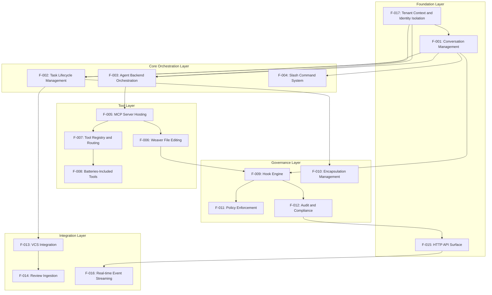

#### 2.3.2 Integration Points

| Integration Point             | Features Involved   | Shared Components                        | Common Services         |
| ----------------------------- | ------------------- | ---------------------------------------- | ----------------------- |
| Agent-Tool Interface          | F-003, F-005, F-007 | Tool schema translation, MCP multiplexer | Tool execution context  |
| Conversation-Task Binding     | F-001, F-002, F-004 | Task context management                  | State synchronization   |
| Tenant-Identity Enforcement   | F-017, F-001, F-002 | Request context, tenant session settings | RLS policy evaluation   |
| Governance-Execution Pipeline | F-009, F-010, F-006 | Hook execution engine                    | Policy evaluation       |
| VCS-Review Integration        | F-013, F-014, F-002 | Comment normalization                    | Review state management |

#### 2.3.3 Shared Components

| Component         | Description                         | Used By Features           | Interface                        |
| ----------------- | ----------------------------------- | -------------------------- | -------------------------------- |
| Message Bus       | Event-driven communication backbone | F-001, F-009, F-012, F-016 | Event publishing/subscription    |
| Workspace Manager | Encapsulated execution environment  | F-006, F-008, F-010        | Workspace lifecycle API          |
| Policy Engine     | Declarative policy evaluation       | F-009, F-011, F-012        | Policy definition and evaluation |
| Audit Logger      | Structured audit trail generation   | F-001, F-009, F-012, F-013 | Audit event recording            |
| Request Context   | Tenant-scoped execution identity    | F-017, F-001, F-002, F-003 | Context propagation contract     |

### 2.4 Implementation Considerations

#### 2.4.1 Technical Constraints

| Feature Category          | Constraints                                | Mitigation Strategies                     |
| ------------------------- | ------------------------------------------ | ----------------------------------------- |
| Agent Backend Integration | API rate limits, authentication complexity | Connection pooling, credential management |
| Tool Execution            | Resource limits, security boundaries       | Containerization, resource monitoring     |
| Real-time Streaming       | Connection scalability, event ordering     | Event sourcing, connection management     |
| File System Operations    | Concurrent access, change detection        | File locking, change event aggregation    |

#### 2.4.2 Performance Requirements

| Feature                            | Latency Target                | Throughput Target         | Scalability Target           |
| ---------------------------------- | ----------------------------- | ------------------------- | ---------------------------- |
| F-001: Conversation Management     | <100ms message processing     | 1000 messages/second      | 100 concurrent conversations |
| F-003: Agent Backend Orchestration | <30s turn execution           | 50 concurrent turns       | 10 agent backends            |
| F-005: MCP Server Hosting          | <2s tool execution initiation | 500 tool calls/minute     | 50 concurrent MCP servers    |
| F-013: VCS Integration             | <5s VCS operation             | 100 VCS operations/minute | Multiple VCS providers       |

#### 2.4.3 Security Implications

| Security Domain | Requirements                           | Implementation Approach                                           |
| --------------- | -------------------------------------- | ----------------------------------------------------------------- |
| Agent Isolation | Prevent cross-agent data leakage       | Separate execution contexts, credential isolation                 |
| Tool Execution  | Secure tool execution boundaries       | Container encapsulation with shared storage and network isolation |
| Data Protection | Encrypt sensitive conversation data    | End-to-end encryption, secure key management                      |
| Access Control  | Role-based access to features and data | RBAC implementation, permission inheritance                       |

#### 2.4.4 Maintenance Requirements

| Maintenance Area         | Requirements                               | Automation Level                                 |
| ------------------------ | ------------------------------------------ | ------------------------------------------------ |
| Agent Backend Updates    | Backward compatibility, version management | Automated testing, gradual rollout               |
| Tool Registry Management | Tool versioning, dependency management     | Automated tool discovery, health checks          |
| Policy Updates           | Policy versioning, impact analysis         | Automated policy validation, rollback capability |
| Audit Data Management    | Log rotation, compliance reporting         | Automated archival, report generation            |

#### 2.4.5 Traceability Matrix

| Business Requirement          | Features            | Acceptance Criteria                   | Test Strategy                             |
| ----------------------------- | ------------------- | ------------------------------------- | ----------------------------------------- |
| Consistent Agent Experience   | F-001, F-003, F-007 | Same tools/capabilities across agents | Integration testing across agent backends |
| Automated Workflow Governance | F-009, F-011, F-012 | Consistent policy enforcement         | Policy compliance testing                 |
| Comprehensive Audit Trails    | F-001, F-009, F-012 | Complete activity traceability        | Audit trail verification testing          |
| Secure Execution Environment  | F-010, F-005, F-006 | Isolated tool and code execution      | Security penetration testing              |

## 3. Technology Stack

### 3.1 Programming Languages

#### 3.1.1 Primary Language Selection

| Component      | Language | Version | Justification                                                                                                                                      |
| -------------- | -------- | ------- | -------------------------------------------------------------------------------------------------------------------------------------------------- |
| Core Platform  | Rust     | 1.75+   | Actix Web requires minimum supported Rust version (MSRV) of 1.75, providing memory safety, zero-cost abstractions, and excellent async performance |
| Agent Adapters | Rust     | 1.75+   | Consistent language across platform for type safety and performance                                                                                |
| MCP Tools      | Rust     | 1.75+   | Native MCP server implementation with embedded tools for optimal performance                                                                       |
| CLI Tools      | Rust     | 1.75+   | Single-binary distribution and cross-platform compatibility                                                                                        |

#### 3.1.2 Language Selection Criteria

##### Memory Safety and Performance

Rust is a language that empowers everyone to build reliable and efficient
software, with studies finding that roughly ~70% of high severity security bugs
are the result of memory unsafety. This aligns with Corbusier's security
requirements for handling sensitive conversation data and tool execution.

##### Async-First Architecture

Tokio is scalable, built on top of the async/await language feature, which
itself is scalable. When dealing with networking, there's a limit to how fast
you can handle a connection due to latency, so the only way to scale is to
handle many connections at once. With the async/await language feature,
increasing the number of concurrent operations becomes incredibly cheap,
allowing you to scale to a large number of concurrent tasks.

##### Hexagonal Architecture Compatibility

Rust's trait system and ownership model provide excellent support for
dependency inversion and adapter patterns, essential for implementing hexagonal
architecture with clean separation between domain logic and infrastructure
concerns.

#### 3.1.3 Language Constraints and Dependencies

| Constraint Type    | Description                                                     | Mitigation Strategy                                                  |
| ------------------ | --------------------------------------------------------------- | -------------------------------------------------------------------- |
| Compilation Time   | Rust compilation can be slower than interpreted languages       | Incremental compilation, workspace optimization, parallel builds     |
| Learning Curve     | Ownership and borrowing concepts require expertise              | Team training, code review processes, comprehensive documentation    |
| Ecosystem Maturity | Some specialized libraries may be less mature than alternatives | Careful dependency selection, fallback to C bindings where necessary |

### 3.2 Frameworks & Libraries

#### 3.2.1 Core Web Framework

##### Actix Web (version TBD)

Actix Web is planned for the HTTP API surface, with the exact version to be
confirmed in Cargo.toml before implementation, due to:

- One of the fastest web frameworks available according to the TechEmpower
  Framework Benchmark, with the lowest latency
- Powerful, pragmatic, and extremely fast web framework for Rust with features
  out of the box including HTTP/2, logging, etc.
- Leverages asynchronous execution by default to handle many requests
  concurrently, making it well-suited for applications requiring responsiveness
  under load
- Similar syntax to Express.js, making it accessible to JavaScript developers

##### Compatibility Requirements

Diesel is a synchronous ORM and must be isolated from async executor threads to
prevent blocking. Use `tokio::task::spawn_blocking` to offload all Diesel
operations to a dedicated thread pool. Connection pooling is handled through
`r2d2`, which provides robust connection management independent of async
runtimes.

#### 3.2.2 Async Runtime

##### Tokio 1.49.0

Tokio is a runtime for writing reliable asynchronous applications with Rust. It
provides async I/O, networking, scheduling, timers, and more.

##### Selection Justification

- The Tokio library is the most widely used runtime, surpassing all other
  runtimes in usage combined
- Most libraries gravitating towards the One True Runtime — Tokio
- Provides a multi-threaded runtime for executing asynchronous code, an
  asynchronous version of the standard library, and a large ecosystem of
  libraries

##### Runtime Configuration

Tokio provides multiple variations of the runtime. Everything from a
multi-threaded, work-stealing runtime to a light-weight, single-threaded
runtime. Each of these runtimes come with many knobs to allow users to tune
them to their needs.

#### 3.2.3 Database Access Layer

##### Diesel 2.3

Diesel is a safe, extensible ORM and Query Builder for Rust. It provides
compile-time guarantees about your queries and type-safe query construction
with pure Rust PostgreSQL driver support.

##### Key Features

- **Compile-time Query Validation**: Diesel validates queries at compile time,
  catching SQL errors before runtime through its derive macros and DSL
- **Type-safe Query Builder**: Provides a Rust DSL for building queries,
  ensuring type safety for parameters and return types
- **Connection Pooling via r2d2**: Uses the battle-tested `r2d2` crate for
  connection pool management with configurable limits and timeouts
- **Async Integration**: Works with async runtimes via
  `tokio::task::spawn_blocking` to offload blocking database operations to a
  dedicated thread pool

#### 3.2.4 Observability and Logging

##### Tracing 0.1

tracing is a framework for instrumenting Rust programs to collect structured,
event-based diagnostic information. tracing is maintained by the Tokio project,
but does not require the tokio runtime to be used.

##### Advantages for Async Systems

In asynchronous systems like Tokio, interpreting traditional log messages can
often be quite challenging. Since individual tasks are multiplexed on the same
thread, associated events and log lines are intermixed making it difficult to
trace the logic flow. tracing expands upon logging-style diagnostics by
allowing libraries and applications to record structured events with additional
information about temporality and causality.

##### Integration Capabilities

The tracing crates provide a powerful system for logging in your application.
It is compatible with many other crates like the OpenTelemetry SDK, allowing
you to also send your logs for further analysis.

#### 3.2.5 Framework Compatibility Matrix

| Framework | Version | Runtime          | TLS Backend       | Database Support |
| --------- | ------- | ---------------- | ----------------- | ---------------- |
| Actix Web | TBD     | Tokio            | rustls/native-tls | Via Diesel       |
| Diesel    | 2.3     | Tokio (blocking) | N/A               | PostgreSQL       |
| Tracing   | 0.1     | Runtime Agnostic | N/A               | N/A              |
| Tokio     | 1.49.0  | Self             | N/A               | N/A              |

### 3.3 Open Source Dependencies

#### 3.3.1 Core Dependencies

| Crate       | Version | Purpose                          | Registry  |
| ----------- | ------- | -------------------------------- | --------- |
| serde       | 1.0.228 | Serialization framework          | crates.io |
| serde_json  | 1.0.149 | JSON serialization               | crates.io |
| chrono      | 0.4.43  | Date/time handling               | crates.io |
| uuid        | 1.19.0  | UUID generation                  | crates.io |
| thiserror   | 2.0.17  | Error derive macros              | crates.io |
| sha2        | 0.10.9  | SHA-256 deterministic call IDs   | crates.io |
| minijinja   | 2.16.0  | Template rendering               | crates.io |
| async-trait | 0.1.89  | Async trait support              | crates.io |
| mockable    | 3.0.0   | Clock abstraction for testing    | crates.io |
| diesel      | 2.3.5   | Database ORM (with r2d2 pooling) | crates.io |
| cap-std     | 3.4.5   | Capability-based filesystem      | crates.io |
| tokio       | 1.49.0  | Async runtime                    | crates.io |

#### 3.3.2 MCP Protocol Dependencies (Planned)

MCP protocol support will require additional dependencies when implemented:

| Crate        | Version | Purpose                     | Registry  |
| ------------ | ------- | --------------------------- | --------- |
| jsonrpc-core | 18.x    | JSON-RPC 2.0 implementation | crates.io |
| futures      | 0.3.x   | Future utilities            | crates.io |
| tokio-util   | 0.7.x   | Tokio utilities             | crates.io |

#### 3.3.3 Development and Testing Dependencies

| Crate                 | Version | Purpose                       | Registry  |
| --------------------- | ------- | ----------------------------- | --------- |
| rstest                | 0.26.1  | Parameterized test fixtures   | crates.io |
| mockall               | 0.14.0  | Mock generation               | crates.io |
| eyre                  | 0.6.12  | Error reporting for tests     | crates.io |
| pg-embed-setup-unpriv | 0.3.0   | Embedded PostgreSQL for tests | crates.io |

#### 3.3.4 Version Management Strategy

##### Semantic Versioning Compliance

All dependencies follow semantic versioning with careful attention to breaking
changes. Tokio will keep a rolling MSRV (minimum supported rust version) policy
of at least 6 months. When increasing the MSRV, the new Rust version must have
been released at least six months ago.

##### Dependency Pinning Strategy

- Major versions pinned to prevent breaking changes
- Minor versions allowed to float for security updates
- Critical security dependencies monitored through cargo-audit
- Regular dependency updates scheduled monthly

### 3.4 Third-Party Services

#### 3.4.1 AI Agent Backend Services

| Service              | Purpose              | Integration Method     | Authentication |
| -------------------- | -------------------- | ---------------------- | -------------- |
| Claude Code SDK      | AI agent backend     | Direct SDK integration | API key        |
| Codex CLI App Server | AI agent backend     | HTTP API adapter       | API key        |
| OpenAI API           | Future agent backend | HTTP API adapter       | API key        |

#### 3.4.2 Version Control Integration

| Service    | Purpose                          | Integration Method  | Authentication                    |
| ---------- | -------------------------------- | ------------------- | --------------------------------- |
| GitHub API | VCS operations, issue management | REST API + webhooks | OAuth 2.0 / Personal Access Token |
| GitLab API | VCS operations, issue management | REST API + webhooks | OAuth 2.0 / Personal Access Token |

#### 3.4.3 Model Context Protocol Services

Model Context Protocol (MCP) is an open protocol that enables seamless
integration between LLM applications and external data sources and tools.
Whether you're building an AI-powered IDE, enhancing a chat interface, or
creating custom AI workflows, MCP provides a standardized way to connect LLMs
with the context they need.

##### MCP Specification Compliance

This specification defines the authoritative protocol requirements, based on
the TypeScript schema in schema.ts. For implementation guides and examples,
visit modelcontextprotocol.io.

##### Current MCP Version

Protocol Revision: 2025-11-25[^1]. The production-ready specification released
on November 25, 2025 (following the November 11, 2025 release candidate). On
December 9, 2025, governance of the protocol transitioned to the Agentic AI
Foundation[^2].

#### 3.4.4 External Tool Integration

| Tool Category      | Examples                       | Integration Method                     |
| ------------------ | ------------------------------ | -------------------------------------- |
| Review Tools       | Frankie                        | Browser automation adapter             |
| Encapsulation      | Podbot                         | Container runtime API                  |
| File Editing       | Weaver                         | MCP server integration                 |
| Testing Frameworks | Language-specific test runners | Process execution within encapsulation |

#### 3.4.5 Service Reliability Requirements

| Service Type      | Availability Target | Fallback Strategy                              |
| ----------------- | ------------------- | ---------------------------------------------- |
| AI Agent Backends | 99.5%               | Multiple backend support, graceful degradation |
| VCS APIs          | 99.9%               | Local caching, retry mechanisms                |
| MCP Services      | 99.5%               | Local tool fallbacks, service discovery        |

### 3.5 Databases & Storage

#### 3.5.1 Primary Database Selection

##### PostgreSQL 14+

Selected as the primary database for production deployments due to:

- **ACID Compliance**: Full transaction support for conversation and task state
  management
- **JSON Support**: Native JSONB for storing conversation messages and metadata
- **Scalability**: Proven performance for concurrent read/write operations
- **Diesel Integration**: Native support via the `diesel::pg` backend module

##### In-memory repository for development

An in-memory repository implementation is provided for rapid development and
unit testing:

- **Zero Configuration**: No external database required for local development
- **Thread-safe**: Uses `Arc<std::sync::RwLock<HashMap>>` for concurrent access
- **Schema Parity**: Implements the same `MessageRepository` trait as PostgreSQL

Use the in-memory repository for fast local iteration and unit tests that do
not need persistence. SQLite is the default zero-configuration local database
for lightweight development and tests that require a file-backed database. For
integration tests that need database features (constraints, triggers,
transactions), use embedded PostgreSQL via `pg-embed-setup-unpriv`. SQLite
remains a local-only option and is excluded from the production persistence
layer implementation.

#### 3.5.2 Data Persistence Strategies

##### Event Sourcing for Audit Trails

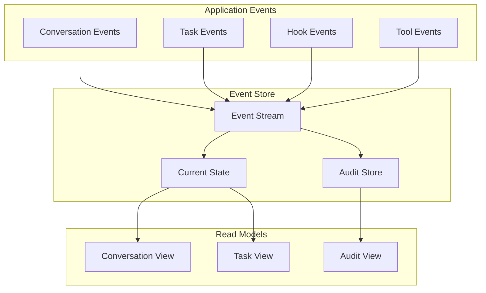

##### Database Schema Strategy

- **Conversation Data**: JSONB storage for flexible message formats
- **Task Data**: Relational tables for structured workflow state
- **Tenancy Partitioning**: `tenant_id` on tenant-owned tables with tenant-aware
  indexes and constraints
- **Audit Data**: Append-only event tables with immutable records
- **Configuration Data**: Structured tables for policies and settings

#### 3.5.3 Caching Solutions

##### In-Memory Caching

- **Tool Registry Cache**: Active tool definitions and schemas
- **Agent Session Cache**: Current agent backend sessions
- **Policy Cache**: Frequently accessed governance policies

##### Distributed Caching (Future)

- **Redis**: For multi-instance deployments
- **Conversation Context**: Shared context across agent sessions
- **Tool Results**: Cacheable tool execution results

#### 3.5.4 Storage Services

##### File System Storage

- **Workspace Files**: Encapsulated file system access through Podbot
- **Change Logs**: Weaver-generated change sets and diffs
- **Temporary Files**: Tool execution artifacts and build outputs

##### Object Storage (Future)

- **Artifact Storage**: Large tool outputs and build artifacts
- **Backup Storage**: Database backups and disaster recovery
- **Static Assets**: Documentation and configuration templates

#### 3.5.5 Database Configuration

Table 3.5.5-1: Database configuration by environment.

| Environment | Database                                                                  | Connection Pool    | Backup Strategy          |
| ----------- | ------------------------------------------------------------------------- | ------------------ | ------------------------ |
| Development | SQLite (default), in-memory                                               | Single connection  | None (ephemeral)         |
| Testing     | In-memory (unit), SQLite (file-backed), embedded PostgreSQL (integration) | Per-test isolation | None (ephemeral)         |
| Staging     | PostgreSQL                                                                | 10 connections     | Daily snapshots          |
| Production  | PostgreSQL                                                                | 50 connections     | Continuous WAL archiving |

##### Diesel Configuration Example

Create a database connection pool with `r2d2::Pool` setting maximum connections
and execute queries with Diesel's type-safe query DSL:

```toml
[dependencies]
diesel = { version = "2.3.5", features = ["postgres", "uuid", "chrono", "serde_json", "r2d2"] }
```

### 3.6 Development & Deployment

#### 3.6.1 Development Tools

##### Build System

- **Cargo**: Native Rust build system and package manager
- **Cargo Workspaces**: Multi-crate project organization following hexagonal
  architecture
- **Cargo Features**: Conditional compilation for different deployment targets

##### Code Quality Tools

- **Rustfmt**: Consistent code formatting across the project
- **Clippy**: Rust linter for catching common mistakes and improving code
  quality
- **Cargo Audit**: Security vulnerability scanning for dependencies
- **Cargo Deny**: License and dependency policy enforcement

##### Development Environment

- **Rust Analyzer**: IDE support for code completion and error checking
- **Cargo Watch**: Automatic rebuilding during development
- **Cargo Nextest**: Fast parallel test execution
- **Criterion**: Performance benchmarking and regression detection

#### 3.6.2 Containerization Strategy

##### Docker Multi-Stage Builds

```dockerfile
# Build stage
FROM rust:1.75-slim as builder
WORKDIR /app
COPY . .
RUN cargo build --release

#### Runtime stage
FROM debian:bookworm-slim
RUN apt-get update && apt-get install -y ca-certificates
COPY --from=builder /app/target/release/corbusier /usr/local/bin/
EXPOSE 8080
CMD ["corbusier"]
```

##### Container Architecture

- **Application Container**: Main Corbusier service
- **Database Container**: PostgreSQL for data persistence
- **Encapsulation Containers**: Podbot-managed workspace containers
- **Tool Containers**: MCP server containers for external tools

#### 3.6.3 CI/CD Pipeline Requirements

##### Continuous Integration

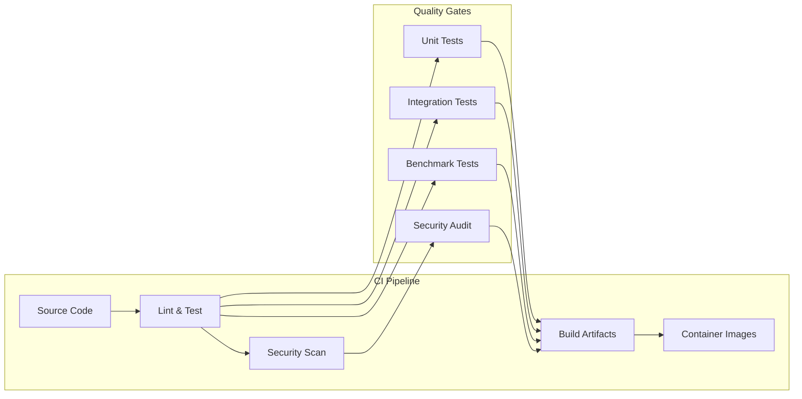

##### Deployment Automation

- **GitHub Actions**: Primary CI/CD platform
- **Automated Testing**: Unit, integration, and end-to-end tests
- **Security Scanning**: Dependency vulnerabilities and code analysis
- **Multi-Architecture Builds**: x86_64 and ARM64 container images

#### 3.6.4 Infrastructure as Code

##### Container Orchestration

- **Docker Compose**: Local development environment
- **Kubernetes**: Production container orchestration (future)
- **Helm Charts**: Kubernetes application packaging (future)

##### Configuration Management

- **Environment Variables**: Runtime configuration
- **Config Files**: TOML-based configuration for complex settings
- **Secrets Management**: Secure handling of API keys and credentials

#### 3.6.5 Monitoring and Observability

##### Application Metrics

tracing is a framework for instrumenting Rust programs to collect structured,
event-based diagnostic information integrated throughout the application for:

- **Performance Monitoring**: Request latency, throughput, and error rates
- **Business Metrics**: Task completion rates, agent utilization, tool
  execution success
- **System Health**: Database connection pool status, memory usage, CPU
  utilization

##### Distributed Tracing

The tracing crates provide a powerful system for logging in your application.
It is compatible with many other crates like the OpenTelemetry SDK, allowing
you to also send your logs for further analysis.

##### Log Aggregation

- **Structured Logging**: JSON-formatted logs for machine processing
- **Log Levels**: Configurable verbosity for different environments
- **Correlation IDs**: Request tracking across service boundaries

#### 3.6.6 Security Considerations

##### Container Security

- **Minimal Base Images**: Debian slim for reduced attack surface
- **Non-Root Execution**: Application runs as non-privileged user
- **Security Scanning**: Regular vulnerability assessment of container images

##### Dependency Security

- **Cargo Audit**: Automated security vulnerability scanning
- **Supply Chain Security**: Verification of dependency integrity
- **Regular Updates**: Scheduled dependency updates with security patches

##### Runtime Security

- **Encapsulation Boundaries**: Podbot containers for secure tool execution
- **Network Policies**: Restricted network access for workspace containers
- **Secrets Management**: Secure handling of API keys and authentication tokens

## 4. Process Flowchart

### 4.1 System Workflows

#### 4.1.1 Core Business Processes

##### 4.1.1.1 End-to-End User Journeys

###### Primary User Journey: Task Creation and Execution

The Model Context Protocol (MCP) is an open protocol that enables seamless
integration between LLM applications and external data sources and tools,
forming the foundation for Corbusier's tool orchestration capabilities.

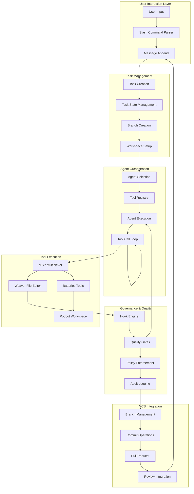

###### Secondary User Journey: Review Comment Processing

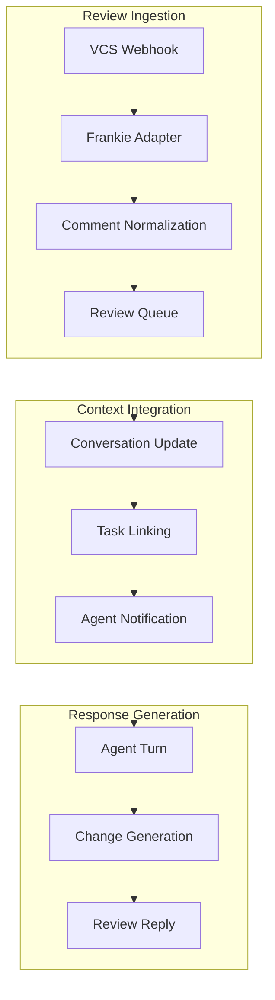

##### 4.1.1.2 System Interactions

###### Agent Backend Integration Flow

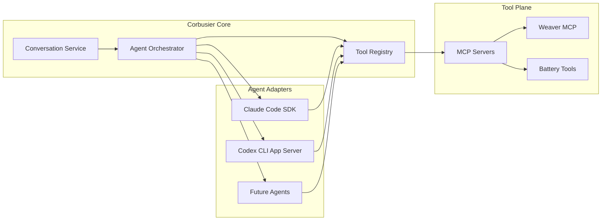

###### MCP Tool Orchestration Flow

The protocol uses JSON-RPC 2.0 messages to establish communication between
servers that provide context and capabilities, enabling standardized tool
integration across different agent backends.

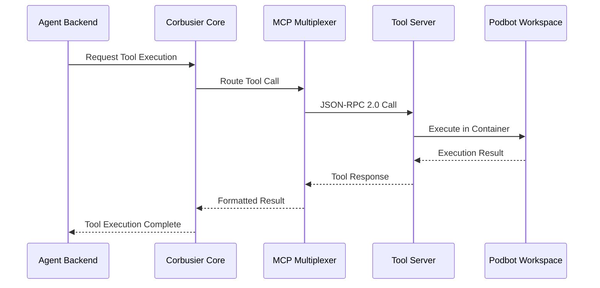

##### 4.1.1.3 Decision Points

###### Agent Selection Decision Matrix

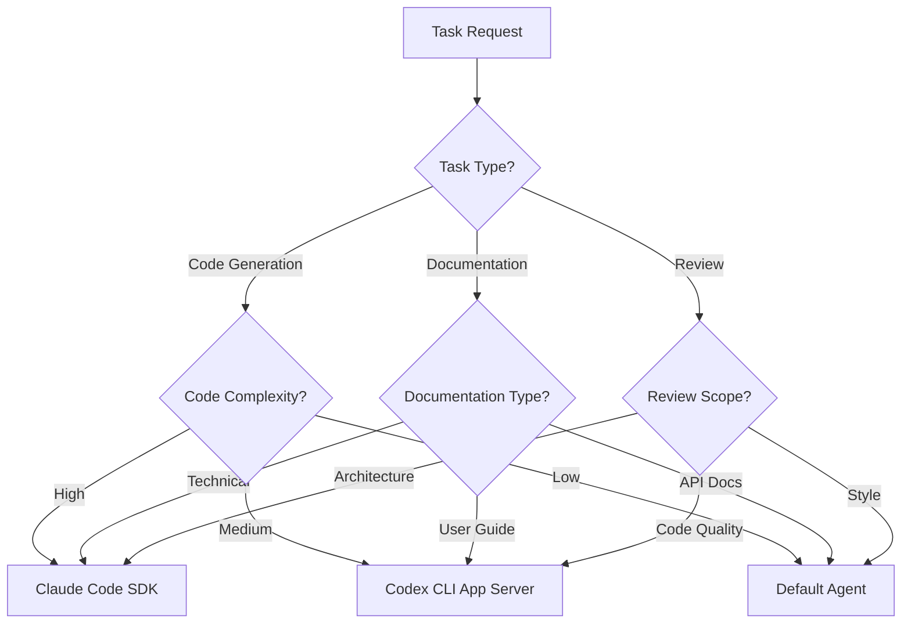

###### Tool Routing Decision Logic

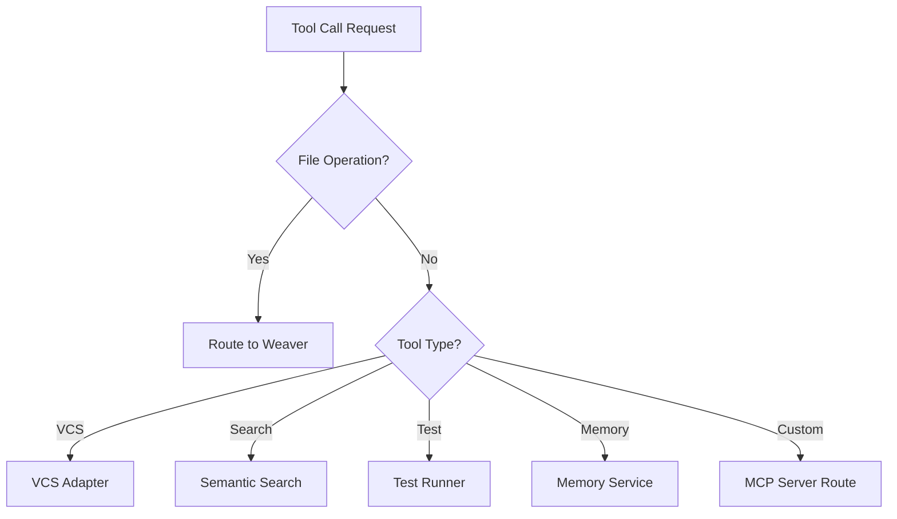

##### 4.1.1.4 Error Handling Paths

###### Agent Turn Error Recovery

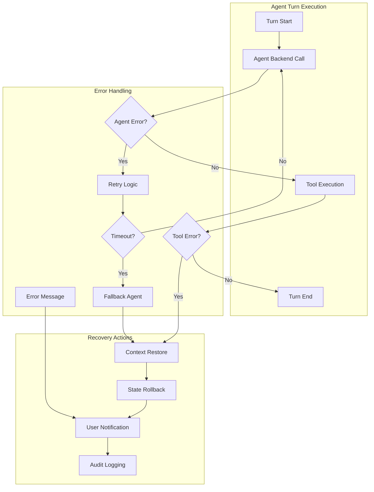

###### Hook Execution Error Handling

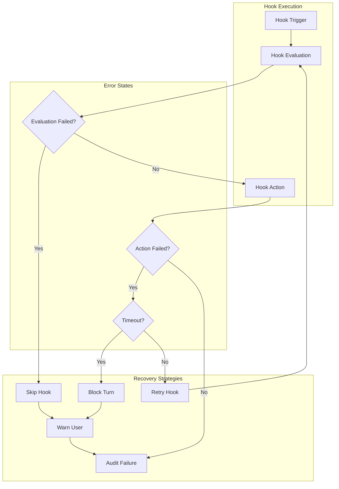

#### 4.1.2 Integration Workflows

##### 4.1.2.1 Data Flow Between Systems

###### Conversation Data Flow

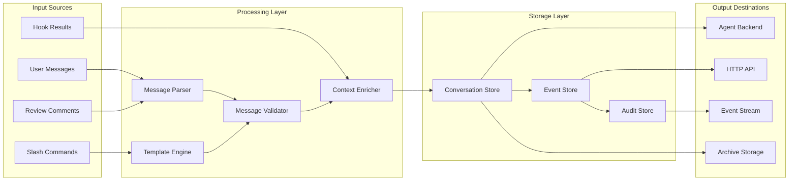

###### Tool Execution Data Flow

With Apps SDK, MCP is the backbone that keeps server, model, and UI in sync. By
standardising the wire format, authentication, and metadata, it lets ChatGPT
reason about your app the same way it reasons about built-in tools.

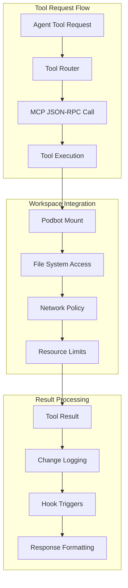

##### 4.1.2.2 API Interactions

###### VCS Integration API Flow

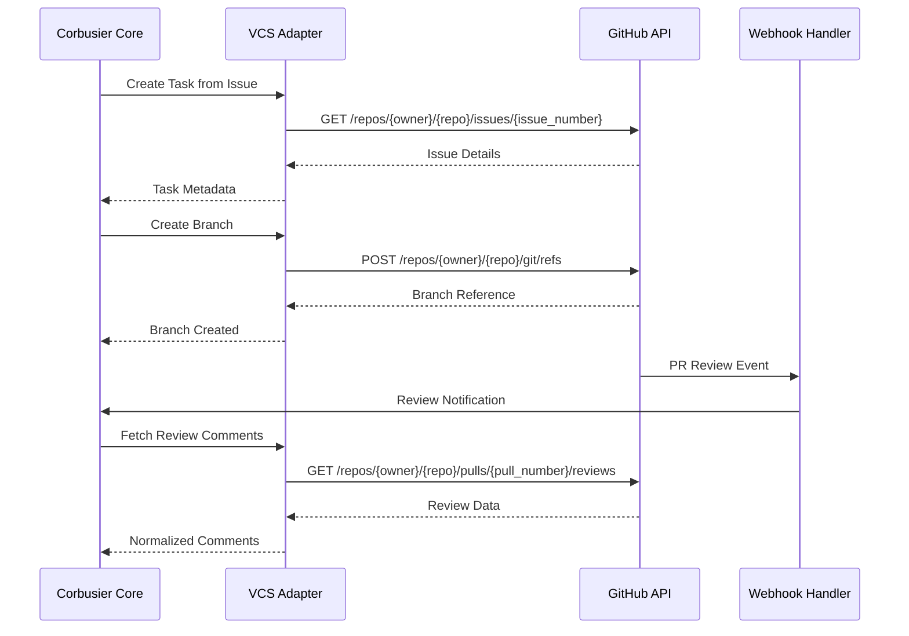

###### MCP Server Communication

The protocol uses JSON-RPC 2.0 messages to establish communication between
servers that provide context and capabilities, ensuring standardized
communication across all tool integrations.

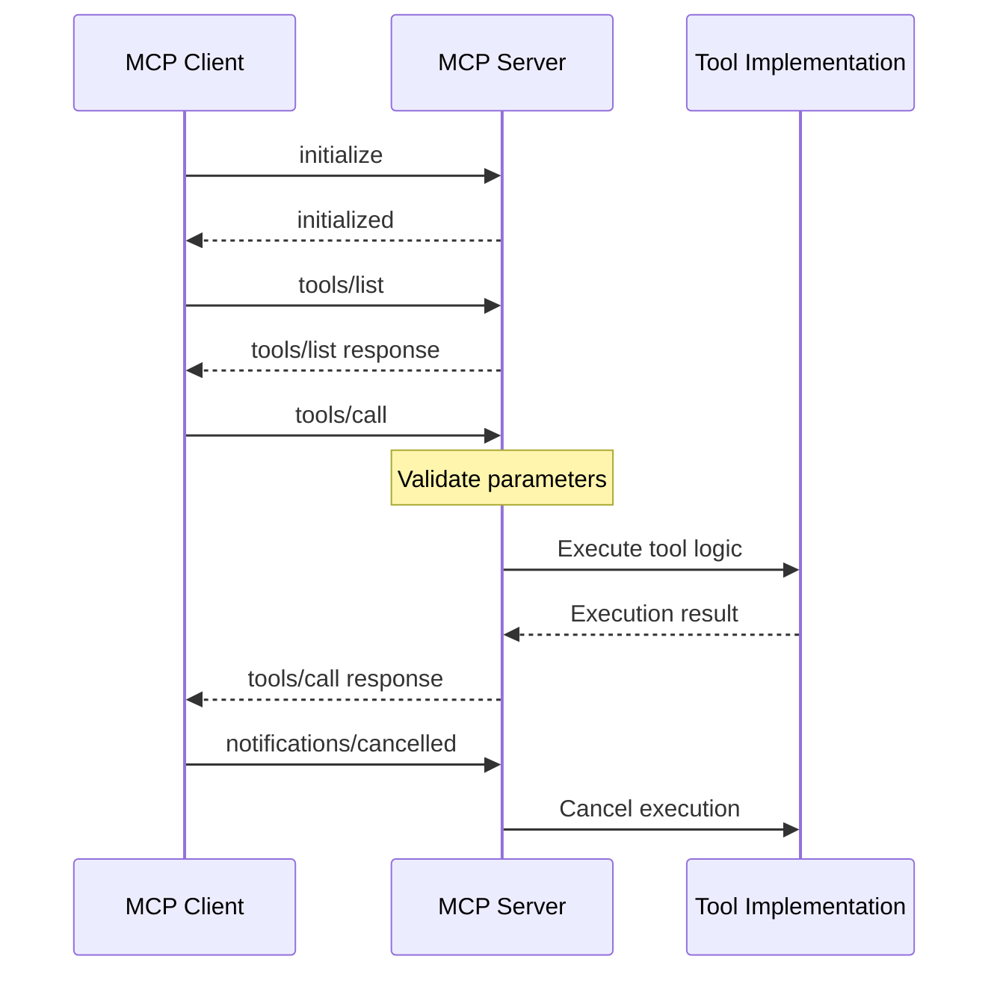

##### 4.1.2.3 Event Processing Flows

###### Real-time Event Streaming

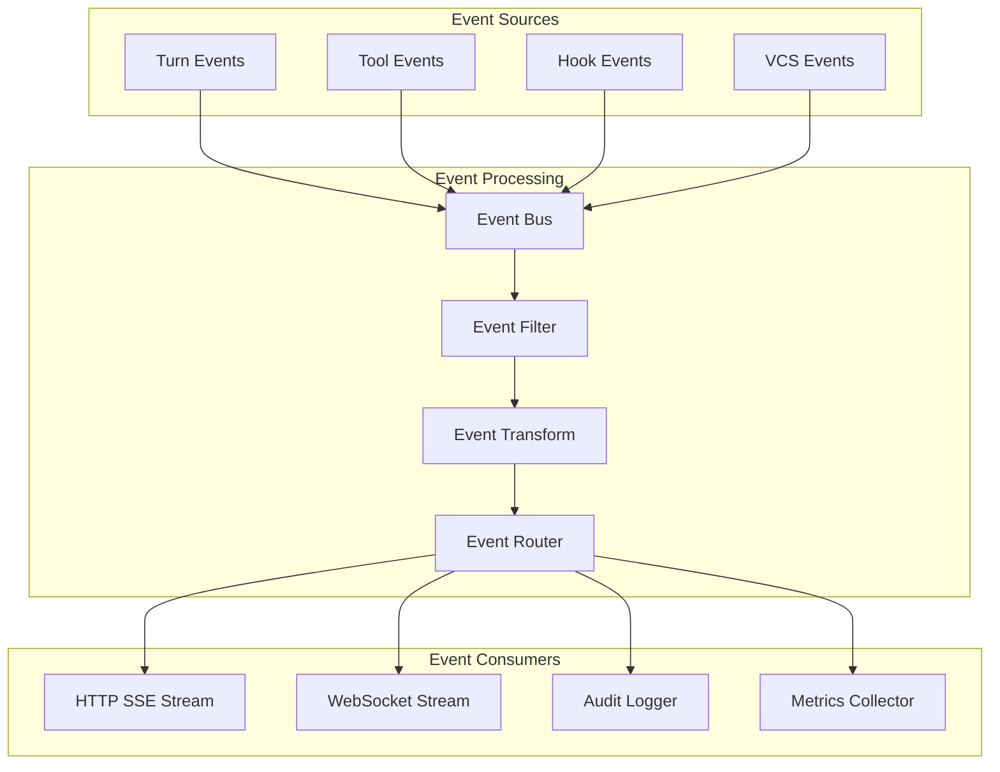

###### Hook Event Processing

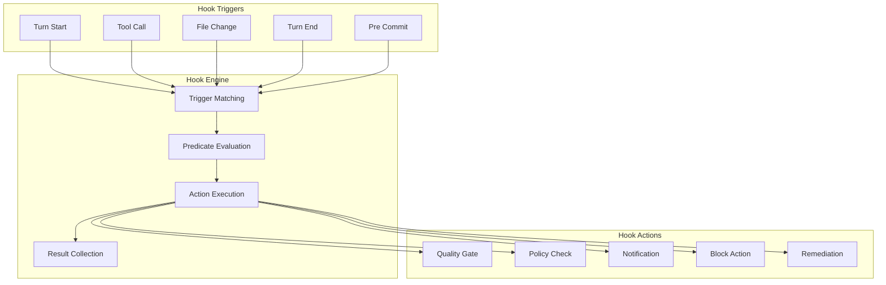

##### 4.1.2.4 Batch Processing Sequences

###### Audit Data Processing

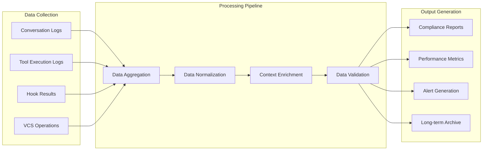

### 4.2 Flowchart Requirements

#### 4.2.1 Process Steps and Decision Points

##### 4.2.1.1 Agent Turn Execution Process

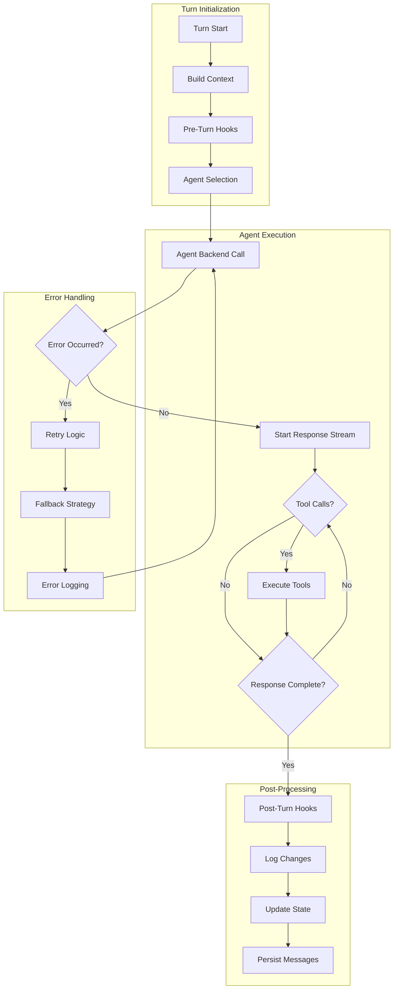

##### 4.2.1.2 Task Lifecycle Management

```mermaid
stateDiagram-v2
    [*] --> Draft: Create Task
    Draft --> InProgress: Start Task
    Draft --> Abandoned: Cancel Task
    
    InProgress --> InReview: Create PR
    InProgress --> Abandoned: Cancel Task
    InProgress --> InProgress: Continue Work
    
    InReview --> InProgress: Request Changes
    InReview --> Done: Approve & Merge
    InReview --> Abandoned: Close PR
    
    Done --> [*]
    Abandoned --> [*]
    
    note right of Draft
        Task created from issue
        Branch not yet created
    end note
    
    note right of InProgress
        Branch created
        Active development
        Tools available
    end note
    
    note right of InReview
        PR created
        Review process active
        Hooks enforced
    end note
```

#### 4.2.2 System Boundaries and User Touchpoints

##### 4.2.2.1 System Architecture Boundaries

```mermaid
flowchart TB
    subgraph "External Systems"
        USER[User Interface]
        VCS[Version Control Systems]
        AGENTS[AI Agent Services]
        REVIEW[Review Tools]
    end
    
    subgraph "Corbusier Platform"
        subgraph "API Layer"
            HTTP[HTTP API]
            WS[WebSocket/SSE]
            WEBHOOK[Webhook Handlers]
        end
        
        subgraph "Core Services"
            CONV[Conversation Service]
            TASK[Task Service]
            AGENT_ORCH[Agent Orchestrator]
            TOOL_REG[Tool Registry]
        end
        
        subgraph "Infrastructure"
            MCP[MCP Multiplexer]
            HOOKS[Hook Engine]
            ENCAP[Encapsulation Layer]
            PERSIST[Persistence Layer]
        end
    end
    
    subgraph "Tool Ecosystem"
        WEAVER[Weaver Editor]
        PODBOT[Podbot Containers]
        BATTERIES[Battery Tools]
        CUSTOM[Custom Tools]
    end
    
    USER --> HTTP
    USER --> WS
    VCS --> WEBHOOK
    AGENTS --> AGENT_ORCH
    REVIEW --> WEBHOOK
    
    HTTP --> CONV
    HTTP --> TASK
    WS --> CONV
    WEBHOOK --> TASK
    
    CONV --> AGENT_ORCH
    TASK --> AGENT_ORCH
    AGENT_ORCH --> TOOL_REG
    TOOL_REG --> MCP
    
    MCP --> WEAVER
    MCP --> BATTERIES
    MCP --> CUSTOM
    ENCAP --> PODBOT
    
    HOOKS --> PERSIST
    CONV --> PERSIST
    TASK --> PERSIST
```

##### 4.2.2.2 User Interaction Points

```mermaid
journey
    title User Journey: Task Creation to Completion
    section Task Setup
        Create task from issue: 5: User
        Configure workspace: 4: User, System
        Select agent backend: 4: User
    section Development
        Send messages to agent: 5: User
        Execute slash commands: 5: User
        Review tool outputs: 4: User, Agent
        Approve changes: 4: User
    section Quality Gates
        Run automated tests: 3: System
        Review hook results: 4: User, System
        Address policy violations: 3: User, Agent
    section Completion
        Create pull request: 4: System
        Review and merge: 5: User
        Archive conversation: 3: System
```

#### 4.2.3 Error States and Recovery Paths

##### 4.2.3.1 Agent Backend Failure Recovery

```mermaid
flowchart TD
    subgraph "Failure Detection"
        AGENT_CALL[Agent Backend Call]
        TIMEOUT{Timeout?}
        ERROR_RESP{Error Response?}
        CONN_FAIL{Connection Failed?}
    end
    
    subgraph "Recovery Strategy"
        RETRY_COUNT{Retry Count < Max?}
        BACKOFF[Exponential Backoff]
        FALLBACK_AGENT[Switch to Fallback Agent]
        CONTEXT_TRANSFER[Transfer Context]
    end
    
    subgraph "User Communication"
        NOTIFY_USER[Notify User of Issue]
        PROGRESS_UPDATE[Update Progress Status]
        MANUAL_INTERVENTION[Request Manual Intervention]
    end
    
    subgraph "System Recovery"
        STATE_RESTORE[Restore Previous State]
        AUDIT_LOG[Log Recovery Event]
        HEALTH_CHECK[Health Check]
        RESUME_OPERATION[Resume Operation]
    end
    
    AGENT_CALL --> TIMEOUT
    AGENT_CALL --> ERROR_RESP
    AGENT_CALL --> CONN_FAIL
    
    TIMEOUT -->|Yes| RETRY_COUNT
    ERROR_RESP -->|Yes| RETRY_COUNT
    CONN_FAIL -->|Yes| RETRY_COUNT
    
    RETRY_COUNT -->|Yes| BACKOFF
    RETRY_COUNT -->|No| FALLBACK_AGENT
    
    BACKOFF --> AGENT_CALL
    FALLBACK_AGENT --> CONTEXT_TRANSFER
    CONTEXT_TRANSFER --> NOTIFY_USER
    
    NOTIFY_USER --> PROGRESS_UPDATE
    PROGRESS_UPDATE --> MANUAL_INTERVENTION
    MANUAL_INTERVENTION --> STATE_RESTORE
    
    STATE_RESTORE --> AUDIT_LOG
    AUDIT_LOG --> HEALTH_CHECK
    HEALTH_CHECK --> RESUME_OPERATION
```

##### 4.2.3.2 Tool Execution Error Handling

```mermaid
flowchart TD
    subgraph "Tool Execution Errors"
        TOOL_START[Tool Execution Start]
        PERMISSION_ERROR{Permission Denied?}
        RESOURCE_ERROR{Resource Unavailable?}
        TIMEOUT_ERROR{Execution Timeout?}
        VALIDATION_ERROR{Input Validation Failed?}
    end
    
    subgraph "Error Classification"
        RETRYABLE{Retryable Error?}
        USER_ERROR{User Input Error?}
        SYSTEM_ERROR{System Error?}
        FATAL_ERROR{Fatal Error?}
    end
    
    subgraph "Recovery Actions"
        RETRY_TOOL[Retry Tool Execution]
        REQUEST_INPUT[Request User Input]
        ESCALATE[Escalate to Admin]
        ABORT_TURN[Abort Turn]
        ALTERNATIVE_TOOL[Use Alternative Tool]
    end
    
    TOOL_START --> PERMISSION_ERROR
    TOOL_START --> RESOURCE_ERROR
    TOOL_START --> TIMEOUT_ERROR
    TOOL_START --> VALIDATION_ERROR
    
    PERMISSION_ERROR --> RETRYABLE
    RESOURCE_ERROR --> RETRYABLE
    TIMEOUT_ERROR --> RETRYABLE
    VALIDATION_ERROR --> USER_ERROR
    
    RETRYABLE -->|Yes| RETRY_TOOL
    RETRYABLE -->|No| SYSTEM_ERROR
    USER_ERROR -->|Yes| REQUEST_INPUT
    SYSTEM_ERROR -->|Yes| ESCALATE
    
    SYSTEM_ERROR --> FATAL_ERROR
    FATAL_ERROR -->|Yes| ABORT_TURN
    FATAL_ERROR -->|No| ALTERNATIVE_TOOL
    
    RETRY_TOOL --> TOOL_START
    REQUEST_INPUT --> TOOL_START
    ALTERNATIVE_TOOL --> TOOL_START
```

### 4.3 Technical Implementation

#### 4.3.1 State Management

##### 4.3.1.1 Conversation State Transitions

```mermaid
stateDiagram-v2
    [*] --> Created: Initialize Conversation
    Created --> Active: First Message
    Active --> AgentProcessing: Agent Turn Start
    AgentProcessing --> ToolExecution: Tool Call
    ToolExecution --> AgentProcessing: Tool Result
    AgentProcessing --> Active: Turn Complete
    Active --> Paused: User Pause
    Paused --> Active: User Resume
    Active --> Archived: Archive Conversation
    Archived --> [*]
    
    AgentProcessing --> Error: Agent Failure
    ToolExecution --> Error: Tool Failure
    Error --> Active: Recovery Complete
    Error --> Archived: Unrecoverable Error
```

##### 4.3.1.2 Task State Management

```mermaid
flowchart TD
    subgraph "State Persistence"
        TASK_STATE[Task State Store]
        EVENT_LOG[Event Log]
        SNAPSHOT[State Snapshots]
        RECOVERY[Recovery Points]
    end
    
    subgraph "State Transitions"
        VALIDATE[Validate Transition]
        EXECUTE[Execute Transition]
        PERSIST[Persist State]
        NOTIFY[Notify Subscribers]
    end
    
    subgraph "Consistency Checks"
        INVARIANT[Check Invariants]
        CONFLICT[Resolve Conflicts]
        ROLLBACK[Rollback on Failure]
        AUDIT[Audit Changes]
    end
    
    TASK_STATE --> VALIDATE
    VALIDATE --> INVARIANT
    INVARIANT --> EXECUTE
    EXECUTE --> PERSIST
    PERSIST --> EVENT_LOG
    EVENT_LOG --> SNAPSHOT
    SNAPSHOT --> NOTIFY
    
    INVARIANT --> CONFLICT
    CONFLICT --> ROLLBACK
    EXECUTE --> ROLLBACK
    ROLLBACK --> RECOVERY
    
    NOTIFY --> AUDIT
    AUDIT --> TASK_STATE
```

#### 4.3.2 Data Persistence Points

##### 4.3.2.1 Event Sourcing Architecture

```mermaid
flowchart LR
    subgraph "Event Generation"
        USER_ACTION[User Actions]
        AGENT_ACTION[Agent Actions]
        TOOL_ACTION[Tool Actions]
        SYSTEM_ACTION[System Actions]
    end
    
    subgraph "Event Processing"
        EVENT_STREAM[Event Stream]
        VALIDATION[Event Validation]
        ENRICHMENT[Event Enrichment]
        ORDERING[Event Ordering]
    end
    
    subgraph "Persistence Layer"
        EVENT_STORE[Event Store]
        SNAPSHOT_STORE[Snapshot Store]
        READ_MODEL[Read Models]
        ARCHIVE[Archive Storage]
    end
    
    subgraph "Query Layer"
        PROJECTION[Event Projections]
        MATERIALIZED[Materialized Views]
        CACHE[Query Cache]
        API_LAYER[API Layer]
    end
    
    USER_ACTION --> EVENT_STREAM
    AGENT_ACTION --> EVENT_STREAM
    TOOL_ACTION --> EVENT_STREAM
    SYSTEM_ACTION --> EVENT_STREAM
    
    EVENT_STREAM --> VALIDATION
    VALIDATION --> ENRICHMENT
    ENRICHMENT --> ORDERING
    ORDERING --> EVENT_STORE
    
    EVENT_STORE --> SNAPSHOT_STORE
    EVENT_STORE --> READ_MODEL
    SNAPSHOT_STORE --> ARCHIVE
    
    READ_MODEL --> PROJECTION
    PROJECTION --> MATERIALIZED
    MATERIALIZED --> CACHE
    CACHE --> API_LAYER
```

##### 4.3.2.2 Transaction Boundaries

```mermaid
flowchart TD
    subgraph "Transaction Scope"
        BEGIN_TX[Begin Transaction]
        VALIDATE_INPUT[Validate Input]
        BUSINESS_LOGIC[Execute Business Logic]
        PERSIST_CHANGES[Persist Changes]
        COMMIT_TX[Commit Transaction]
    end
    
    subgraph "Rollback Scenarios"
        VALIDATION_FAIL[Validation Failed]
        LOGIC_ERROR[Business Logic Error]
        PERSISTENCE_ERROR[Persistence Error]
        ROLLBACK[Rollback Transaction]
    end
    
    subgraph "Consistency Guarantees"
        ACID_CHECK[ACID Compliance]
        ISOLATION[Isolation Level]
        DURABILITY[Durability Check]
        CONSISTENCY[Consistency Validation]
    end
    
    BEGIN_TX --> VALIDATE_INPUT
    VALIDATE_INPUT --> VALIDATION_FAIL
    VALIDATE_INPUT --> BUSINESS_LOGIC
    
    BUSINESS_LOGIC --> LOGIC_ERROR
    BUSINESS_LOGIC --> PERSIST_CHANGES
    
    PERSIST_CHANGES --> PERSISTENCE_ERROR
    PERSIST_CHANGES --> COMMIT_TX
    
    VALIDATION_FAIL --> ROLLBACK
    LOGIC_ERROR --> ROLLBACK
    PERSISTENCE_ERROR --> ROLLBACK
    
    COMMIT_TX --> ACID_CHECK
    ACID_CHECK --> ISOLATION
    ISOLATION --> DURABILITY
    DURABILITY --> CONSISTENCY
```

#### 4.3.3 Caching Requirements

##### 4.3.3.1 Multi-Level Caching Strategy

```mermaid
flowchart TD
    subgraph "Application Cache"
        TOOL_CACHE[Tool Registry Cache]
        AGENT_CACHE[Agent Session Cache]
        POLICY_CACHE[Policy Cache]
        TEMPLATE_CACHE[Template Cache]
    end
    
    subgraph "Data Cache"
        CONVERSATION_CACHE[Conversation Cache]
        TASK_CACHE[Task Cache]
        USER_CACHE[User Context Cache]
        METADATA_CACHE[Metadata Cache]
    end
    
    subgraph "External Cache"
        VCS_CACHE[VCS Data Cache]
        AGENT_RESP_CACHE[Agent Response Cache]
        TOOL_RESULT_CACHE[Tool Result Cache]
        REVIEW_CACHE[Review Data Cache]
    end
    
    subgraph "Cache Management"
        TTL[Time-to-Live]
        INVALIDATION[Cache Invalidation]
        WARMING[Cache Warming]
        EVICTION[Cache Eviction]
    end
    
    TOOL_CACHE --> TTL
    AGENT_CACHE --> TTL
    POLICY_CACHE --> TTL
    TEMPLATE_CACHE --> TTL
    
    CONVERSATION_CACHE --> INVALIDATION
    TASK_CACHE --> INVALIDATION
    USER_CACHE --> INVALIDATION
    METADATA_CACHE --> INVALIDATION
    
    VCS_CACHE --> WARMING
    AGENT_RESP_CACHE --> WARMING
    TOOL_RESULT_CACHE --> WARMING
    REVIEW_CACHE --> WARMING
    
    TTL --> EVICTION
    INVALIDATION --> EVICTION
    WARMING --> EVICTION
```

#### 4.3.4 Error Handling

##### 4.3.4.1 Retry Mechanisms

```mermaid
flowchart TD
    subgraph "Retry Configuration"
        MAX_RETRIES[Max Retry Count]
        BACKOFF_STRATEGY[Backoff Strategy]
        RETRY_CONDITIONS[Retry Conditions]
        CIRCUIT_BREAKER[Circuit Breaker]
    end
    
    subgraph "Retry Logic"
        ATTEMPT[Execute Attempt]
        SUCCESS{Success?}
        RETRYABLE{Retryable Error?}
        RETRY_COUNT{Retry Count < Max?}
        BACKOFF_WAIT[Wait with Backoff]
    end
    
    subgraph "Failure Handling"
        PERMANENT_FAIL[Permanent Failure]
        CIRCUIT_OPEN[Open Circuit]
        FALLBACK[Execute Fallback]
        ERROR_LOG[Log Error]
    end
    
    MAX_RETRIES --> RETRY_COUNT
    BACKOFF_STRATEGY --> BACKOFF_WAIT
    RETRY_CONDITIONS --> RETRYABLE
    CIRCUIT_BREAKER --> CIRCUIT_OPEN
    
    ATTEMPT --> SUCCESS
    SUCCESS -->|No| RETRYABLE
    SUCCESS -->|Yes| CIRCUIT_BREAKER
    
    RETRYABLE -->|Yes| RETRY_COUNT
    RETRYABLE -->|No| PERMANENT_FAIL
    
    RETRY_COUNT -->|Yes| BACKOFF_WAIT
    RETRY_COUNT -->|No| PERMANENT_FAIL
    
    BACKOFF_WAIT --> ATTEMPT
    PERMANENT_FAIL --> FALLBACK
    CIRCUIT_OPEN --> FALLBACK
    FALLBACK --> ERROR_LOG
```

##### 4.3.4.2 Fallback Processes

```mermaid
flowchart TD
    subgraph "Primary Systems"
        PRIMARY_AGENT[Primary Agent]
        PRIMARY_TOOL[Primary Tool]
        PRIMARY_VCS[Primary VCS]
        PRIMARY_STORAGE[Primary Storage]
    end
    
    subgraph "Fallback Systems"
        FALLBACK_AGENT[Fallback Agent]
        FALLBACK_TOOL[Alternative Tool]
        FALLBACK_VCS[Backup VCS]
        FALLBACK_STORAGE[Backup Storage]
    end
    
    subgraph "Degraded Mode"
        LIMITED_FEATURES[Limited Features]
        CACHED_DATA[Cached Data Only]
        MANUAL_MODE[Manual Intervention]
        OFFLINE_MODE[Offline Mode]
    end
    
    subgraph "Recovery Process"
        HEALTH_CHECK[Health Monitoring]
        AUTO_RECOVERY[Automatic Recovery]
        GRADUAL_RESTORE[Gradual Restoration]
        FULL_RESTORE[Full Service Restore]
    end
    
    PRIMARY_AGENT --> FALLBACK_AGENT
    PRIMARY_TOOL --> FALLBACK_TOOL
    PRIMARY_VCS --> FALLBACK_VCS
    PRIMARY_STORAGE --> FALLBACK_STORAGE
    
    FALLBACK_AGENT --> LIMITED_FEATURES
    FALLBACK_TOOL --> CACHED_DATA
    FALLBACK_VCS --> MANUAL_MODE
    FALLBACK_STORAGE --> OFFLINE_MODE
    
    LIMITED_FEATURES --> HEALTH_CHECK
    CACHED_DATA --> HEALTH_CHECK
    MANUAL_MODE --> HEALTH_CHECK
    OFFLINE_MODE --> HEALTH_CHECK
    
    HEALTH_CHECK --> AUTO_RECOVERY
    AUTO_RECOVERY --> GRADUAL_RESTORE
    GRADUAL_RESTORE --> FULL_RESTORE
```

### 4.4 Validation Rules

#### 4.4.1 Business Rules at Each Step

##### 4.4.1.1 Task Creation Validation

| Validation Rule        | Description                                           | Enforcement Point | Error Handling                   |
| ---------------------- | ----------------------------------------------------- | ----------------- | -------------------------------- |
| Unique Task ID         | Each task must have a globally unique identifier      | Task creation     | Reject with error message        |
| Valid Issue Reference  | Task origin must reference existing VCS issue         | Issue validation  | Fetch and validate issue         |
| Branch Naming Policy   | Branch names must follow configured naming convention | Branch creation   | Auto-generate compliant name     |
| Workspace Availability | Required workspace resources must be available        | Workspace setup   | Queue or fallback to alternative |

##### 4.4.1.2 Agent Turn Validation

```mermaid
flowchart TD
    subgraph "Pre-Turn Validation"
        CONTEXT_VALID{Context Valid?}
        AGENT_AVAILABLE{Agent Available?}
        TOOLS_READY{Tools Ready?}
        PERMISSIONS{Permissions OK?}
    end
    
    subgraph "During-Turn Validation"
        TOOL_PARAMS{Tool Parameters Valid?}
        RESOURCE_LIMITS{Within Resource Limits?}
        POLICY_COMPLIANCE{Policy Compliant?}
        TIMEOUT_CHECK{Within Timeout?}
    end
    
    subgraph "Post-Turn Validation"
        RESPONSE_VALID{Response Valid?}
        CHANGES_APPROVED{Changes Approved?}
        HOOKS_PASSED{Hooks Passed?}
        STATE_CONSISTENT{State Consistent?}
    end
    
    CONTEXT_VALID -->|No| REJECT_TURN[Reject Turn]
    AGENT_AVAILABLE -->|No| QUEUE_TURN[Queue Turn]
    TOOLS_READY -->|No| WAIT_TOOLS[Wait for Tools]
    PERMISSIONS -->|No| REQUEST_AUTH[Request Authorization]
    
    TOOL_PARAMS -->|No| INVALID_PARAMS[Invalid Parameters Error]
    RESOURCE_LIMITS -->|No| RESOURCE_ERROR[Resource Limit Error]
    POLICY_COMPLIANCE -->|No| POLICY_VIOLATION[Policy Violation]
    TIMEOUT_CHECK -->|No| TIMEOUT_ERROR[Timeout Error]
    
    RESPONSE_VALID -->|No| RESPONSE_ERROR[Response Error]
    CHANGES_APPROVED -->|No| REJECT_CHANGES[Reject Changes]
    HOOKS_PASSED -->|No| HOOK_FAILURE[Hook Failure]
    STATE_CONSISTENT -->|No| STATE_ERROR[State Inconsistency]
```

#### 4.4.2 Data Validation Requirements

##### 4.4.2.1 Message Validation Schema

```mermaid
flowchart TD
    subgraph "Message Structure"
        MSG_ID[Message ID Required]
        ROLE_VALID[Valid Role Type]
        CONTENT_PARTS[Content Parts Array]
        TIMESTAMP[Timestamp Required]
    end
    
    subgraph "Content Validation"
        TEXT_CONTENT[Text Content Validation]
        TOOL_CALLS[Tool Call Validation]
        ATTACHMENTS[Attachment Validation]
        METADATA[Metadata Validation]
    end
    
    subgraph "Business Rules"
        CONVERSATION_CONTEXT[Conversation Context]
        SEQUENCE_ORDER[Message Sequence]
        DUPLICATE_CHECK[Duplicate Detection]
        SIZE_LIMITS[Size Limits]
    end
    
    MSG_ID --> TEXT_CONTENT
    ROLE_VALID --> TOOL_CALLS
    CONTENT_PARTS --> ATTACHMENTS
    TIMESTAMP --> METADATA
    
    TEXT_CONTENT --> CONVERSATION_CONTEXT
    TOOL_CALLS --> SEQUENCE_ORDER
    ATTACHMENTS --> DUPLICATE_CHECK
    METADATA --> SIZE_LIMITS
```

##### 4.4.2.2 Tool Call Validation

A minimal MCP server for Apps SDK implements three capabilities: List tools –
your server advertises the tools it supports, including their JSON Schema input
and output contracts and optional annotations. Call tools – when a model
selects a tool to use, it sends a call_tool request with the arguments
corresponding to the user intent.

```mermaid
flowchart TD
    subgraph "Schema Validation"
        TOOL_EXISTS{Tool Exists?}
        SCHEMA_MATCH{Schema Matches?}
        PARAM_TYPES{Parameter Types Valid?}
        REQUIRED_PARAMS{Required Parameters Present?}
    end
    
    subgraph "Authorization Validation"
        TOOL_PERMISSIONS{Tool Permissions?}
        WORKSPACE_ACCESS{Workspace Access?}
        RESOURCE_QUOTA{Resource Quota?}
        POLICY_ALLOWED{Policy Allows?}
    end
    
    subgraph "Runtime Validation"
        TOOL_AVAILABLE{Tool Available?}
        DEPENDENCIES{Dependencies Met?}
        PRECONDITIONS{Preconditions Met?}
        CONTEXT_VALID{Context Valid?}
    end
    
    TOOL_EXISTS -->|No| TOOL_NOT_FOUND[Tool Not Found Error]
    SCHEMA_MATCH -->|No| SCHEMA_ERROR[Schema Validation Error]
    PARAM_TYPES -->|No| TYPE_ERROR[Parameter Type Error]
    REQUIRED_PARAMS -->|No| MISSING_PARAM[Missing Parameter Error]
    
    TOOL_PERMISSIONS -->|No| PERMISSION_DENIED[Permission Denied]
    WORKSPACE_ACCESS -->|No| ACCESS_DENIED[Access Denied]
    RESOURCE_QUOTA -->|No| QUOTA_EXCEEDED[Quota Exceeded]
    POLICY_ALLOWED -->|No| POLICY_BLOCKED[Policy Blocked]
    
    TOOL_AVAILABLE -->|No| TOOL_UNAVAILABLE[Tool Unavailable]
    DEPENDENCIES -->|No| DEPENDENCY_ERROR[Dependency Error]
    PRECONDITIONS -->|No| PRECONDITION_FAILED[Precondition Failed]
    CONTEXT_VALID -->|No| CONTEXT_ERROR[Context Error]
```

#### 4.4.3 Authorization Checkpoints

##### 4.4.3.1 Multi-Level Authorization

```mermaid
flowchart TD
    subgraph "User Level"
        USER_AUTH[User Authentication]
        USER_ROLES[User Roles]
        USER_PERMISSIONS[User Permissions]
        SESSION_VALID[Session Validation]
    end
    
    subgraph "Resource Level"
        RESOURCE_OWNER[Resource Ownership]
        RESOURCE_POLICY[Resource Policy]
        RESOURCE_SCOPE[Resource Scope]
        RESOURCE_STATE[Resource State]
    end
    
    subgraph "Operation Level"
        OPERATION_TYPE[Operation Type]
        OPERATION_CONTEXT[Operation Context]
        OPERATION_IMPACT[Operation Impact]
        OPERATION_AUDIT[Operation Audit]
    end
    
    subgraph "System Level"
        SYSTEM_POLICY[System Policy]
        RATE_LIMITS[Rate Limits]
        QUOTA_LIMITS[Quota Limits]
        MAINTENANCE_MODE[Maintenance Mode]
    end
    
    USER_AUTH --> RESOURCE_OWNER
    USER_ROLES --> RESOURCE_POLICY
    USER_PERMISSIONS --> RESOURCE_SCOPE
    SESSION_VALID --> RESOURCE_STATE
    
    RESOURCE_OWNER --> OPERATION_TYPE
    RESOURCE_POLICY --> OPERATION_CONTEXT
    RESOURCE_SCOPE --> OPERATION_IMPACT
    RESOURCE_STATE --> OPERATION_AUDIT
    
    OPERATION_TYPE --> SYSTEM_POLICY
    OPERATION_CONTEXT --> RATE_LIMITS
    OPERATION_IMPACT --> QUOTA_LIMITS
    OPERATION_AUDIT --> MAINTENANCE_MODE
```

#### 4.4.4 Regulatory Compliance Checks

##### 4.4.4.1 Audit Trail Requirements

```mermaid
flowchart LR
    subgraph "Data Collection"
        USER_ACTIONS[User Actions]
        SYSTEM_EVENTS[System Events]
        TOOL_EXECUTIONS[Tool Executions]
        STATE_CHANGES[State Changes]
    end
    
    subgraph "Audit Processing"
        EVENT_CAPTURE[Event Capture]
        DATA_ENRICHMENT[Data Enrichment]
        INTEGRITY_CHECK[Integrity Check]
        RETENTION_POLICY[Retention Policy]
    end
    
    subgraph "Compliance Validation"
        COMPLETENESS[Completeness Check]
        IMMUTABILITY[Immutability Verification]
        ACCESSIBILITY[Accessibility Validation]
        PRIVACY_COMPLIANCE[Privacy Compliance]
    end
    
    subgraph "Reporting"
        AUDIT_REPORTS[Audit Reports]
        COMPLIANCE_DASHBOARD[Compliance Dashboard]
        VIOLATION_ALERTS[Violation Alerts]
        EXPORT_CAPABILITY[Export Capability]
    end
    
    USER_ACTIONS --> EVENT_CAPTURE
    SYSTEM_EVENTS --> EVENT_CAPTURE
    TOOL_EXECUTIONS --> EVENT_CAPTURE
    STATE_CHANGES --> EVENT_CAPTURE
    
    EVENT_CAPTURE --> DATA_ENRICHMENT
    DATA_ENRICHMENT --> INTEGRITY_CHECK
    INTEGRITY_CHECK --> RETENTION_POLICY
    
    RETENTION_POLICY --> COMPLETENESS
    COMPLETENESS --> IMMUTABILITY
    IMMUTABILITY --> ACCESSIBILITY
    ACCESSIBILITY --> PRIVACY_COMPLIANCE
    
    PRIVACY_COMPLIANCE --> AUDIT_REPORTS
    AUDIT_REPORTS --> COMPLIANCE_DASHBOARD
    COMPLIANCE_DASHBOARD --> VIOLATION_ALERTS
    VIOLATION_ALERTS --> EXPORT_CAPABILITY
```

### 4.5 Timing and SLA Considerations

#### 4.5.1 Performance Requirements

##### 4.5.1.1 Response Time Targets

| Operation Category        | Target Latency | Maximum Latency | Measurement Method           |
| ------------------------- | -------------- | --------------- | ---------------------------- |
| Message Processing        | <100ms         | <500ms          | End-to-end message handling  |
| Tool Execution Initiation | <2s            | <5s             | Tool call to execution start |
| Agent Turn Completion     | <30s           | <120s           | Turn start to completion     |
| VCS Operations            | <5s            | <15s            | API call to response         |
| Hook Execution            | <10s           | <30s            | Hook trigger to completion   |

##### 4.5.1.2 Throughput Requirements

```mermaid
flowchart TD
    subgraph "Concurrent Operations"
        CONVERSATIONS[100 Concurrent Conversations]
        AGENT_TURNS[50 Concurrent Agent Turns]
        TOOL_CALLS[500 Tool Calls/Minute]
        VCS_OPS[100 VCS Operations/Minute]
    end
    
    subgraph "Resource Scaling"
        AUTO_SCALE[Auto Scaling Triggers]
        LOAD_BALANCE[Load Balancing]
        RESOURCE_POOL[Resource Pool Management]
        QUEUE_MANAGEMENT[Queue Management]
    end
    
    subgraph "Performance Monitoring"
        METRICS[Performance Metrics]
        ALERTS[Performance Alerts]
        CAPACITY_PLANNING[Capacity Planning]
        OPTIMIZATION[Performance Optimization]
    end
    
    CONVERSATIONS --> AUTO_SCALE
    AGENT_TURNS --> LOAD_BALANCE
    TOOL_CALLS --> RESOURCE_POOL
    VCS_OPS --> QUEUE_MANAGEMENT
    
    AUTO_SCALE --> METRICS
    LOAD_BALANCE --> ALERTS
    RESOURCE_POOL --> CAPACITY_PLANNING
    QUEUE_MANAGEMENT --> OPTIMIZATION
```

#### 4.5.2 Availability Requirements

##### 4.5.2.1 Service Level Objectives

```mermaid
gantt
    title Service Availability Targets
    dateFormat  YYYY-MM-DD
    section Core Services
    Conversation Management (99.9%)    :2024-01-01, 365d
    Agent Orchestration (99.5%)       :2024-01-01, 365d
    Tool Execution (99.5%)            :2024-01-01, 365d
    section External Dependencies
    VCS Integration (99.0%)           :2024-01-01, 365d
    Agent Backends (99.0%)            :2024-01-01, 365d
    MCP Services (99.5%)              :2024-01-01, 365d
    section Maintenance Windows
    Scheduled Maintenance             :2024-01-15, 4h
    Security Updates                  :2024-02-15, 2h
    Feature Deployments               :2024-03-15, 1h
```

##### 4.5.2.2 Disaster Recovery

```mermaid
flowchart TD
    subgraph "Failure Detection"
        HEALTH_MONITOR[Health Monitoring]
        ALERT_SYSTEM[Alert System]
        ESCALATION[Escalation Procedures]
        INCIDENT_RESPONSE[Incident Response]
    end
    
    subgraph "Recovery Procedures"
        FAILOVER[Automatic Failover]
        DATA_RECOVERY[Data Recovery]
        SERVICE_RESTORE[Service Restoration]
        VALIDATION[Recovery Validation]
    end
    
    subgraph "Business Continuity"
        BACKUP_SYSTEMS[Backup Systems]
        DEGRADED_MODE[Degraded Mode Operation]
        COMMUNICATION[Stakeholder Communication]
        POST_INCIDENT[Post-Incident Review]
    end
    
    HEALTH_MONITOR --> ALERT_SYSTEM
    ALERT_SYSTEM --> ESCALATION
    ESCALATION --> INCIDENT_RESPONSE
    
    INCIDENT_RESPONSE --> FAILOVER
    FAILOVER --> DATA_RECOVERY
    DATA_RECOVERY --> SERVICE_RESTORE
    SERVICE_RESTORE --> VALIDATION
    
    FAILOVER --> BACKUP_SYSTEMS
    DATA_RECOVERY --> DEGRADED_MODE
    SERVICE_RESTORE --> COMMUNICATION
    VALIDATION --> POST_INCIDENT
```

#### 4.5.3 Scalability Considerations

##### 4.5.3.1 Horizontal Scaling Strategy

```mermaid
flowchart LR
    subgraph "Load Distribution"
        LOAD_BALANCER[Load Balancer]
        SERVICE_MESH[Service Mesh]
        API_GATEWAY[API Gateway]
        RATE_LIMITER[Rate Limiter]
    end
    
    subgraph "Service Scaling"
        CONVERSATION_SVC[Conversation Service Instances]
        AGENT_SVC[Agent Orchestrator Instances]
        TOOL_SVC[Tool Service Instances]
        HOOK_SVC[Hook Engine Instances]
    end
    
    subgraph "Data Scaling"
        DB_SHARDING[Database Sharding]
        CACHE_CLUSTER[Cache Cluster]
        EVENT_STREAM[Event Stream Partitioning]
        STORAGE_TIER[Storage Tiering]
    end
    
    subgraph "Auto Scaling"
        METRICS_COLLECTION[Metrics Collection]
        SCALING_POLICIES[Scaling Policies]
        RESOURCE_PROVISIONING[Resource Provisioning]
        HEALTH_CHECKS[Health Checks]
    end
    
    LOAD_BALANCER --> CONVERSATION_SVC
    SERVICE_MESH --> AGENT_SVC
    API_GATEWAY --> TOOL_SVC
    RATE_LIMITER --> HOOK_SVC
    
    CONVERSATION_SVC --> DB_SHARDING
    AGENT_SVC --> CACHE_CLUSTER
    TOOL_SVC --> EVENT_STREAM
    HOOK_SVC --> STORAGE_TIER
    
    DB_SHARDING --> METRICS_COLLECTION
    CACHE_CLUSTER --> SCALING_POLICIES
    EVENT_STREAM --> RESOURCE_PROVISIONING
    STORAGE_TIER --> HEALTH_CHECKS
```

## 5. System Architecture

### 5.1 High-Level Architecture

#### 5.1.1 System Overview

Corbusier implements hexagonal architecture (also known as ports and adapters
architecture), an architectural pattern that aims at creating loosely coupled
application components that can be easily connected to their software
environment by means of ports and adapters. This architectural approach enables
the system to serve as an AI agent orchestration platform that owns the
workflow, conversations, tool surface, hooks, and VCS primitives while hosting
pluggable agent engines as backend adapters.

The architecture follows the principle of dependency inversion, where the
application or application component contains the core business logic and
receives commands or queries from the ports, and sends requests out through the
ports to external actors, which are implemented through adapters. This design
ensures that Corbusier's core orchestration logic remains technology-agnostic
and can adapt to changing external systems without requiring modifications to
the business logic.

The system leverages the Model Context Protocol (MCP), an open protocol that
enables seamless integration between LLM applications and external data sources
and tools, using JSON-RPC 2.0 messages to establish communication between
servers that provide context and capabilities. This protocol serves as the
backbone for tool orchestration, ensuring standardized communication across all
agent backends.

The hexagonal architecture provides three key benefits for Corbusier:
testability through inherent loose coupling that makes writing unit tests and
testing in isolation easier, technology adaptability that prevents vendor
lock-in, and maintainability through clear separation of concerns between
domain logic and infrastructure code.

#### 5.1.2 Core Components Table

| Component Name            | Primary Responsibility                                      | Key Dependencies                   | Integration Points                        |
| ------------------------- | ----------------------------------------------------------- | ---------------------------------- | ----------------------------------------- |
| Conversation Orchestrator | Canonical message history management and agent coordination | Message Bus, Persistence Layer     | Agent Backends, HTTP API, Event Streaming |
| Agent Orchestrator        | Pluggable agent backend hosting and turn execution          | Tool Registry, Hook Engine         | Claude Code SDK, Codex CLI App Server     |
| Tool Registry & Router    | MCP server hosting and tool execution routing               | MCP Multiplexer, Workspace Manager | Weaver, Battery Tools, Custom MCP Servers |
| Task Service              | Issue-to-branch-to-PR workflow automation                   | VCS Adapters, Workspace Manager    | GitHub/GitLab APIs, Encapsulation Layer   |

#### 5.1.3 Data Flow Description

The primary data flow in Corbusier follows a request-response pattern with
event-driven orchestration. User messages enter through the HTTP API and are
processed by the Conversation Orchestrator, which maintains canonical message
format across all agent backends. The Agent Orchestrator selects appropriate
agent backends based on task context and routes tool calls through the Tool
Registry to MCP-compliant servers.

With the Apps SDK integration, MCP serves as the backbone that keeps server,
model, and UI in sync by standardizing the wire format, authentication, and
metadata, allowing ChatGPT to reason about applications the same way it reasons
about built-in tools. This standardization ensures consistent tool execution
regardless of the underlying agent backend.

File modifications flow exclusively through Weaver as the authoritative file
editing tool, preventing "stealth edits" by agent backends and ensuring
comprehensive change tracking. The Hook Engine monitors all system events and
enforces governance policies at configured trigger points, with results flowing
back into the conversation context for agent awareness.

Task lifecycle data flows from VCS issue creation through branch management to
pull request completion, with state transitions managed by the Task Service and
synchronized across all system components through the event bus architecture.

#### 5.1.4 External Integration Points

| System Name     | Integration Type       | Data Exchange Pattern   | Protocol/Format                 |
| --------------- | ---------------------- | ----------------------- | ------------------------------- |
| Claude Code SDK | Agent Backend Adapter  | Bidirectional streaming | Native SDK API                  |
| GitHub/GitLab   | VCS Provider Adapter   | REST API + Webhooks     | JSON over HTTPS                 |
| Weaver          | File Editing Tool      | MCP Server Integration  | JSON-RPC 2.0 over STDIO         |
| Podbot          | Encapsulation Provider | Container Runtime API   | Docker API / Process Management |

### 5.2 Component Details

#### 5.2.1 Conversation Orchestrator

- **Purpose and Responsibilities:** The Conversation Orchestrator serves as the
  central hub for all conversational interactions, maintaining canonical
  message history across different agent backends and ensuring consistent
  conversation experience. It handles message parsing, slash command expansion,
  context preservation during agent handoffs, and real-time event streaming to
  connected clients.
- **Technologies and Frameworks:** Built using Actix Web, one of the fastest web
  frameworks available according to the TechEmpower Framework Benchmark,
  providing powerful, pragmatic, and extremely fast web framework capabilities
  for Rust. The component leverages Tokio for asynchronous message processing
  and Diesel ORM for conversation persistence with PostgreSQL backend.
- **Key Interfaces and APIs:** Exposes RESTful HTTP endpoints for conversation
  management (`POST /conversations/{id}/messages`,
  `GET /conversations/{id}/history`) and WebSocket/SSE connections for
  real-time event streaming. Implements the ConversationPort trait for internal
  service communication and integrates with the Message Bus for event-driven
  coordination.
- **Data Persistence Requirements:** Utilizes event sourcing pattern with
  append-only message storage in PostgreSQL, ensuring immutable conversation
  history. Message metadata includes timestamps, agent backend information,
  tool call results, and slash command expansions for complete audit trails.
- **Scaling Considerations:** Designed for horizontal scaling with stateless
  message processing and shared conversation state through database
  persistence. Connection pooling supports up to 100 concurrent conversations
  with automatic load balancing across multiple service instances.

#### 5.2.2 Agent Orchestrator

- **Purpose and Responsibilities:** The Agent Orchestrator manages the lifecycle
  of agent backend sessions, coordinates turn execution across different AI
  agent engines, and provides unified tool access through schema translation.
  It implements the adapter pattern to support pluggable agent backends while
  maintaining consistent orchestration logic.
- **Technologies and Frameworks:** Implements async Rust traits for agent
  backend abstraction, with concrete adapters for Claude Code SDK and Codex CLI
  App Server. Uses Tokio for concurrent turn execution and implements circuit
  breaker patterns for resilient agent communication.
- **Key Interfaces and APIs:** Defines the AgentHostPort trait for backend
  integration and ToolRouterPort for tool execution coordination. Provides turn
  streaming capabilities through async iterators and implements cancellation
  support using Tokio cancellation tokens.
- **Data Persistence Requirements:** Stores agent session metadata, turn
  execution logs, and tool call audit trails. Maintains agent capability
  matrices and tool schema mappings for cross-backend compatibility.
- **Scaling Considerations:** Supports up to 50 concurrent agent turns with
  automatic resource management and session cleanup. Implements connection
  pooling for agent backend APIs and provides graceful degradation when
  backends become unavailable.

#### 5.2.3 Tool Registry & Router

- **Purpose and Responsibilities:** Implements MCP server hosting with three
  core capabilities: listing tools with JSON Schema input and output contracts,
  executing tool calls with arguments corresponding to user intent, and
  managing tool lifecycle. Routes all tool executions through MCP-compliant
  interfaces while providing consistent tool access across different agent
  backends.
- **Technologies and Frameworks:** Built on JSON-RPC 2.0 message protocol,
  taking inspiration from the Language Server Protocol to standardize how to
  integrate additional context and tools into the ecosystem of AI applications.
  Implements both STDIO and HTTP+SSE transport mechanisms for MCP server
  communication.
- **Key Interfaces and APIs:** Exposes MCP-compliant tool discovery
  (`tools/list`) and execution (`tools/call`) endpoints. Implements tool schema
  translation between agent-specific formats and canonical MCP schemas.
  Provides tool authentication and authorization through workspace-scoped
  access control.
- **Data Persistence Requirements:** Maintains tool registry metadata, execution
  logs, and capability annotations. Stores tool schema mappings and access
  control policies with versioning support for tool updates.
- **Scaling Considerations:** Designed to host up to 50 concurrent MCP servers
  with automatic lifecycle management. Implements tool execution queuing and
  resource limits to prevent system overload during high-throughput scenarios.

#### 5.2.4 Task Service

- **Purpose and Responsibilities:** Manages the complete task lifecycle from VCS
  issue creation through branch management to pull request completion.
  Coordinates workspace setup, maintains task-branch-PR associations, and
  handles state transitions with comprehensive audit logging.
- **Technologies and Frameworks:** Implements domain-driven design with Task
  aggregate managing state transitions. Uses VCS adapter pattern for
  GitHub/GitLab integration and coordinates with Podbot for workspace
  encapsulation.
- **Key Interfaces and APIs:** Provides task management endpoints
  (`POST /tasks`, `PUT /tasks/{id}/state`) and VCS integration through the
  VcsHostPort trait. Implements webhook handlers for external VCS events and
  review comment ingestion.
- **Data Persistence Requirements:** Stores task metadata, state transition
  history, and VCS association mappings. Maintains branch naming policies and
  workspace configuration with support for task archival and recovery.
- **Scaling Considerations:** Supports concurrent task management with
  optimistic locking for state transitions. Implements task queuing for
  workspace resource allocation and provides batch operations for bulk task
  management.

#### 5.2.5 Component Interaction Diagrams

```mermaid
sequenceDiagram
    participant User as User Client
    participant Conv as Conversation Orchestrator
    participant Agent as Agent Orchestrator
    participant Tool as Tool Registry
    participant MCP as MCP Server
    participant Hook as Hook Engine
    
    User->>Conv: POST /conversations/{id}/messages
    Conv->>Agent: Execute Turn Request
    Agent->>Tool: Route Tool Call
    Tool->>MCP: JSON-RPC tools/call
    MCP-->>Tool: Tool Result
    Tool-->>Agent: Formatted Response
    Agent->>Hook: Trigger Post-Turn Hooks
    Hook-->>Agent: Hook Results
    Agent-->>Conv: Turn Complete
    Conv-->>User: SSE Event Stream
```

#### 5.2.6 State Transition Diagrams

```mermaid
stateDiagram-v2
    [*] --> Created: Initialize Task
    Created --> InProgress: Start Development
    Created --> Abandoned: Cancel Task
    
    InProgress --> InReview: Create Pull Request
    InProgress --> Abandoned: Cancel Development
    InProgress --> InProgress: Continue Work
    
    InReview --> InProgress: Request Changes
    InReview --> Done: Approve & Merge
    InReview --> Abandoned: Close PR
    
    Done --> [*]
    Abandoned --> [*]
    
    note right of InProgress
        Branch created
        Workspace active
        Tools available
    end note
    
    note right of InReview
        PR created
        Review hooks active
        Quality gates enforced
    end note
```

### 5.3 Technical Decisions

#### 5.3.1 Architecture Style Decisions and Tradeoffs

##### Hexagonal Architecture Selection

The hexagonal architecture clearly separates core logic from input and output
infrastructure, with the main principle being to have inputs and outputs on the
edges of technology-agnostic code, commonly called "the Application" or "the
Hexagon". This decision enables Corbusier to serve as an orchestration platform
rather than being tightly coupled to specific agent backends or tools.

The tradeoff analysis reveals that while the additional adapter code introduces
maintenance overhead and is justified only when the application requires
several input sources and output destinations or when inputs and outputs must
change over time, Corbusier's multi-agent orchestration requirements clearly
justify this complexity. The architecture prevents technology lock-in and
enables independent evolution of agent backends, tools, and infrastructure
components.

##### Event-Driven vs Request-Response Patterns

Corbusier implements a hybrid approach combining synchronous request-response
for user interactions with asynchronous event-driven patterns for internal
coordination. This decision balances user experience requirements (immediate
feedback) with system scalability needs (loose coupling between components).

##### Microservices vs Modular Monolith

The system adopts a modular monolith approach with clear component boundaries
defined by hexagonal architecture principles. This decision prioritizes
development velocity and operational simplicity while maintaining the
flexibility to extract components into separate services as scaling
requirements evolve.

#### 5.3.2 Communication Pattern Choices

| Pattern Type        | Use Case              | Justification                     | Implementation                  |
| ------------------- | --------------------- | --------------------------------- | ------------------------------- |
| Synchronous HTTP    | User-facing APIs      | Immediate feedback required       | Actix Web REST endpoints        |
| Asynchronous Events | Internal coordination | Loose coupling between components | Message bus with event sourcing |
| Streaming           | Real-time updates     | Live progress visibility          | WebSocket/SSE connections       |
| JSON-RPC 2.0        | Tool integration      | MCP protocol compliance           | STDIO and HTTP+SSE transports   |

#### 5.3.3 Data Storage Solution Rationale

##### PostgreSQL for Primary Storage

PostgreSQL provides ACID compliance for conversation and task state management,
native JSONB support for flexible message formats, and proven scalability for
concurrent operations. The choice supports both relational data (task
associations) and document storage (conversation messages) within a single
system.

##### Event Sourcing for Audit Trails (Storage Rationale)

Event sourcing ensures complete auditability of all system operations, supports
temporal queries for debugging and compliance, and enables system state
reconstruction from historical events. This pattern aligns with the requirement
for comprehensive audit trails across all agent interactions.

##### In-memory repository for testing

An in-memory repository implementation supports fast local iteration and unit
tests that do not need persistence while maintaining compatibility with the
PostgreSQL production interface through the shared `MessageRepository` trait.
SQLite is the default zero-configuration file-backed option for lightweight
development and tests that require persistence, and embedded PostgreSQL is
reserved for integration tests that need full database features.

#### 5.3.4 Caching Strategy Justification

##### Multi-Level Caching Architecture

The caching strategy implements three distinct levels: application-level
caching for tool registries and agent sessions, data-level caching for
frequently accessed conversations and tasks, and external caching for VCS data
and agent responses. This approach optimizes for different access patterns and
data volatility characteristics.

##### Cache Invalidation Strategy

Event-driven cache invalidation ensures consistency across distributed cache
layers while minimizing unnecessary cache misses. The strategy balances data
freshness requirements with performance optimization goals.

#### 5.3.5 Security Mechanism Selection

##### Workspace Encapsulation

Podbot container-based encapsulation provides secure isolation for tool
execution and repository operations. This decision addresses the security
requirements for arbitrary code execution while maintaining development
workflow flexibility.

##### MCP Security Implementation

The Model Context Protocol enables powerful capabilities through arbitrary data
access and code execution paths, requiring important security and trust
considerations, with tools representing arbitrary code execution that must be
treated with appropriate caution. Corbusier implements robust consent and
authorization flows, access controls, and security best practices as
recommended by the MCP specification.

##### Authentication and Authorization Framework

Role-based access control (RBAC) with workspace-scoped permissions ensures
appropriate access boundaries while supporting collaborative development
workflows. The framework integrates with existing enterprise authentication
systems through adapter patterns.

##### Tenant Isolation Guardrails

Tenant isolation is enforced twice. First, repository and service signatures
require request context carrying `tenant_id`, preventing unscoped access at the
Rust boundary. Second, PostgreSQL row-level security policies and tenant
consistency constraints enforce the same boundary in storage, so query bugs do
not silently become cross-tenant data leaks.

#### 5.3.6 Architecture Decision Records

```mermaid
flowchart TD
    subgraph "Decision Context"
        REQ[Multi-Agent Orchestration Requirement]
        SCALE[Scalability Needs]
        MAINT[Maintainability Goals]
        SECURITY[Security Requirements]
    end
    
    subgraph "Architecture Evaluation"
        LAYERED[Layered Architecture]
        MICRO[Microservices]
        HEX[Hexagonal Architecture]
        EVENT[Event-Driven Architecture]
    end
    
    subgraph "Decision Outcome"
        CHOSEN[Hexagonal + Event-Driven Hybrid]
        RATIONALE[Technology Agnostic Core + Loose Coupling]
        TRADEOFFS[Complexity vs Flexibility]
    end
    
    REQ --> HEX
    SCALE --> EVENT
    MAINT --> HEX
    SECURITY --> HEX
    
    LAYERED --> CHOSEN
    MICRO --> CHOSEN
    HEX --> CHOSEN
    EVENT --> CHOSEN
    
    CHOSEN --> RATIONALE
    RATIONALE --> TRADEOFFS
```

### 5.4 Cross-Cutting Concerns

#### 5.4.1 Monitoring and Observability Approach

##### Structured Logging with Tracing

Corbusier implements the tracing framework for instrumenting Rust programs to
collect structured, event-based diagnostic information, with tracing maintained
by the Tokio project but not requiring the tokio runtime. The system generates
structured logs with correlation IDs and tenant IDs for request tracking across
service boundaries, enabling comprehensive debugging and performance analysis.

##### Distributed Tracing Integration

The tracing crates provide compatibility with OpenTelemetry SDK, allowing logs
to be sent for further analysis. This integration supports end-to-end request
tracing across agent backends, tool executions, and VCS operations, providing
visibility into complex multi-component workflows.

##### Performance Metrics Collection

The system collects application metrics including request latency, throughput,
error rates, agent utilization, tool execution success rates, and resource
consumption. Business metrics track task completion rates, conversation
engagement, and workflow efficiency to support capacity planning and
optimization efforts.

##### Health Monitoring and Alerting

Automated health checks monitor core services, agent backend availability, MCP
server status, and database connectivity. Alert thresholds trigger
notifications for performance degradation, error rate increases, and service
unavailability to ensure rapid incident response.

#### 5.4.2 Logging and Tracing Strategy

| Log Level | Use Case                                | Retention Period | Processing Method   |
| --------- | --------------------------------------- | ---------------- | ------------------- |
| ERROR     | System failures, agent errors           | 90 days          | Real-time alerting  |
| WARN      | Policy violations, degraded performance | 30 days          | Batch analysis      |
| INFO      | User actions, task state changes        | 30 days          | Structured indexing |
| DEBUG     | Tool executions, internal flows         | 7 days           | On-demand analysis  |

#### 5.4.3 Error Handling Patterns

##### Hierarchical Error Handling

The system implements layered error handling with domain-specific error types,
adapter-level error translation, and user-friendly error messages. Critical
errors trigger automatic recovery procedures while non-critical errors generate
warnings and continue processing.

##### Circuit Breaker Implementation

Circuit breakers protect against cascading failures in agent backend
communication, tool execution, and external service integration. The pattern
provides graceful degradation when dependencies become unavailable and
automatic recovery when services restore.

##### Retry Mechanisms with Exponential Backoff

Configurable retry policies handle transient failures in network communication,
database operations, and external API calls. Exponential backoff prevents
overwhelming failing services while maximizing success probability for
recoverable errors.

#### 5.4.4 Authentication and Authorization Framework

##### Role-Based Access Control (RBAC)

The authorization framework implements hierarchical roles (Admin, Team Lead,
Developer, Viewer) with workspace-scoped permissions. Role inheritance and
permission aggregation support complex organizational structures while
maintaining security boundaries.

##### Workspace-Scoped Security

Security policies enforce access control at the workspace level, ensuring users
can only access tasks, conversations, and tools within their authorized scope.
This approach supports multi-tenant deployments and project isolation
requirements.

Tenant context remains explicit even when the initial tenant model is one
owning user per tenant. This preserves a clean distinction between user and
tenant identities, enabling later support for team and organization tenants
without redesigning repository or policy boundaries.

##### API Authentication

HTTP API endpoints require authentication through JWT tokens or API keys, with
rate limiting and request validation to prevent abuse. WebSocket connections
implement token-based authentication with automatic session management.

#### 5.4.5 Performance Requirements and SLAs

| Service Category   | Availability Target | Response Time Target      | Throughput Target     |
| ------------------ | ------------------- | ------------------------- | --------------------- |
| Core Orchestration | 99.9%               | <100ms message processing | 1000 messages/second  |
| Agent Backends     | 99.5%               | <30s turn completion      | 50 concurrent turns   |
| Tool Execution     | 99.5%               | <2s execution initiation  | 500 tool calls/minute |
| VCS Integration    | 99.0%               | <5s operation completion  | 100 operations/minute |

#### 5.4.6 Disaster Recovery Procedures

##### Automated Backup Strategy

PostgreSQL databases utilize continuous WAL archiving with point-in-time
recovery capabilities. Conversation data, task state, and configuration
settings are backed up every 6 hours with 30-day retention for operational
recovery and 1-year retention for compliance requirements.

##### Service Recovery Procedures

Automated failover mechanisms detect service failures and redirect traffic to
healthy instances within 30 seconds. Database failover utilizes read replicas
promoted to primary status with automatic DNS updates to minimize service
disruption.

##### Data Recovery and Validation

Recovery procedures include data integrity validation, conversation history
verification, and task state consistency checks. Automated testing validates
recovery procedures monthly to ensure reliability during actual incidents.

#### 5.4.7 Error Handling Flow Diagrams

```mermaid
flowchart TD
    subgraph "Error Detection"
        SERVICE_ERROR[Service Error Detected]
        ERROR_TYPE{Error Type?}
        SEVERITY{Error Severity?}
    end
    
    subgraph "Recovery Actions"
        RETRY[Retry with Backoff]
        CIRCUIT_BREAK[Open Circuit Breaker]
        FALLBACK[Execute Fallback]
        ESCALATE[Escalate to Admin]
    end
    
    subgraph "User Communication"
        LOG_ERROR[Log Error Details]
        NOTIFY_USER[Notify User]
        UPDATE_STATUS[Update System Status]
        AUDIT_TRAIL[Create Audit Trail]
    end
    
    SERVICE_ERROR --> ERROR_TYPE
    ERROR_TYPE -->|Transient| SEVERITY
    ERROR_TYPE -->|Permanent| CIRCUIT_BREAK
    ERROR_TYPE -->|Unknown| ESCALATE
    
    SEVERITY -->|Low| RETRY
    SEVERITY -->|High| FALLBACK
    SEVERITY -->|Critical| CIRCUIT_BREAK
    
    RETRY --> LOG_ERROR
    CIRCUIT_BREAK --> NOTIFY_USER
    FALLBACK --> UPDATE_STATUS
    ESCALATE --> AUDIT_TRAIL
    
    LOG_ERROR --> AUDIT_TRAIL
    NOTIFY_USER --> AUDIT_TRAIL
    UPDATE_STATUS --> AUDIT_TRAIL
```

## 6. SYSTEM COMPONENTS DESIGN

### 6.1 Core Domain Components

#### 6.1.1 Conversation Management Component

##### Component Architecture

The hexagonal architecture, or ports and adapters architecture, is an
architectural pattern used in software design. It aims at creating loosely
coupled application components that can be easily connected to their software
environment by means of ports and adapters. This makes components exchangeable
at any level and facilitates test automation.

The Conversation Management Component serves as the central orchestrator for
all conversational interactions within Corbusier, implementing the core domain
logic for message handling, slash command processing, and context preservation
across agent handoffs.

```mermaid
graph TB
    subgraph "Conversation Domain Core"
        CM[Conversation Manager]
        MH[Message Handler]
        SC[Slash Command Processor]
        CP[Context Preservator]
        AH[Agent Handoff Manager]
    end
    
    subgraph "Inbound Ports"
        CIP[Conversation Input Port]
        SCP[Slash Command Port]
        AHP[Agent Handoff Port]
    end
    
    subgraph "Outbound Ports"
        PSP[Persistence Store Port]
        EBP[Event Bus Port]
        AOP[Agent Orchestrator Port]
        SSP[Stream Service Port]
    end
    
    subgraph "Adapters"
        HTA[HTTP API Adapter]
        WSA[WebSocket Adapter]
        DBA[Database Adapter]
        MBA[Message Bus Adapter]
    end
    
    CIP --> CM
    SCP --> SC
    AHP --> AH
    
    CM --> MH
    MH --> CP
    SC --> CM
    AH --> CM
    
    CM --> PSP
    CM --> EBP
    CM --> AOP
    CM --> SSP
    
    HTA --> CIP
    WSA --> CIP
    PSP --> DBA
    EBP --> MBA
```

##### Domain Model Structure

| Entity              | Attributes                                              | Invariants                                 | Relationships                    |
| ------------------- | ------------------------------------------------------- | ------------------------------------------ | -------------------------------- |
| Conversation        | conversation_id, task_id, messages, context, state      | Unique ID, append-only messages            | 1:N with Messages, 1:1 with Task |
| Message             | message_id, role, content, metadata, timestamp          | Immutable after creation, valid role type  | N:1 with Conversation            |
| ConversationContext | agent_backend, tool_policy, templates, workspace_ref    | Valid agent selection, consistent policies | 1:1 with Conversation            |
| SlashCommand        | command_type, parameters, expansion_result, audit_trail | Valid command syntax, traceable execution  | N:1 with Message                 |

##### Business Logic Implementation

The component implements pure domain logic without external dependencies,
ensuring that conversation rules and message processing remain consistent
regardless of the underlying infrastructure. The application or application
component contains the core business logic. It receives commands or queries
from the ports, and sends requests out through the ports to external actors,
which are implemented through adapters.

##### Port Definitions

```rust
#[async_trait::async_trait]
pub trait ConversationInputPort: Send + Sync {
    async fn append_message(&self, conversation_id: ConversationId, message: Message) -> Result<MessageId>;
    async fn execute_slash_command(&self, conversation_id: ConversationId, command: SlashCommand) -> Result<CommandResult>;
    async fn initiate_agent_handoff(&self, conversation_id: ConversationId, target_agent: AgentBackend) -> Result<HandoffResult>;
}

#[async_trait::async_trait]
pub trait PersistenceStorePort: Send + Sync {
    async fn store_conversation(&self, conversation: &Conversation) -> Result<()>;
    async fn load_conversation(&self, conversation_id: ConversationId) -> Result<Option<Conversation>>;
    async fn append_message(&self, conversation_id: ConversationId, message: &Message) -> Result<()>;
}
```

#### 6.1.2 Task Lifecycle Management Component

##### Component Responsibilities

The Task Lifecycle Management Component orchestrates the complete workflow from
VCS issue creation through branch management to pull request completion,
maintaining state consistency and enforcing business rules throughout the task
lifecycle.

```mermaid
stateDiagram-v2
    [*] --> Draft: Create from Issue/Milestone
    Draft --> InProgress: Start Development
    Draft --> Abandoned: Cancel Task
    
    InProgress --> InReview: Create Pull Request
    InProgress --> Abandoned: Cancel Development
    InProgress --> Paused: Pause Work
    
    Paused --> InProgress: Resume Work
    Paused --> Abandoned: Cancel Task
    
    InReview --> InProgress: Request Changes
    InReview --> Done: Approve & Merge
    InReview --> Abandoned: Close PR
    
    Done --> [*]
    Abandoned --> [*]
    
    note right of InProgress
        Branch created
        Workspace active
        Tools available
        Agent sessions allowed
    end note
    
    note right of InReview
        PR created
        Review hooks active
        Quality gates enforced
        Merge policies applied
    end note
```

##### Domain Aggregates

The Task aggregate serves as the consistency boundary, ensuring that all state
transitions follow business rules and maintain referential integrity with
associated VCS objects.

| Aggregate Root  | Value Objects                                    | Entities                      | Business Rules                                  |
| --------------- | ------------------------------------------------ | ----------------------------- | ----------------------------------------------- |
| Task            | TaskOrigin, TaskState, BranchRef, PullRequestRef | TaskEvent, StateTransition    | One active branch per task, at most one open PR |
| Workspace       | WorkspaceConfig, EncapsulationSpec               | WorkspaceResource, MountPoint | Workspace lifecycle tied to task state          |
| TaskAssociation | IssueRef, MilestoneRef, LinkMetadata             | AssociationEvent              | Immutable origin reference                      |

##### State Transition Logic

```rust
impl Task {
    pub fn transition_to(&mut self, target_state: TaskState, context: TransitionContext) -> Result<Vec<DomainEvent>> {
        let transition = StateTransition::new(self.state, target_state, context.timestamp);
        
        match (self.state, target_state) {
            (TaskState::Draft, TaskState::InProgress) => {
                self.validate_branch_creation(&context)?;
                self.create_workspace_requirement()?;
            },
            (TaskState::InProgress, TaskState::InReview) => {
                self.validate_pr_creation(&context)?;
                self.enforce_quality_gates()?;
            },
            (TaskState::InReview, TaskState::Done) => {
                self.validate_merge_requirements(&context)?;
                self.schedule_cleanup()?;
            },
            _ => return Err(TaskError::InvalidTransition(transition))
        }
        
        self.state = target_state;
        self.record_transition(transition);
        Ok(self.collect_domain_events())
    }
}
```

#### 6.1.3 Agent Orchestration Component

##### Multi-Backend Architecture

Model Context Protocol (MCP) is an open protocol that enables seamless
integration between LLM applications and external data sources and tools.
Whether you're building an AI-powered IDE, enhancing a chat interface, or
creating custom AI workflows, MCP provides a standardized way to connect LLMs
with the context they need.

The Agent Orchestration Component implements the adapter pattern to support
multiple AI agent backends while maintaining consistent orchestration logic and
tool access patterns.

```mermaid
graph TB
    subgraph "Agent Orchestration Core"
        AO[Agent Orchestrator]
        SM[Session Manager]
        TR[Turn Router]
        TS[Tool Schema Translator]
        CB[Circuit Breaker]
    end
    
    subgraph "Agent Backend Adapters"
        CAD[Claude Code SDK Adapter]
        CASA[Codex CLI App Server Adapter]
        FAD[Future Agent Adapter]
    end
    
    subgraph "Tool Integration"
        MCP_MUX[MCP Multiplexer]
        TOOL_REG[Tool Registry]
        SCHEMA_MAP[Schema Mapper]
    end
    
    subgraph "Session Management"
        SESSION_POOL[Session Pool]
        CONTEXT_CACHE[Context Cache]
        RESOURCE_LIMITER[Resource Limiter]
    end
    
    AO --> SM
    AO --> TR
    TR --> TS
    TR --> CB
    
    SM --> SESSION_POOL
    SM --> CONTEXT_CACHE
    SM --> RESOURCE_LIMITER
    
    TR --> CAD
    TR --> CASA
    TR --> FAD
    
    TS --> MCP_MUX
    MCP_MUX --> TOOL_REG
    TOOL_REG --> SCHEMA_MAP
```

##### Agent Backend Abstraction

```rust
#[async_trait::async_trait]
pub trait AgentBackend: Send + Sync {
    async fn create_session(&self, config: SessionConfig) -> Result<AgentSession>;
    async fn execute_turn(&self, session: &AgentSession, request: TurnRequest) -> Result<TurnStream>;
    async fn translate_tool_schema(&self, canonical_schema: &ToolSchema) -> Result<BackendSpecificSchema>;
    fn get_capabilities(&self) -> AgentCapabilities;
    fn get_backend_info(&self) -> BackendInfo;
}

pub struct TurnRequest {
    pub conversation_history: Vec<Message>,
    pub available_tools: Vec<ToolDefinition>,
    pub context: TurnContext,
    pub constraints: TurnConstraints,
}

pub enum TurnEvent {
    TextChunk(String),
    ToolCall(ToolCallRequest),
    ToolResult(ToolCallResult),
    TurnComplete(TurnSummary),
    Error(TurnError),
}
```

##### Tool Schema Translation

The component handles translation between agent-specific tool call formats and
the canonical MCP schema, ensuring consistent tool access across different
backends.

| Agent Backend        | Tool Call Format        | Schema Translation    | Execution Pattern               |
| -------------------- | ----------------------- | --------------------- | ------------------------------- |
| Claude Code SDK      | Native function calling | Direct MCP mapping    | Streaming with tool results     |
| Codex CLI App Server | Structured commands     | Command-to-MCP bridge | Request-response with callbacks |
| Future Backends      | Adapter-specific        | Pluggable translators | Configurable patterns           |

#### 6.1.4 Tool Registry and Execution Component

##### MCP Server Hosting Architecture

MCP takes some inspiration from the Language Server Protocol, which
standardizes how to add support for programming languages across a whole
ecosystem of development tools. In a similar way, MCP standardizes how to
integrate additional context and tools into the ecosystem of AI applications.

The Tool Registry and Execution Component manages MCP server lifecycle, tool
discovery, and execution routing while providing consistent tool interfaces
across different agent backends.

```mermaid
graph TB
    subgraph "Tool Registry Core"
        TR[Tool Registry]
        TD[Tool Discovery]
        TL[Tool Lifecycle Manager]
        ER[Execution Router]
    end
    
    subgraph "MCP Server Management"
        MCP_HOST[MCP Server Host]
        STDIO_MGR[STDIO Manager]
        HTTP_MGR[HTTP+SSE Manager]
        HEALTH_MON[Health Monitor]
    end
    
    subgraph "Tool Execution"
        EXEC_CTX[Execution Context]
        PARAM_VAL[Parameter Validator]
        RESULT_PROC[Result Processor]
        TIMEOUT_MGR[Timeout Manager]
    end
    
    subgraph "Built-in Tools"
        WEAVER[Weaver File Editor]
        MEMORY[Memory Service]
        SEARCH[Semantic Search]
        VCS_TOOL[VCS Operations]
        TEST_RUNNER[Test Runner]
    end
    
    TR --> TD
    TR --> TL
    TR --> ER
    
    TL --> MCP_HOST
    MCP_HOST --> STDIO_MGR
    MCP_HOST --> HTTP_MGR
    MCP_HOST --> HEALTH_MON
    
    ER --> EXEC_CTX
    EXEC_CTX --> PARAM_VAL
    EXEC_CTX --> RESULT_PROC
    EXEC_CTX --> TIMEOUT_MGR
    
    MCP_HOST --> WEAVER
    MCP_HOST --> MEMORY
    MCP_HOST --> SEARCH
    MCP_HOST --> VCS_TOOL
    MCP_HOST --> TEST_RUNNER
```

##### Tool Registration and Discovery

This specification defines the authoritative protocol requirements, based on
the TypeScript schema in schema.ts. For implementation guides and examples,
visit modelcontextprotocol.io.

```rust
pub struct ToolDefinition {
    pub name: String,
    pub description: String,
    pub input_schema: JsonSchema,
    pub output_schema: Option<JsonSchema>,
    pub capabilities: ToolCapabilities,
    pub access_policy: AccessPolicy,
    pub execution_context: ExecutionContext,
}

#[async_trait::async_trait]
pub trait ToolProvider: Send + Sync {
    async fn list_tools(&self) -> Result<Vec<ToolDefinition>>;
    async fn call_tool(&self, name: &str, parameters: Value, context: &ExecutionContext) -> Result<ToolResult>;
    async fn get_tool_schema(&self, name: &str) -> Result<JsonSchema>;
    fn get_provider_info(&self) -> ProviderInfo;
}

pub struct ToolExecutionContext {
    pub workspace_id: WorkspaceId,
    pub task_id: Option<TaskId>,
    pub conversation_id: ConversationId,
    pub user_permissions: UserPermissions,
    pub resource_limits: ResourceLimits,
    pub request_context: RequestContext,
}

pub struct RequestContext {
    pub tenant_id: TenantId,
    pub correlation_id: CorrelationId,
    pub causation_id: Option<CausationId>,
    pub user_id: UserId,
    pub session_id: SessionId,
}
```

##### Weaver Integration

Weaver serves as the authoritative file editing tool, preventing "stealth
edits" by agent backends and ensuring comprehensive change tracking through
structured change logs.

```rust
pub struct WeaverChangeSet {
    pub change_id: ChangeId,
    pub timestamp: DateTime<Utc>,
    pub files_changed: Vec<FileChange>,
    pub textual_diffs: Vec<TextualDiff>,
    pub ast_changes: Option<Vec<AstChange>>,
    pub semantic_summary: String,
    pub validation_results: ValidationResults,
}

pub struct FileChange {
    pub file_path: PathBuf,
    pub change_type: ChangeType,
    pub line_changes: Vec<LineChange>,
    pub metadata: FileMetadata,
}

#[derive(Debug, Clone)]
pub enum ChangeType {
    Created,
    Modified,
    Deleted,
    Renamed { from: PathBuf, to: PathBuf },
    Moved { from: PathBuf, to: PathBuf },
}
```

### 6.2 Infrastructure Components

#### 6.2.1 HTTP API Layer

##### Actix Web Integration

One of the fastest web frameworks available according to the TechEmpower
Framework Benchmark, Actix Web (version to be pinned in Cargo.toml) powers the
HTTP API layer with high‑performance REST endpoints and real‑time streaming
capabilities.

```mermaid
graph TB
    subgraph "HTTP API Layer"
        API_GW[API Gateway]
        AUTH_MW[Authentication Middleware]
        RATE_LIM[Rate Limiting]
        CORS_MW[CORS Middleware]
        LOG_MW[Logging Middleware]
    end
    
    subgraph "REST Endpoints"
        CONV_API[Conversation API]
        TASK_API[Task API]
        TOOL_API[Tool API]
        ADMIN_API[Admin API]
    end
    
    subgraph "Streaming Services"
        SSE_SVC[Server-Sent Events]
        WS_SVC[WebSocket Service]
        STREAM_MGR[Stream Manager]
    end
    
    subgraph "Request Processing"
        REQ_VAL[Request Validator]
        RESP_FMT[Response Formatter]
        ERR_HAND[Error Handler]
        AUDIT_LOG[Audit Logger]
    end
    
    API_GW --> AUTH_MW
    AUTH_MW --> RATE_LIM
    RATE_LIM --> CORS_MW
    CORS_MW --> LOG_MW
    
    LOG_MW --> CONV_API
    LOG_MW --> TASK_API
    LOG_MW --> TOOL_API
    LOG_MW --> ADMIN_API
    
    CONV_API --> SSE_SVC
    TASK_API --> WS_SVC
    SSE_SVC --> STREAM_MGR
    WS_SVC --> STREAM_MGR
    
    CONV_API --> REQ_VAL
    REQ_VAL --> RESP_FMT
    RESP_FMT --> ERR_HAND
    ERR_HAND --> AUDIT_LOG
```

##### API Endpoint Design

Minimum supported Rust version (MSRV) is now 1.75. The API design follows
RESTful principles with comprehensive error handling and structured response
formats.

| Endpoint Category | Base Path               | Authentication | Rate Limiting | Streaming Support           |
| ----------------- | ----------------------- | -------------- | ------------- | --------------------------- |
| Conversations     | `/api/v1/conversations` | JWT Required   | 100 req/min   | SSE for turn events         |
| Tasks             | `/api/v1/tasks`         | JWT Required   | 50 req/min    | WebSocket for state changes |
| Tools             | `/api/v1/tools`         | JWT Required   | 200 req/min   | SSE for execution logs      |
| Admin             | `/api/v1/admin`         | Admin Role     | 20 req/min    | WebSocket for system events |

##### Request/Response Patterns

```rust
#[derive(Serialize, Deserialize)]
pub struct ApiResponse<T> {
    pub success: bool,
    pub data: Option<T>,
    pub error: Option<ApiError>,
    pub metadata: ResponseMetadata,
}

#[derive(Serialize, Deserialize)]
pub struct ResponseMetadata {
    pub request_id: String,
    pub timestamp: DateTime<Utc>,
    pub processing_time_ms: u64,
    pub version: String,
}

// Conversation API Example
#[post("/conversations/{id}/messages")]
pub async fn append_message(
    path: web::Path<ConversationId>,
    payload: web::Json<MessageRequest>,
    auth: AuthenticatedUser,
    conversation_service: web::Data<ConversationService>,
) -> Result<impl Responder, ApiError> {
    let conversation_id = path.into_inner();
    let message_request = payload.into_inner();
    
    let result = conversation_service
        .append_message(conversation_id, message_request, auth.user_id)
        .await?;
    
    Ok(web::Json(ApiResponse::success(result)))
}
```

#### 6.2.2 Event Streaming Infrastructure

##### Real-time Event Distribution

The event streaming infrastructure provides real-time visibility into system
operations through WebSocket and Server-Sent Events, enabling responsive user
interfaces and external integrations.

```mermaid
sequenceDiagram
    participant Client as Web Client
    participant SSE as SSE Handler
    participant EventBus as Event Bus
    participant ConvSvc as Conversation Service
    participant AgentOrch as Agent Orchestrator
    participant ToolExec as Tool Executor
    
    Client->>SSE: Connect to /events/conversations/{id}
    SSE->>EventBus: Subscribe to conversation events
    
    ConvSvc->>EventBus: Publish TurnStarted event
    EventBus->>SSE: Forward event
    SSE->>Client: Send turn_started event
    
    AgentOrch->>EventBus: Publish ToolCallInitiated event
    EventBus->>SSE: Forward event
    SSE->>Client: Send tool_call_initiated event
    
    ToolExec->>EventBus: Publish ToolExecutionComplete event
    EventBus->>SSE: Forward event
    SSE->>Client: Send tool_execution_complete event
    
    ConvSvc->>EventBus: Publish TurnCompleted event
    EventBus->>SSE: Forward event
    SSE->>Client: Send turn_completed event
```

##### Event Types and Schemas

```rust
#[derive(Debug, Clone, Serialize)]
#[serde(tag = "event_type", content = "data")]
pub enum StreamEvent {
    TurnStarted {
        conversation_id: ConversationId,
        turn_id: TurnId,
        agent_backend: String,
        timestamp: DateTime<Utc>,
    },
    ToolCallInitiated {
        conversation_id: ConversationId,
        turn_id: TurnId,
        tool_name: String,
        parameters: Value,
        timestamp: DateTime<Utc>,
    },
    ToolExecutionComplete {
        conversation_id: ConversationId,
        turn_id: TurnId,
        tool_name: String,
        result: ToolResult,
        execution_time_ms: u64,
        timestamp: DateTime<Utc>,
    },
    TurnCompleted {
        conversation_id: ConversationId,
        turn_id: TurnId,
        message_count: usize,
        tool_calls: usize,
        timestamp: DateTime<Utc>,
    },
    Error {
        conversation_id: ConversationId,
        error_type: String,
        message: String,
        timestamp: DateTime<Utc>,
    },
}
```

#### 6.2.3 Persistence Layer

##### Database Architecture

The persistence layer implements a hybrid approach combining relational data
for structured entities with JSONB storage for flexible message formats,
utilizing PostgreSQL for production, SQLite as the default file-backed option
for local development, and the in-memory repository for fast unit testing that
does not require persistence. Event data uses an in-memory adapter, whilst
audit data uses a cache adapter (which may be memory-backed or persistent
depending on configuration), as both are ephemeral by design and do not require
cross-session persistence during development.

```mermaid
graph TB
    subgraph "Persistence Layer"
        REPO_MGR[Repository Manager]
        CONN_POOL[Connection Pool]
        QUERY_BUILD[Query Builder]
        MIGRATION_MGR[Migration Manager]
    end
    
    subgraph "Repository Pattern"
        CONV_REPO[Conversation Repository]
        TASK_REPO[Task Repository]
        EVENT_REPO[Event Repository]
        AUDIT_REPO[Audit Repository]
    end
    
    subgraph "Database Adapters"
        PG_ADAPTER[PostgreSQL Adapter]
        SQLITE_ADAPTER[SQLite Adapter]
        MEMORY_ADAPTER[In-memory Adapter]
        CACHE_ADAPTER[Cache Adapter]
    end
    
    subgraph "Data Models"
        CONV_MODEL[Conversation Model]
        MSG_MODEL[Message Model]
        TASK_MODEL[Task Model]
        EVENT_MODEL[Event Model]
    end
    
    REPO_MGR --> CONN_POOL
    REPO_MGR --> QUERY_BUILD
    REPO_MGR --> MIGRATION_MGR
    
    REPO_MGR --> CONV_REPO
    REPO_MGR --> TASK_REPO
    REPO_MGR --> EVENT_REPO
    REPO_MGR --> AUDIT_REPO
    
    CONV_REPO --> PG_ADAPTER
    CONV_REPO --> SQLITE_ADAPTER
    TASK_REPO --> PG_ADAPTER
    TASK_REPO --> SQLITE_ADAPTER
    EVENT_REPO --> MEMORY_ADAPTER
    AUDIT_REPO --> CACHE_ADAPTER
    
    PG_ADAPTER --> CONV_MODEL
    PG_ADAPTER --> MSG_MODEL
    PG_ADAPTER --> TASK_MODEL
    SQLITE_ADAPTER --> CONV_MODEL
    SQLITE_ADAPTER --> MSG_MODEL
    SQLITE_ADAPTER --> TASK_MODEL
    MEMORY_ADAPTER --> EVENT_MODEL
```

##### Schema Design

```sql
-- Tenant root table
CREATE TABLE tenants (
    id UUID PRIMARY KEY DEFAULT gen_random_uuid(),
    slug VARCHAR(64) NOT NULL UNIQUE,
    name VARCHAR(255) NOT NULL,
    status VARCHAR(20) NOT NULL DEFAULT 'active',
    created_at TIMESTAMPTZ NOT NULL DEFAULT NOW(),
    updated_at TIMESTAMPTZ NOT NULL DEFAULT NOW(),
    CONSTRAINT tenants_status_check CHECK (status IN ('active', 'disabled'))
);

-- Deterministic default tenant for migration safety and single-tenant dev mode.
INSERT INTO tenants (id, slug, name, status)
VALUES ('00000000-0000-0000-0000-000000000001', 'default', 'Default Tenant', 'active')
ON CONFLICT (id) DO NOTHING;

-- Tasks with tenant scoping
CREATE TABLE tasks (
    id UUID PRIMARY KEY DEFAULT gen_random_uuid(),
    tenant_id UUID NOT NULL REFERENCES tenants(id),
    origin JSONB NOT NULL,
    branch_ref VARCHAR(255),
    pull_request_ref VARCHAR(255),
    state VARCHAR(50) NOT NULL DEFAULT 'draft',
    workspace_id UUID,
    created_at TIMESTAMPTZ NOT NULL DEFAULT NOW(),
    updated_at TIMESTAMPTZ NOT NULL DEFAULT NOW(),
    -- Supports composite FKs from child rows while keeping `id` as PK.
    UNIQUE (id, tenant_id)
);

-- Conversations table with JSONB context and tenant consistency
CREATE TABLE conversations (
    id UUID PRIMARY KEY DEFAULT gen_random_uuid(),
    tenant_id UUID NOT NULL REFERENCES tenants(id),
    task_id UUID,
    context JSONB NOT NULL,
    state VARCHAR(50) NOT NULL DEFAULT 'active',
    created_at TIMESTAMPTZ NOT NULL DEFAULT NOW(),
    updated_at TIMESTAMPTZ NOT NULL DEFAULT NOW(),
    UNIQUE (id, tenant_id),
    FOREIGN KEY (task_id, tenant_id) REFERENCES tasks(id, tenant_id)
);

-- Messages with append-only design and composite tenant FK
CREATE TABLE messages (
    id UUID PRIMARY KEY DEFAULT gen_random_uuid(),
    tenant_id UUID NOT NULL REFERENCES tenants(id),
    conversation_id UUID NOT NULL,
    role VARCHAR(20) NOT NULL CHECK (role IN ('user', 'assistant', 'tool', 'system')),
    content JSONB NOT NULL,
    metadata JSONB NOT NULL DEFAULT '{}',
    created_at TIMESTAMPTZ NOT NULL DEFAULT NOW(),
    -- Monotonic sequence number scoped to conversation, assigned by application logic.
    sequence_number BIGINT NOT NULL,
    FOREIGN KEY (conversation_id, tenant_id) REFERENCES conversations(id, tenant_id),
    UNIQUE (tenant_id, conversation_id, sequence_number)
);

-- Backend registrations are unique within a tenant, not globally
CREATE TABLE backend_registrations (
    id UUID PRIMARY KEY DEFAULT gen_random_uuid(),
    tenant_id UUID NOT NULL REFERENCES tenants(id),
    name VARCHAR(100) NOT NULL,
    status VARCHAR(20) NOT NULL DEFAULT 'active',
    capabilities JSONB NOT NULL DEFAULT '{}',
    backend_info JSONB NOT NULL DEFAULT '{}',
    created_at TIMESTAMPTZ NOT NULL DEFAULT NOW(),
    updated_at TIMESTAMPTZ NOT NULL DEFAULT NOW(),
    UNIQUE (tenant_id, name)
);

-- Event sourcing for audit trails with tenant attribution
CREATE TABLE domain_events (
    id UUID PRIMARY KEY DEFAULT gen_random_uuid(),
    tenant_id UUID NOT NULL REFERENCES tenants(id),
    aggregate_id UUID NOT NULL,
    aggregate_type VARCHAR(100) NOT NULL,
    event_type VARCHAR(100) NOT NULL,
    event_data JSONB NOT NULL,
    event_version INTEGER NOT NULL DEFAULT 1,
    occurred_at TIMESTAMPTZ NOT NULL DEFAULT NOW()
);

CREATE TABLE audit_logs (
    id UUID PRIMARY KEY DEFAULT gen_random_uuid(),
    tenant_id UUID NOT NULL REFERENCES tenants(id),
    table_name VARCHAR(100) NOT NULL,
    operation VARCHAR(10) NOT NULL,
    row_id UUID,
    old_values JSONB,
    new_values JSONB,
    user_id UUID,
    session_id UUID,
    correlation_id UUID,
    causation_id UUID,
    occurred_at TIMESTAMPTZ NOT NULL DEFAULT NOW()
);
```

#### 6.2.4 Encapsulation and Workspace Management

##### Podbot Integration

The encapsulation layer provides secure, isolated execution environments for
tool operations and repository access through Podbot container management,
ensuring consistent development environments and security boundaries.

```mermaid
graph TB
    subgraph "Workspace Management"
        WM[Workspace Manager]
        LC[Lifecycle Controller]
        RM[Resource Manager]
        SM[Security Manager]
    end
    
    subgraph "Podbot Integration"
        PA[Podbot Adapter]
        CC[Container Controller]
        NP[Network Policy]
        VM[Volume Manager]
    end
    
    subgraph "Workspace Resources"
        FS[File System Mount]
        ENV[Environment Variables]
        NET[Network Access]
        PROC[Process Limits]
    end
    
    subgraph "Tool Execution"
        TE[Tool Executor]
        CMD[Command Runner]
        LOG[Log Collector]
        MON[Resource Monitor]
    end
    
    WM --> LC
    WM --> RM
    WM --> SM
    
    LC --> PA
    PA --> CC
    PA --> NP
    PA --> VM
    
    CC --> FS
    CC --> ENV
    CC --> NET
    CC --> PROC
    
    RM --> TE
    TE --> CMD
    TE --> LOG
    TE --> MON
```

##### Workspace Configuration

```rust
pub struct WorkspaceConfig {
    pub workspace_id: WorkspaceId,
    pub task_id: TaskId,
    pub repository_url: String,
    pub branch_ref: String,
    pub environment: WorkspaceEnvironment,
    pub resource_limits: ResourceLimits,
    pub network_policy: NetworkPolicy,
    pub security_context: SecurityContext,
}

pub struct WorkspaceEnvironment {
    pub language_runtime: LanguageRuntime,
    pub toolchain_version: String,
    pub environment_variables: HashMap<String, String>,
    pub secrets_policy: SecretsPolicy,
    pub package_registries: Vec<RegistryConfig>,
}

pub struct ResourceLimits {
    pub cpu_limit: CpuLimit,
    pub memory_limit: MemoryLimit,
    pub disk_limit: DiskLimit,
    pub network_bandwidth: BandwidthLimit,
    pub execution_timeout: Duration,
}

#[async_trait::async_trait]
pub trait EncapsulationProvider: Send + Sync {
    async fn create_workspace(&self, config: WorkspaceConfig) -> Result<Workspace>;
    async fn destroy_workspace(&self, workspace_id: WorkspaceId) -> Result<()>;
    async fn execute_command(&self, workspace_id: WorkspaceId, command: Command) -> Result<CommandResult>;
    async fn mount_repository(&self, workspace_id: WorkspaceId, repo_config: RepositoryConfig) -> Result<()>;
    async fn get_workspace_status(&self, workspace_id: WorkspaceId) -> Result<WorkspaceStatus>;
}
```

### 6.3 Integration Components

#### 6.3.1 VCS Integration Layer

##### Multi-Provider Architecture

The VCS integration layer supports multiple version control providers through a
unified adapter interface, enabling consistent workflow management across
GitHub, GitLab, and future providers.

```mermaid
graph TB
    subgraph "VCS Integration Core"
        VCS_MGR[VCS Manager]
        PROV_REG[Provider Registry]
        OP_ROUTER[Operation Router]
        WEBHOOK_HAND[Webhook Handler]
    end
    
    subgraph "Provider Adapters"
        GH_ADAPTER[GitHub Adapter]
        GL_ADAPTER[GitLab Adapter]
        BB_ADAPTER[Bitbucket Adapter]
        GENERIC_ADAPTER[Generic Git Adapter]
    end
    
    subgraph "VCS Operations"
        ISSUE_MGR[Issue Manager]
        BRANCH_MGR[Branch Manager]
        PR_MGR[Pull Request Manager]
        REVIEW_MGR[Review Manager]
    end
    
    subgraph "Webhook Processing"
        EVENT_PARSER[Event Parser]
        EVENT_ROUTER[Event Router]
        EVENT_HANDLER[Event Handler]
        RETRY_MGR[Retry Manager]
    end
    
    VCS_MGR --> PROV_REG
    VCS_MGR --> OP_ROUTER
    VCS_MGR --> WEBHOOK_HAND
    
    OP_ROUTER --> GH_ADAPTER
    OP_ROUTER --> GL_ADAPTER
    OP_ROUTER --> BB_ADAPTER
    OP_ROUTER --> GENERIC_ADAPTER
    
    GH_ADAPTER --> ISSUE_MGR
    GH_ADAPTER --> BRANCH_MGR
    GH_ADAPTER --> PR_MGR
    GH_ADAPTER --> REVIEW_MGR
    
    WEBHOOK_HAND --> EVENT_PARSER
    EVENT_PARSER --> EVENT_ROUTER
    EVENT_ROUTER --> EVENT_HANDLER
    EVENT_HANDLER --> RETRY_MGR
```

##### Provider Abstraction

```rust
#[async_trait::async_trait]
pub trait VcsProvider: Send + Sync {
    async fn get_issue(&self, issue_ref: IssueRef) -> Result<Issue>;
    async fn create_branch(&self, base_ref: BranchRef, branch_name: String) -> Result<BranchRef>;
    async fn create_pull_request(&self, request: CreatePullRequestRequest) -> Result<PullRequest>;
    async fn get_pull_request_reviews(&self, pr_ref: PullRequestRef) -> Result<Vec<Review>>;
    async fn post_review_comment(&self, pr_ref: PullRequestRef, comment: ReviewComment) -> Result<()>;
    async fn update_pull_request_status(&self, pr_ref: PullRequestRef, status: PrStatus) -> Result<()>;
    fn get_provider_info(&self) -> VcsProviderInfo;
}

pub struct Issue {
    pub id: IssueId,
    pub number: u64,
    pub title: String,
    pub description: String,
    pub labels: Vec<Label>,
    pub assignees: Vec<User>,
    pub milestone: Option<Milestone>,
    pub state: IssueState,
    pub created_at: DateTime<Utc>,
    pub updated_at: DateTime<Utc>,
}

pub struct PullRequest {
    pub id: PullRequestId,
    pub number: u64,
    pub title: String,
    pub description: String,
    pub source_branch: BranchRef,
    pub target_branch: BranchRef,
    pub state: PrState,
    pub reviews: Vec<Review>,
    pub checks: Vec<StatusCheck>,
    pub mergeable: bool,
}
```

#### 6.3.2 Review Integration Component

##### Frankie Adapter Integration

The review integration component leverages Frankie for browser-based review
comment ingestion and normalization, enabling interactive review workflows and
automated response to feedback.

```mermaid
sequenceDiagram
    participant VCS as VCS Provider
    participant Webhook as Webhook Handler
    participant Frankie as Frankie Adapter
    participant ReviewSvc as Review Service
    participant ConvSvc as Conversation Service
    participant Agent as Agent Orchestrator
    
    VCS->>Webhook: PR Review Event
    Webhook->>ReviewSvc: Process Review Event
    ReviewSvc->>Frankie: Fetch Review Comments
    Frankie->>VCS: Browser Automation
    VCS-->>Frankie: Raw Review Data
    Frankie-->>ReviewSvc: Normalized Comments
    ReviewSvc->>ConvSvc: Append Review Messages
    ConvSvc->>Agent: Trigger Review Response Turn
    Agent-->>ConvSvc: Generate Response
    ConvSvc-->>ReviewSvc: Review Response
    ReviewSvc->>VCS: Post Response Comment
```

##### Review Comment Processing

```rust
pub struct ReviewComment {
    pub id: CommentId,
    pub review_id: ReviewId,
    pub file_path: Option<PathBuf>,
    pub line_number: Option<u32>,
    pub content: String,
    pub author: User,
    pub created_at: DateTime<Utc>,
    pub comment_type: CommentType,
    pub thread_id: Option<ThreadId>,
}

#[derive(Debug, Clone)]
pub enum CommentType {
    General,
    FileLevel,
    LineLevel { start_line: u32, end_line: Option<u32> },
    Suggestion { original: String, suggested: String },
}

pub struct NormalizedReview {
    pub review_id: ReviewId,
    pub pull_request_ref: PullRequestRef,
    pub reviewer: User,
    pub overall_state: ReviewState,
    pub comments: Vec<ReviewComment>,
    pub themes: Vec<ReviewTheme>,
    pub action_items: Vec<ActionItem>,
    pub processed_at: DateTime<Utc>,
}

#[async_trait::async_trait]
pub trait ReviewProcessor: Send + Sync {
    async fn process_review_event(&self, event: ReviewEvent) -> Result<NormalizedReview>;
    async fn cluster_comments(&self, comments: Vec<ReviewComment>) -> Result<Vec<CommentCluster>>;
    async fn extract_action_items(&self, review: &NormalizedReview) -> Result<Vec<ActionItem>>;
    async fn generate_review_summary(&self, review: &NormalizedReview) -> Result<ReviewSummary>;
}
```

#### 6.3.3 Hook Engine Component

##### Declarative Hook System

The Hook Engine implements a comprehensive governance system that executes
consistent policies across all workflows, regardless of agent backend, with
support for multiple trigger points and configurable actions.

```mermaid
graph TB
    subgraph "Hook Engine Core"
        HE[Hook Engine]
        HM[Hook Manager]
        PE[Predicate Evaluator]
        AE[Action Executor]
    end
    
    subgraph "Hook Definitions"
        HD[Hook Definitions]
        TR[Trigger Registry]
        PR[Predicate Registry]
        AR[Action Registry]
    end
    
    subgraph "Execution Context"
        EC[Execution Context]
        RM[Resource Manager]
        TM[Timeout Manager]
        RL[Result Logger]
    end
    
    subgraph "Hook Actions"
        QG[Quality Gates]
        PC[Policy Checks]
        NT[Notifications]
        BA[Block Actions]
        RM_ACTION[Remediation]
    end
    
    HE --> HM
    HM --> PE
    PE --> AE
    
    HM --> HD
    HD --> TR
    HD --> PR
    HD --> AR
    
    AE --> EC
    EC --> RM
    EC --> TM
    EC --> RL
    
    AE --> QG
    AE --> PC
    AE --> NT
    AE --> BA
    AE --> RM_ACTION
```

##### Hook Definition Schema

```rust
pub struct HookDefinition {
    pub id: HookId,
    pub name: String,
    pub description: String,
    pub trigger: HookTrigger,
    pub predicate: HookPredicate,
    pub actions: Vec<HookAction>,
    pub priority: HookPriority,
    pub enabled: bool,
    pub configuration: HookConfiguration,
}

#[derive(Debug, Clone)]
pub enum HookTrigger {
    TurnStart { conversation_id: ConversationId },
    ToolCall { tool_name: String, parameters: Value },
    FileChange { file_patterns: Vec<String> },
    TurnEnd { conversation_id: ConversationId },
    PreCommit { changeset: ChangeSet },
    PostCommit { commit_ref: CommitRef },
    PrePullRequest { pr_request: CreatePullRequestRequest },
    PostPullRequest { pr_ref: PullRequestRef },
}

#[derive(Debug, Clone)]
pub enum HookAction {
    QualityGate { 
        gate_type: QualityGateType,
        configuration: GateConfiguration,
        failure_action: FailureAction,
    },
    PolicyCheck {
        policy_name: String,
        severity: PolicySeverity,
        remediation: Option<RemediationAction>,
    },
    Notification {
        channels: Vec<NotificationChannel>,
        message_template: String,
        urgency: NotificationUrgency,
    },
    BlockAction {
        block_type: BlockType,
        reason: String,
        override_permissions: Vec<Permission>,
    },
    Remediation {
        remediation_type: RemediationType,
        auto_apply: bool,
        confirmation_required: bool,
    },
}

pub struct HookExecutionResult {
    pub hook_id: HookId,
    pub execution_id: ExecutionId,
    pub trigger_context: TriggerContext,
    pub results: Vec<ActionResult>,
    pub overall_status: ExecutionStatus,
    pub execution_time: Duration,
    pub artifacts: Vec<ExecutionArtifact>,
    pub next_actions: Vec<NextAction>,
}
```

### 6.4 Component Integration Patterns

#### 6.4.1 Event-Driven Communication

##### Message Bus Architecture

Components communicate through a centralized event bus that ensures loose
coupling while maintaining consistency across the system. The event bus
supports both synchronous and asynchronous message patterns.

```mermaid
graph TB
    subgraph "Event Bus Core"
        EB[Event Bus]
        ER[Event Router]
        ES[Event Store]
        EF[Event Filter]
    end
    
    subgraph "Event Publishers"
        CONV_PUB[Conversation Publisher]
        TASK_PUB[Task Publisher]
        TOOL_PUB[Tool Publisher]
        HOOK_PUB[Hook Publisher]
    end
    
    subgraph "Event Subscribers"
        AUDIT_SUB[Audit Subscriber]
        STREAM_SUB[Stream Subscriber]
        HOOK_SUB[Hook Subscriber]
        METRIC_SUB[Metrics Subscriber]
    end
    
    subgraph "Event Processing"
        EP[Event Processor]
        EV[Event Validator]
        ET[Event Transformer]
        ED[Event Dispatcher]
    end
    
    CONV_PUB --> EB
    TASK_PUB --> EB
    TOOL_PUB --> EB
    HOOK_PUB --> EB
    
    EB --> ER
    ER --> ES
    ER --> EF
    
    EF --> AUDIT_SUB
    EF --> STREAM_SUB
    EF --> HOOK_SUB
    EF --> METRIC_SUB
    
    ER --> EP
    EP --> EV
    EV --> ET
    ET --> ED
```

#### 6.4.2 Dependency Injection Container

##### Service Registration and Resolution

By design, a hexagonal architecture uses abstractions for inputs and outputs.
Therefore, writing unit tests and testing in isolation become easier because of
the inherent loose coupling.

The dependency injection container manages component lifecycle and ensures
proper dependency resolution while maintaining the hexagonal architecture's
dependency inversion principle.

```rust
pub struct ServiceContainer {
    services: HashMap<TypeId, Box<dyn Any + Send + Sync>>,
    factories: HashMap<TypeId, Box<dyn ServiceFactory>>,
    singletons: HashMap<TypeId, Arc<dyn Any + Send + Sync>>,
}

impl ServiceContainer {
    pub fn register<T: 'static + Send + Sync>(&mut self, service: T) {
        self.services.insert(TypeId::of::<T>(), Box::new(service));
    }
    
    pub fn register_factory<T: 'static + Send + Sync, F>(&mut self, factory: F)
    where
        F: Fn(&ServiceContainer) -> T + 'static + Send + Sync,
    {
        self.factories.insert(
            TypeId::of::<T>(),
            Box::new(move |container| Box::new(factory(container))),
        );
    }
    
    pub fn resolve<T: 'static + Send + Sync + Clone>(&self) -> Result<T> {
        if let Some(service) = self.services.get(&TypeId::of::<T>()) {
            return Ok(service.downcast_ref::<T>().unwrap().clone());
        }
        
        if let Some(singleton) = self.singletons.get(&TypeId::of::<T>()) {
            return Ok(singleton.downcast_ref::<T>().unwrap().clone());
        }
        
        if let Some(factory) = self.factories.get(&TypeId::of::<T>()) {
            let instance = factory.create(self);
            return Ok(*instance.downcast::<T>().unwrap());
        }
        
        Err(ServiceResolutionError::ServiceNotFound(TypeId::of::<T>()))
    }
}

// Service registration example
pub fn configure_services(container: &mut ServiceContainer) {
    // Core services
    container.register_factory(|c| {
        ConversationService::new(
            c.resolve::<Arc<dyn ConversationRepository>>().unwrap(),
            c.resolve::<Arc<dyn EventBus>>().unwrap(),
        )
    });
    
    // Infrastructure adapters
    container.register_singleton(Arc::new(PostgresConversationRepository::new(
        container.resolve::<ConnectionPool>().unwrap()
    )));
    
    // Agent backends
    container.register(ClaudeCodeSdkAdapter::new(
        container.resolve::<ClaudeConfig>().unwrap()
    ));
}
```

#### 6.4.3 Cross-Cutting Concerns

##### Observability Integration

The Model Context Protocol enables powerful capabilities through arbitrary data
access and code execution paths. With this power comes important security and
trust considerations that all implementors must carefully address.

Cross-cutting concerns such as logging, metrics, security, and error handling
are implemented as aspects that can be applied consistently across all
components without violating architectural boundaries.

```rust
// Tracing integration for observability
#[tracing::instrument(skip(self, request), fields(conversation_id = %request.conversation_id))]
pub async fn execute_turn(&self, request: TurnRequest) -> Result<TurnResult> {
    let span = tracing::info_span!("agent_turn_execution", 
        agent_backend = %self.backend_name(),
        tool_count = request.available_tools.len()
    );
    
    async move {
        tracing::info!("Starting agent turn execution");
        
        let start_time = Instant::now();
        let result = self.internal_execute_turn(request).await;
        let duration = start_time.elapsed();
        
        match &result {
            Ok(turn_result) => {
                tracing::info!(
                    duration_ms = duration.as_millis(),
                    message_count = turn_result.messages.len(),
                    tool_calls = turn_result.tool_calls.len(),
                    "Agent turn completed successfully"
                );
            }
            Err(error) => {
                tracing::error!(
                    duration_ms = duration.as_millis(),
                    error = %error,
                    "Agent turn failed"
                );
            }
        }
        
        result
    }.instrument(span).await
}

// Security aspect for MCP tool execution
pub struct SecurityAspect {
    policy_engine: Arc<dyn PolicyEngine>,
    audit_logger: Arc<dyn AuditLogger>,
}

impl SecurityAspect {
    pub async fn authorize_tool_execution(
        &self,
        tool_name: &str,
        parameters: &Value,
        context: &ExecutionContext,
    ) -> Result<AuthorizationResult> {
        let authorization_request = AuthorizationRequest {
            resource: Resource::Tool(tool_name.to_string()),
            action: Action::Execute,
            subject: context.user_id,
            context: context.clone(),
        };
        
        let result = self.policy_engine.evaluate(authorization_request).await?;
        
        self.audit_logger.log_authorization_decision(
            context.user_id,
            tool_name,
            &result,
            context.request_context.clone(),
        ).await?;
        
        Ok(result)
    }
}
```

This comprehensive system components design ensures that Corbusier maintains
clean architectural boundaries while providing the flexibility and
extensibility required for an AI agent orchestration platform. The hexagonal
architecture enables independent evolution of components while maintaining
system coherence through well-defined ports and adapters.

Based on the comprehensive analysis of Corbusier's architecture and the current
industry trends, I can now provide a detailed assessment of the Core Services
Architecture requirements.

### 6.1 Core Services Architecture

#### 6.1.1 Architecture Decision and Rationale

##### Core Services Architecture is not applicable for this system

in the traditional distributed microservices sense. Corbusier implements a
**modular monolith architecture** with hexagonal (ports and adapters) design
patterns, which represents a fundamentally different architectural approach
that does not require distributed service components.

##### 6.1.1.1 Architectural Pattern Selection

Corbusier avoids the common pitfall where companies "spent nine months building
a microservices architecture for an app that had forty-seven users" and instead
follows the principle that "telling your team to build a monolith sounds like
admitting defeat. It's not. It's called being smart."

The system follows the principle that "it is beneficial to think of
microservices as an end-goal rather than a starting point. A modular monolithic
architecture in the early stages of software development would pave the way for
microservices with a well-defined bounded context later" and "if microservices
seems like a big leap, a modular monolith might just be the springboard you
need."

##### 6.1.1.2 Modular Monolith Characteristics

Corbusier implements "an architectural pattern that structures the application
into independent modules or components with well-defined boundaries. The
modules are split based on logical boundaries, grouping together related
functionalities."

The key distinction is that "microservice communication occurs over a network,
whereas within a Modular Monolith, communication is direct within the same
process."

#### 6.1.2 Modular Architecture Components

##### 6.1.2.1 Domain-Oriented Module Structure

Corbusier organizes itself as "a collection of loosely coupled, domain modules
that are based on DDD subdomains/bounded context rather than technical layers
in order to manage complexity and improve team autonomy."

```mermaid
graph TB
    subgraph "Corbusier Modular Monolith"
        subgraph "Conversation Module"
            CM[Conversation Manager]
            MH[Message Handler]
            SC[Slash Command Processor]
        end
        
        subgraph "Task Management Module"
            TM[Task Manager]
            WF[Workflow Engine]
            VCS[VCS Integration]
        end
        
        subgraph "Agent Orchestration Module"
            AO[Agent Orchestrator]
            AB[Agent Backends]
            TR[Tool Router]
        end
        
        subgraph "Tool Execution Module"
            MCP[MCP Multiplexer]
            WV[Weaver Integration]
            BT[Battery Tools]
        end
        
        subgraph "Governance Module"
            HE[Hook Engine]
            PE[Policy Engine]
            AU[Audit Logger]
        end
    end
    
    subgraph "Infrastructure Layer"
        HTTP[HTTP API]
        DB[Database]
        FS[File System]
        EXT[External Services]
    end
    
    CM --> TM
    TM --> AO
    AO --> TR
    TR --> MCP
    HE --> AU
    
    CM --> HTTP
    TM --> DB
    MCP --> FS
    VCS --> EXT
```

##### 6.1.2.2 Module Boundaries and Communication

| Module              | Primary Responsibility                       | Communication Pattern                 | Dependencies                         |
| ------------------- | -------------------------------------------- | ------------------------------------- | ------------------------------------ |
| Conversation        | Message orchestration and agent coordination | Event-driven with direct method calls | Task Management, Agent Orchestration |
| Task Management     | Workflow lifecycle and VCS integration       | Command/Query with event publishing   | VCS adapters, Workspace management   |
| Agent Orchestration | Multi-backend agent hosting and execution    | Adapter pattern with async streaming  | Tool Execution, External agent APIs  |
| Tool Execution      | MCP server hosting and tool routing          | Protocol-based with encapsulation     | Workspace containers, File system    |

##### 6.1.2.3 Inter-Module Communication Patterns

Following modular monolith principles, "the Payment Domain Module should
similarly interact with the Payment Settings Domain or Module through a similar
'public' API, interface, or contract. The main difference is that microservice
communication occurs over a network, whereas within a Modular Monolith,
communication is direct within the same process."

```mermaid
sequenceDiagram
    participant User as User Request
    participant Conv as Conversation Module
    participant Task as Task Module
    participant Agent as Agent Module
    participant Tool as Tool Module
    participant Gov as Governance Module
    
    User->>Conv: HTTP Request
    Conv->>Task: Get Task Context
    Task-->>Conv: Task Information
    Conv->>Agent: Execute Turn
    Agent->>Tool: Route Tool Calls
    Tool-->>Agent: Tool Results
    Agent->>Gov: Trigger Hooks
    Gov-->>Agent: Hook Results
    Agent-->>Conv: Turn Complete
    Conv-->>User: HTTP Response
```

#### 6.1.3 Scalability Design Within Monolith

##### 6.1.3.1 Vertical Scaling Approach

The modular monolithic architecture provides benefits where "the modules are
produced and delivered as a single unit, which makes the application
significantly easier to design, deploy and manage" and "the modules in a
modular monolithic architecture are created to function fluidly with one
another, which improves performance and stability."

| Scaling Dimension | Implementation Strategy                              | Resource Allocation                              | Performance Optimization                  |
| ----------------- | ---------------------------------------------------- | ------------------------------------------------ | ----------------------------------------- |
| CPU Utilization   | Tokio async runtime with work-stealing scheduler     | Multi-threaded execution pools                   | Zero-cost abstractions in Rust            |
| Memory Management | Rust ownership model with minimal garbage collection | Efficient data structures and connection pooling | Memory-mapped files for large datasets    |
| I/O Operations    | Async I/O with connection multiplexing               | Database connection pooling (50 connections)     | Streaming responses for real-time updates |

##### 6.1.3.2 Resource Optimization Techniques

```mermaid
graph LR
    subgraph "Performance Optimization"
        subgraph "Async Runtime"
            TR[Tokio Runtime]
            WS[Work Stealing]
            CP[Connection Pooling]
        end
        
        subgraph "Memory Management"
            OM[Ownership Model]
            ZC[Zero-Copy Operations]
            MM[Memory Mapping]
        end
        
        subgraph "I/O Optimization"
            AI[Async I/O]
            ST[Streaming]
            BF[Buffering]
        end
    end
    
    TR --> OM
    WS --> ZC
    CP --> MM
    AI --> ST
    ST --> BF
```

##### 6.1.3.3 Capacity Planning Guidelines

| Resource Type            | Current Capacity    | Scaling Triggers     | Optimization Actions                                |
| ------------------------ | ------------------- | -------------------- | --------------------------------------------------- |
| Concurrent Conversations | 100 active sessions | >80% utilization     | Increase connection pool, optimize memory usage     |
| Agent Turn Execution     | 50 concurrent turns | >30s average latency | Implement turn queuing, optimize tool execution     |
| Tool Execution           | 500 calls/minute    | >5s execution time   | Add tool result caching, optimize MCP communication |

#### 6.1.4 Resilience Patterns

##### 6.1.4.1 Fault Tolerance Within Monolith

The modular approach provides "enhanced flexibility: Adapters provide a modular
approach, so if there's a need to swap AWS services or add new integrations,
the core logic remains unaffected. This adaptability allows for seamless
changes without impacting the entire application."

```mermaid
graph TB
    subgraph "Resilience Mechanisms"
        subgraph "Circuit Breaker Pattern"
            CB[Circuit Breaker]
            HM[Health Monitoring]
            FB[Fallback Mechanisms]
        end
        
        subgraph "Retry Logic"
            EB[Exponential Backoff]
            RL[Retry Limits]
            TC[Timeout Control]
        end
        
        subgraph "Error Isolation"
            EH[Error Handling]
            GD[Graceful Degradation]
            ER[Error Recovery]
        end
        
        subgraph "Data Consistency"
            TX[Transaction Management]
            ES[Event Sourcing]
            AL[Audit Logging]
        end
    end
    
    CB --> EB
    HM --> RL
    FB --> TC
    EH --> TX
    GD --> ES
    ER --> AL
```

##### 6.1.4.2 Module-Level Fault Isolation

| Failure Scenario        | Isolation Strategy                      | Recovery Mechanism             | Impact Mitigation                             |
| ----------------------- | --------------------------------------- | ------------------------------ | --------------------------------------------- |
| Agent Backend Failure   | Circuit breaker with fallback agents    | Automatic agent switching      | Conversation continues with different backend |
| Tool Execution Failure  | Tool-level timeouts and retries         | Alternative tool routing       | Graceful degradation of capabilities          |
| VCS Integration Failure | Local caching with eventual consistency | Retry with exponential backoff | Offline mode with sync on recovery            |

##### 6.1.4.3 Data Redundancy and Backup

The modular monolith approach provides cost advantages where "as all modules
may be put on a single server, less infrastructure is required, making it
significantly more cost-effective."

```mermaid
graph TB
    subgraph "Data Protection Strategy"
        subgraph "Primary Storage"
            PG[PostgreSQL Primary]
            WAL[Write-Ahead Logging]
            PITR[Point-in-Time Recovery]
        end
        
        subgraph "Backup Systems"
            REP[Read Replicas]
            SNAP[Automated Snapshots]
            ARCH[Archive Storage]
        end
        
        subgraph "Recovery Procedures"
            AUTO[Automated Recovery]
            MAN[Manual Intervention]
            VAL[Data Validation]
        end
    end
    
    PG --> WAL
    WAL --> PITR
    PG --> REP
    REP --> SNAP
    SNAP --> ARCH
    AUTO --> MAN
    MAN --> VAL
```

#### 6.1.5 Migration Path to Microservices

##### 6.1.5.1 Future Microservices Extraction

The modular monolith provides "easier transition to Microservices - A
well-structured modular monolith offers a clear path to a microservices
architecture. You can gradually extract modules into separate services when the
need arises."

The architecture is designed so that modules "can be moved or deployed as
microservices later if want" and "it can be moved or deployed as microservices
later if want."

##### 6.1.5.2 Extraction Readiness Assessment

```mermaid
graph TB
    subgraph "Microservices Migration Readiness"
        subgraph "Module Maturity"
            WDB[Well-Defined Boundaries]
            LC[Loose Coupling]
            HC[High Cohesion]
        end
        
        subgraph "Operational Readiness"
            MON[Monitoring Capabilities]
            DEP[Deployment Automation]
            TEST[Testing Infrastructure]
        end
        
        subgraph "Team Readiness"
            EXP[Distributed Systems Experience]
            OPS[Operations Capability]
            GOV[Governance Processes]
        end
        
        subgraph "Business Justification"
            SCALE[Scaling Requirements]
            TEAM[Team Autonomy Needs]
            TECH[Technology Diversity]
        end
    end
    
    WDB --> MON
    LC --> DEP
    HC --> TEST
    MON --> EXP
    DEP --> OPS
    TEST --> GOV
    EXP --> SCALE
    OPS --> TEAM
    GOV --> TECH
```

##### 6.1.5.3 Extraction Strategy

| Module              | Extraction Priority | Complexity | Prerequisites                                         |
| ------------------- | ------------------- | ---------- | ----------------------------------------------------- |
| Tool Execution      | High                | Medium     | Container orchestration, MCP protocol standardization |
| Agent Orchestration | Medium              | High       | Service mesh, distributed tracing, circuit breakers   |
| VCS Integration     | Low                 | Low        | API gateway, webhook management                       |
| Governance          | Low                 | High       | Distributed policy enforcement, audit aggregation     |

#### 6.1.6 Architectural Benefits and Trade-offs

##### 6.1.6.1 Modular Monolith Advantages

The modular monolith approach provides key benefits: "Encapsulate Business
Logic The main benefit of the modular monolith is that the business logics are
encapsulated in Modules and it enables high reusability, while data remains
consistent and communication patterns simple. Reusable Codes, Easy to Refactor
For large development teams, developing modular components of an application
will increase reusability. Modular components can be reused that can help teams
establish a single source of truth. This will lead to faster and more
consistent development."

##### 6.1.6.2 Operational Simplicity

The monolithic approach provides operational advantages: "The biggest advantage
of a monolithic architecture is that there is a lot of overlap in most apps –
such as logging or security functions – and these are easier to handle in
monolithic architectures. If everything runs on the same app, then it is easy
to connect the components. Lower operating overhead costs: as it is a single,
large-scale application, the logs, monitoring and tests only have to be set up
for one application."

##### 6.1.6.3 Development Velocity Benefits

| Benefit Category       | Modular Monolith Advantage                    | Implementation in Corbusier              |
| ---------------------- | --------------------------------------------- | ---------------------------------------- |
| Development Speed      | Single deployment unit, shared infrastructure | Unified build system, integrated testing |
| Debugging Simplicity   | Single process, unified logging               | Structured tracing with correlation IDs  |
| Transaction Management | ACID compliance across modules                | PostgreSQL transactions, event sourcing  |
| Code Reuse             | Shared libraries and utilities                | Common domain models, shared adapters    |

The modular monolith architecture for Corbusier provides the optimal balance of
simplicity, maintainability, and future flexibility while avoiding the
premature complexity of distributed systems. This approach aligns with industry
best practices for AI agent orchestration platforms that prioritize rapid
development and reliable operation over distributed system complexity.

### 6.2 Database Design

#### 6.2.1 Schema Design

##### 6.2.1.1 Entity Relationships

Corbusier implements a hybrid database design combining relational structures
for core entities with JSONB storage for flexible message formats and metadata.
The design follows event sourcing principles for audit trails while maintaining
efficient query patterns for operational data.

```mermaid
erDiagram
    conversations {
        uuid id PK
        uuid task_id FK
        jsonb context
        varchar state
        timestamptz created_at
        timestamptz updated_at
    }
    
    messages {
        uuid id PK
        uuid conversation_id FK
        varchar role
        jsonb content
        jsonb metadata
        timestamptz created_at
        bigserial sequence_number
    }
    
    tasks {
        uuid id PK
        jsonb origin
        varchar branch_ref
        varchar pull_request_ref
        varchar state
        uuid workspace_id
        timestamptz created_at
        timestamptz updated_at
    }
    
    domain_events {
        uuid id PK
        uuid aggregate_id
        varchar aggregate_type
        varchar event_type
        jsonb event_data
        integer event_version
        timestamptz occurred_at
    }
    
    workspaces {
        uuid id PK
        uuid task_id FK
        jsonb configuration
        varchar encapsulation_type
        varchar status
        timestamptz created_at
        timestamptz destroyed_at
    }
    
    tool_executions {
        uuid id PK
        uuid conversation_id FK
        uuid turn_id
        varchar tool_name
        jsonb parameters
        jsonb result
        varchar status
        timestamptz started_at
        timestamptz completed_at
    }
    
    hook_executions {
        uuid id PK
        uuid trigger_context_id
        varchar hook_id
        varchar trigger_type
        jsonb predicate_data
        jsonb action_results
        varchar status
        timestamptz executed_at
    }
    
    conversations ||--o{ messages : contains
    tasks ||--o| conversations : has
    tasks ||--o| workspaces : uses
    conversations ||--o{ tool_executions : executes
    domain_events }o--|| conversations : audits
    domain_events }o--|| tasks : audits
    hook_executions }o--|| conversations : governs
```

##### 6.2.1.2 Data Models and Structures

###### Core Entity Models

| Entity        | Storage Strategy               | Key Attributes                 | Relationships                       |
| ------------- | ------------------------------ | ------------------------------ | ----------------------------------- |
| Conversations | Relational + JSONB context     | ID, task_id, state, context    | 1:N with Messages, 1:1 with Task    |
| Messages      | Append-only with JSONB content | ID, role, content, sequence    | N:1 with Conversation               |
| Tasks         | Relational with JSONB origin   | ID, state, branch_ref, origin  | 1:1 with Workspace, 1:N with Events |
| Domain Events | Event sourcing table           | aggregate_id, event_type, data | N:1 with Aggregates                 |

###### JSONB Schema Patterns

JSONB supports indexing the JSON data and is very efficient at parsing and
querying it. In most cases, when you work with JSON in PostgreSQL, you should
be using JSONB.

```sql
-- Message content structure
{
  "parts": [
    {
      "type": "text",
      "content": "User message content"
    },
    {
      "type": "tool_call",
      "tool_name": "weaver_edit",
      "parameters": {...}
    }
  ],
  "metadata": {
    "agent_backend": "claude_code_sdk",
    "turn_id": "uuid",
    "slash_command_expansion": {...},
    "tool_call_audits": [
      {
        "call_id": "call-123",
        "tool_name": "weaver_edit",
        "status": "succeeded"
      }
    ],
    "agent_response_audit": {
      "status": "completed",
      "response_id": "resp-456",
      "model": "claude-3-opus"
    }
  }
}

-- Task origin structure
{
  "type": "issue",
  "issue_ref": {
    "provider": "github",
    "repository": "owner/repo",
    "issue_number": 123
  },
  "metadata": {
    "title": "Issue title",
    "labels": ["bug", "priority-high"],
    "assignees": ["user1"]
  }
}

-- Conversation context structure
{
  "agent_backend": "claude_code_sdk",
  "tool_policy": {
    "allowed_tools": ["weaver", "memory", "search"],
    "file_edit_policy": "weaver_only"
  },
  "workspace_config": {
    "language_runtime": "rust",
    "toolchain_version": "1.75"
  }
}
```

###### Audit metadata schema

Message metadata carries audit records for tool calls and agent responses. The
schema is intentionally minimal and extensible:

- `tool_call_audits`: array of tool call audit objects. Required fields are
  `call_id`, `tool_name`, and `status`. Optional fields include `error`.
- `agent_response_audit`: agent response audit object. Required field is
  `status`. Optional fields include `response_id`, `model`, and `error`.

Status values are standardized:

- Tool call statuses: `queued`, `running`, `succeeded`, `failed`.
- Agent response statuses: `completed`, `failed`, `cancelled`.

###### Canonical Message Domain Model

For screen readers: The following class diagram illustrates the canonical
message domain model, showing the Message aggregate root and its related value
objects, including content parts, metadata, and identity types.

```mermaid
classDiagram
    class Message {
        -MessageId id
        -ConversationId conversation_id
        -Role role
        -Vec~ContentPart~ content
        -MessageMetadata metadata
        -DateTime~Utc~ created_at
        -SequenceNumber sequence_number
        +new(...) Result
        +new_with_id(...) Result
        +id() MessageId
        +conversation_id() ConversationId
        +role() Role
        +content() Vec~ContentPart~
        +metadata() MessageMetadata
        +created_at() DateTime~Utc~
        +sequence_number() SequenceNumber
        +builder(...) MessageBuilder
    }

    class MessageBuilder {
        -Option~MessageId~ id
        -ConversationId conversation_id
        -Role role
        -Vec~ContentPart~ content
        -MessageMetadata metadata
        -SequenceNumber sequence_number
        +new(...) MessageBuilder
        +with_id(id) MessageBuilder
        +with_content(part) MessageBuilder
        +with_content_parts(parts) MessageBuilder
        +with_metadata(metadata) MessageBuilder
        +build(clock) Result
    }

    class MessageBuilderError {
        <<enum>>
        EmptyContent
    }

    class ContentPart {
        <<enum>>
        Text
        ToolCall
        ToolResult
        Attachment
    }

    class TextPart {
        +String text
        +new(text) TextPart
        +is_empty() bool
        +len() usize
    }

    class ToolCallPart {
        +String call_id
        +String name
        +Value arguments
        +new(call_id, name, args) ToolCallPart
        +is_valid() bool
    }

    class ToolResultPart {
        +String call_id
        +Value content
        +bool success
        +success(call_id, content) ToolResultPart
        +failure(call_id, error) ToolResultPart
        +is_valid() bool
    }

    class AttachmentPart {
        +String mime_type
        +Option~String~ name
        +String data
        +Option~u64~ size_bytes
        +new(mime_type, data) AttachmentPart
        +with_name(name) AttachmentPart
        +with_size(size) AttachmentPart
        +is_valid() bool
    }

    class MessageMetadata {
        +Option~String~ agent_backend
        +Option~TurnId~ turn_id
        +Option~SlashCommandExpansion~ expansion
        +Vec~ToolCallAudit~ tool_call_audits
        +Option~AgentResponseAudit~ agent_response_audit
        +HashMap~String, Value~ extensions
        +empty() MessageMetadata
        +with_agent_backend(backend) MessageMetadata
        +with_turn_id(turn_id) MessageMetadata
        +with_slash_command_expansion(exp) MessageMetadata
        +with_tool_call_audit(audit) MessageMetadata
        +with_tool_call_audits(audits) MessageMetadata
        +with_agent_response_audit(audit) MessageMetadata
        +with_extension(key, value) MessageMetadata
        +is_empty() bool
    }

    class SlashCommandExpansion {
        +String command
        +HashMap~String, Value~ parameters
        +String expanded_content
        +new(command, content) SlashCommandExpansion
        +with_parameter(key, value) SlashCommandExpansion
    }

    class ToolCallAudit {
        +String call_id
        +String tool_name
        +ToolCallStatus status
        +Option~String~ error
        +new(call_id, tool_name, status) ToolCallAudit
        +with_error(error) ToolCallAudit
    }

    class ToolCallStatus {
        <<enum>>
        Queued
        Running
        Succeeded
        Failed
    }

    class AgentResponseAudit {
        +AgentResponseStatus status
        +Option~String~ response_id
        +Option~String~ model
        +Option~String~ error
        +new(status) AgentResponseAudit
        +with_response_id(response_id) AgentResponseAudit
        +with_model(model) AgentResponseAudit
        +with_error(error) AgentResponseAudit
    }

    class AgentResponseStatus {
        <<enum>>
        Completed
        Failed
        Cancelled
    }

    class Role {
        <<enum>>
        User
        Assistant
        Tool
        System
        +can_call_tools() bool
        +is_human() bool
        +is_system() bool
        +is_tool() bool
    }

    class MessageId {
        -Uuid value
        +new() MessageId
        +from_uuid(uuid) MessageId
        +into_inner() Uuid
    }

    class ConversationId {
        -Uuid value
        +new() ConversationId
        +from_uuid(uuid) ConversationId
        +into_inner() Uuid
    }

    class TurnId {
        -Uuid value
        +new() TurnId
        +from_uuid(uuid) TurnId
        +into_inner() Uuid
    }

    class SequenceNumber {
        -u64 value
        +new(value) SequenceNumber
        +value() u64
        +next() SequenceNumber
    }

    class Clock {
        <<interface>>
        +utc() DateTime~Utc~
    }

    Message o-- MessageId
    Message o-- ConversationId
    Message o-- Role
    Message o-- MessageMetadata
    Message o-- SequenceNumber
    Message "1" o-- "*" ContentPart

    ContentPart o-- TextPart
    ContentPart o-- ToolCallPart
    ContentPart o-- ToolResultPart
    ContentPart o-- AttachmentPart

    MessageMetadata o-- TurnId
    MessageMetadata o-- SlashCommandExpansion
    MessageMetadata "1" o-- "*" ToolCallAudit
    MessageMetadata o-- AgentResponseAudit
    ToolCallAudit o-- ToolCallStatus
    AgentResponseAudit o-- AgentResponseStatus

    MessageBuilder --> Message
    MessageBuilder ..> MessageBuilderError

    SequenceNumber ..> Message
```

_Figure 6.2.1.2a: Canonical message domain model class diagram showing the
Message aggregate root with its value objects, content parts, and identity
types._

##### 6.2.1.3 Indexing Strategy

###### Primary Indexes

JSONB provides a wide array of options to index your JSON data. At a high
level, we will dig into 3 different types of indexes – GIN, BTREE, and HASH.

| Table                 | Index Type | Columns                                       | Purpose                             |
| --------------------- | ---------- | --------------------------------------------- | ----------------------------------- |
| messages              | B-tree     | (tenant_id, conversation_id, sequence_number) | Message ordering and pagination     |
| messages              | GIN        | content                                       | Full-text search in message content |
| conversations         | B-tree     | (tenant_id, task_id)                          | Task-conversation lookup            |
| tasks                 | B-tree     | (tenant_id, state, created_at)                | Task filtering and sorting          |
| tasks                 | B-tree     | (tenant_id, branch_ref)                       | Branch association lookup           |
| tasks                 | B-tree     | (tenant_id, pull_request_ref)                 | Pull request lookup                 |
| backend_registrations | B-tree     | (tenant_id, name)                             | Per-tenant backend uniqueness       |

###### JSONB Indexing Strategy

GIN indexes can be used to efficiently search for keys or key/value pairs
occurring within a large number of jsonb documents (datums). Two GIN "operator
classes" are provided, offering different performance and flexibility
trade-offs.

```sql
-- GIN indexes for JSONB columns
CREATE INDEX idx_messages_content_gin ON messages USING GIN (content);
CREATE INDEX idx_conversations_context_gin ON conversations USING GIN (context);
CREATE INDEX idx_tasks_origin_gin ON tasks USING GIN (origin);

-- Expression indexes for frequently queried JSONB fields
CREATE INDEX idx_messages_agent_backend ON messages USING BTREE ((metadata->>'agent_backend'));
CREATE INDEX idx_tasks_issue_number ON tasks USING BTREE (((origin->'issue_ref'->>'issue_number')::bigint));
CREATE INDEX idx_conversations_agent ON conversations USING BTREE ((context->>'agent_backend'));

-- Composite indexes for tenant-aware queries
CREATE INDEX idx_messages_tenant_conversation_role
    ON messages (tenant_id, conversation_id, role, created_at);
CREATE INDEX idx_domain_events_tenant_aggregate
    ON domain_events (tenant_id, aggregate_type, aggregate_id, occurred_at);
CREATE INDEX idx_tasks_tenant_branch_ref
    ON tasks (tenant_id, branch_ref) WHERE branch_ref IS NOT NULL;
CREATE INDEX idx_tasks_tenant_pull_request_ref
    ON tasks (tenant_id, pull_request_ref) WHERE pull_request_ref IS NOT NULL;

-- Tenant-scoped uniqueness guards
CREATE UNIQUE INDEX idx_tasks_issue_origin_unique_per_tenant
    ON tasks (
        tenant_id,
        (origin->'issue_ref'->>'provider'),
        (origin->'issue_ref'->>'repository'),
        ((origin->'issue_ref'->>'issue_number')::bigint)
    )
    WHERE origin->>'type' = 'issue';
CREATE UNIQUE INDEX idx_backend_registrations_tenant_name_unique
    ON backend_registrations (tenant_id, name);
```

###### Performance Optimization Indexes

The jsonb_path_ops operator class also supports @>, @?, and @@ operators, it
has notable performance advantages over the default operator class jsonb_ops.

```sql
-- Optimized GIN indexes using jsonb_path_ops for containment queries
CREATE INDEX idx_messages_content_path_ops ON messages USING GIN (content jsonb_path_ops);
CREATE INDEX idx_tool_executions_params ON tool_executions USING GIN (parameters jsonb_path_ops);

-- Partial indexes for active records
CREATE INDEX idx_tasks_active
    ON tasks (tenant_id, created_at)
    WHERE state IN ('draft', 'in_progress', 'in_review');
CREATE INDEX idx_conversations_active
    ON conversations (tenant_id, updated_at)
    WHERE state = 'active';
```

##### 6.2.1.4 Partitioning Approach

###### Time-Based Partitioning for Audit Data

We can store all changes to the domain object state as a sequence of events in
an append-only event stream. Thus, event streams will contain an entire history
of changes.

```sql
-- Partition domain_events by month for efficient archival
CREATE TABLE domain_events (
    id UUID DEFAULT gen_random_uuid(),
    aggregate_id UUID NOT NULL,
    aggregate_type VARCHAR(100) NOT NULL,
    event_type VARCHAR(100) NOT NULL,
    event_data JSONB NOT NULL,
    event_version INTEGER NOT NULL DEFAULT 1,
    occurred_at TIMESTAMPTZ NOT NULL DEFAULT NOW()
) PARTITION BY RANGE (occurred_at);

-- Create monthly partitions
CREATE TABLE domain_events_2024_01 PARTITION OF domain_events
    FOR VALUES FROM ('2024-01-01') TO ('2024-02-01');

CREATE TABLE domain_events_2024_02 PARTITION OF domain_events
    FOR VALUES FROM ('2024-02-01') TO ('2024-03-01');

-- Partition tool_executions by date for performance
CREATE TABLE tool_executions (
    id UUID DEFAULT gen_random_uuid(),
    conversation_id UUID NOT NULL,
    turn_id UUID NOT NULL,
    tool_name VARCHAR(100) NOT NULL,
    parameters JSONB NOT NULL,
    result JSONB,
    status VARCHAR(50) NOT NULL,
    started_at TIMESTAMPTZ NOT NULL DEFAULT NOW(),
    completed_at TIMESTAMPTZ
) PARTITION BY RANGE (started_at);
```

##### 6.2.1.5 Replication Configuration

###### Primary-Replica Setup

| Configuration    | Primary Database  | Read Replicas                 | Purpose              |
| ---------------- | ----------------- | ----------------------------- | -------------------- |
| Write Operations | All writes        | None                          | Data consistency     |
| Read Operations  | Real-time queries | Historical queries, reporting | Load distribution    |
| Backup Source    | Primary           | Replicas                      | Reduced primary load |
| Failover Target  | N/A               | Promoted replica              | High availability    |

###### Streaming Replication Configuration

```sql
-- Primary database configuration
-- postgresql.conf
wal_level = replica
max_wal_senders = 3
max_replication_slots = 3
synchronous_commit = on
synchronous_standby_names = 'replica1'

-- Replica configuration
-- recovery.conf
standby_mode = 'on'
primary_conninfo = 'host=primary-db port=5432 user=replicator'
trigger_file = '/tmp/postgresql.trigger'
```

##### 6.2.1.6 Backup Architecture

###### Multi-Tier Backup Strategy

```mermaid
graph TB
    subgraph "Backup Tiers"
        subgraph "Continuous Backup"
            WAL[WAL Archiving]
            PITR[Point-in-Time Recovery]
        end
        
        subgraph "Scheduled Backups"
            DAILY[Daily Full Backup]
            HOURLY[Hourly Incremental]
        end
        
        subgraph "Long-term Storage"
            WEEKLY[Weekly Archive]
            MONTHLY[Monthly Archive]
            YEARLY[Yearly Archive]
        end
    end
    
    subgraph "Storage Locations"
        LOCAL[Local Storage]
        S3[Object Storage]
        GLACIER[Cold Storage]
    end
    
    WAL --> LOCAL
    PITR --> LOCAL
    DAILY --> S3
    HOURLY --> S3
    WEEKLY --> S3
    MONTHLY --> GLACIER
    YEARLY --> GLACIER
```

#### 6.2.2 Data Management

##### 6.2.2.1 Migration Procedures

###### Schema Evolution Strategy

Diesel provides connection pooling through `r2d2::Pool`. Create a pool using
`ConnectionManager<PgConnection>` for PostgreSQL. Key configuration parameters:
`max_size`: Maximum simultaneous connections (align with database limits),
`min_idle`: Minimum idle connections to maintain, `connection_timeout`: Wait
time for connection acquisition, `idle_timeout`: Time before closing unused
connections.

Migrations are managed through the Diesel CLI (`diesel migration`), which
generates timestamped migration directories with `up.sql` and `down.sql` files.

```rust
// Illustrative example - Migration management with Diesel CLI
// Run from command line: diesel migration run
// Generate new migration: diesel migration generate create_messages

use diesel::r2d2::{ConnectionManager, Pool};
use diesel::PgConnection;
use diesel_migrations::{embed_migrations, EmbeddedMigrations, MigrationHarness};

pub const MIGRATIONS: EmbeddedMigrations = embed_migrations!("./migrations");

pub struct MigrationManager {
    pool: Pool<ConnectionManager<PgConnection>>,
}

impl MigrationManager {
    /// Runs pending migrations synchronously.
    ///
    /// When invoked from async contexts (e.g., Tokio runtime), wrap this
    /// call in `tokio::task::spawn_blocking` to avoid blocking the executor.
    pub fn run_migrations(&self) -> Result<(), Box<dyn std::error::Error + Send + Sync>> {
        let mut conn = self.pool.get()?;
        conn.run_pending_migrations(MIGRATIONS)?;
        Ok(())
    }

    /// Async wrapper for running migrations from Tokio contexts.
    pub async fn run_migrations_async(&self) -> Result<(), Box<dyn std::error::Error + Send + Sync>> {
        let pool = self.pool.clone();
        tokio::task::spawn_blocking(move || {
            let mut conn = pool.get()?;
            conn.run_pending_migrations(MIGRATIONS)?;
            Ok(())
        })
        .await
        .map_err(|e| Box::new(e) as Box<dyn std::error::Error + Send + Sync>)? // Convert JoinError
    }
}
```

###### Migration File Structure

```sql
-- 20240115_001_initial_schema.sql
-- Create core tables with proper constraints and indexes

BEGIN;

CREATE EXTENSION IF NOT EXISTS "uuid-ossp";
CREATE EXTENSION IF NOT EXISTS "pg_trgm";

-- Conversations table
CREATE TABLE tenants (
    id UUID PRIMARY KEY,
    slug VARCHAR(64) NOT NULL UNIQUE,
    name VARCHAR(255) NOT NULL,
    status VARCHAR(20) NOT NULL DEFAULT 'active',
    created_at TIMESTAMPTZ NOT NULL DEFAULT NOW(),
    updated_at TIMESTAMPTZ NOT NULL DEFAULT NOW(),
    CONSTRAINT tenants_status_check CHECK (status IN ('active', 'disabled'))
);

INSERT INTO tenants (id, slug, name, status)
VALUES ('00000000-0000-0000-0000-000000000001', 'default', 'Default Tenant', 'active');

CREATE TABLE tasks (
    id UUID PRIMARY KEY DEFAULT gen_random_uuid(),
    tenant_id UUID NOT NULL REFERENCES tenants(id),
    origin JSONB NOT NULL,
    state VARCHAR(50) NOT NULL DEFAULT 'draft',
    created_at TIMESTAMPTZ NOT NULL DEFAULT NOW(),
    updated_at TIMESTAMPTZ NOT NULL DEFAULT NOW(),
    -- Supports composite FKs from child rows while keeping `id` as PK.
    UNIQUE (id, tenant_id)
);

CREATE TABLE conversations (
    id UUID PRIMARY KEY DEFAULT gen_random_uuid(),
    tenant_id UUID NOT NULL REFERENCES tenants(id),
    task_id UUID,
    context JSONB NOT NULL DEFAULT '{}',
    state VARCHAR(50) NOT NULL DEFAULT 'active',
    created_at TIMESTAMPTZ NOT NULL DEFAULT NOW(),
    updated_at TIMESTAMPTZ NOT NULL DEFAULT NOW(),
    CONSTRAINT conversations_state_check CHECK (state IN ('active', 'paused', 'archived')),
    UNIQUE (id, tenant_id),
    FOREIGN KEY (task_id, tenant_id) REFERENCES tasks(id, tenant_id)
);

CREATE TABLE messages (
    id UUID PRIMARY KEY DEFAULT gen_random_uuid(),
    tenant_id UUID NOT NULL REFERENCES tenants(id),
    conversation_id UUID NOT NULL,
    role VARCHAR(20) NOT NULL,
    content JSONB NOT NULL,
    metadata JSONB NOT NULL DEFAULT '{}',
    created_at TIMESTAMPTZ NOT NULL DEFAULT NOW(),
    -- Monotonic sequence number scoped to conversation, assigned by application logic.
    sequence_number BIGINT NOT NULL,
    CONSTRAINT messages_role_check CHECK (role IN ('user', 'assistant', 'tool', 'system')),
    CONSTRAINT fk_messages_conversation
        FOREIGN KEY (conversation_id, tenant_id) REFERENCES conversations(id, tenant_id),
    UNIQUE (tenant_id, conversation_id, sequence_number)
);

CREATE TABLE backend_registrations (
    id UUID PRIMARY KEY DEFAULT gen_random_uuid(),
    tenant_id UUID NOT NULL REFERENCES tenants(id),
    name VARCHAR(100) NOT NULL,
    capabilities JSONB NOT NULL DEFAULT '{}',
    backend_info JSONB NOT NULL DEFAULT '{}',
    status VARCHAR(20) NOT NULL DEFAULT 'active',
    created_at TIMESTAMPTZ NOT NULL DEFAULT NOW(),
    updated_at TIMESTAMPTZ NOT NULL DEFAULT NOW(),
    UNIQUE (tenant_id, name)
);

CREATE INDEX idx_conversations_tenant_task ON conversations(tenant_id, task_id);
CREATE INDEX idx_messages_content_gin ON messages USING GIN (content);
CREATE UNIQUE INDEX idx_tasks_issue_origin_unique_per_tenant
    ON tasks (
        tenant_id,
        (origin->'issue_ref'->>'provider'),
        (origin->'issue_ref'->>'repository'),
        ((origin->'issue_ref'->>'issue_number')::bigint)
    )
    WHERE origin->>'type' = 'issue';

COMMIT;
```

##### 6.2.2.2 Versioning Strategy

###### Event Schema Versioning

New read-side projections can be created as needed (later) from events. It
allows responding to future needs and new requirements.

| Version Strategy     | Implementation          | Use Case             | Migration Path      |
| -------------------- | ----------------------- | -------------------- | ------------------- |
| Additive Changes     | Add new JSONB fields    | New event properties | Backward compatible |
| Schema Evolution     | Version field in events | Breaking changes     | Event upcasting     |
| Projection Updates   | New projection handlers | Read model changes   | Rebuild projections |
| Event Transformation | Event migration scripts | Major schema changes | Batch processing    |

```rust
// Event versioning implementation
#[derive(Serialize, Deserialize)]
pub struct VersionedEvent {
    pub version: u32,
    pub event_type: String,
    pub data: serde_json::Value,
    pub metadata: EventMetadata,
}

pub trait EventUpgrader {
    fn upgrade(&self, event: VersionedEvent) -> Result<VersionedEvent>;
    fn supported_versions(&self) -> Vec<u32>;
}

pub struct MessageCreatedUpgrader;

impl EventUpgrader for MessageCreatedUpgrader {
    fn upgrade(&self, mut event: VersionedEvent) -> Result<VersionedEvent> {
        match event.version {
            1 => {
                // Upgrade from v1 to v2: add metadata field
                if !event.data.as_object().unwrap().contains_key("metadata") {
                    event.data["metadata"] = json!({});
                }
                event.version = 2;
                Ok(event)
            }
            2 => Ok(event), // Current version
            _ => Err(anyhow::anyhow!("Unsupported version: {}", event.version))
        }
    }
    
    fn supported_versions(&self) -> Vec<u32> {
        vec![1, 2]
    }
}
```

##### 6.2.2.3 Archival Policies

###### Data Lifecycle Management

```mermaid
graph LR
    subgraph "Data Lifecycle"
        ACTIVE[Active Data<br/>0-90 days]
        WARM[Warm Storage<br/>90 days - 2 years]
        COLD[Cold Storage<br/>2+ years]
        ARCHIVE[Archive<br/>7+ years]
    end
    
    subgraph "Storage Tiers"
        POSTGRES[PostgreSQL<br/>Primary]
        PARTITION[Partitioned Tables<br/>Historical]
        S3[Object Storage<br/>Compressed]
        GLACIER[Glacier<br/>Long-term]
    end
    
    ACTIVE --> POSTGRES
    WARM --> PARTITION
    COLD --> S3
    ARCHIVE --> GLACIER
    
    ACTIVE -->|90 days| WARM
    WARM -->|2 years| COLD
    COLD -->|7 years| ARCHIVE
```

###### Automated Archival Process

```sql
-- Archival stored procedure
CREATE OR REPLACE FUNCTION archive_old_events()
RETURNS void AS $$
DECLARE
    cutoff_date TIMESTAMPTZ;
    archived_count INTEGER;
BEGIN
    -- Archive events older than 2 years
    cutoff_date := NOW() - INTERVAL '2 years';
    
    -- Move to archive table
    WITH archived AS (
        DELETE FROM domain_events 
        WHERE occurred_at < cutoff_date
        RETURNING *
    )
    INSERT INTO domain_events_archive 
    SELECT * FROM archived;
    
    GET DIAGNOSTICS archived_count = ROW_COUNT;
    
    RAISE NOTICE 'Archived % events older than %', archived_count, cutoff_date;
END;
$$ LANGUAGE plpgsql;

-- Schedule archival job
SELECT cron.schedule('archive-events', '0 2 * * 0', 'SELECT archive_old_events();');
```

##### 6.2.2.4 Data Storage and Retrieval Mechanisms

###### Connection Pool Configuration

The pool has a maximum connection limit that it will not exceed; if `get()` is
called when at this limit and all connections are checked out, the task will be
made to wait until a connection becomes available. The connection limit, and
other parameters, are configurable via `Pool::builder()`.

```rust
use diesel::r2d2::{ConnectionManager, Pool};
use diesel::PgConnection;
use std::time::Duration;

pub type PgPool = Pool<ConnectionManager<PgConnection>>;

pub fn create_database_pool(database_url: &str) -> Result<PgPool, r2d2::Error> {
    let manager = ConnectionManager::<PgConnection>::new(database_url);
    Pool::builder()
        .max_size(50)
        .min_idle(Some(5))
        .max_lifetime(Some(Duration::from_secs(3600))) // 1 hour
        .idle_timeout(Some(Duration::from_secs(600)))  // 10 minutes
        .connection_timeout(Duration::from_secs(30))
        .test_on_check_out(true)
        .build(manager)
}
```

###### Repository Pattern Implementation

The following illustrative example demonstrates the repository pattern with
Diesel and `spawn_blocking`. Identifiers such as `NewMessage`, `MessageRow`,
`row_to_message`, and `RepositoryError` are context-dependent and defined in
the actual implementation. Tenant scoping is established per operation with
`set_config('app.tenant_id', <value>, true)` inside the same transaction as
the protected statements, ensuring connection-pool reuse cannot bypass RLS.

```rust
// Illustrative pseudocode - see src/message/adapters/postgres.rs for implementation
use async_trait::async_trait;
use diesel::prelude::*;
use diesel::r2d2::{ConnectionManager, Pool};

pub type PgPool = Pool<ConnectionManager<PgConnection>>;

#[async_trait]
pub trait MessageRepository: Send + Sync {
    async fn store(&self, ctx: &RequestContext, message: &Message) -> RepositoryResult<()>;
    async fn find_by_id(&self, ctx: &RequestContext, id: MessageId) -> RepositoryResult<Option<Message>>;
    async fn find_by_conversation(
        &self,
        ctx: &RequestContext,
        conversation_id: ConversationId,
    ) -> RepositoryResult<Vec<Message>>;
    async fn next_sequence_number(
        &self,
        ctx: &RequestContext,
        conversation_id: ConversationId,
    ) -> RepositoryResult<SequenceNumber>;
    async fn exists(&self, ctx: &RequestContext, id: MessageId) -> RepositoryResult<bool>;
}

#[derive(Debug, Clone)]
pub struct PostgresMessageRepository {
    pool: PgPool,
}

impl PostgresMessageRepository {
    pub const fn new(pool: PgPool) -> Self {
        Self { pool }
    }

    /// Runs a blocking database operation on a dedicated thread pool.
    async fn run_blocking<F, T>(f: F) -> RepositoryResult<T>
    where
        F: FnOnce() -> RepositoryResult<T> + Send + 'static,
        T: Send + 'static,
    {
        tokio::task::spawn_blocking(f)
            .await
            .map_err(|e| RepositoryError::connection(format!("task join error: {e}")))?
    }

    fn run_with_context<T, F>(
        conn: &mut PgConnection,
        ctx: &RequestContext,
        operation: F,
    ) -> RepositoryResult<T>
    where
        F: FnOnce(&mut PgConnection) -> RepositoryResult<T>,
    {
        conn.transaction(|tx| {
            diesel::sql_query("SELECT set_config('app.tenant_id', $1, true)")
                .bind::<diesel::sql_types::Text, _>(ctx.tenant_id.to_string())
                .execute(tx)
                .map_err(RepositoryError::database)?;
            operation(tx)
        })
    }
}

#[async_trait]
impl MessageRepository for PostgresMessageRepository {
    async fn store(&self, ctx: &RequestContext, message: &Message) -> RepositoryResult<()> {
        let pool = self.pool.clone();
        let ctx = ctx.clone();
        let new_message = NewMessage::try_from_domain(message)?;

        Self::run_blocking(move || {
            let mut conn = pool.get().map_err(|e| RepositoryError::connection(e.to_string()))?;
            Self::run_with_context(&mut conn, &ctx, move |tx| {
                diesel::insert_into(messages::table)
                    .values(&new_message)
                    .execute(tx)
                    .map_err(RepositoryError::database)?;
                Ok(())
            })
        })
        .await
    }

    async fn find_by_id(&self, ctx: &RequestContext, id: MessageId) -> RepositoryResult<Option<Message>> {
        let pool = self.pool.clone();
        let ctx = ctx.clone();
        let uuid = id.into_inner();

        Self::run_blocking(move || {
            let mut conn = pool.get().map_err(|e| RepositoryError::connection(e.to_string()))?;
            Self::run_with_context(&mut conn, &ctx, move |tx| {
                messages::table
                    .filter(messages::tenant_id.eq(ctx.tenant_id.into_inner()))
                    .filter(messages::id.eq(uuid))
                    .select(MessageRow::as_select())
                    .first::<MessageRow>(tx)
                    .optional()
                    .map_err(RepositoryError::database)?
                    .map(Self::row_to_message)
                    .transpose()
            })
        })
        .await
    }
}
```

##### 6.2.2.5 Caching Policies

###### Multi-Level Caching Strategy

In practice, a hybrid approach works best: use traditional columns for fixed,
frequently queried attributes and JSONB for variable parts of your data.

| Cache Level       | Technology        | TTL                 | Use Case                        |
| ----------------- | ----------------- | ------------------- | ------------------------------- |
| Application Cache | In-memory HashMap | 5 minutes           | Active conversation context     |
| Query Cache       | PostgreSQL        | 1 hour              | Frequently accessed read models |
| Connection Cache  | r2d2 Pool         | Connection lifetime | Database connections            |
| Result Cache      | Redis (future)    | 30 minutes          | Expensive query results         |

```rust
use std::collections::HashMap;
use std::sync::Arc;
use tokio::sync::RwLock;
use std::time::{Duration, Instant};

pub struct ConversationCache {
    cache: Arc<RwLock<HashMap<ConversationId, CachedConversation>>>,
    ttl: Duration,
}

#[derive(Clone)]
struct CachedConversation {
    conversation: Conversation,
    cached_at: Instant,
}

impl ConversationCache {
    pub fn new(ttl: Duration) -> Self {
        Self {
            cache: Arc::new(RwLock::new(HashMap::new())),
            ttl,
        }
    }
    
    pub async fn get(&self, id: ConversationId) -> Option<Conversation> {
        let cache = self.cache.read().await;
        if let Some(cached) = cache.get(&id) {
            if cached.cached_at.elapsed() < self.ttl {
                return Some(cached.conversation.clone());
            }
        }
        None
    }
    
    pub async fn put(&self, conversation: Conversation) {
        let mut cache = self.cache.write().await;
        cache.insert(
            conversation.id,
            CachedConversation {
                conversation,
                cached_at: Instant::now(),
            },
        );
    }
    
    pub async fn invalidate(&self, id: ConversationId) {
        let mut cache = self.cache.write().await;
        cache.remove(&id);
    }
}
```

#### 6.2.3 Compliance Considerations

##### 6.2.3.1 Data Retention Rules

###### Regulatory Compliance Framework (Security Controls)

A true history of the system (audit and traceability). An industry standard for
implementing audit trail.

| Data Category         | Retention Period | Compliance Requirement   | Deletion Policy         |
| --------------------- | ---------------- | ------------------------ | ----------------------- |
| Conversation Messages | 7 years          | Audit trail requirements | Archive to cold storage |
| Domain Events         | Permanent        | Event sourcing integrity | Never delete            |
| Tool Execution Logs   | 3 years          | Operational audit        | Compress and archive    |
| User Activity Logs    | 2 years          | Privacy regulations      | Anonymize after 1 year  |

###### Retention Policy Implementation

```sql
-- Data retention policy table
CREATE TABLE data_retention_policies (
    id UUID PRIMARY KEY DEFAULT gen_random_uuid(),
    table_name VARCHAR(100) NOT NULL,
    retention_period INTERVAL NOT NULL,
    action VARCHAR(50) NOT NULL, -- 'archive', 'delete', 'anonymize'
    last_executed TIMESTAMPTZ,
    created_at TIMESTAMPTZ NOT NULL DEFAULT NOW(),
    
    CONSTRAINT retention_action_check CHECK (action IN ('archive', 'delete', 'anonymize'))
);

-- Insert retention policies
INSERT INTO data_retention_policies (table_name, retention_period, action) VALUES
('messages', INTERVAL '7 years', 'archive'),
('tool_executions', INTERVAL '3 years', 'archive'),
('hook_executions', INTERVAL '2 years', 'delete'),
('domain_events', INTERVAL '100 years', 'archive'); -- Effectively permanent

-- Automated retention enforcement
CREATE OR REPLACE FUNCTION enforce_retention_policies()
RETURNS void AS $$
DECLARE
    policy RECORD;
    cutoff_date TIMESTAMPTZ;
    affected_rows INTEGER;
BEGIN
    FOR policy IN SELECT * FROM data_retention_policies LOOP
        cutoff_date := NOW() - policy.retention_period;
        
        CASE policy.action
            WHEN 'archive' THEN
                EXECUTE format('SELECT archive_table_data(%L, %L)', policy.table_name, cutoff_date);
            WHEN 'delete' THEN
                EXECUTE format('DELETE FROM %I WHERE created_at < %L', policy.table_name, cutoff_date);
            WHEN 'anonymize' THEN
                EXECUTE format('SELECT anonymize_table_data(%L, %L)', policy.table_name, cutoff_date);
        END CASE;
        
        UPDATE data_retention_policies 
        SET last_executed = NOW() 
        WHERE id = policy.id;
        
        RAISE NOTICE 'Applied % retention policy for table %', policy.action, policy.table_name;
    END LOOP;
END;
$$ LANGUAGE plpgsql;
```

##### 6.2.3.2 Backup and Fault Tolerance Policies

###### Backup Verification and Testing

```mermaid
graph TB
    subgraph "Backup Strategy"
        CONTINUOUS[Continuous WAL Backup]
        DAILY[Daily Full Backup]
        WEEKLY[Weekly Verification]
        MONTHLY[Monthly DR Test]
    end
    
    subgraph "Verification Process"
        RESTORE[Restore to Test Environment]
        VALIDATE[Data Integrity Check]
        PERFORMANCE[Performance Validation]
        REPORT[Backup Health Report]
    end
    
    subgraph "Fault Tolerance"
        REPLICATION[Streaming Replication]
        FAILOVER[Automatic Failover]
        MONITORING[Health Monitoring]
        ALERTING[Alert System]
    end
    
    CONTINUOUS --> RESTORE
    DAILY --> VALIDATE
    WEEKLY --> PERFORMANCE
    MONTHLY --> REPORT
    
    REPLICATION --> FAILOVER
    MONITORING --> ALERTING
```

###### Recovery Time and Point Objectives

| Service Tier             | RTO (Recovery Time) | RPO (Recovery Point) | Backup Frequency   | Verification         |
| ------------------------ | ------------------- | -------------------- | ------------------ | -------------------- |
| Critical (Conversations) | < 1 hour            | < 5 minutes          | Continuous WAL     | Daily restore test   |
| Important (Tasks)        | < 4 hours           | < 30 minutes         | Hourly incremental | Weekly verification  |
| Standard (Logs)          | < 24 hours          | < 4 hours            | Daily full backup  | Monthly verification |

##### 6.2.3.3 Privacy Controls

###### Data Classification and Protection

Each event is enriched with metadata such as created_at (timestamp) and
created_by (user). This design provides a tamper-proof audit log that makes it
easy to trace who performed which action and when, improving both transparency
and accountability.

```sql
-- Data classification table
CREATE TABLE data_classifications (
    id UUID PRIMARY KEY DEFAULT gen_random_uuid(),
    table_name VARCHAR(100) NOT NULL,
    column_name VARCHAR(100) NOT NULL,
    classification VARCHAR(50) NOT NULL, -- 'public', 'internal', 'confidential', 'restricted'
    encryption_required BOOLEAN NOT NULL DEFAULT false,
    anonymization_method VARCHAR(50), -- 'hash', 'mask', 'remove'
    created_at TIMESTAMPTZ NOT NULL DEFAULT NOW(),
    
    CONSTRAINT classification_check CHECK (classification IN ('public', 'internal', 'confidential', 'restricted'))
);

-- Privacy-aware query functions
CREATE OR REPLACE FUNCTION get_conversation_with_privacy(
    p_conversation_id UUID,
    p_user_role VARCHAR(50)
) RETURNS JSONB AS $$
DECLARE
    result JSONB;
BEGIN
    SELECT 
        CASE 
            WHEN p_user_role = 'admin' THEN to_jsonb(c)
            WHEN p_user_role = 'user' THEN to_jsonb(c) - 'metadata'
            ELSE jsonb_build_object('id', c.id, 'state', c.state)
        END
    INTO result
    FROM conversations c
    WHERE c.id = p_conversation_id;
    
    RETURN result;
END;
$$ LANGUAGE plpgsql SECURITY DEFINER;

-- Data anonymization for GDPR compliance
CREATE OR REPLACE FUNCTION anonymize_user_data(p_user_id UUID)
RETURNS void AS $$
BEGIN
    -- Anonymize messages
    UPDATE messages 
    SET metadata = metadata || jsonb_build_object('user_id', 'anonymized')
    WHERE metadata->>'user_id' = p_user_id::text;
    
    -- Anonymize domain events
    UPDATE domain_events 
    SET event_data = event_data || jsonb_build_object('user_id', 'anonymized')
    WHERE event_data->>'user_id' = p_user_id::text;
    
    RAISE NOTICE 'Anonymized data for user %', p_user_id;
END;
$$ LANGUAGE plpgsql;
```

##### 6.2.3.4 Audit Mechanisms

###### Comprehensive Audit Trail Design

Metadata tracks important context: user ID, correlation ID, causation ID. This
audit trail proves invaluable for debugging and compliance.

```sql
-- Audit log table for all database operations
CREATE TABLE audit_logs (
    id UUID PRIMARY KEY DEFAULT gen_random_uuid(),
    tenant_id UUID NOT NULL REFERENCES tenants(id),
    table_name VARCHAR(100) NOT NULL,
    operation VARCHAR(10) NOT NULL, -- 'INSERT', 'UPDATE', 'DELETE'
    row_id UUID,
    old_values JSONB,
    new_values JSONB,
    user_id UUID,
    session_id UUID,
    correlation_id UUID,
    causation_id UUID,
    application_name VARCHAR(100),
    ip_address INET,
    user_agent TEXT,
    occurred_at TIMESTAMPTZ NOT NULL DEFAULT NOW(),
    
    CONSTRAINT audit_operation_check CHECK (operation IN ('INSERT', 'UPDATE', 'DELETE'))
);

-- Audit trigger function
CREATE OR REPLACE FUNCTION audit_trigger_function()
RETURNS TRIGGER AS $$
DECLARE
    audit_row audit_logs%ROWTYPE;
    excluded_cols TEXT[] := ARRAY['updated_at'];
BEGIN
    audit_row.table_name := TG_TABLE_NAME;
    audit_row.operation := TG_OP;
    audit_row.occurred_at := NOW();
    
    -- Extract user context from application
    audit_row.tenant_id := current_setting('app.tenant_id', true)::UUID;
    audit_row.user_id := current_setting('app.user_id', true)::UUID;
    audit_row.session_id := current_setting('app.session_id', true)::UUID;
    audit_row.correlation_id := current_setting('app.correlation_id', true)::UUID;
    audit_row.causation_id := current_setting('app.causation_id', true)::UUID;
    audit_row.application_name := current_setting('application_name', true);
    audit_row.ip_address := current_setting('app.ip_address', true)::INET;
    audit_row.user_agent := current_setting('app.user_agent', true);
    
    IF TG_OP = 'DELETE' THEN
        audit_row.row_id := OLD.id;
        audit_row.old_values := to_jsonb(OLD);
        INSERT INTO audit_logs SELECT audit_row.*;
        RETURN OLD;
    ELSIF TG_OP = 'UPDATE' THEN
        audit_row.row_id := NEW.id;
        audit_row.old_values := to_jsonb(OLD);
        audit_row.new_values := to_jsonb(NEW);
        INSERT INTO audit_logs SELECT audit_row.*;
        RETURN NEW;
    ELSIF TG_OP = 'INSERT' THEN
        audit_row.row_id := NEW.id;
        audit_row.new_values := to_jsonb(NEW);
        INSERT INTO audit_logs SELECT audit_row.*;
        RETURN NEW;
    END IF;
    
    RETURN NULL;
END;
$$ LANGUAGE plpgsql;

-- Apply audit triggers to critical tables
CREATE TRIGGER conversations_audit_trigger
    AFTER INSERT OR UPDATE OR DELETE ON conversations
    FOR EACH ROW EXECUTE FUNCTION audit_trigger_function();

CREATE TRIGGER messages_audit_trigger
    AFTER INSERT OR UPDATE OR DELETE ON messages
    FOR EACH ROW EXECUTE FUNCTION audit_trigger_function();

CREATE TRIGGER tasks_audit_trigger
    AFTER INSERT OR UPDATE OR DELETE ON tasks
    FOR EACH ROW EXECUTE FUNCTION audit_trigger_function();

CREATE TRIGGER backend_registrations_audit_trigger
    AFTER INSERT OR UPDATE OR DELETE ON backend_registrations
    FOR EACH ROW EXECUTE FUNCTION audit_trigger_function();
```

##### 6.2.3.5 Access Controls

###### Row-Level Security Implementation

```sql
-- Enable row-level security
ALTER TABLE conversations ENABLE ROW LEVEL SECURITY;
ALTER TABLE messages ENABLE ROW LEVEL SECURITY;
ALTER TABLE tasks ENABLE ROW LEVEL SECURITY;
ALTER TABLE backend_registrations ENABLE ROW LEVEL SECURITY;
ALTER TABLE domain_events ENABLE ROW LEVEL SECURITY;
ALTER TABLE audit_logs ENABLE ROW LEVEL SECURITY;

-- Force RLS so table-owner paths cannot bypass tenant isolation.
ALTER TABLE conversations FORCE ROW LEVEL SECURITY;
ALTER TABLE messages FORCE ROW LEVEL SECURITY;
ALTER TABLE tasks FORCE ROW LEVEL SECURITY;
ALTER TABLE backend_registrations FORCE ROW LEVEL SECURITY;
ALTER TABLE domain_events FORCE ROW LEVEL SECURITY;
ALTER TABLE audit_logs FORCE ROW LEVEL SECURITY;

-- Tenant isolation policies
CREATE POLICY conversations_access_policy ON conversations
    FOR ALL TO authenticated_users
    USING (tenant_id = current_setting('app.tenant_id', true)::UUID)
    WITH CHECK (tenant_id = current_setting('app.tenant_id', true)::UUID);

CREATE POLICY messages_access_policy ON messages
    FOR ALL TO authenticated_users
    USING (tenant_id = current_setting('app.tenant_id', true)::UUID)
    WITH CHECK (tenant_id = current_setting('app.tenant_id', true)::UUID);

CREATE POLICY tasks_access_policy ON tasks
    FOR ALL TO authenticated_users
    USING (tenant_id = current_setting('app.tenant_id', true)::UUID)
    WITH CHECK (tenant_id = current_setting('app.tenant_id', true)::UUID);

CREATE POLICY backend_registrations_access_policy ON backend_registrations
    FOR ALL TO authenticated_users
    USING (tenant_id = current_setting('app.tenant_id', true)::UUID)
    WITH CHECK (tenant_id = current_setting('app.tenant_id', true)::UUID);

CREATE POLICY domain_events_access_policy ON domain_events
    FOR SELECT TO authenticated_users
    USING (tenant_id = current_setting('app.tenant_id', true)::UUID);

CREATE POLICY domain_events_write_policy ON domain_events
    FOR INSERT TO authenticated_users
    WITH CHECK (tenant_id = current_setting('app.tenant_id', true)::UUID);

CREATE POLICY audit_logs_access_policy ON audit_logs
    FOR SELECT TO authenticated_users
    USING (tenant_id = current_setting('app.tenant_id', true)::UUID);

CREATE POLICY audit_logs_insert_policy ON audit_logs
    FOR INSERT TO authenticated_users
    WITH CHECK (tenant_id = current_setting('app.tenant_id', true)::UUID);

-- A privileged admin bypass role can be added later with explicit BYPASSRLS.
```

#### 6.2.4 Performance Optimization

##### 6.2.4.1 Query Optimization Patterns

###### JSONB Query Optimization

When we use ->> operator of JSONB, PostgreSQL can use B-tree or Hash index for
processing the operations. PostgreSQL can use indexes for the text results as
compare operands.

```sql
-- Optimized queries using proper indexing
-- Instead of: SELECT * FROM messages WHERE content->>'type' = 'tool_call'
-- Use expression index:
CREATE INDEX idx_messages_content_type ON messages ((content->>'type'));

-- Query with index usage
EXPLAIN (ANALYZE, BUFFERS) 
SELECT m.id, m.content, m.created_at
FROM messages m
WHERE content->>'type' = 'tool_call'
  AND created_at > NOW() - INTERVAL '1 day'
ORDER BY created_at DESC
LIMIT 100;

-- Optimized containment queries using GIN indexes
-- Instead of: WHERE content->'metadata'->>'agent' = 'claude'
-- Use containment operator:
SELECT * FROM messages 
WHERE content @> '{"metadata": {"agent": "claude"}}';

-- Complex JSONB queries with proper indexing
SELECT 
    c.id,
    c.context->>'agent_backend' as agent,
    COUNT(m.id) as message_count,
    MAX(m.created_at) as last_message
FROM conversations c
JOIN messages m ON c.id = m.conversation_id
WHERE c.context @> '{"agent_backend": "claude_code_sdk"}'
  AND m.created_at > NOW() - INTERVAL '7 days'
GROUP BY c.id, c.context->>'agent_backend'
ORDER BY last_message DESC;
```

###### Query Performance Monitoring

```sql
-- Query performance tracking
CREATE TABLE query_performance_log (
    id UUID PRIMARY KEY DEFAULT gen_random_uuid(),
    query_hash TEXT NOT NULL,
    query_text TEXT NOT NULL,
    execution_time_ms NUMERIC NOT NULL,
    rows_examined BIGINT,
    rows_returned BIGINT,
    buffer_hits BIGINT,
    buffer_misses BIGINT,
    executed_at TIMESTAMPTZ NOT NULL DEFAULT NOW(),
    user_id UUID,
    application_name VARCHAR(100)
);

-- Function to log slow queries
CREATE OR REPLACE FUNCTION log_slow_query(
    p_query_text TEXT,
    p_execution_time_ms NUMERIC,
    p_rows_examined BIGINT DEFAULT NULL,
    p_rows_returned BIGINT DEFAULT NULL
) RETURNS void AS $$
BEGIN
    -- Only log queries slower than 1 second
    IF p_execution_time_ms > 1000 THEN
        INSERT INTO query_performance_log (
            query_hash,
            query_text,
            execution_time_ms,
            rows_examined,
            rows_returned,
            user_id,
            application_name
        ) VALUES (
            md5(p_query_text),
            p_query_text,
            p_execution_time_ms,
            p_rows_examined,
            p_rows_returned,
            current_setting('app.user_id', true)::UUID,
            current_setting('application_name', true)
        );
    END IF;
END;
$$ LANGUAGE plpgsql;
```

##### 6.2.4.2 Caching Strategy

###### Application-Level Caching

```rust
use redis::AsyncCommands;
use serde::{Deserialize, Serialize};
use std::time::Duration;

pub struct CacheManager {
    redis_client: redis::Client,
    default_ttl: Duration,
}

impl CacheManager {
    pub fn new(redis_url: &str, default_ttl: Duration) -> Result<Self, redis::RedisError> {
        let redis_client = redis::Client::open(redis_url)?;
        Ok(Self {
            redis_client,
            default_ttl,
        })
    }
    
    pub async fn get<T>(&self, key: &str) -> Result<Option<T>, Box<dyn std::error::Error>>
    where
        T: for<'de> Deserialize<'de>,
    {
        let mut conn = self.redis_client.get_async_connection().await?;
        let cached_data: Option<String> = conn.get(key).await?;
        
        match cached_data {
            Some(data) => {
                let deserialized: T = serde_json::from_str(&data)?;
                Ok(Some(deserialized))
            }
            None => Ok(None),
        }
    }
    
    pub async fn set<T>(&self, key: &str, value: &T, ttl: Option<Duration>) -> Result<(), Box<dyn std::error::Error>>
    where
        T: Serialize,
    {
        let mut conn = self.redis_client.get_async_connection().await?;
        let serialized = serde_json::to_string(value)?;
        let ttl = ttl.unwrap_or(self.default_ttl);
        
        conn.set_ex(key, serialized, ttl.as_secs()).await?;
        Ok(())
    }
    
    pub async fn invalidate_pattern(&self, pattern: &str) -> Result<(), redis::RedisError> {
        let mut conn = self.redis_client.get_async_connection().await?;
        let keys: Vec<String> = conn.keys(pattern).await?;
        
        if !keys.is_empty() {
            conn.del(keys).await?;
        }
        
        Ok(())
    }
}

// Cache key strategies
pub struct CacheKeys;

impl CacheKeys {
    pub fn conversation(id: &ConversationId) -> String {
        format!("conversation:{}", id)
    }
    
    pub fn conversation_messages(id: &ConversationId, limit: usize) -> String {
        format!("conversation:{}:messages:{}", id, limit)
    }
    
    pub fn task(id: &TaskId) -> String {
        format!("task:{}", id)
    }
    
    pub fn user_conversations(user_id: &UserId) -> String {
        format!("user:{}:conversations", user_id)
    }
}
```

##### 6.2.4.3 Connection Pooling

###### Advanced Connection Pool Configuration

Set the maximum number of connections that this pool should maintain. Be
mindful of the connection limits for your database as well as other
applications which may want to connect to the same database (or even multiple
instances of the same application in high-availability deployments).

```rust
use diesel::r2d2::{ConnectionManager, Pool, CustomizeConnection};
use diesel::PgConnection;
use std::time::Duration;

pub struct DatabaseConfig {
    pub max_size: u32,
    pub min_idle: u32,
    pub max_lifetime: Duration,
    pub idle_timeout: Duration,
    pub connection_timeout: Duration,
    pub test_on_check_out: bool,
}

impl Default for DatabaseConfig {
    fn default() -> Self {
        Self {
            max_size: 50,
            min_idle: 5,
            max_lifetime: Duration::from_secs(3600), // 1 hour
            idle_timeout: Duration::from_secs(600),  // 10 minutes
            connection_timeout: Duration::from_secs(30),
            test_on_check_out: true,
        }
    }
}

#[derive(Debug)]
struct ConnectionCustomizer;

impl CustomizeConnection<PgConnection, r2d2::Error> for ConnectionCustomizer {
    fn on_acquire(&self, conn: &mut PgConnection) -> Result<(), r2d2::Error> {
        use diesel::RunQueryDsl;
        // Set connection-level optimizations
        diesel::sql_query("SET statement_timeout = '30s'")
            .execute(conn)
            .map_err(|e| r2d2::Error::QueryError(e))?;
        diesel::sql_query("SET lock_timeout = '10s'")
            .execute(conn)
            .map_err(|e| r2d2::Error::QueryError(e))?;
        diesel::sql_query("SET idle_in_transaction_session_timeout = '60s'")
            .execute(conn)
            .map_err(|e| r2d2::Error::QueryError(e))?;
        Ok(())
    }
}

pub fn create_optimized_pool(
    database_url: &str,
    config: DatabaseConfig,
) -> Result<Pool<ConnectionManager<PgConnection>>, r2d2::Error> {
    let manager = ConnectionManager::<PgConnection>::new(database_url);
    Pool::builder()
        .max_size(config.max_size)
        .min_idle(Some(config.min_idle))
        .max_lifetime(Some(config.max_lifetime))
        .idle_timeout(Some(config.idle_timeout))
        .connection_timeout(config.connection_timeout)
        .test_on_check_out(config.test_on_check_out)
        .connection_customizer(Box::new(ConnectionCustomizer))
        .build(manager)
}
```

##### 6.2.4.4 Read/Write Splitting

###### Database Connection Routing

```rust
use diesel::r2d2::{ConnectionManager, Pool};
use diesel::PgConnection;
use std::sync::atomic::{AtomicUsize, Ordering};

pub type PgPool = Pool<ConnectionManager<PgConnection>>;

pub struct DatabaseManager {
    write_pool: PgPool,
    read_pools: Vec<PgPool>,
    current_read_index: AtomicUsize,
}

impl DatabaseManager {
    pub fn new(write_pool: PgPool, read_pools: Vec<PgPool>) -> Self {
        Self {
            write_pool,
            read_pools,
            current_read_index: AtomicUsize::new(0),
        }
    }

    pub fn get_write_pool(&self) -> &PgPool {
        &self.write_pool
    }

    pub fn get_read_pool(&self) -> &PgPool {
        if self.read_pools.is_empty() {
            return &self.write_pool;
        }

        let index = self.current_read_index.fetch_add(1, Ordering::Relaxed) % self.read_pools.len();
        &self.read_pools[index]
    }

    pub async fn execute_read_query<T, F>(&self, query_fn: F) -> Result<T, RepositoryError>
    where
        F: FnOnce(&PgPool) -> Result<T, RepositoryError> + Send + 'static,
        T: Send + 'static,
    {
        let pool = self.get_read_pool().clone();
        tokio::task::spawn_blocking(move || query_fn(&pool))
            .await
            .map_err(|e| RepositoryError::connection(e.to_string()))?
    }

    pub async fn execute_write_query<T, F>(&self, query_fn: F) -> Result<T, RepositoryError>
    where
        F: FnOnce(&PgPool) -> Result<T, RepositoryError> + Send + 'static,
        T: Send + 'static,
    {
        let pool = self.get_write_pool().clone();
        tokio::task::spawn_blocking(move || query_fn(&pool))
            .await
            .map_err(|e| RepositoryError::connection(e.to_string()))?
    }
}
```

##### 6.2.4.5 Batch Processing Approach

###### Efficient Batch Operations

The PostgreSQL-based implementation targets up to 10K events/second throughput
under benchmark conditions with proper indexing and partitioning (single-node
PostgreSQL 14+, SSD storage, batch inserts of 100 events). The append-only
nature contributes to performance—no updates, no deletes, just inserts.

```rust
use diesel::prelude::*;
use diesel::r2d2::{ConnectionManager, Pool};
use std::time::Duration;

pub type PgPool = Pool<ConnectionManager<PgConnection>>;

pub struct BatchProcessor {
    pool: PgPool,
    batch_size: usize,
    flush_interval: Duration,
}

impl BatchProcessor {
    pub async fn batch_insert_messages(&self, messages: Vec<Message>) -> Result<(), RepositoryError> {
        let pool = self.pool.clone();
        let batch_size = self.batch_size;

        tokio::task::spawn_blocking(move || {
            let mut conn = pool.get().map_err(|e| RepositoryError::connection(e.to_string()))?;

            for chunk in messages.chunks(batch_size) {
                let new_messages: Vec<NewMessage> = chunk
                    .iter()
                    .map(NewMessage::try_from_domain)
                    .collect::<Result<Vec<_>, _>>()?;

                diesel::insert_into(messages::table)
                    .values(&new_messages)
                    .execute(&mut conn)
                    .map_err(RepositoryError::database)?;
            }

            Ok(())
        })
        .await
        .map_err(|e| RepositoryError::connection(e.to_string()))?
    }

    pub async fn batch_insert_events(&self, events: Vec<DomainEvent>) -> Result<(), RepositoryError> {
        let pool = self.pool.clone();

        tokio::task::spawn_blocking(move || {
            let mut conn = pool.get().map_err(|e| RepositoryError::connection(e.to_string()))?;

            conn.transaction::<_, RepositoryError, _>(|tx_conn| {
                for chunk in events.chunks(500) {
                    let new_events: Vec<NewDomainEvent> = chunk
                        .iter()
                        .map(NewDomainEvent::from_domain)
                        .collect();

                    diesel::insert_into(domain_events::table)
                        .values(&new_events)
                        .execute(tx_conn)
                        .map_err(RepositoryError::database)?;
                }
                Ok(())
            })
        })
        .await
        .map_err(|e| RepositoryError::connection(e.to_string()))?
    }
}
```

This comprehensive database design provides Corbusier with a robust, scalable,
and compliant data foundation that supports the AI agent orchestration
platform's requirements for conversation management, task lifecycle tracking,
comprehensive audit trails, and high-performance operations while maintaining
data integrity and regulatory compliance.

### 6.3 Integration Architecture

#### 6.3.1 API Design

##### 6.3.1.1 Protocol Specifications

Corbusier implements a comprehensive integration architecture centered around
three primary protocols: Model Context Protocol (MCP) using JSON-RPC 2.0
messages to establish communication between servers that provide context and
capabilities, with this specification defining the authoritative protocol
requirements based on the TypeScript schema, HTTP/REST for external client
integration, and WebSocket/SSE for real-time event streaming.

###### Primary Protocol Stack

| Protocol           | Version      | Transport                        | Use Case                                   | Compliance Standard                                                                   |
| ------------------ | ------------ | -------------------------------- | ------------------------------------------ | ------------------------------------------------------------------------------------- |
| MCP                | 2024-11-05   | JSON-RPC 2.0 over STDIO/HTTP+SSE | Tool integration and agent communication   | TypeScript schema specification with implementation guides at modelcontextprotocol.io |
| HTTP/REST          | 1.1          | HTTPS with TLS 1.3               | External API access and client integration | OpenAPI 3.0 specification                                                             |
| WebSocket          | RFC 6455     | WSS over TLS                     | Real-time event streaming                  | tokio-tungstenite implementation                                                      |
| Server-Sent Events | W3C Standard | HTTP/2                           | Unidirectional event streaming             | Actix Web SSE support                                                                 |

###### MCP Protocol Implementation

MCP takes inspiration from the Language Server Protocol, standardizing how to
integrate additional context and tools into the ecosystem of AI applications.
Corbusier implements MCP as the backbone for tool orchestration:

```mermaid
sequenceDiagram
    participant Agent as Agent Backend
    participant Corbusier as Corbusier Core
    participant MCP as MCP Multiplexer
    participant Tool as Tool Server
    
    Agent->>Corbusier: Tool Call Request
    Corbusier->>MCP: Route via JSON-RPC 2.0
    MCP->>Tool: tools/list
    Tool-->>MCP: Tool Definitions
    MCP->>Tool: tools/call
    Tool-->>MCP: Tool Result
    MCP-->>Corbusier: Formatted Response
    Corbusier-->>Agent: Tool Execution Complete
```

###### HTTP API Specification

Actix Web provides middleware support for authentication, with
actix_web_httpauth providing middleware that makes it simple to add
authentication to any actix-based API:

| Endpoint Category | Base Path               | Methods                | Authentication   | Rate Limiting  |
| ----------------- | ----------------------- | ---------------------- | ---------------- | -------------- |
| Conversations     | `/api/v1/conversations` | GET, POST, PUT         | JWT Bearer Token | 100 req/min    |
| Tasks             | `/api/v1/tasks`         | GET, POST, PUT, DELETE | JWT Bearer Token | 50 req/min     |
| Tools             | `/api/v1/tools`         | GET, POST              | JWT Bearer Token | 200 req/min    |
| Events            | `/api/v1/events`        | GET (SSE)              | JWT Bearer Token | 10 connections |

##### 6.3.1.2 Authentication Methods

###### JWT-Based Authentication Framework

JWT authentication implementation covers generating and verifying JWT tokens
with the HS256 algorithm, with JSON Web Token defining a compact and
self-contained way of transmitting information securely between parties as a
JSON object that can securely hold claims such as user identity, permissions,
and session data.

```mermaid
graph TB
    subgraph "Authentication Flow"
        LOGIN[User Login]
        VALIDATE[Credential Validation]
        JWT_GEN[JWT Token Generation]
        TOKEN_RESP[Token Response]
    end
    
    subgraph "Request Authorization"
        REQ[API Request]
        TOKEN_EXTRACT[Extract Bearer Token]
        TOKEN_VERIFY[Verify JWT Signature]
        CLAIMS_EXTRACT[Extract Claims]
        AUTHZ[Authorization Check]
    end
    
    subgraph "Token Management"
        REFRESH[Token Refresh]
        REVOKE[Token Revocation]
        EXPIRE[Token Expiration]
    end
    
    LOGIN --> VALIDATE
    VALIDATE --> JWT_GEN
    JWT_GEN --> TOKEN_RESP
    
    REQ --> TOKEN_EXTRACT
    TOKEN_EXTRACT --> TOKEN_VERIFY
    TOKEN_VERIFY --> CLAIMS_EXTRACT
    CLAIMS_EXTRACT --> AUTHZ
    
    TOKEN_RESP --> REFRESH
    REFRESH --> REVOKE
    REVOKE --> EXPIRE
```

###### Authentication Implementation

JWT middleware attempts to obtain the token from the Authorization header
first, and if the token is not present, it will then look in the Cookies
object, with a 401 Unauthorized error sent to the client if the token cannot be
found in either location:

| Authentication Method | Implementation            | Token Location       | Expiration Policy              |
| --------------------- | ------------------------- | -------------------- | ------------------------------ |
| Bearer Token          | JWT with HS256            | Authorization Header | 24 hours with refresh          |
| Cookie-based          | Secure HTTP-only cookies  | Cookie header        | 7 days with sliding expiration |
| API Key               | Static key authentication | X-API-Key header     | No expiration (admin only)     |

Authentication claims include both user and tenant identifiers so downstream
services can construct request context consistently:
`{ sub: user_id, tenant_id, session_id, role, tenant_kind }`. The initial
release supports `tenant_kind = user`; team and organization tenants are
deferred.

###### MCP Authentication Integration

MCP clients are required to implement Resource Indicators as specified in RFC
8707, with clients explicitly stating the intended recipient of the access
token, allowing the Authorization Server to issue tokens that are tightly
scoped and only valid for that specific MCP server.

##### 6.3.1.3 Authorization Framework

###### Role-Based Access Control (RBAC) Model

| Role      | Permissions                            | Resource Scope                            | API Access           |
| --------- | -------------------------------------- | ----------------------------------------- | -------------------- |
| Admin     | Full system access                     | All workspaces and tasks in tenant        | All endpoints        |
| Team Lead | Team management, policy configuration  | Team workspaces in tenant                 | Management endpoints |
| Developer | Task creation, conversation management | Own tasks and shared workspaces in tenant | Core functionality   |
| Viewer    | Read-only access                       | Assigned tasks in tenant                  | Read endpoints only  |

###### Workspace-Scoped Authorization Rules

```mermaid
graph TB
    subgraph "Authorization Layers"
        USER_AUTH[User Authentication]
        ROLE_CHECK[Role Verification]
        WORKSPACE_SCOPE[Workspace Scope Check]
        RESOURCE_PERM[Resource Permissions]
    end
    
    subgraph "Policy Enforcement"
        POLICY_ENGINE[Policy Engine]
        ACCESS_DECISION[Access Decision]
        AUDIT_LOG[Audit Logging]
    end
    
    USER_AUTH --> ROLE_CHECK
    ROLE_CHECK --> WORKSPACE_SCOPE
    WORKSPACE_SCOPE --> RESOURCE_PERM
    RESOURCE_PERM --> POLICY_ENGINE
    POLICY_ENGINE --> ACCESS_DECISION
    ACCESS_DECISION --> AUDIT_LOG
```

##### 6.3.1.4 Rate Limiting Strategy

###### Multi-Tier Rate Limiting

| Tier     | Limit Type            | Threshold   | Window         | Enforcement             |
| -------- | --------------------- | ----------- | -------------- | ----------------------- |
| Global   | Requests per IP       | 1000/hour   | Sliding window | IP-based blocking       |
| User     | Requests per user     | 500/hour    | Fixed window   | User-based throttling   |
| Endpoint | Endpoint-specific     | Variable    | Per endpoint   | Function-based limiting |
| Resource | Concurrent operations | 10 per user | Real-time      | Resource locking        |

###### Rate Limiting Implementation

Tokio provides an event-driven, non-blocking I/O platform with a multithreaded,
work-stealing based task scheduler, enabling efficient rate limiting through
async middleware:

```rust
pub struct RateLimiter {
    redis_client: redis::Client,
    limits: HashMap<String, RateLimit>,
}

pub struct RateLimit {
    requests_per_window: u32,
    window_duration: Duration,
    burst_allowance: u32,
}

impl RateLimiter {
    pub async fn check_rate_limit(
        &self,
        key: &str,
        limit_type: &str,
    ) -> Result<RateLimitResult> {
        let limit = self.limits.get(limit_type)
            .ok_or_else(|| anyhow::anyhow!("Unknown limit type"))?;
        
        let current_count = self.get_current_count(key, limit.window_duration).await?;
        
        if current_count >= limit.requests_per_window {
            Ok(RateLimitResult::Exceeded {
                retry_after: self.calculate_retry_after(key, limit).await?,
            })
        } else {
            self.increment_count(key, limit.window_duration).await?;
            Ok(RateLimitResult::Allowed {
                remaining: limit.requests_per_window - current_count - 1,
            })
        }
    }
}
```

##### 6.3.1.5 Versioning Approach

###### API Versioning Strategy

| Versioning Method       | Implementation                                                                           | Scope                 | Migration Strategy       |
| ----------------------- | ---------------------------------------------------------------------------------------- | --------------------- | ------------------------ |
| URL Path Versioning     | `/api/v1/`, `/api/v2/`                                                                   | Major API changes     | Parallel version support |
| Header Versioning       | `Accept: application/vnd.corbusier.v1+json`                                              | Content negotiation   | Backward compatibility   |
| MCP Protocol Versioning | Protocol specification released on November 25th, 2025, with 14-day RC validation window | Tool protocol changes | Gradual rollout          |

###### Version Lifecycle Management

```mermaid
gantt
    title API Version Lifecycle
    dateFormat  YYYY-MM-DD
    section Version 1.0
    Development     :2024-01-01, 90d
    Stable Release  :2024-04-01, 365d
    Maintenance     :2025-04-01, 180d
    Deprecation     :2025-10-01, 90d
    section Version 2.0
    Development     :2024-10-01, 120d
    Beta Release    :2025-02-01, 60d
    Stable Release  :2025-04-01, 365d
```

##### 6.3.1.6 Documentation Standards

###### OpenAPI 3.0 Specification

| Documentation Component | Standard            | Tool                   | Update Frequency    |
| ----------------------- | ------------------- | ---------------------- | ------------------- |
| API Schema              | OpenAPI 3.0         | Swagger/Redoc          | Automated from code |
| MCP Tools               | JSON Schema         | Custom generator       | Per tool update     |
| Authentication          | OAuth 2.1           | Standard documentation | Per security update |
| Examples                | Postman Collections | Automated export       | Weekly              |

###### Documentation Generation Pipeline

```mermaid
graph LR
    subgraph "Source Code"
        RUST[Rust Code with Annotations]
        SCHEMA[JSON Schema Definitions]
        EXAMPLES[Example Requests/Responses]
    end
    
    subgraph "Generation Tools"
        OPENAPI[OpenAPI Generator]
        POSTMAN[Postman Collection Generator]
        MCP_DOC[MCP Documentation Generator]
    end
    
    subgraph "Output Formats"
        SWAGGER[Swagger UI]
        REDOC[ReDoc Documentation]
        POSTMAN_COLL[Postman Collections]
        MCP_SPEC[MCP Tool Specifications]
    end
    
    RUST --> OPENAPI
    SCHEMA --> OPENAPI
    EXAMPLES --> POSTMAN
    
    OPENAPI --> SWAGGER
    OPENAPI --> REDOC
    POSTMAN --> POSTMAN_COLL
    SCHEMA --> MCP_DOC
    MCP_DOC --> MCP_SPEC
```

#### 6.3.2 Message Processing

##### 6.3.2.1 Event Processing Patterns

###### Event-Driven Architecture

Streams are like async iterators that suspend until items are ready, excelling
in scenarios where data is continuous or unpredictable, such as processing HTTP
chunks, streaming logs, or handling WebSocket messages. Corbusier implements
comprehensive event processing for real-time system coordination:

```mermaid
graph TB
    subgraph "Event Sources"
        USER_EVENTS[User Actions]
        AGENT_EVENTS[Agent Turn Events]
        TOOL_EVENTS[Tool Execution Events]
        VCS_EVENTS[VCS Webhook Events]
        HOOK_EVENTS[Hook Execution Events]
    end
    
    subgraph "Event Processing Pipeline"
        EVENT_BUS[Event Bus]
        EVENT_FILTER[Event Filtering]
        EVENT_TRANSFORM[Event Transformation]
        EVENT_ROUTE[Event Routing]
    end
    
    subgraph "Event Consumers"
        STREAM_CLIENTS[Streaming Clients]
        HOOK_ENGINE[Hook Engine]
        AUDIT_LOGGER[Audit Logger]
        METRICS_COLLECTOR[Metrics Collector]
        NOTIFICATION_SVC[Notification Service]
    end
    
    USER_EVENTS --> EVENT_BUS
    AGENT_EVENTS --> EVENT_BUS
    TOOL_EVENTS --> EVENT_BUS
    VCS_EVENTS --> EVENT_BUS
    HOOK_EVENTS --> EVENT_BUS
    
    EVENT_BUS --> EVENT_FILTER
    EVENT_FILTER --> EVENT_TRANSFORM
    EVENT_TRANSFORM --> EVENT_ROUTE
    
    EVENT_ROUTE --> STREAM_CLIENTS
    EVENT_ROUTE --> HOOK_ENGINE
    EVENT_ROUTE --> AUDIT_LOGGER
    EVENT_ROUTE --> METRICS_COLLECTOR
    EVENT_ROUTE --> NOTIFICATION_SVC
```

###### Event Schema and Types

| Event Category      | Event Types                                         | Schema Version | Processing Priority |
| ------------------- | --------------------------------------------------- | -------------- | ------------------- |
| Conversation Events | TurnStarted, TurnCompleted, MessageAppended         | v1.0           | High                |
| Tool Events         | ToolCallInitiated, ToolExecutionComplete, ToolError | v1.0           | High                |
| Task Events         | TaskCreated, StateTransition, BranchCreated         | v1.0           | Medium              |
| System Events       | ServiceStarted, HealthCheck, ConfigurationChanged   | v1.0           | Low                 |

##### 6.3.2.2 Message Queue Architecture

###### Tokio-Based Message Processing

Tokio streams enable developers to process dynamic, asynchronous data with
efficiency and safety, enabling non-blocking processing to handle data as it
arrives without blocking the runtime:

```mermaid
graph TB
    subgraph "Message Producers"
        HTTP_HANDLERS[HTTP Request Handlers]
        AGENT_ADAPTERS[Agent Backend Adapters]
        TOOL_EXECUTORS[Tool Executors]
        WEBHOOK_HANDLERS[Webhook Handlers]
    end
    
    subgraph "Message Queue Layer"
        TOKIO_CHANNELS[Tokio Channels]
        BROADCAST_CHAN[Broadcast Channels]
        MPSC_CHAN[MPSC Channels]
        ONESHOT_CHAN[Oneshot Channels]
    end
    
    subgraph "Message Consumers"
        EVENT_PROCESSORS[Event Processors]
        STREAM_HANDLERS[Stream Handlers]
        PERSISTENCE_SVC[Persistence Service]
        NOTIFICATION_SVC[Notification Service]
    end
    
    HTTP_HANDLERS --> TOKIO_CHANNELS
    AGENT_ADAPTERS --> TOKIO_CHANNELS
    TOOL_EXECUTORS --> TOKIO_CHANNELS
    WEBHOOK_HANDLERS --> TOKIO_CHANNELS
    
    TOKIO_CHANNELS --> BROADCAST_CHAN
    TOKIO_CHANNELS --> MPSC_CHAN
    TOKIO_CHANNELS --> ONESHOT_CHAN
    
    BROADCAST_CHAN --> EVENT_PROCESSORS
    MPSC_CHAN --> STREAM_HANDLERS
    ONESHOT_CHAN --> PERSISTENCE_SVC
    EVENT_PROCESSORS --> NOTIFICATION_SVC
```

###### Channel Configuration and Patterns

| Channel Type | Use Case                                 | Buffer Size   | Backpressure Strategy   |
| ------------ | ---------------------------------------- | ------------- | ----------------------- |
| Broadcast    | Event distribution to multiple consumers | 1000 messages | Drop oldest on overflow |
| MPSC         | Producer-consumer workflows              | 100 messages  | Async backpressure      |
| Oneshot      | Request-response patterns                | N/A           | Immediate response      |
| Watch        | Configuration updates                    | 1 message     | Latest value only       |

##### 6.3.2.3 Stream Processing Design

###### Real-Time Event Streaming

Tokio broadcast receivers can be used to await receive methods and send out new
events every time a new message is received, enabling real-time event streaming:

```rust
pub struct EventStreamManager {
    broadcast_tx: broadcast::Sender<StreamEvent>,
    active_connections: Arc<Mutex<HashMap<ConnectionId, ConnectionInfo>>>,
}

impl EventStreamManager {
    pub async fn create_event_stream(
        &self,
        user_id: UserId,
        filters: EventFilters,
    ) -> impl Stream<Item = Result<Event, Infallible>> {
        let mut rx = self.broadcast_tx.subscribe();
        let connection_id = ConnectionId::new();
        
        self.register_connection(connection_id, user_id, filters.clone()).await;
        
        async_stream::stream! {
            yield Ok(Event::default().event("connected").data("Stream established"));
            
            while let Ok(event) = rx.recv().await {
                if filters.matches(&event) && self.authorize_event(&event, user_id).await {
                    yield Ok(Event::default()
                        .event(&event.event_type)
                        .data(serde_json::to_string(&event).unwrap())
                        .id(event.id.to_string()));
                }
            }
        }
    }
}
```

###### Stream Processing Patterns

| Pattern  | Implementation                 | Use Case           | Performance Characteristics  |
| -------- | ------------------------------ | ------------------ | ---------------------------- |
| Fan-out  | Broadcast channels             | Event distribution | High throughput, low latency |
| Pipeline | Chained stream transformations | Data processing    | Sequential processing        |
| Merge    | Multiple stream combination    | Event aggregation  | Ordered event processing     |
| Buffer   | Buffered stream processing     | Batch operations   | Controlled memory usage      |

##### 6.3.2.4 Batch Processing Flows

###### Asynchronous Batch Processing

```mermaid
graph LR
    subgraph "Batch Collection"
        EVENTS[Event Collection]
        BUFFER[Batch Buffer]
        TRIGGER[Batch Trigger]
    end
    
    subgraph "Batch Processing"
        VALIDATE[Batch Validation]
        TRANSFORM[Batch Transformation]
        PERSIST[Batch Persistence]
    end
    
    subgraph "Result Handling"
        SUCCESS[Success Handling]
        ERROR[Error Handling]
        RETRY[Retry Logic]
    end
    
    EVENTS --> BUFFER
    BUFFER --> TRIGGER
    TRIGGER --> VALIDATE
    VALIDATE --> TRANSFORM
    TRANSFORM --> PERSIST
    PERSIST --> SUCCESS
    PERSIST --> ERROR
    ERROR --> RETRY
    RETRY --> VALIDATE
```

###### Batch Processing Configuration

| Batch Type          | Trigger Condition       | Batch Size    | Processing Interval     |
| ------------------- | ----------------------- | ------------- | ----------------------- |
| Audit Events        | Time-based (5 minutes)  | 1000 events   | Every 5 minutes         |
| Metrics Data        | Size-based (500 events) | 500 events    | When buffer full        |
| Tool Execution Logs | Mixed (time + size)     | 100 events    | 1 minute or buffer full |
| VCS Operations      | Event-based             | 50 operations | On completion           |

##### 6.3.2.5 Error Handling Strategy

###### Comprehensive Error Handling Pipeline

```mermaid
graph TB
    subgraph "Error Detection"
        MSG_ERROR[Message Processing Error]
        STREAM_ERROR[Stream Processing Error]
        BATCH_ERROR[Batch Processing Error]
        TIMEOUT_ERROR[Timeout Error]
    end
    
    subgraph "Error Classification"
        TRANSIENT[Transient Error]
        PERMANENT[Permanent Error]
        SYSTEM[System Error]
        USER[User Error]
    end
    
    subgraph "Recovery Strategies"
        RETRY[Exponential Backoff Retry]
        DLQ[Dead Letter Queue]
        FALLBACK[Fallback Processing]
        ALERT[Alert Generation]
    end
    
    MSG_ERROR --> TRANSIENT
    STREAM_ERROR --> PERMANENT
    BATCH_ERROR --> SYSTEM
    TIMEOUT_ERROR --> USER
    
    TRANSIENT --> RETRY
    PERMANENT --> DLQ
    SYSTEM --> FALLBACK
    USER --> ALERT
    
    RETRY --> DLQ
    FALLBACK --> ALERT
```

###### Error Handling Implementation

| Error Type             | Retry Strategy      | Max Retries | Backoff Strategy      |
| ---------------------- | ------------------- | ----------- | --------------------- |
| Network Timeout        | Exponential backoff | 3 attempts  | 1s, 2s, 4s            |
| Rate Limit Exceeded    | Fixed delay         | 5 attempts  | Rate limit reset time |
| Authentication Failure | No retry            | 0 attempts  | Immediate failure     |
| Tool Execution Error   | Linear backoff      | 2 attempts  | 5s, 10s               |

#### 6.3.3 External Systems

##### 6.3.3.1 Third-Party Integration Patterns

###### Agent Backend Integration

Corbusier implements the adapter pattern for multiple AI agent backends,
ensuring consistent orchestration regardless of the underlying agent technology:

```mermaid
graph TB
    subgraph "Agent Backend Adapters"
        CLAUDE_ADAPTER[Claude Code SDK Adapter]
        CODEX_ADAPTER[Codex CLI App Server Adapter]
        FUTURE_ADAPTER[Future Agent Adapters]
    end
    
    subgraph "Adapter Interface"
        AGENT_PORT[AgentHostPort Trait]
        SESSION_MGR[Session Management]
        TOOL_TRANSLATION[Tool Schema Translation]
        STREAM_HANDLER[Response Stream Handling]
    end
    
    subgraph "Core Integration"
        AGENT_ORCHESTRATOR[Agent Orchestrator]
        TOOL_ROUTER[Tool Router]
        CONVERSATION_SVC[Conversation Service]
    end
    
    CLAUDE_ADAPTER --> AGENT_PORT
    CODEX_ADAPTER --> AGENT_PORT
    FUTURE_ADAPTER --> AGENT_PORT
    
    AGENT_PORT --> SESSION_MGR
    AGENT_PORT --> TOOL_TRANSLATION
    AGENT_PORT --> STREAM_HANDLER
    
    SESSION_MGR --> AGENT_ORCHESTRATOR
    TOOL_TRANSLATION --> TOOL_ROUTER
    STREAM_HANDLER --> CONVERSATION_SVC
```

###### VCS Provider Integration

| VCS Provider | Integration Method    | Authentication                    | Webhook Support         |
| ------------ | --------------------- | --------------------------------- | ----------------------- |
| GitHub       | REST API v4 + GraphQL | OAuth 2.0, Personal Access Tokens | Full webhook support    |
| GitLab       | REST API v4           | OAuth 2.0, Project Access Tokens  | Full webhook support    |
| Bitbucket    | REST API 2.0          | OAuth 2.0, App Passwords          | Limited webhook support |
| Generic Git  | Git CLI + SSH         | SSH Keys, HTTPS credentials       | No webhook support      |

##### 6.3.3.2 Legacy System Interfaces

###### Encapsulation Provider Integration

Corbusier integrates with Podbot for secure workspace encapsulation, with
extensibility for future encapsulation technologies:

```mermaid
sequenceDiagram
    participant Task as Task Service
    participant Encap as Encapsulation Adapter
    participant Podbot as Podbot Runtime
    participant Workspace as Workspace Container
    
    Task->>Encap: Create Workspace Request
    Encap->>Podbot: Pod Creation API Call
    Podbot->>Workspace: Initialize Container
    Workspace-->>Podbot: Container Ready
    Podbot-->>Encap: Pod Status Response
    Encap-->>Task: Workspace Created
    
    Task->>Encap: Execute Tool Command
    Encap->>Podbot: Command Execution Request
    Podbot->>Workspace: Execute in Container
    Workspace-->>Podbot: Command Result
    Podbot-->>Encap: Execution Response
    Encap-->>Task: Tool Result
```

###### Review Integration (Frankie)

| Integration Component | Technology         | Data Flow                                | Processing Method            |
| --------------------- | ------------------ | ---------------------------------------- | ---------------------------- |
| Comment Extraction    | Browser automation | VCS → Frankie → Corbusier                | Real-time webhook processing |
| Comment Normalization | Text processing    | Raw comments → Structured data           | Async batch processing       |
| Thread Management     | State tracking     | Comment threads → Conversation context   | Event-driven updates         |
| Response Generation   | AI integration     | Structured feedback → Agent prompts      | Streaming response           |

##### 6.3.3.3 API Gateway Configuration

###### Gateway Architecture

```mermaid
graph TB
    subgraph "External Clients"
        WEB_CLIENT[Web Clients]
        MOBILE_CLIENT[Mobile Clients]
        CLI_CLIENT[CLI Clients]
        THIRD_PARTY[Third-party Integrations]
    end
    
    subgraph "API Gateway Layer"
        LOAD_BALANCER[Load Balancer]
        RATE_LIMITER[Rate Limiter]
        AUTH_MIDDLEWARE[Authentication Middleware]
        CORS_HANDLER[CORS Handler]
    end
    
    subgraph "Corbusier Services"
        CONVERSATION_API[Conversation API]
        TASK_API[Task API]
        TOOL_API[Tool API]
        ADMIN_API[Admin API]
    end
    
    WEB_CLIENT --> LOAD_BALANCER
    MOBILE_CLIENT --> LOAD_BALANCER
    CLI_CLIENT --> LOAD_BALANCER
    THIRD_PARTY --> LOAD_BALANCER
    
    LOAD_BALANCER --> RATE_LIMITER
    RATE_LIMITER --> AUTH_MIDDLEWARE
    AUTH_MIDDLEWARE --> CORS_HANDLER
    
    CORS_HANDLER --> CONVERSATION_API
    CORS_HANDLER --> TASK_API
    CORS_HANDLER --> TOOL_API
    CORS_HANDLER --> ADMIN_API
```

###### Gateway Configuration

| Configuration Aspect | Implementation                 | Technology         | Performance Target      |
| -------------------- | ------------------------------ | ------------------ | ----------------------- |
| Load Balancing       | Round-robin with health checks | Actix Web built-in | <1ms routing overhead   |
| SSL Termination      | TLS 1.3 with modern ciphers    | rustls             | <5ms handshake time     |
| Request Routing      | Path-based routing             | Actix Web router   | <0.1ms route resolution |
| Response Caching     | Selective endpoint caching     | In-memory cache    | 95% cache hit rate      |

##### 6.3.3.4 External Service Contracts

###### Service Level Agreements

| External Service | Availability SLA | Response Time SLA     | Error Rate SLA   | Fallback Strategy |
| ---------------- | ---------------- | --------------------- | ---------------- | ----------------- |
| Claude Code SDK  | 99.5%            | <2s for tool calls    | <1% error rate   | Fallback to Codex |
| GitHub API       | 99.9%            | <1s for API calls     | <0.5% error rate | Local caching     |
| Podbot Runtime   | 99.8%            | <5s container startup | <2% error rate   | Local execution   |
| MCP Tool Servers | 99.0%            | <10s tool execution   | <5% error rate   | Tool degradation  |

###### Contract Monitoring and Enforcement

```mermaid
graph LR
    subgraph "Monitoring"
        HEALTH_CHECK[Health Checks]
        PERF_MONITOR[Performance Monitoring]
        ERROR_TRACKING[Error Rate Tracking]
        SLA_DASHBOARD[SLA Dashboard]
    end
    
    subgraph "Enforcement"
        CIRCUIT_BREAKER[Circuit Breaker]
        FALLBACK_LOGIC[Fallback Logic]
        ALERT_SYSTEM[Alert System]
        AUTO_RECOVERY[Auto Recovery]
    end
    
    HEALTH_CHECK --> CIRCUIT_BREAKER
    PERF_MONITOR --> FALLBACK_LOGIC
    ERROR_TRACKING --> ALERT_SYSTEM
    SLA_DASHBOARD --> AUTO_RECOVERY
```

###### Integration Resilience Patterns

| Pattern            | Implementation               | Trigger Condition      | Recovery Action                  |
| ------------------ | ---------------------------- | ---------------------- | -------------------------------- |
| Circuit Breaker    | Per-service circuit breakers | 5 consecutive failures | Open circuit for 30s             |
| Retry with Backoff | Exponential backoff          | Transient failures     | 3 retries with 1s, 2s, 4s delays |
| Bulkhead Isolation | Resource pool separation     | Resource exhaustion    | Isolate failing service          |
| Timeout Management | Per-operation timeouts       | Slow responses         | Cancel and retry                 |

###### External Dependency Management

```mermaid
graph TB
    subgraph "Dependency Health"
        HEALTH_MONITOR[Health Monitoring]
        PERF_METRICS[Performance Metrics]
        ERROR_RATES[Error Rate Tracking]
        CAPACITY_MONITOR[Capacity Monitoring]
    end
    
    subgraph "Adaptive Behavior"
        LOAD_SHEDDING[Load Shedding]
        GRACEFUL_DEGRADATION[Graceful Degradation]
        PRIORITY_QUEUING[Priority Queuing]
        RESOURCE_THROTTLING[Resource Throttling]
    end
    
    subgraph "Recovery Mechanisms"
        AUTO_SCALING[Auto Scaling]
        FAILOVER[Automatic Failover]
        CACHE_WARMING[Cache Warming]
        SERVICE_DISCOVERY[Service Discovery]
    end
    
    HEALTH_MONITOR --> LOAD_SHEDDING
    PERF_METRICS --> GRACEFUL_DEGRADATION
    ERROR_RATES --> PRIORITY_QUEUING
    CAPACITY_MONITOR --> RESOURCE_THROTTLING
    
    LOAD_SHEDDING --> AUTO_SCALING
    GRACEFUL_DEGRADATION --> FAILOVER
    PRIORITY_QUEUING --> CACHE_WARMING
    RESOURCE_THROTTLING --> SERVICE_DISCOVERY
```

This comprehensive integration architecture ensures that Corbusier can
effectively orchestrate AI agents while maintaining robust, secure, and
performant integrations with external systems. The Model Context Protocol
enables powerful capabilities through arbitrary data access and code execution
paths, requiring important security and trust considerations, with tools
representing arbitrary code execution that must be treated with appropriate
caution, and implementors should build robust consent and authorization flows,
provide clear documentation of security implications, implement appropriate
access controls and data protections, and follow security best practices.

### 6.4 Security Architecture

#### 6.4.1 Authentication Framework

##### 6.4.1.1 Identity Management

Corbusier implements a comprehensive identity management system built on
industry-standard protocols and security best practices. The system uses JWT
(JSON Web Token) authentication, which defines a compact and self-contained way
of transmitting information securely between parties as a JSON object that can
securely hold claims such as user identity, permissions, and session data.

###### Identity Provider Integration

| Identity Provider    | Integration Method            | Authentication Flow               | Token Management                  |
| -------------------- | ----------------------------- | --------------------------------- | --------------------------------- |
| Local Authentication | Direct credential validation  | Username/password with JWT        | HS256 signing with refresh tokens |
| OAuth 2.1 Providers  | External provider integration | Authorization code flow with PKCE | Bearer token validation           |
| Enterprise SSO       | SAML/OIDC integration         | Federated authentication          | Token exchange and validation     |

###### User Identity Model

```mermaid
graph TB
    subgraph "Identity Sources"
        LOCAL[Local User Store]
        OAUTH[OAuth 2.1 Providers]
        ENTERPRISE[Enterprise SSO]
    end
    
    subgraph "Identity Processing"
        AUTH_SVC[Authentication Service]
        TOKEN_GEN[Token Generator]
        CLAIM_BUILDER[Claims Builder]
        SESSION_MGR[Session Manager]
    end
    
    subgraph "Identity Storage"
        USER_STORE[User Repository]
        SESSION_STORE[Session Store]
        TOKEN_CACHE[Token Cache]
    end
    
    LOCAL --> AUTH_SVC
    OAUTH --> AUTH_SVC
    ENTERPRISE --> AUTH_SVC
    
    AUTH_SVC --> TOKEN_GEN
    TOKEN_GEN --> CLAIM_BUILDER
    CLAIM_BUILDER --> SESSION_MGR
    
    SESSION_MGR --> USER_STORE
    SESSION_MGR --> SESSION_STORE
    SESSION_MGR --> TOKEN_CACHE
```

##### 6.4.1.2 Multi-Factor Authentication

###### MFA Implementation Strategy

To further enhance security, the system implements additional checks in the
route protection middleware. After verifying the JWT, the system can query
additional verification mechanisms to ensure the user's session is still valid.

| MFA Method            | Implementation               | Use Case                     | Security Level |
| --------------------- | ---------------------------- | ---------------------------- | -------------- |
| TOTP (Time-based OTP) | RFC 6238 compliant           | Standard user authentication | Medium         |
| WebAuthn/FIDO2        | Browser-based biometric      | High-security operations     | High           |
| SMS/Email OTP         | External service integration | Account recovery             | Low            |
| Hardware Tokens       | PKCS#11 integration          | Administrative access        | Very High      |

##### 6.4.1.3 Session Management

###### JWT-Based Session Architecture

The implementation implies that the token duration stays valid since last
active. It does not mean that after this duration, the token becomes invalid or
expired. So long as the client keeps sending requests while the token is valid,
it will never expire.

```rust
pub struct SessionManager {
    token_signer: TokenSigner,
    session_store: Arc<dyn SessionStore>,
    config: SessionConfig,
}

pub struct SessionConfig {
    pub access_token_ttl: Duration,
    pub refresh_token_ttl: Duration,
    pub sliding_expiration: bool,
    pub max_concurrent_sessions: usize,
}

impl SessionManager {
    pub async fn create_session(&self, user_id: UserId, claims: UserClaims) -> Result<SessionTokens> {
        let session_id = SessionId::new();
        let access_token = self.generate_access_token(user_id, session_id, &claims).await?;
        let refresh_token = self.generate_refresh_token(user_id, session_id).await?;
        
        self.session_store.store_session(Session {
            id: session_id,
            user_id,
            created_at: Utc::now(),
            last_accessed: Utc::now(),
            expires_at: Utc::now() + self.config.access_token_ttl,
            claims: claims.clone(),
        }).await?;
        
        Ok(SessionTokens { access_token, refresh_token })
    }
}
```

##### 6.4.1.4 Token Handling

###### JWT Token Security Implementation

The JWT implementation supports multiple cryptographic signing and verifying
algorithms such as HS256, HS384, HS512, EdDSA and ES256, providing flexibility
in security requirements.

| Token Type    | Algorithm         | Expiration    | Storage Location        | Revocation Method    |
| ------------- | ----------------- | ------------- | ----------------------- | -------------------- |
| Access Token  | HS256/RS256       | 1 hour        | Memory/HTTP-only cookie | Session invalidation |
| Refresh Token | HS256/RS256       | 7 days        | Secure HTTP-only cookie | Database blacklist   |
| API Key       | Static validation | No expiration | Authorization header    | Database revocation  |

###### Token Validation Pipeline

```mermaid
sequenceDiagram
    participant Client as Client Application
    participant Middleware as Auth Middleware
    participant TokenSvc as Token Service
    participant SessionStore as Session Store
    participant UserStore as User Repository
    
    Client->>Middleware: Request with Bearer Token
    Middleware->>TokenSvc: Validate Token
    TokenSvc->>TokenSvc: Verify Signature
    TokenSvc->>TokenSvc: Check Expiration
    TokenSvc->>SessionStore: Verify Session Active
    SessionStore-->>TokenSvc: Session Status
    TokenSvc->>UserStore: Verify User Exists
    UserStore-->>TokenSvc: User Status
    TokenSvc-->>Middleware: Validation Result
    Middleware-->>Client: Authorized Response
```

##### 6.4.1.5 Password Policies

###### Password Security Requirements

| Policy Aspect  | Requirement                  | Implementation               | Enforcement Point            |
| -------------- | ---------------------------- | ---------------------------- | ---------------------------- |
| Minimum Length | 12 characters                | Client and server validation | Registration/password change |
| Complexity     | Mixed case, numbers, symbols | Regex validation             | Password creation            |
| History        | Last 5 passwords             | Hashed password storage      | Password update              |
| Expiration     | 90 days (configurable)       | Database tracking            | Login validation             |

#### 6.4.2 Authorization System

##### 6.4.2.1 Role-Based Access Control

###### RBAC Implementation Architecture

The core of authorization is determining, for each action, should this agent
(or user) be allowed to do this? In traditional applications, this often boils
down to checking a user's role or permissions before executing an operation.
With MCP and AI agents, we have a similar need, but it can get more complex.

```mermaid
graph TB
    subgraph "Role Hierarchy"
        ADMIN[Administrator]
        TEAM_LEAD[Team Lead]
        DEVELOPER[Developer]
        VIEWER[Viewer]
    end
    
    subgraph "Permission Categories"
        SYSTEM_PERMS[System Permissions]
        WORKSPACE_PERMS[Workspace Permissions]
        TASK_PERMS[Task Permissions]
        TOOL_PERMS[Tool Permissions]
    end
    
    subgraph "Resource Scoping"
        GLOBAL[Global Resources]
        WORKSPACE[Workspace Resources]
        TASK[Task Resources]
        USER[User Resources]
    end
    
    ADMIN --> SYSTEM_PERMS
    ADMIN --> WORKSPACE_PERMS
    ADMIN --> TASK_PERMS
    ADMIN --> TOOL_PERMS
    
    TEAM_LEAD --> WORKSPACE_PERMS
    TEAM_LEAD --> TASK_PERMS
    TEAM_LEAD --> TOOL_PERMS
    
    DEVELOPER --> TASK_PERMS
    DEVELOPER --> TOOL_PERMS
    
    VIEWER --> TASK_PERMS
    
    SYSTEM_PERMS --> GLOBAL
    WORKSPACE_PERMS --> WORKSPACE
    TASK_PERMS --> TASK
    TOOL_PERMS --> USER
```

###### Role Definition Matrix

| Role          | System Admin | Workspace Management | Task Creation | Tool Execution | Read Access |
| ------------- | ------------ | -------------------- | ------------- | -------------- | ----------- |
| Administrator | ✓            | ✓                    | ✓             | ✓              | ✓           |
| Team Lead     | ✗            | ✓                    | ✓             | ✓              | ✓           |
| Developer     | ✗            | ✗                    | ✓             | ✓              | ✓           |
| Viewer        | ✗            | ✗                    | ✗             | ✗              | ✓           |

##### 6.4.2.2 Permission Management

###### Fine-Grained Permission System

Implementing authorization logic directly in the MCP server code, with a bunch
of if/else checks for roles, etc. is error-prone and inflexible. Hardcoding
such rules leads to brittle code - any policy change means modifying the code
and redeploying the server, which is not agile or scalable.

```rust
pub struct PermissionEngine {
    policy_store: Arc<dyn PolicyStore>,
    permission_cache: Arc<RwLock<HashMap<String, CachedPermission>>>,
}

#[derive(Debug, Clone)]
pub struct Permission {
    pub resource: Resource,
    pub action: Action,
    pub conditions: Vec<Condition>,
}

#[derive(Debug, Clone)]
pub enum Resource {
    System,
    Workspace(WorkspaceId),
    Task(TaskId),
    Conversation(ConversationId),
    Tool(String),
}

#[derive(Debug, Clone)]
pub enum Action {
    Create,
    Read,
    Update,
    Delete,
    Execute,
    Manage,
}

impl PermissionEngine {
    pub async fn check_permission(
        &self,
        user_id: UserId,
        permission: Permission,
        context: AuthorizationContext,
    ) -> Result<AuthorizationDecision> {
        let cache_key = format!("{}:{}:{}", user_id, permission.resource, permission.action);
        
        if let Some(cached) = self.get_cached_permission(&cache_key).await {
            if !cached.is_expired() {
                return Ok(cached.decision);
            }
        }
        
        let decision = self.evaluate_permission(user_id, permission, context).await?;
        self.cache_permission(cache_key, decision.clone()).await;
        
        Ok(decision)
    }
}
```

##### 6.4.2.3 Resource Authorization

###### Workspace-Scoped Authorization

Imagine an AI assistant that has access to a finance database: a regular
employee's AI assistant should perhaps read records but not create payments,
whereas a manager's assistant might initiate a purchase order but only up to a
certain amount. If the MCP server doesn't enforce these distinctions, the AI
agent could overstep its authority.

| Resource Type | Authorization Scope     | Access Control Method       | Inheritance Rules            |
| ------------- | ----------------------- | --------------------------- | ---------------------------- |
| Workspaces    | User membership + role  | RBAC with workspace context | Team permissions inherit     |
| Tasks         | Workspace membership    | Task ownership + delegation | Creator and assignee access  |
| Conversations | Task association        | Task permissions apply      | Read access for team members |
| Tools         | Workspace + tool policy | Tool-specific permissions   | Workspace tool policies      |

###### Resource Authorization Flow

```mermaid
flowchart TD
    subgraph "Authorization Request"
        REQ[Authorization Request]
        USER_CTX[User Context]
        RESOURCE[Resource Identifier]
        ACTION[Requested Action]
    end
    
    subgraph "Permission Evaluation"
        ROLE_CHECK[Role Verification]
        SCOPE_CHECK[Scope Verification]
        POLICY_EVAL[Policy Evaluation]
        CONDITION_CHECK[Condition Evaluation]
    end
    
    subgraph "Decision Engine"
        PERMIT[Permit]
        DENY[Deny]
        CONDITIONAL[Conditional Permit]
    end
    
    REQ --> USER_CTX
    REQ --> RESOURCE
    REQ --> ACTION
    
    USER_CTX --> ROLE_CHECK
    RESOURCE --> SCOPE_CHECK
    ACTION --> POLICY_EVAL
    
    ROLE_CHECK --> CONDITION_CHECK
    SCOPE_CHECK --> CONDITION_CHECK
    POLICY_EVAL --> CONDITION_CHECK
    
    CONDITION_CHECK --> PERMIT
    CONDITION_CHECK --> DENY
    CONDITION_CHECK --> CONDITIONAL
```

##### 6.4.2.4 Policy Enforcement Points

###### Multi-Layer Policy Enforcement

| Enforcement Layer | Implementation           | Scope                 | Performance Impact |
| ----------------- | ------------------------ | --------------------- | ------------------ |
| API Gateway       | HTTP middleware          | All external requests | Low (<1ms)         |
| Service Layer     | Method-level decorators  | Business logic calls  | Medium (<5ms)      |
| Data Layer        | Repository-level filters | Database queries      | Low (<2ms)         |
| Tool Execution    | MCP server validation    | Tool calls            | Medium (<10ms)     |

###### Policy Enforcement Architecture

```rust
#[async_trait::async_trait]
pub trait PolicyEnforcementPoint: Send + Sync {
    async fn enforce(&self, request: AuthorizationRequest) -> Result<EnforcementResult>;
    fn get_enforcement_level(&self) -> EnforcementLevel;
}

pub struct ApiGatewayPEP {
    permission_engine: Arc<PermissionEngine>,
    audit_logger: Arc<dyn AuditLogger>,
}

#[async_trait::async_trait]
impl PolicyEnforcementPoint for ApiGatewayPEP {
    async fn enforce(&self, request: AuthorizationRequest) -> Result<EnforcementResult> {
        let start_time = Instant::now();
        
        let decision = self.permission_engine
            .check_permission(request.user_id, request.permission, request.context)
            .await?;
        
        let enforcement_result = match decision {
            AuthorizationDecision::Permit => EnforcementResult::Allow,
            AuthorizationDecision::Deny(reason) => EnforcementResult::Deny(reason),
            AuthorizationDecision::Conditional(conditions) => {
                EnforcementResult::Conditional(conditions)
            }
        };
        
        self.audit_logger.log_authorization_decision(
            request.user_id,
            &request.permission,
            &enforcement_result,
            start_time.elapsed(),
        ).await?;
        
        Ok(enforcement_result)
    }
}
```

##### 6.4.2.5 Audit Logging

###### Comprehensive Authorization Audit Trail

Another point to consider is auditability and compliance. When AI agents are
making tool calls, you need a clear log of "who (or which agent) did what, and
was it allowed." This is not just for security forensics but also for
compliance with regulations.

| Audit Event Type        | Information Captured                  | Retention Period | Analysis Method      |
| ----------------------- | ------------------------------------- | ---------------- | -------------------- |
| Authentication Events   | User login/logout, MFA challenges     | 2 years          | Real-time monitoring |
| Authorization Decisions | Permission checks, policy evaluations | 7 years          | Batch analysis       |
| Resource Access         | Resource access attempts and results  | 1 year           | Pattern analysis     |
| Policy Changes          | Policy modifications and approvals    | Permanent        | Change tracking      |

#### 6.4.3 Data Protection

##### 6.4.3.1 Encryption Standards

###### Encryption Implementation Matrix

| Data State          | Encryption Method   | Key Management            | Algorithm         | Key Rotation          |
| ------------------- | ------------------- | ------------------------- | ----------------- | --------------------- |
| Data at Rest        | AES-256-GCM         | Database-level encryption | AES-256           | Annual                |
| Data in Transit     | TLS 1.3             | Certificate management    | ChaCha20-Poly1305 | Certificate lifecycle |
| Application Secrets | Envelope encryption | External key management   | AES-256-GCM       | Quarterly             |
| JWT Tokens          | HMAC/RSA signing    | Rotating key pairs        | HS256/RS256       | Monthly               |

###### Encryption Architecture

```mermaid
graph TB
    subgraph "Key Management"
        KMS[Key Management Service]
        KEK[Key Encryption Keys]
        DEK[Data Encryption Keys]
        ROTATION[Key Rotation Service]
    end
    
    subgraph "Data Encryption"
        DB_ENCRYPT[Database Encryption]
        FILE_ENCRYPT[File System Encryption]
        TOKEN_ENCRYPT[Token Encryption]
        TRANSIT_ENCRYPT[Transport Encryption]
    end
    
    subgraph "Certificate Management"
        CA[Certificate Authority]
        CERT_STORE[Certificate Store]
        CERT_RENEWAL[Certificate Renewal]
    end
    
    KMS --> KEK
    KEK --> DEK
    DEK --> DB_ENCRYPT
    DEK --> FILE_ENCRYPT
    DEK --> TOKEN_ENCRYPT
    
    CA --> CERT_STORE
    CERT_STORE --> TRANSIT_ENCRYPT
    CERT_RENEWAL --> CERT_STORE
    
    ROTATION --> KEK
    ROTATION --> CERT_RENEWAL
```

##### 6.4.3.2 Key Management

###### Hierarchical Key Management System

```rust
pub struct KeyManager {
    kms_client: Arc<dyn KeyManagementService>,
    key_cache: Arc<RwLock<HashMap<KeyId, CachedKey>>>,
    rotation_scheduler: Arc<KeyRotationScheduler>,
}

pub struct EncryptionKey {
    pub id: KeyId,
    pub algorithm: EncryptionAlgorithm,
    pub key_material: SecretBytes,
    pub created_at: DateTime<Utc>,
    pub expires_at: Option<DateTime<Utc>>,
    pub usage: KeyUsage,
}

impl KeyManager {
    pub async fn get_encryption_key(&self, usage: KeyUsage) -> Result<EncryptionKey> {
        let key_id = self.get_current_key_id(usage).await?;
        
        if let Some(cached_key) = self.get_cached_key(&key_id).await {
            if !cached_key.is_expired() {
                return Ok(cached_key.key);
            }
        }
        
        let key = self.kms_client.retrieve_key(key_id).await?;
        self.cache_key(key.clone()).await;
        
        Ok(key)
    }
    
    pub async fn rotate_key(&self, usage: KeyUsage) -> Result<EncryptionKey> {
        let new_key = self.kms_client.generate_key(usage).await?;
        self.rotation_scheduler.schedule_old_key_cleanup(usage).await?;
        
        Ok(new_key)
    }
}
```

##### 6.4.3.3 Data Masking Rules

###### Sensitive Data Protection

| Data Category        | Masking Strategy         | Implementation                | Access Control         |
| -------------------- | ------------------------ | ----------------------------- | ---------------------- |
| User Credentials     | Hash with salt           | bcrypt/Argon2                 | Admin-only access      |
| API Keys             | Partial masking          | Show last 4 characters        | Owner + admin access   |
| Conversation Content | Context-aware masking    | PII detection and redaction   | Role-based access      |
| Tool Parameters      | Parameter-specific rules | Configurable masking patterns | Tool-specific policies |

##### 6.4.3.4 Secure Communication

###### TLS Configuration and Security

All authorization endpoints MUST be served over HTTPS with TLS 1.3, and clients
MUST securely store tokens following OAuth 2.1 best practices.

| Communication Channel       | Protocol        | Cipher Suites                  | Certificate Management            |
| --------------------------- | --------------- | ------------------------------ | --------------------------------- |
| Client-Server               | TLS 1.3         | ChaCha20-Poly1305, AES-256-GCM | Automated certificate renewal     |
| MCP Tool Communication      | TLS 1.3 or mTLS | AES-256-GCM                    | Client certificate authentication |
| Database Connections        | TLS 1.2+        | AES-256-CBC                    | Database-specific certificates    |
| Inter-service Communication | mTLS            | ChaCha20-Poly1305              | Service mesh certificates         |

##### 6.4.3.5 Compliance Controls

###### Regulatory Compliance Framework

| Regulation                   | Applicable Controls                         | Implementation                          | Audit Requirements      |
| ---------------------------- | ------------------------------------------- | --------------------------------------- | ----------------------- |
| GDPR                         | Data minimization, right to erasure         | Data classification, automated deletion | Annual compliance audit |
| SOC 2 Type II                | Access controls, encryption                 | RBAC, encryption at rest/transit        | Continuous monitoring   |
| ISO 27001                    | Information security management             | Security policies, risk assessment      | Annual certification    |
| NIST Cybersecurity Framework | Identify, protect, detect, respond, recover | Comprehensive security program          | Quarterly assessments   |

#### 6.4.4 MCP Security Considerations

##### 6.4.4.1 MCP Protocol Security

###### MCP-Specific Security Implementation

To prevent session hijacking and event injection attacks, MCP servers that
implement authorization MUST verify all inbound requests. MCP Servers MUST NOT
use sessions for authentication. MCP servers MUST use secure, non-deterministic
session IDs.

```mermaid
graph TB
    subgraph "MCP Security Layers"
        OAUTH[OAuth 2.1 Authentication]
        RESOURCE_INDICATORS[Resource Indicators RFC 8707]
        SCOPE_VALIDATION[Scope Validation]
        TOKEN_AUDIENCE[Token Audience Validation]
    end
    
    subgraph "MCP Server Security"
        REQUEST_VALIDATION[Request Validation]
        AUTHORIZATION_CHECK[Authorization Check]
        TOOL_SANDBOXING[Tool Execution Sandboxing]
        AUDIT_LOGGING[Comprehensive Audit Logging]
    end
    
    subgraph "Client Security"
        PKCE[PKCE Implementation]
        TOKEN_STORAGE[Secure Token Storage]
        SCOPE_MINIMIZATION[Scope Minimization]
        CONSENT_MANAGEMENT[Consent Management]
    end
    
    OAUTH --> REQUEST_VALIDATION
    RESOURCE_INDICATORS --> AUTHORIZATION_CHECK
    SCOPE_VALIDATION --> TOOL_SANDBOXING
    TOKEN_AUDIENCE --> AUDIT_LOGGING
    
    PKCE --> OAUTH
    TOKEN_STORAGE --> RESOURCE_INDICATORS
    SCOPE_MINIMIZATION --> SCOPE_VALIDATION
    CONSENT_MANAGEMENT --> TOKEN_AUDIENCE
```

###### MCP Authorization Implementation

MCP auth implementations MUST implement OAuth 2.1 with appropriate security
measures for both confidential and public clients. MCP deployments are
encouraged to publish a Protected Resource Metadata document as defined in RFC
9728.

| Security Requirement      | Implementation                | Compliance Standard      | Validation Method           |
| ------------------------- | ----------------------------- | ------------------------ | --------------------------- |
| PKCE with SHA-256         | All OAuth flows               | OAuth 2.1 mandatory      | Code challenge verification |
| HTTPS endpoints           | All authorization endpoints   | TLS 1.3 minimum          | Certificate validation      |
| Token audience validation | MCP server token verification | RFC 8707                 | Audience claim verification |
| Scope minimization        | Least privilege principle     | OAuth 2.1 best practices | Scope validation            |

##### 6.4.4.2 Tool Execution Security

###### Secure Tool Execution Environment

The MCP server should enforce limits on what the AI can do — e.g., the maximum
file size it can read, or CPU time for an execution tool. If the AI has a code
execution tool, consider running it in a secure sandbox or container with
strict resource controls.

```rust
pub struct SecureToolExecutor {
    encapsulation_provider: Arc<dyn EncapsulationProvider>,
    resource_limiter: Arc<ResourceLimiter>,
    audit_logger: Arc<dyn AuditLogger>,
}

pub struct ToolExecutionContext {
    pub workspace_id: WorkspaceId,
    pub user_permissions: UserPermissions,
    pub resource_limits: ResourceLimits,
    pub network_policy: NetworkPolicy,
    pub execution_timeout: Duration,
}

impl SecureToolExecutor {
    pub async fn execute_tool(
        &self,
        tool_call: ToolCall,
        context: ToolExecutionContext,
    ) -> Result<ToolResult> {
        // Pre-execution security checks
        self.validate_tool_permissions(&tool_call, &context).await?;
        self.enforce_resource_limits(&context).await?;
        
        // Create isolated execution environment
        let workspace = self.encapsulation_provider
            .create_workspace(context.workspace_id, context.resource_limits)
            .await?;
        
        // Execute tool with monitoring
        let execution_start = Instant::now();
        let result = timeout(
            context.execution_timeout,
            self.execute_in_workspace(&workspace, tool_call)
        ).await??;
        
        // Post-execution audit
        self.audit_logger.log_tool_execution(
            &tool_call,
            &result,
            execution_start.elapsed(),
            &context,
        ).await?;
        
        Ok(result)
    }
}
```

##### 6.4.4.3 Workspace Isolation

###### Container-Based Security Architecture

A Pod can encapsulate an application composed of multiple co-located containers
that are tightly coupled and need to share resources. These co-located
containers form a single cohesive unit of service, providing the foundation for
Corbusier's workspace isolation model.

| Isolation Mechanism   | Implementation            | Security Benefit                 | Performance Impact |
| --------------------- | ------------------------- | -------------------------------- | ------------------ |
| Process Isolation     | Container namespaces      | Prevent process interference     | Low                |
| Network Isolation     | Container networking      | Restrict network access          | Medium             |
| File System Isolation | Container volumes         | Prevent unauthorized file access | Low                |
| Resource Isolation    | Container resource limits | Prevent resource exhaustion      | Medium             |

###### Workspace Security Configuration

```mermaid
graph TB
    subgraph "Workspace Security Layers"
        subgraph "Container Security"
            USER_NS[User Namespaces]
            SECCOMP[Seccomp Profiles]
            APPARMOR[AppArmor/SELinux]
            CAPABILITIES[Dropped Capabilities]
        end
        
        subgraph "Network Security"
            NET_POLICY[Network Policies]
            FIREWALL[Container Firewall]
            DNS_FILTER[DNS Filtering]
            EGRESS_CONTROL[Egress Control]
        end
        
        subgraph "Storage Security"
            VOLUME_ENCRYPTION[Volume Encryption]
            READ_ONLY_FS[Read-Only File System]
            MOUNT_RESTRICTIONS[Mount Restrictions]
            QUOTA_LIMITS[Storage Quotas]
        end
        
        subgraph "Runtime Security"
            RESOURCE_LIMITS[Resource Limits]
            EXECUTION_TIMEOUT[Execution Timeouts]
            MONITORING[Runtime Monitoring]
            AUDIT_TRAIL[Audit Trail]
        end
    end
    
    USER_NS --> NET_POLICY
    SECCOMP --> FIREWALL
    APPARMOR --> DNS_FILTER
    CAPABILITIES --> EGRESS_CONTROL
    
    NET_POLICY --> VOLUME_ENCRYPTION
    FIREWALL --> READ_ONLY_FS
    DNS_FILTER --> MOUNT_RESTRICTIONS
    EGRESS_CONTROL --> QUOTA_LIMITS
    
    VOLUME_ENCRYPTION --> RESOURCE_LIMITS
    READ_ONLY_FS --> EXECUTION_TIMEOUT
    MOUNT_RESTRICTIONS --> MONITORING
    QUOTA_LIMITS --> AUDIT_TRAIL
```

#### 6.4.5 Security Monitoring and Incident Response

##### 6.4.5.1 Security Event Monitoring

###### Real-Time Security Monitoring

| Event Category           | Detection Method         | Response Time | Escalation Criteria             |
| ------------------------ | ------------------------ | ------------- | ------------------------------- |
| Authentication Failures  | Failed login attempts    | Real-time     | >5 failures in 5 minutes        |
| Authorization Violations | Permission denied events | Real-time     | Any admin privilege attempt     |
| Suspicious Tool Usage    | Anomaly detection        | <1 minute     | Unusual tool execution patterns |
| Data Access Anomalies    | Access pattern analysis  | <5 minutes    | Bulk data access attempts       |

##### 6.4.5.2 Incident Response Framework

###### Security Incident Response Process

```mermaid
flowchart TD
    subgraph "Detection Phase"
        ALERT[Security Alert]
        TRIAGE[Alert Triage]
        CLASSIFICATION[Incident Classification]
    end
    
    subgraph "Response Phase"
        CONTAINMENT[Containment Actions]
        INVESTIGATION[Forensic Investigation]
        REMEDIATION[Remediation Actions]
    end
    
    subgraph "Recovery Phase"
        SYSTEM_RESTORE[System Restoration]
        MONITORING[Enhanced Monitoring]
        LESSONS_LEARNED[Lessons Learned]
    end
    
    ALERT --> TRIAGE
    TRIAGE --> CLASSIFICATION
    CLASSIFICATION --> CONTAINMENT
    CONTAINMENT --> INVESTIGATION
    INVESTIGATION --> REMEDIATION
    REMEDIATION --> SYSTEM_RESTORE
    SYSTEM_RESTORE --> MONITORING
    MONITORING --> LESSONS_LEARNED
```

##### 6.4.5.3 Compliance and Audit Requirements

###### Continuous Compliance Monitoring

| Compliance Area        | Monitoring Method             | Reporting Frequency | Audit Trail Retention |
| ---------------------- | ----------------------------- | ------------------- | --------------------- |
| Access Control         | Automated policy validation   | Daily               | 7 years               |
| Data Protection        | Encryption verification       | Continuous          | 7 years               |
| Security Configuration | Configuration drift detection | Hourly              | 3 years               |
| Incident Response      | Response time tracking        | Per incident        | 7 years               |

This comprehensive security architecture ensures that Corbusier maintains
robust protection across all system components while supporting the unique
security requirements of AI agent orchestration. MCP servers pose significant
security risks due to their ability to execute commands and perform API calls.
One major concern is that even if a user doesn't intend a specific action, the
LLM might decide it's the appropriate one, making the multi-layered security
approach essential for safe AI agent operations.

### 6.5 Monitoring and Observability

#### 6.5.1 Monitoring Infrastructure

##### 6.5.1.1 Metrics Collection Framework

The tracing crate provides a versatile interface for collecting structured
telemetry—including metrics, traces, and logs. Its design allows developers to
plug in their implementation of choice to deliver this data as needed to a
preferred backend system. Corbusier implements a comprehensive metrics
collection framework built on the Rust tracing ecosystem and OpenTelemetry
standards.

###### Core Metrics Architecture

```mermaid
graph TB
    subgraph "Application Layer"
        HTTP[HTTP Endpoints]
        AGENT[Agent Orchestrator]
        TOOL[Tool Executor]
        HOOK[Hook Engine]
    end
    
    subgraph "Metrics Collection"
        TRACING[Tracing Framework]
        OTEL[OpenTelemetry SDK]
        METRICS_RS[Metrics-rs]
        ACTIX_METRICS[Actix-Web Metrics]
    end
    
    subgraph "Metrics Processing"
        PROMETHEUS[Prometheus Exporter]
        AGGREGATION[Metrics Aggregation]
        FILTERING[Metrics Filtering]
    end
    
    subgraph "Storage & Visualization"
        PROM_SERVER[Prometheus Server]
        GRAFANA[Grafana Dashboards]
        ALERTMANAGER[Alert Manager]
    end
    
    HTTP --> TRACING
    AGENT --> TRACING
    TOOL --> TRACING
    HOOK --> TRACING
    
    TRACING --> OTEL
    TRACING --> METRICS_RS
    HTTP --> ACTIX_METRICS
    
    OTEL --> PROMETHEUS
    METRICS_RS --> PROMETHEUS
    ACTIX_METRICS --> PROMETHEUS
    
    PROMETHEUS --> AGGREGATION
    AGGREGATION --> FILTERING
    FILTERING --> PROM_SERVER
    
    PROM_SERVER --> GRAFANA
    PROM_SERVER --> ALERTMANAGER
```

###### Metrics Collection Implementation

| Metric Category         | Collection Method          | Export Format     | Retention Period |
| ----------------------- | -------------------------- | ----------------- | ---------------- |
| HTTP Request Metrics    | Actix-Web middleware       | Prometheus format | 30 days          |
| Agent Turn Metrics      | Custom instrumentation     | OpenTelemetry     | 30 days          |
| Tool Execution Metrics  | MCP server instrumentation | Prometheus format | 7 days           |
| System Resource Metrics | Node exporter              | Prometheus format | 90 days          |

##### 6.5.1.2 Log Aggregation System

This is where observability comes in, provided by Tokio tracing crate and
OpenTelemetry (OTel) crates. The log aggregation system leverages structured
logging with correlation IDs to provide comprehensive visibility into system
operations.

###### Structured Logging Configuration

```mermaid
graph LR
    subgraph "Log Sources"
        APP_LOGS[Application Logs]
        ACCESS_LOGS[HTTP Access Logs]
        AGENT_LOGS[Agent Backend Logs]
        TOOL_LOGS[Tool Execution Logs]
        AUDIT_LOGS[Audit Logs]
    end
    
    subgraph "Log Processing"
        TRACING_SUB[Tracing Subscriber]
        JSON_FORMAT[JSON Formatter]
        CORRELATION[Correlation ID Injection]
        FILTERING[Log Level Filtering]
    end
    
    subgraph "Log Storage"
        FILE_OUTPUT[File Output]
        STDOUT[Standard Output]
        SYSLOG[Syslog Integration]
        EXTERNAL[External Log Systems]
    end
    
    APP_LOGS --> TRACING_SUB
    ACCESS_LOGS --> TRACING_SUB
    AGENT_LOGS --> TRACING_SUB
    TOOL_LOGS --> TRACING_SUB
    AUDIT_LOGS --> TRACING_SUB
    
    TRACING_SUB --> JSON_FORMAT
    JSON_FORMAT --> CORRELATION
    CORRELATION --> FILTERING
    
    FILTERING --> FILE_OUTPUT
    FILTERING --> STDOUT
    FILTERING --> SYSLOG
    FILTERING --> EXTERNAL
```

###### Log Level Configuration Matrix

| Component        | Development | Staging | Production | Retention |
| ---------------- | ----------- | ------- | ---------- | --------- |
| HTTP Requests    | DEBUG       | INFO    | WARN       | 7 days    |
| Agent Operations | DEBUG       | DEBUG   | INFO       | 14 days   |
| Tool Executions  | TRACE       | DEBUG   | INFO       | 7 days    |
| Security Events  | INFO        | INFO    | INFO       | 90 days   |

##### 6.5.1.3 Distributed Tracing Implementation

You can see the complete breakdown of your requests with details like how much
time each operation took, span attributes, etc · Using OpenTelemetry libraries,
you can instrument your Rust applications for end-to-end tracing. Corbusier
implements distributed tracing to track requests across agent backends, tool
executions, and VCS operations.

###### Tracing Architecture

```mermaid
sequenceDiagram
    participant User as User Request
    participant HTTP as HTTP Handler
    participant Conv as Conversation Service
    participant Agent as Agent Orchestrator
    participant Tool as Tool Executor
    participant MCP as MCP Server
    
    User->>HTTP: POST /conversations/{id}/messages
    Note over HTTP: Span: http_request
    HTTP->>Conv: Process Message
    Note over Conv: Span: conversation_turn
    Conv->>Agent: Execute Agent Turn
    Note over Agent: Span: agent_execution
    Agent->>Tool: Execute Tool Call
    Note over Tool: Span: tool_execution
    Tool->>MCP: MCP Tool Call
    Note over MCP: Span: mcp_call
    MCP-->>Tool: Tool Result
    Tool-->>Agent: Execution Complete
    Agent-->>Conv: Turn Complete
    Conv-->>HTTP: Response Ready
    HTTP-->>User: HTTP Response
```

###### Trace Context Propagation

| Boundary       | Propagation Method | Context Format        | Implementation       |
| -------------- | ------------------ | --------------------- | -------------------- |
| HTTP Requests  | HTTP Headers       | W3C Trace Context     | Actix-Web middleware |
| Agent Backends | SDK Integration    | OpenTelemetry context | Custom propagation   |
| Tool Execution | MCP Protocol       | Custom headers        | MCP middleware       |

##### 6.5.1.4 Alert Management System

While Prometheus offers basic alerting capabilities, Grafana allows visualizing
alerts alongside metrics dashboards, providing a comprehensive monitoring
experience. By leveraging Prometheus alerting rules and Grafana integration,
organizations can automate the detection and notification of critical events
within their infrastructure.

###### Alert Processing Flow

```mermaid
graph TB
    subgraph "Alert Sources"
        PROM_RULES[Prometheus Rules]
        GRAFANA_ALERTS[Grafana Alerts]
        CUSTOM_ALERTS[Custom Alerts]
        HEALTH_CHECKS[Health Check Failures]
    end
    
    subgraph "Alert Processing"
        ALERTMANAGER[Alert Manager]
        GROUPING[Alert Grouping]
        ROUTING[Alert Routing]
        SILENCING[Alert Silencing]
    end
    
    subgraph "Notification Channels"
        SLACK[Slack Integration]
        EMAIL[Email Notifications]
        WEBHOOK[Webhook Endpoints]
        PAGERDUTY[PagerDuty Integration]
    end
    
    PROM_RULES --> ALERTMANAGER
    GRAFANA_ALERTS --> ALERTMANAGER
    CUSTOM_ALERTS --> ALERTMANAGER
    HEALTH_CHECKS --> ALERTMANAGER
    
    ALERTMANAGER --> GROUPING
    GROUPING --> ROUTING
    ROUTING --> SILENCING
    
    SILENCING --> SLACK
    SILENCING --> EMAIL
    SILENCING --> WEBHOOK
    SILENCING --> PAGERDUTY
```

##### 6.5.1.5 Dashboard Design Framework

Grafana and Prometheus are a powerful duo for monitoring and visualizing
real-time data. Prometheus collects critical metrics, while Grafana turns them
into dynamic, interactive dashboards.

###### Dashboard Hierarchy

| Dashboard Level      | Purpose                        | Audience         | Update Frequency |
| -------------------- | ------------------------------ | ---------------- | ---------------- |
| Executive Summary    | High-level KPIs and SLA status | Management       | Daily            |
| Operational Overview | System health and performance  | Operations team  | Real-time        |
| Component Deep Dive  | Detailed component metrics     | Development team | Real-time        |
| Troubleshooting      | Diagnostic and debugging views | Support team     | Real-time        |

#### 6.5.2 Observability Patterns

##### 6.5.2.1 Health Check Implementation

use actix_web::{web, App, HttpResponse, HttpServer}; use
actix_web_metrics_mw::Metrics; fn health() -> HttpResponse {
counter!("endpoint.method.status", 1); HttpResponse::Ok().finish() } Corbusier
implements comprehensive health checks across all system components.

###### Health Check Architecture

```mermaid
graph TB
subgraph "Health Check Endpoints"
    LIVENESS["/health/live"]
    READINESS["/health/ready"]
    STARTUP["/health/startup"]
    DETAILED["/health/detailed"]
end

subgraph "Component Health Checks"
    DB_HEALTH["Database Connectivity"]
    AGENT_HEALTH["Agent Backend Health"]
    MCP_HEALTH["MCP Server Health"]
    VCS_HEALTH["VCS Integration Health"]
    ENCAP_HEALTH["Encapsulation Health"]
end

subgraph "Health Aggregation"
    HEALTH_SERVICE["Health Service"]
    STATUS_CALC["Status Calculation"]
    CACHE["Health Status Cache"]
end

LIVENESS --> HEALTH_SERVICE
READINESS --> HEALTH_SERVICE
STARTUP --> HEALTH_SERVICE
DETAILED --> HEALTH_SERVICE

HEALTH_SERVICE --> DB_HEALTH
HEALTH_SERVICE --> AGENT_HEALTH
HEALTH_SERVICE --> MCP_HEALTH
HEALTH_SERVICE --> VCS_HEALTH
HEALTH_SERVICE --> ENCAP_HEALTH

DB_HEALTH --> STATUS_CALC
AGENT_HEALTH --> STATUS_CALC
MCP_HEALTH --> STATUS_CALC
VCS_HEALTH --> STATUS_CALC
ENCAP_HEALTH --> STATUS_CALC

STATUS_CALC --> CACHE
```

###### Health Check Response Matrix

| Endpoint         | Healthy Response | Degraded Response       | Unhealthy Response      | Timeout |
| ---------------- | ---------------- | ----------------------- | ----------------------- | ------- |
| /health/live     | 200 OK           | 200 OK                  | 503 Service Unavailable | 5s      |
| /health/ready    | 200 OK           | 503 Service Unavailable | 503 Service Unavailable | 10s     |
| /health/startup  | 200 OK           | 503 Service Unavailable | 503 Service Unavailable | 30s     |
| /health/detailed | JSON status      | JSON with warnings      | JSON with errors        | 15s     |

##### 6.5.2.2 Performance Metrics Collection

Metrics provide insights into the system's general performance and specific
functionalities. They will also help monitor performance and health.

###### Core Performance Metrics

| Metric Name                       | Type      | Description                    | Alert Threshold |
| --------------------------------- | --------- | ------------------------------ | --------------- |
| `http_request_duration_seconds`   | Histogram | HTTP request latency           | P95 > 2s        |
| `agent_turn_duration_seconds`     | Histogram | Agent turn execution time      | P95 > 30s       |
| `tool_execution_duration_seconds` | Histogram | Tool execution time            | P95 > 10s       |
| `active_conversations_total`      | Gauge     | Number of active conversations | > 100           |

###### Business Metrics Framework

```mermaid
graph LR
    subgraph "User Experience Metrics"
        TASK_COMPLETION[Task Completion Rate]
        TURN_SUCCESS[Turn Success Rate]
        TOOL_SUCCESS[Tool Success Rate]
        USER_SATISFACTION[User Satisfaction Score]
    end
    
    subgraph "System Performance Metrics"
        RESPONSE_TIME[Response Time]
        THROUGHPUT[Request Throughput]
        ERROR_RATE[Error Rate]
        AVAILABILITY[System Availability]
    end
    
    subgraph "Resource Utilization"
        CPU_USAGE[CPU Utilization]
        MEMORY_USAGE[Memory Usage]
        DB_CONNECTIONS[Database Connections]
        AGENT_SESSIONS[Active Agent Sessions]
    end
    
    subgraph "Business KPIs"
        DAILY_ACTIVE_USERS[Daily Active Users]
        TASKS_PER_USER[Tasks per User]
        AGENT_UTILIZATION[Agent Utilization]
        COST_PER_TASK[Cost per Task]
    end
    
    TASK_COMPLETION --> BUSINESS_KPIs
    TURN_SUCCESS --> BUSINESS_KPIs
    RESPONSE_TIME --> BUSINESS_KPIs
    CPU_USAGE --> BUSINESS_KPIs
```

##### 6.5.2.3 SLA Monitoring Framework

Sometimes these are written into formal service level agreements (SLAs) with
customers, and sometimes they are implicit in customers expectations for a
service. Good SLOs are simple. Don't use every metric you can track as an SLI;
choose the ones that really matter to the consumers of your service.

###### SLA Definitions and Targets

| Service Level Indicator | Target   | Measurement Window | Calculation Method             |
| ----------------------- | -------- | ------------------ | ------------------------------ |
| System Availability     | 99.5%    | 30 days            | Uptime / Total time            |
| API Response Time       | P95 < 2s | 24 hours           | Response time percentile       |
| Task Success Rate       | 95%      | 7 days             | Successful tasks / Total tasks |
| Agent Turn Success Rate | 98%      | 24 hours           | Successful turns / Total turns |

##### 6.5.2.4 Capacity Tracking System

###### Resource Capacity Monitoring

```mermaid
graph TB
    subgraph "Capacity Metrics"
        CONCURRENT_USERS[Concurrent Users]
        ACTIVE_TASKS[Active Tasks]
        AGENT_SESSIONS[Agent Sessions]
        TOOL_EXECUTIONS[Tool Executions]
        DB_CONNECTIONS[Database Connections]
    end
    
    subgraph "Capacity Analysis"
        TREND_ANALYSIS[Trend Analysis]
        PEAK_DETECTION[Peak Detection]
        GROWTH_PROJECTION[Growth Projection]
        BOTTLENECK_ID[Bottleneck Identification]
    end
    
    subgraph "Capacity Planning"
        SCALING_TRIGGERS[Auto-scaling Triggers]
        RESOURCE_ALLOCATION[Resource Allocation]
        PERFORMANCE_TUNING[Performance Tuning]
        CAPACITY_ALERTS[Capacity Alerts]
    end
    
    CONCURRENT_USERS --> TREND_ANALYSIS
    ACTIVE_TASKS --> PEAK_DETECTION
    AGENT_SESSIONS --> GROWTH_PROJECTION
    TOOL_EXECUTIONS --> BOTTLENECK_ID
    DB_CONNECTIONS --> TREND_ANALYSIS
    
    TREND_ANALYSIS --> SCALING_TRIGGERS
    PEAK_DETECTION --> RESOURCE_ALLOCATION
    GROWTH_PROJECTION --> PERFORMANCE_TUNING
    BOTTLENECK_ID --> CAPACITY_ALERTS
```

###### Capacity Thresholds and Actions

| Resource              | Warning Threshold | Critical Threshold | Auto-scaling Action        | Manual Intervention       |
| --------------------- | ----------------- | ------------------ | -------------------------- | ------------------------- |
| CPU Utilization       | 70%               | 85%                | Scale horizontally         | Performance optimization  |
| Memory Usage          | 75%               | 90%                | Increase memory allocation | Memory leak investigation |
| Database Connections  | 80%               | 95%                | Increase connection pool   | Query optimization        |
| Active Agent Sessions | 40 sessions       | 50 sessions        | Queue new requests         | Add agent capacity        |

#### 6.5.3 Incident Response

##### 6.5.3.1 Alert Routing Configuration

Alertmanager is used to handle alerts sent by Prometheus and can forward them
to services like Slack, email, PagerDuty, etc. Below is how to configure
Alertmanager to send notifications to a Slack channel.

###### Alert Routing Matrix

| Alert Severity | Primary Channel   | Secondary Channel | Escalation Time | On-Call Response  |
| -------------- | ----------------- | ----------------- | --------------- | ----------------- |
| Critical       | PagerDuty + Slack | Email             | Immediate       | 5 minutes         |
| High           | Slack             | Email             | 15 minutes      | 30 minutes        |
| Medium         | Slack             | None              | 1 hour          | Next business day |
| Low            | Email             | None              | 4 hours         | Next business day |

###### Alert Routing Flow

```mermaid
graph TB
    subgraph "Alert Generation"
        PROMETHEUS[Prometheus Rules]
        GRAFANA[Grafana Alerts]
        HEALTH_CHECKS[Health Check Failures]
        CUSTOM[Custom Alerts]
    end
    
    subgraph "Alert Manager Processing"
        RECEIVE[Alert Reception]
        GROUPING[Alert Grouping]
        INHIBITION[Alert Inhibition]
        SILENCING[Alert Silencing]
        ROUTING[Alert Routing]
    end
    
    subgraph "Notification Channels"
        PAGERDUTY[PagerDuty]
        SLACK_CRITICAL[Slack #critical-alerts]
        SLACK_GENERAL[Slack #alerts]
        EMAIL[Email Notifications]
        WEBHOOK[Custom Webhooks]
    end
    
    PROMETHEUS --> RECEIVE
    GRAFANA --> RECEIVE
    HEALTH_CHECKS --> RECEIVE
    CUSTOM --> RECEIVE
    
    RECEIVE --> GROUPING
    GROUPING --> INHIBITION
    INHIBITION --> SILENCING
    SILENCING --> ROUTING
    
    ROUTING --> PAGERDUTY
    ROUTING --> SLACK_CRITICAL
    ROUTING --> SLACK_GENERAL
    ROUTING --> EMAIL
    ROUTING --> WEBHOOK
```

##### 6.5.3.2 Escalation Procedures

###### Incident Escalation Timeline

| Time Elapsed | Severity Level | Escalation Action               | Responsible Party   |
| ------------ | -------------- | ------------------------------- | ------------------- |
| 0 minutes    | Critical       | Immediate PagerDuty alert       | On-call engineer    |
| 5 minutes    | Critical       | Escalate to senior engineer     | Team lead           |
| 15 minutes   | Critical       | Escalate to engineering manager | Engineering manager |
| 30 minutes   | Critical       | Escalate to VP Engineering      | VP Engineering      |

##### 6.5.3.3 Runbook Integration

###### Automated Runbook Execution

```mermaid
graph LR
    subgraph "Alert Detection"
        ALERT[Alert Triggered]
        CLASSIFICATION[Alert Classification]
        SEVERITY[Severity Assessment]
    end
    
    subgraph "Runbook Selection"
        RUNBOOK_DB[Runbook Database]
        MATCHING[Pattern Matching]
        SELECTION[Runbook Selection]
    end
    
    subgraph "Automated Response"
        DIAGNOSTIC[Diagnostic Commands]
        REMEDIATION[Automated Remediation]
        VALIDATION[Validation Checks]
        NOTIFICATION[Status Notification]
    end
    
    ALERT --> CLASSIFICATION
    CLASSIFICATION --> SEVERITY
    SEVERITY --> RUNBOOK_DB
    
    RUNBOOK_DB --> MATCHING
    MATCHING --> SELECTION
    SELECTION --> DIAGNOSTIC
    
    DIAGNOSTIC --> REMEDIATION
    REMEDIATION --> VALIDATION
    VALIDATION --> NOTIFICATION
```

###### Common Runbooks

| Alert Type                          | Runbook Actions                                 | Success Criteria            | Escalation Trigger                   |
| ----------------------------------- | ----------------------------------------------- | --------------------------- | ------------------------------------ |
| High Memory Usage                   | Restart service, check for memory leaks         | Memory usage < 70%          | No improvement in 10 minutes         |
| Database Connection Pool Exhaustion | Increase pool size, kill long-running queries   | Available connections > 20% | Pool still exhausted after 5 minutes |
| Agent Backend Timeout               | Switch to fallback agent, restart agent service | Successful agent response   | Multiple backend failures            |
| Tool Execution Failure              | Retry tool execution, check workspace health    | Tool execution success      | Persistent tool failures             |

##### 6.5.3.4 Post-Mortem Process

###### Incident Analysis Framework

```mermaid
graph TB
    subgraph "Incident Documentation"
        TIMELINE[Incident Timeline]
        IMPACT[Impact Assessment]
        ROOT_CAUSE[Root Cause Analysis]
        CONTRIBUTING[Contributing Factors]
    end
    
    subgraph "Analysis Process"
        DATA_COLLECTION[Data Collection]
        STAKEHOLDER_INPUT[Stakeholder Input]
        TECHNICAL_REVIEW[Technical Review]
        PROCESS_REVIEW[Process Review]
    end
    
    subgraph "Improvement Actions"
        ACTION_ITEMS[Action Items]
        OWNERSHIP[Owner Assignment]
        TIMELINE_PLAN[Timeline Planning]
        TRACKING[Progress Tracking]
    end
    
    subgraph "Knowledge Sharing"
        DOCUMENTATION[Documentation Update]
        TEAM_SHARING[Team Sharing Session]
        RUNBOOK_UPDATE[Runbook Updates]
        MONITORING_IMPROVEMENT[Monitoring Improvements]
    end
    
    TIMELINE --> DATA_COLLECTION
    IMPACT --> STAKEHOLDER_INPUT
    ROOT_CAUSE --> TECHNICAL_REVIEW
    CONTRIBUTING --> PROCESS_REVIEW
    
    DATA_COLLECTION --> ACTION_ITEMS
    STAKEHOLDER_INPUT --> OWNERSHIP
    TECHNICAL_REVIEW --> TIMELINE_PLAN
    PROCESS_REVIEW --> TRACKING
    
    ACTION_ITEMS --> DOCUMENTATION
    OWNERSHIP --> TEAM_SHARING
    TIMELINE_PLAN --> RUNBOOK_UPDATE
    TRACKING --> MONITORING_IMPROVEMENT
```

##### 6.5.3.5 Improvement Tracking

###### Continuous Improvement Metrics

| Improvement Area               | Metric                            | Target       | Measurement Method                    |
| ------------------------------ | --------------------------------- | ------------ | ------------------------------------- |
| Mean Time to Detection (MTTD)  | Time from incident start to alert | < 2 minutes  | Alert timestamp - incident start      |
| Mean Time to Response (MTTR)   | Time from alert to first response | < 5 minutes  | First response - alert timestamp      |
| Mean Time to Resolution (MTTR) | Time from alert to resolution     | < 30 minutes | Resolution - alert timestamp          |
| Incident Recurrence Rate       | Percentage of recurring incidents | < 10%        | Recurring incidents / Total incidents |

#### 6.5.4 Monitoring Implementation Details

##### 6.5.4.1 Prometheus Configuration

###### Prometheus Scrape Configuration

```yaml
global:
  scrape_interval: 15s
  evaluation_interval: 15s

rule_files:
  - "corbusier_rules.yml"

alerting:
  alertmanagers:
    - static_configs:
        - targets:
          - alertmanager:9093

scrape_configs:
  - job_name: 'corbusier-api'
    static_configs:
      - targets: ['corbusier:8080']
    metrics_path: '/metrics'
    scrape_interval: 10s
    
  - job_name: 'corbusier-health'
    static_configs:
      - targets: ['corbusier:8080']
    metrics_path: '/health/metrics'
    scrape_interval: 30s
    
  - job_name: 'node-exporter'
    static_configs:
      - targets: ['node-exporter:9100']
```

##### 6.5.4.2 Grafana Dashboard Configuration

###### Grafana Dashboard Layout Structure

```mermaid
graph TB
    subgraph "Executive Dashboard"
        SLA_STATUS[SLA Status Panel]
        ACTIVE_USERS[Active Users]
        TASK_COMPLETION[Task Completion Rate]
        SYSTEM_HEALTH[System Health Overview]
    end
    
    subgraph "Operational Dashboard"
        REQUEST_RATE[Request Rate]
        RESPONSE_TIME[Response Time]
        ERROR_RATE[Error Rate]
        RESOURCE_USAGE[Resource Usage]
    end
    
    subgraph "Component Dashboard"
        AGENT_METRICS[Agent Metrics]
        TOOL_METRICS[Tool Metrics]
        DB_METRICS[Database Metrics]
        VCS_METRICS[VCS Metrics]
    end
    
    subgraph "Troubleshooting Dashboard"
        ERROR_LOGS[Error Log Analysis]
        TRACE_ANALYSIS[Trace Analysis]
        PERFORMANCE_DRILL[Performance Drill-down]
        ALERT_CORRELATION[Alert Correlation]
    end
```

##### 6.5.4.3 Alert Rule Definitions

###### Critical Alert Rules

```yaml
groups:
  - name: corbusier.critical
    rules:
      - alert: HighErrorRate
        expr: rate(http_requests_total{status=~"5.."}[5m]) > 0.1
        for: 2m
        labels:
          severity: critical
        annotations:
          summary: "High error rate detected"
          description: "Error rate is {{ $value }} errors per second"
          
      - alert: AgentBackendDown
        expr: up{job="agent-backend"} == 0
        for: 1m
        labels:
          severity: critical
        annotations:
          summary: "Agent backend is down"
          description: "Agent backend {{ $labels.instance }} is not responding"
          
      - alert: DatabaseConnectionPoolExhausted
        expr: db_connections_active / db_connections_max > 0.95
        for: 30s
        labels:
          severity: critical
        annotations:
          summary: "Database connection pool nearly exhausted"
          description: "Connection pool utilization is {{ $value | humanizePercentage }}"
```

This comprehensive monitoring and observability framework ensures that
Corbusier maintains high availability and performance while providing the
visibility needed for effective operations and continuous improvement.
Prometheus metrics provide visibility into the inner workings of our systems.
They allow us to track things like the number of requests, the latency of
requests, the memory usage, and the CPU usage. This information can be used to
identify problems, troubleshoot issues and optimize performance.

### 6.6 Testing Strategy

#### 6.6.1 Testing Approach

##### 6.6.1.1 Unit Testing

###### Testing Framework and Tools

Corbusier leverages Tokio's testing capabilities where testing is extremely and
amazingly easy by simply adding/replacing #[test] with #[tokio::test] before
any test function. The testing framework utilizes Rust's built-in testing
infrastructure enhanced with async-specific tooling.

| Framework Component | Technology      | Version  | Purpose                                                                                                                                                                   |
| ------------------- | --------------- | -------- | ------------------------------------------------------------------------------------------------------------------------------------------------------------------------- |
| Core Test Framework | `cargo test`    | Built-in | Standard Rust testing                                                                                                                                                     |
| Async Test Support  | `tokio-test`    | 0.4.5    | Testing utilities for Tokio- and futures-based code                                                                                                                       |
| Mocking Framework   | `mockall`       | 0.14.0   | A powerful mock object library for Rust that provides tools to create mock versions of almost any trait or struct for use in unit tests as a stand-in for the real object |
| Test Runner         | `cargo-nextest` | Latest   | Modern execution model for faster, more reliable test runs that powers Rust development at every scale                                                                    |

###### Test Organization Structure

```mermaid
graph TB
    subgraph "Test Organization"
        subgraph "Unit Tests"
            DOMAIN_TESTS[Domain Logic Tests]
            SERVICE_TESTS[Service Layer Tests]
            ADAPTER_TESTS[Adapter Tests]
            UTIL_TESTS[Utility Tests]
        end
        
        subgraph "Test Modules"
            CONV_TESTS[Conversation Tests]
            TASK_TESTS[Task Tests]
            AGENT_TESTS[Agent Orchestrator Tests]
            TOOL_TESTS[Tool Registry Tests]
        end
        
        subgraph "Mock Objects"
            AGENT_MOCKS[Agent Backend Mocks]
            VCS_MOCKS[VCS Provider Mocks]
            MCP_MOCKS[MCP Server Mocks]
            DB_MOCKS[Database Mocks]
        end
    end
    
    DOMAIN_TESTS --> CONV_TESTS
    SERVICE_TESTS --> TASK_TESTS
    ADAPTER_TESTS --> AGENT_TESTS
    UTIL_TESTS --> TOOL_TESTS
    
    CONV_TESTS --> AGENT_MOCKS
    TASK_TESTS --> VCS_MOCKS
    AGENT_TESTS --> MCP_MOCKS
    TOOL_TESTS --> DB_MOCKS
```

###### Mocking Strategy

The easiest approach is to use #[automock] which can mock most traits, or
structs that only have a single impl block. For things it can't handle, there
is mock!

| Component Type | Mocking Approach                 | Implementation                            | Test Isolation                        |
| -------------- | -------------------------------- | ----------------------------------------- | ------------------------------------- |
| Agent Backends | Trait mocking with `#[automock]` | MockAgentBackend with expectation setting | Complete isolation from external APIs |
| VCS Providers  | Interface mocking                | MockVcsProvider with predefined responses | No external VCS calls                 |
| MCP Servers    | Protocol mocking                 | Mock JSON-RPC responses                   | Isolated tool execution               |
| Database       | Repository pattern mocking       | MockRepository implementations            | In-memory test data                   |

###### Code Coverage Requirements

| Component Category | Coverage Target | Measurement Method                   | Quality Gate         |
| ------------------ | --------------- | ------------------------------------ | -------------------- |
| Domain Logic       | 95%             | Line coverage with `cargo-tarpaulin` | Fail CI if below 90% |
| Service Layer      | 90%             | Branch coverage                      | Fail CI if below 85% |
| Adapter Layer      | 80%             | Integration coverage                 | Fail CI if below 75% |
| Utility Functions  | 100%            | Line coverage                        | Fail CI if below 95% |

###### Test Naming Conventions

```rust
// Test module organization
#[cfg(test)]
mod tests {
    use super::*;
    use mockall::predicate::*;
    
    // Test naming: test_[component]_[scenario]_[expected_outcome]
    #[tokio::test]
    async fn test_conversation_service_append_message_success() {
        // Arrange
        let mut mock_repo = MockConversationRepository::new();
        mock_repo.expect_append_message()
            .with(eq(conversation_id), always())
            .times(1)
            .returning(|_, _| Ok(()));
        
        // Act & Assert
        let service = ConversationService::new(Arc::new(mock_repo));
        let result = service.append_message(conversation_id, message).await;
        assert!(result.is_ok());
    }
    
    #[tokio::test]
    async fn test_agent_orchestrator_turn_execution_with_tool_calls() {
        // Test implementation
    }
}
```

###### Test Data Management

| Data Type       | Management Strategy | Implementation                                | Cleanup Method            |
| --------------- | ------------------- | --------------------------------------------- | ------------------------- |
| Test Fixtures   | Builder pattern     | `ConversationBuilder`, `TaskBuilder`          | Automatic with test scope |
| Mock Data       | Factory functions   | `create_test_message()`, `create_test_task()` | Memory cleanup            |
| Temporary Files | `tempfile` crate    | Scoped temporary directories                  | Automatic cleanup         |
| Test Databases  | SQLite in-memory    | `:memory:` database                           | Connection drop cleanup   |

##### 6.6.1.2 Integration Testing

###### Service Integration Test Approach

Integration testing uses mock servers (e.g., wiremock) and binds test servers
to ephemeral ports to eliminate non-deterministic failures caused by network
I/O or backoff.

```mermaid
sequenceDiagram
    participant Test as Integration Test
    participant Corbusier as Corbusier Service
    participant MockAgent as Mock Agent Backend
    participant MockVCS as Mock VCS Provider
    participant TestDB as Test Database
    
    Test->>TestDB: Setup test data
    Test->>MockAgent: Configure expectations
    Test->>MockVCS: Setup mock responses
    Test->>Corbusier: Execute workflow
    Corbusier->>MockAgent: Agent turn request
    MockAgent-->>Corbusier: Mock response
    Corbusier->>MockVCS: VCS operation
    MockVCS-->>Corbusier: Mock VCS response
    Corbusier->>TestDB: Persist results
    TestDB-->>Corbusier: Confirmation
    Corbusier-->>Test: Workflow complete
    Test->>Test: Verify end-to-end behavior
```

###### API Testing Strategy

| API Layer            | Testing Approach      | Tools                  | Validation Method           |
| -------------------- | --------------------- | ---------------------- | --------------------------- |
| HTTP REST API        | Actix-Web test client | `actix-web::test`      | Request/response validation |
| WebSocket/SSE        | Connection testing    | `tokio-tungstenite`    | Event stream validation     |
| MCP Protocol         | JSON-RPC testing      | Custom MCP test client | Protocol compliance         |
| Database Integration | Repository testing    | SQLite test database   | Data persistence validation |

###### Repository Behaviour Testing

The in-memory repository adapter allows testing repository behaviour without
database infrastructure. This approach provides fast, deterministic tests that
automatically clean up after themselves.

```rust
// Repository behaviour test (in-memory adapter)
#[tokio::test]
async fn test_conversation_repository_behaviour() {
    // Use in-memory repository for testing - no database setup required
    let repo = InMemoryMessageRepository::new();

    // Create test data
    let conversation_id = ConversationId::new();
    let clock = DefaultClock;
    let message = Message::new(
        conversation_id,
        Role::User,
        vec![ContentPart::Text(TextPart::new("Test message".to_string()))],
        SequenceNumber::new(1),
        &clock,
    )
    .expect("valid message");

    // Test store and retrieve
    repo.store(&message).await.expect("Failed to store");
    let retrieved = repo
        .find_by_id(message.id())
        .await
        .expect("Failed to retrieve")
        .expect("Message not found");

    assert_eq!(message.id(), retrieved.id());
}
```

###### External Service Mocking

WireMock provides HTTP mocking to perform black-box testing of Rust
applications that interact with third-party APIs, though there is WireMock Rust
implementation, but not a Testcontainers one.

| External Service   | Mocking Strategy  | Implementation         | Test Scenarios                  |
| ------------------ | ----------------- | ---------------------- | ------------------------------- |
| Claude Code SDK    | HTTP mock server  | `wiremock-rs`          | API responses, timeouts, errors |
| GitHub/GitLab APIs | REST API mocking  | `wiremock-rs`          | Webhook events, API failures    |
| MCP Tool Servers   | Protocol mocking  | Custom JSON-RPC mock   | Tool execution, errors          |
| Podbot Runtime     | Container mocking | Mock container adapter | Workspace lifecycle             |

###### Test Environment Management

```mermaid
graph TB
    subgraph "Test Environment Setup"
        ENV_CONFIG[Environment Configuration]
        TEST_DATA[Test Data Setup]
        MOCK_SERVICES[Mock Service Startup]
        CLEANUP[Cleanup Procedures]
    end
    
    subgraph "Environment Types"
        UNIT_ENV[Unit Test Environment]
        INTEGRATION_ENV[Integration Test Environment]
        E2E_ENV[End-to-End Test Environment]
    end
    
    subgraph "Resource Management"
        DB_SETUP[Database Setup]
        CONTAINER_MGMT[Container Management]
        NETWORK_CONFIG[Network Configuration]
        FILE_SYSTEM[File System Isolation]
    end
    
    ENV_CONFIG --> UNIT_ENV
    TEST_DATA --> INTEGRATION_ENV
    MOCK_SERVICES --> E2E_ENV
    CLEANUP --> UNIT_ENV
    
    UNIT_ENV --> DB_SETUP
    INTEGRATION_ENV --> CONTAINER_MGMT
    E2E_ENV --> NETWORK_CONFIG
    DB_SETUP --> FILE_SYSTEM
```

##### 6.6.1.3 End-to-End Testing

###### E2E Test Scenarios

| Scenario                  | Description                        | Components Tested                   | Success Criteria                              |
| ------------------------- | ---------------------------------- | ----------------------------------- | --------------------------------------------- |
| Complete Task Workflow    | Issue creation to PR merge         | All system components               | Task state transitions correctly              |
| Agent Turn Execution      | Full conversation turn with tools  | Agent orchestration, tool execution | Correct tool results and conversation updates |
| Review Comment Processing | VCS webhook to agent response      | VCS integration, review processing  | Automated response to review feedback         |
| Hook Execution Pipeline   | Policy enforcement across workflow | Hook engine, governance             | Consistent policy application                 |

###### UI Automation Approach

Since Corbusier is primarily an API-driven system with optional web interfaces,
E2E testing focuses on API workflows rather than traditional UI automation.

```rust
// End-to-end test example
#[tokio::test]
async fn test_complete_task_workflow_e2e() {
    // Setup test environment
    let test_env = TestEnvironment::new().await;
    let client = test_env.create_client();
    
    // Create task from issue
    let task_request = CreateTaskRequest {
        origin: TaskOrigin::Issue(IssueRef {
            provider: "github".to_string(),
            repository: "test/repo".to_string(),
            issue_number: 123,
        }),
    };
    
    let task = client.create_task(task_request).await
        .expect("Failed to create task");
    
    // Start task (creates branch and workspace)
    client.start_task(task.id).await
        .expect("Failed to start task");
    
    // Execute agent turn with tool calls
    let message = CreateMessageRequest {
        role: MessageRole::User,
        content: "Implement the feature described in the issue".to_string(),
    };
    
    let turn_result = client.append_message(task.conversation_id, message).await
        .expect("Failed to execute turn");
    
    // Verify tool executions occurred
    assert!(!turn_result.tool_calls.is_empty());
    
    // Create pull request
    client.create_pull_request(task.id).await
        .expect("Failed to create PR");
    
    // Verify final task state
    let final_task = client.get_task(task.id).await
        .expect("Failed to get final task");
    assert_eq!(final_task.state, TaskState::InReview);
}
```

###### Test Data Setup/Teardown

| Resource Type       | Setup Method            | Teardown Method       | Isolation Level |
| ------------------- | ----------------------- | --------------------- | --------------- |
| Test Databases      | Fresh SQLite instance   | Connection drop       | Per test        |
| Mock Services       | WireMock server startup | Server shutdown       | Per test suite  |
| Temporary Files     | `tempfile` directories  | Automatic cleanup     | Per test        |
| Container Resources | Podbot test containers  | Container termination | Per test        |

###### Performance Testing Requirements

Tokio's multi-threaded runtime is 2.7x faster than a single-threaded
alternative when stress-testing network clients under 1000+ concurrent requests.

| Performance Metric       | Target     | Measurement Method        | Load Pattern            |
| ------------------------ | ---------- | ------------------------- | ----------------------- |
| Agent Turn Latency       | P95 < 30s  | Response time measurement | Concurrent turns        |
| Tool Execution Time      | P95 < 10s  | Tool call duration        | Parallel tool execution |
| HTTP API Response        | P95 < 2s   | Request-response timing   | Sustained load          |
| Concurrent Conversations | 100 active | Resource utilization      | Gradual ramp-up         |

###### Cross-Browser Testing Strategy

Not applicable - Corbusier is primarily a backend API service with optional web
interfaces that would be tested separately.

#### 6.6.2 Test Automation

##### 6.6.2.1 CI/CD Integration

###### Automated Test Triggers

```mermaid
graph LR
    subgraph "Trigger Events"
        PR[Pull Request]
        PUSH[Push to Main]
        SCHEDULE[Scheduled Run]
        MANUAL[Manual Trigger]
    end
    
    subgraph "Test Execution"
        UNIT[Unit Tests]
        INTEGRATION[Integration Tests]
        E2E[End-to-End Tests]
        PERFORMANCE[Performance Tests]
    end
    
    subgraph "Quality Gates"
        COVERAGE[Coverage Check]
        LINT[Code Linting]
        SECURITY[Security Scan]
        DOCS[Documentation Check]
    end
    
    PR --> UNIT
    PR --> INTEGRATION
    PUSH --> E2E
    SCHEDULE --> PERFORMANCE
    MANUAL --> E2E
    
    UNIT --> COVERAGE
    INTEGRATION --> LINT
    E2E --> SECURITY
    PERFORMANCE --> DOCS
```

###### Parallel Test Execution

Nextest uses a modern execution model for faster, more reliable test runs and
excels in situations where there are bottlenecks in multiple test binaries:
cargo test can only run them serially, while nextest can run those tests in
parallel.

| Test Category     | Parallelization Strategy    | Resource Allocation | Execution Time Target |
| ----------------- | --------------------------- | ------------------- | --------------------- |
| Unit Tests        | Per-test parallelization    | 4 CPU cores         | < 2 minutes           |
| Integration Tests | Per-service parallelization | 2 CPU cores         | < 5 minutes           |
| End-to-End Tests  | Sequential execution        | 1 CPU core          | < 10 minutes          |
| Performance Tests | Isolated execution          | 8 CPU cores         | < 15 minutes          |

###### Test Reporting Requirements

cargo-nextest is an alternative test runner for Rust which, among other cool
features, supports XML and JSON output.

```yaml
# .config/nextest.toml
[profile.ci]
fail-fast = false

[profile.ci.junit]
path = "test-results.xml"

[profile.ci.reporter]
verbose = true
status-level = "all"
```

###### Failed Test Handling

| Failure Type            | Handling Strategy      | Retry Policy                        | Escalation                     |
| ----------------------- | ---------------------- | ----------------------------------- | ------------------------------ |
| Flaky Tests             | Automatic retry        | 3 attempts with exponential backoff | Mark as flaky after 3 failures |
| Infrastructure Failures | Environment reset      | 2 attempts                          | Alert infrastructure team      |
| Code Failures           | Immediate failure      | No retry                            | Block PR merge                 |
| Timeout Failures        | Extended timeout retry | 1 attempt with 2x timeout           | Manual investigation           |

###### Flaky Test Management

Configure your pipeline to run cargo nextest run or cargo test with the
--test-threads=1 flag to prevent race conditions and flakiness. Parallel
execution in CI/CD tools such as GitHub Actions can lead to port collisions and
resource contention when tests are not isolated. Leverage the RUST_TEST_THREADS
environment variable to control concurrency.

```rust
// Flaky test detection and handling
#[tokio::test]
#[ignore = "flaky"] // Mark known flaky tests
async fn test_potentially_flaky_operation() {
    // Use deterministic test patterns
    tokio::time::pause(); // Control time in tests
    
    // Implement proper cleanup
    let _guard = TestGuard::new(); // Ensures cleanup
    
    // Use fixed ports or ephemeral port allocation
    let server = TestServer::bind_ephemeral().await;
    
    // Test implementation with proper isolation
}
```

##### 6.6.2.2 Test Environment Automation

###### Environment Provisioning

```mermaid
graph TB
    subgraph "Environment Setup"
        CONFIG[Configuration Loading]
        DEPS[Dependency Installation]
        SERVICES[Service Startup]
        VALIDATION[Environment Validation]
    end
    
    subgraph "Test Execution"
        SETUP[Test Setup]
        EXECUTION[Test Execution]
        TEARDOWN[Test Teardown]
        REPORTING[Result Reporting]
    end
    
    subgraph "Resource Management"
        CONTAINERS[Container Management]
        DATABASES[Database Provisioning]
        NETWORKS[Network Configuration]
        CLEANUP[Resource Cleanup]
    end
    
    CONFIG --> DEPS
    DEPS --> SERVICES
    SERVICES --> VALIDATION
    VALIDATION --> SETUP
    
    SETUP --> EXECUTION
    EXECUTION --> TEARDOWN
    TEARDOWN --> REPORTING
    
    SERVICES --> CONTAINERS
    CONTAINERS --> DATABASES
    DATABASES --> NETWORKS
    NETWORKS --> CLEANUP
```

#### 6.6.3 Quality Metrics

##### 6.6.3.1 Code Coverage Targets

###### Coverage Requirements by Component

Automate coverage checks for future-proofing by integrating cargo-tarpaulin and
fail the job if line coverage drops below your threshold.

| Component               | Line Coverage | Branch Coverage | Function Coverage | Quality Gate      |
| ----------------------- | ------------- | --------------- | ----------------- | ----------------- |
| Domain Logic            | 95%           | 90%             | 100%              | Fail CI below 90% |
| Application Services    | 90%           | 85%             | 95%               | Fail CI below 85% |
| Infrastructure Adapters | 80%           | 75%             | 90%               | Fail CI below 75% |
| HTTP API Handlers       | 85%           | 80%             | 95%               | Fail CI below 80% |

###### Test Success Rate Requirements

Regularly monitor test runtime and pass rates within your pipeline dashboard;
any drop below 95% pass rate week-over-week should trigger an alert for
maintainers to triage flaky cases.

| Test Category     | Success Rate Target | Measurement Window | Alert Threshold |
| ----------------- | ------------------- | ------------------ | --------------- |
| Unit Tests        | 99%                 | Per commit         | < 98%           |
| Integration Tests | 97%                 | Daily              | < 95%           |
| End-to-End Tests  | 95%                 | Weekly             | < 90%           |
| Performance Tests | 90%                 | Weekly             | < 85%           |

###### Performance Test Thresholds

| Performance Metric  | Baseline | Warning Threshold | Critical Threshold | Action                    |
| ------------------- | -------- | ----------------- | ------------------ | ------------------------- |
| Agent Turn Latency  | 15s      | 25s               | 35s                | Performance investigation |
| Tool Execution Time | 5s       | 8s                | 12s                | Tool optimization         |
| Memory Usage        | 512MB    | 768MB             | 1GB                | Memory leak investigation |
| CPU Utilization     | 50%      | 75%               | 90%                | Resource scaling          |

###### Quality Gates

```mermaid
graph LR
    subgraph "Quality Checks"
        TESTS[Test Execution]
        COVERAGE[Coverage Analysis]
        LINT[Code Linting]
        SECURITY[Security Scan]
    end
    
    subgraph "Quality Gates"
        UNIT_GATE[Unit Test Gate]
        INTEGRATION_GATE[Integration Gate]
        COVERAGE_GATE[Coverage Gate]
        SECURITY_GATE[Security Gate]
    end
    
    subgraph "Actions"
        PASS[Allow Merge]
        BLOCK[Block Merge]
        WARN[Warning Only]
        MANUAL[Manual Review]
    end
    
    TESTS --> UNIT_GATE
    TESTS --> INTEGRATION_GATE
    COVERAGE --> COVERAGE_GATE
    SECURITY --> SECURITY_GATE
    
    UNIT_GATE --> PASS
    INTEGRATION_GATE --> BLOCK
    COVERAGE_GATE --> WARN
    SECURITY_GATE --> MANUAL
```

###### Documentation Requirements

| Documentation Type         | Coverage Requirement | Update Trigger         | Quality Check        |
| -------------------------- | -------------------- | ---------------------- | -------------------- |
| API Documentation          | 100% of public APIs  | Code changes           | Automated generation |
| Architecture Documentation | All major components | Design changes         | Manual review        |
| Test Documentation         | All test scenarios   | Test additions         | Peer review          |
| Deployment Documentation   | All environments     | Infrastructure changes | Validation testing   |

##### 6.6.3.2 Test Execution Flow

```mermaid
flowchart TD
    subgraph "Pre-Test Phase"
        CHECKOUT[Code Checkout]
        DEPS[Install Dependencies]
        BUILD[Build Project]
        LINT[Run Linting]
    end
    
    subgraph "Test Execution Phase"
        UNIT[Unit Tests]
        INTEGRATION[Integration Tests]
        E2E[End-to-End Tests]
        PERFORMANCE[Performance Tests]
    end
    
    subgraph "Post-Test Phase"
        COVERAGE[Coverage Analysis]
        REPORTS[Generate Reports]
        ARTIFACTS[Store Artifacts]
        NOTIFICATION[Send Notifications]
    end
    
    subgraph "Quality Gates"
        GATE1{Unit Tests Pass?}
        GATE2{Coverage > 85%?}
        GATE3{Security Scan Clean?}
        GATE4{Performance OK?}
    end
    
    CHECKOUT --> DEPS
    DEPS --> BUILD
    BUILD --> LINT
    LINT --> UNIT
    
    UNIT --> GATE1
    GATE1 -->|Yes| INTEGRATION
    GATE1 -->|No| NOTIFICATION
    
    INTEGRATION --> E2E
    E2E --> PERFORMANCE
    PERFORMANCE --> COVERAGE
    
    COVERAGE --> GATE2
    GATE2 -->|Yes| GATE3
    GATE2 -->|No| NOTIFICATION
    
    GATE3 -->|Yes| GATE4
    GATE3 -->|No| NOTIFICATION
    
    GATE4 -->|Yes| REPORTS
    GATE4 -->|No| NOTIFICATION
    
    REPORTS --> ARTIFACTS
    ARTIFACTS --> NOTIFICATION
```

This comprehensive testing strategy ensures that Corbusier maintains high
quality and reliability while supporting the complex requirements of AI agent
orchestration. According to The Rust Survey 2024, teams adopting property
strategies catch 32% more protocol violations before deployment, emphasizing
the importance of thorough testing in distributed systems like Corbusier.

Based on the comprehensive analysis of Corbusier's architecture and the search
results about AI agent orchestration platforms, I can now provide the User
Interface Design section. From the detailed technical specifications, it's
clear that Corbusier is primarily designed as an API-driven orchestration
platform with optional web interfaces for monitoring and management.

## 7. User Interface Design

### 7.1 UI Architecture Overview

#### 7.1.1 Interface Strategy

Corbusier implements a hybrid UI approach centered around an intuitive
dashboard that integrates agents, connectors, and APIs into a single interface,
allowing teams to set up workflows quickly and maintain visibility into their
performance, with centralized dashboards for governance and monitoring
dashboards providing audit trails and visibility into performance.

The platform follows the principle that agents should meet users where they
are, whether in Teams, Slack, ServiceNow, or other frontline tools, as agentic
systems mature into the primary interface through which users interact with
enterprise systems.

##### Primary Interface Components

| Interface Type           | Purpose                             | Target Users                       | Technology Stack                         |
| ------------------------ | ----------------------------------- | ---------------------------------- | ---------------------------------------- |
| Web Dashboard            | System monitoring and configuration | Engineering managers, DevOps teams | React/TypeScript with Actix Web backend  |
| Real-time Streaming      | Live workflow visibility            | Development teams, operations      | Server-Sent Events (SSE) and WebSocket   |
| CLI Interface            | Developer tooling and automation    | Software developers                | Rust CLI with HTTP API integration       |
| Conversational Interface | Natural language task management    | All user types                     | Chat-based interface with slash commands |

#### 7.1.2 Core UI Technologies

##### Frontend Technology Stack

| Technology   | Version | Purpose                      | Justification                                      |
| ------------ | ------- | ---------------------------- | -------------------------------------------------- |
| React        | 18.x    | Component-based UI framework | Industry standard for complex dashboards           |
| TypeScript   | 5.x     | Type-safe JavaScript         | Enhanced developer experience and error prevention |
| Tailwind CSS | 3.x     | Utility-first CSS framework  | Rapid UI development with consistent design        |
| React Query  | 4.x     | Server state management      | Efficient data fetching and caching                |
| Recharts     | 2.x     | Data visualization           | Real-time metrics and performance charts           |

##### Backend Integration

The UI communicates with Corbusier's core through the HTTP API layer built on
Actix Web, leveraging extensive community-built connectors, monitoring
dashboards, and scalability across cloud and on-prem environments.

### 7.2 Core UI Use Cases

#### 7.2.1 Task Management Interface

##### Primary Use Case: Task Lifecycle Visualization

Users need to visualize and manage the complete task lifecycle from issue
creation through pull request completion, with real-time status updates and
workflow progression indicators.

```mermaid
graph TB
    subgraph "Task Management Dashboard"
        TASK_LIST[Task List View]
        TASK_DETAIL[Task Detail Panel]
        WORKFLOW_VIS[Workflow Visualization]
        STATUS_TRACK[Status Tracking]
    end
    
    subgraph "Real-time Updates"
        SSE_STREAM[SSE Event Stream]
        STATUS_UPDATES[Status Updates]
        PROGRESS_INDICATORS[Progress Indicators]
        NOTIFICATION_PANEL[Notification Panel]
    end
    
    subgraph "Action Controls"
        START_TASK[Start Task Button]
        AGENT_SELECT[Agent Selection]
        TOOL_CONFIG[Tool Configuration]
        HOOK_SETTINGS[Hook Settings]
    end
    
    TASK_LIST --> TASK_DETAIL
    TASK_DETAIL --> WORKFLOW_VIS
    WORKFLOW_VIS --> STATUS_TRACK
    
    SSE_STREAM --> STATUS_UPDATES
    STATUS_UPDATES --> PROGRESS_INDICATORS
    PROGRESS_INDICATORS --> NOTIFICATION_PANEL
    
    TASK_DETAIL --> START_TASK
    START_TASK --> AGENT_SELECT
    AGENT_SELECT --> TOOL_CONFIG
    TOOL_CONFIG --> HOOK_SETTINGS
```

#### 7.2.2 Conversation Management Interface

##### Primary Use Case: Agent Turn Monitoring

The web-based UI provides a clear, step-by-step log of the agent's 'thinking'
process, making it easy to track its progress and tasks, enabling users to
monitor agent conversations and tool executions in real-time.

##### Interface Components

| Component               | Functionality                 | Real-time Updates        | User Interactions                   |
| ----------------------- | ----------------------------- | ------------------------ | ----------------------------------- |
| Conversation Timeline   | Chronological message display | Live message streaming   | Message filtering, search           |
| Agent Status Panel      | Current agent activity        | Turn progress indicators | Agent switching, configuration      |
| Tool Execution Log      | Tool call details and results | Execution status updates | Tool result inspection, retry       |
| Slash Command Interface | Command input and expansion   | Command completion       | Template selection, parameter input |

#### 7.2.3 System Monitoring Dashboard

##### Primary Use Case: Operational Visibility

Monitoring dashboards give developers visibility into agent performance with
dashboards for agent performance and debugging, providing comprehensive system
health and performance metrics.

##### Dashboard Layout Structure

```mermaid
graph TB
    subgraph "Executive Overview"
        SLA_METRICS[SLA Status Metrics]
        ACTIVE_TASKS[Active Tasks Count]
        SYSTEM_HEALTH[System Health Score]
        PERFORMANCE_KPI[Performance KPIs]
    end
    
    subgraph "Operational Metrics"
        AGENT_UTILIZATION[Agent Utilization]
        TOOL_EXECUTION[Tool Execution Stats]
        ERROR_RATES[Error Rate Trends]
        RESPONSE_TIMES[Response Time Distribution]
    end
    
    subgraph "Resource Monitoring"
        CPU_USAGE[CPU Usage]
        MEMORY_USAGE[Memory Usage]
        DB_CONNECTIONS[Database Connections]
        WORKSPACE_STATUS[Workspace Status]
    end
    
    subgraph "Alert Management"
        ACTIVE_ALERTS[Active Alerts]
        ALERT_HISTORY[Alert History]
        ESCALATION_STATUS[Escalation Status]
        RESOLUTION_TRACKING[Resolution Tracking]
    end
```

### 7.3 UI/Backend Interaction Boundaries

#### 7.3.1 API Integration Patterns

##### RESTful API Endpoints

| Endpoint Category       | HTTP Methods           | Response Format         | Caching Strategy         |
| ----------------------- | ---------------------- | ----------------------- | ------------------------ |
| `/api/v1/tasks`         | GET, POST, PUT, DELETE | JSON with metadata      | 5-minute cache for lists |
| `/api/v1/conversations` | GET, POST, PUT         | JSON with SSE streaming | Real-time, no cache      |
| `/api/v1/agents`        | GET, POST              | JSON with capabilities  | 1-hour cache             |
| `/api/v1/tools`         | GET, POST              | JSON with schemas       | 30-minute cache          |

##### Real-time Data Streaming

The UI leverages Server-Sent Events (SSE) for real-time updates, following the
pattern where the analytics dashboard tracks data like error logs and
performance metrics, while state tracking can monitor runs and tasks across
workflows and infrastructure, with feature-wise support for human-in-the-loop
workflows.

```typescript
// SSE Integration Example
interface StreamEvent {
  event_type: 'turn_started' | 'tool_executed' | 'turn_completed' | 'error';
  conversation_id: string;
  data: {
    timestamp: string;
    details: Record<string, any>;
  };
}

class EventStreamManager {
  private eventSource: EventSource;
  
  connect(conversationId: string) {
    this.eventSource = new EventSource(`/api/v1/events/conversations/${conversationId}`);
    
    this.eventSource.onmessage = (event) => {
      const streamEvent: StreamEvent = JSON.parse(event.data);
      this.handleStreamEvent(streamEvent);
    };
  }
  
  private handleStreamEvent(event: StreamEvent) {
    switch (event.event_type) {
      case 'turn_started':
        this.updateTurnStatus('in_progress');
        break;
      case 'tool_executed':
        this.appendToolResult(event.data);
        break;
      case 'turn_completed':
        this.updateTurnStatus('completed');
        break;
    }
  }
}
```

#### 7.3.2 State Management Architecture

##### Frontend State Management

| State Category   | Management Strategy       | Persistence     | Synchronization |
| ---------------- | ------------------------- | --------------- | --------------- |
| UI State         | React useState/useReducer | Session storage | Local only      |
| Server State     | React Query               | Memory cache    | Real-time sync  |
| User Preferences | Local storage             | Browser storage | Manual sync     |
| Real-time Events | Event-driven updates      | No persistence  | SSE streaming   |

### 7.4 UI Schemas and Data Models

#### 7.4.1 Core Data Interfaces

##### Task Interface Schema

```typescript
interface Task {
  id: string;
  origin: TaskOrigin;
  state: 'draft' | 'in_progress' | 'in_review' | 'done' | 'abandoned';
  branch_ref?: string;
  pull_request_ref?: string;
  conversation_id?: string;
  workspace_id?: string;
  created_at: string;
  updated_at: string;
  metadata: {
    title: string;
    description: string;
    labels: string[];
    assignees: string[];
  };
}

interface TaskOrigin {
  type: 'issue' | 'milestone' | 'ad_hoc';
  issue_ref?: {
    provider: string;
    repository: string;
    issue_number: number;
  };
  milestone_ref?: {
    name: string;
    roadmap_path: string;
  };
}
```

##### Conversation Interface Schema

```typescript
interface Conversation {
  id: string;
  task_id?: string;
  messages: Message[];
  context: ConversationContext;
  state: 'active' | 'paused' | 'archived';
  created_at: string;
  updated_at: string;
}

interface Message {
  id: string;
  role: 'user' | 'assistant' | 'tool' | 'system';
  content: ContentPart[];
  metadata: {
    timestamp: string;
    agent_backend?: string;
    tool_calls?: ToolCall[];
    slash_command_expansion?: Record<string, any>;
  };
}

interface ConversationContext {
  agent_backend: string;
  tool_policy: {
    allowed_tools: string[];
    file_edit_policy: 'weaver_only' | 'agent_native';
  };
  workspace_config: {
    language_runtime: string;
    toolchain_version: string;
  };
}
```

#### 7.4.2 Real-time Event Schemas

##### Stream Event Types

```typescript
type StreamEventType = 
  | 'turn_started'
  | 'tool_call_initiated'
  | 'tool_execution_complete'
  | 'turn_completed'
  | 'hook_executed'
  | 'error';

interface BaseStreamEvent {
  event_type: StreamEventType;
  conversation_id: string;
  timestamp: string;
}

interface TurnStartedEvent extends BaseStreamEvent {
  event_type: 'turn_started';
  data: {
    turn_id: string;
    agent_backend: string;
  };
}

interface ToolExecutionCompleteEvent extends BaseStreamEvent {
  event_type: 'tool_execution_complete';
  data: {
    tool_name: string;
    execution_time_ms: number;
    result: ToolResult;
  };
}
```

### 7.5 Screen Specifications

#### 7.5.1 Task Management Dashboard

##### Layout Structure

```mermaid
graph TB
    subgraph "Header Navigation"
        LOGO[Corbusier Logo]
        NAV_MENU[Navigation Menu]
        USER_PROFILE[User Profile]
        NOTIFICATIONS[Notifications]
    end
    
    subgraph "Main Content Area"
        SIDEBAR[Task Sidebar]
        TASK_GRID[Task Grid View]
        DETAIL_PANEL[Task Detail Panel]
    end
    
    subgraph "Status Bar"
        SYSTEM_STATUS[System Status]
        ACTIVE_AGENTS[Active Agents]
        RESOURCE_USAGE[Resource Usage]
    end
    
    HEADER --> MAIN_CONTENT
    MAIN_CONTENT --> STATUS_BAR
    
    SIDEBAR --> TASK_GRID
    TASK_GRID --> DETAIL_PANEL
```

##### Screen Components

| Component              | Functionality                     | Data Source               | Update Frequency  |
| ---------------------- | --------------------------------- | ------------------------- | ----------------- |
| Task List              | Display all tasks with filtering  | `/api/v1/tasks`           | Real-time via SSE |
| Task Detail Panel      | Show task information and actions | `/api/v1/tasks/{id}`      | On selection      |
| Workflow Visualization | Display task state transitions    | Task state events         | Real-time         |
| Agent Status Indicator | Show current agent activity       | Agent orchestrator status | Every 5 seconds   |

#### 7.5.2 Conversation Interface

##### Chat-Style Interface Design

The conversation interface follows modern chat application patterns with
real-time message streaming and interactive tool result displays.

##### Interface Elements

| Element            | Purpose                        | Behavior                 | Styling              |
| ------------------ | ------------------------------ | ------------------------ | -------------------- |
| Message Timeline   | Display conversation history   | Auto-scroll to latest    | Chronological layout |
| Message Input      | User message composition       | Slash command completion | Rich text editor     |
| Tool Result Cards  | Display tool execution results | Expandable/collapsible   | Syntax highlighting  |
| Agent Status Badge | Show current agent state       | Real-time updates        | Color-coded status   |

#### 7.5.3 System Monitoring Dashboard

##### Multi-Panel Dashboard Layout

The dashboard creates interactive dashboards and embeds AI-powered
conversational interfaces to deliver actionable insights, providing
comprehensive system visibility.

##### Dashboard Panels

| Panel             | Metrics Displayed                     | Chart Type   | Refresh Rate |
| ----------------- | ------------------------------------- | ------------ | ------------ |
| System Health     | CPU, Memory, Database connections     | Gauge charts | 10 seconds   |
| Agent Performance | Turn completion rates, response times | Line charts  | 30 seconds   |
| Tool Execution    | Success rates, execution times        | Bar charts   | 1 minute     |
| Error Tracking    | Error rates, failure patterns         | Heat maps    | 1 minute     |

### 7.6 User Interactions

#### 7.6.1 Primary User Workflows

##### Task Creation Workflow

1. **Issue Selection**: User selects GitHub/GitLab issue from integrated picker
2. **Agent Configuration**: Choose agent backend (Claude Code SDK, Codex CLI
   App Server)
3. **Workspace Setup**: Configure development environment and tool policies
4. **Task Initialization**: System creates branch and workspace automatically
5. **Conversation Start**: Begin agent interaction with context-aware prompts

##### Agent Interaction Workflow

1. **Message Composition**: User types message with slash command support
2. **Command Expansion**: System expands slash commands with template
   suggestions
3. **Agent Processing**: Real-time display of agent thinking and tool execution
4. **Result Review**: Interactive display of tool results and file changes
5. **Approval/Iteration**: User approves changes or requests modifications

#### 7.6.2 Interactive Elements

##### Slash Command Interface

The system provides an intelligent command interface with auto-completion and
template expansion.

```typescript
interface SlashCommand {
  command: string;
  description: string;
  parameters: CommandParameter[];
  template: string;
}

interface CommandParameter {
  name: string;
  type: 'string' | 'number' | 'boolean' | 'select';
  required: boolean;
  options?: string[];
  placeholder?: string;
}

// Example slash commands
const SLASH_COMMANDS: SlashCommand[] = [
  {
    command: '/task',
    description: 'Create or manage tasks',
    parameters: [
      { name: 'action', type: 'select', required: true, options: ['start', 'create', 'status'] },
      { name: 'issue', type: 'string', required: false, placeholder: 'Issue reference' }
    ],
    template: '/task {action} {issue}'
  },
  {
    command: '/review',
    description: 'Review and comment management',
    parameters: [
      { name: 'action', type: 'select', required: true, options: ['sync', 'respond', 'summary'] }
    ],
    template: '/review {action}'
  }
];
```

#### 7.6.3 Responsive Design Considerations

##### Breakpoint Strategy

| Breakpoint    | Screen Size    | Layout Adjustments                 | Component Behavior      |
| ------------- | -------------- | ---------------------------------- | ----------------------- |
| Mobile        | < 768px        | Single column, collapsible sidebar | Simplified task cards   |
| Tablet        | 768px - 1024px | Two-column layout                  | Condensed detail panels |
| Desktop       | > 1024px       | Full three-column layout           | Complete feature set    |
| Large Desktop | > 1440px       | Extended detail panels             | Enhanced visualizations |

### 7.7 Visual Design Considerations

#### 7.7.1 Design System

##### Color Palette

| Color Category | Hex Code | Usage                           | Accessibility       |
| -------------- | -------- | ------------------------------- | ------------------- |
| Primary Blue   | #2563EB  | Actions, links, highlights      | WCAG AA compliant   |
| Success Green  | #10B981  | Success states, completed tasks | High contrast       |
| Warning Orange | #F59E0B  | Warnings, pending states        | Sufficient contrast |
| Error Red      | #EF4444  | Errors, failed operations       | High contrast       |
| Neutral Gray   | #6B7280  | Text, borders, backgrounds      | Multiple shades     |

##### Typography Scale

| Element    | Font Size | Font Weight | Line Height | Usage              |
| ---------- | --------- | ----------- | ----------- | ------------------ |
| Heading 1  | 2.25rem   | 700         | 1.2         | Page titles        |
| Heading 2  | 1.875rem  | 600         | 1.3         | Section headers    |
| Heading 3  | 1.5rem    | 600         | 1.4         | Subsection headers |
| Body Text  | 1rem      | 400         | 1.6         | General content    |
| Small Text | 0.875rem  | 400         | 1.5         | Metadata, captions |

#### 7.7.2 Component Library

##### Reusable UI Components

| Component      | Purpose                     | Variants                      | Props                      |
| -------------- | --------------------------- | ----------------------------- | -------------------------- |
| TaskCard       | Display task information    | Compact, detailed, grid       | task, onClick, selected    |
| StatusBadge    | Show status indicators      | Success, warning, error, info | status, size, animated     |
| AgentAvatar    | Display agent identity      | Small, medium, large          | agentType, status, tooltip |
| ToolResultCard | Show tool execution results | Expandable, inline, modal     | result, expanded, onToggle |

#### 7.7.3 Accessibility Standards

##### WCAG 2.1 AA Compliance

| Requirement           | Implementation           | Testing Method        | Compliance Level |
| --------------------- | ------------------------ | --------------------- | ---------------- |
| Color Contrast        | 4.5:1 minimum ratio      | Automated testing     | AA               |
| Keyboard Navigation   | Full keyboard support    | Manual testing        | AA               |
| Screen Reader Support | ARIA labels and roles    | Screen reader testing | AA               |
| Focus Management      | Visible focus indicators | Keyboard testing      | AA               |

#### 7.7.4 Performance Considerations

##### Frontend Performance Targets

| Metric                   | Target | Measurement | Optimization Strategy          |
| ------------------------ | ------ | ----------- | ------------------------------ |
| First Contentful Paint   | < 1.5s | Lighthouse  | Code splitting, lazy loading   |
| Largest Contentful Paint | < 2.5s | Lighthouse  | Image optimization, CDN        |
| Cumulative Layout Shift  | < 0.1  | Lighthouse  | Reserved space, stable layouts |
| Time to Interactive      | < 3.5s | Lighthouse  | Bundle optimization, caching   |

The UI design for Corbusier emphasizes operational efficiency and real-time
visibility while maintaining the platform's core principle of serving as "the
best room" for AI agent orchestration. The interface provides comprehensive
monitoring and control capabilities without overwhelming users, supporting both
technical and non-technical team members in their daily workflows.

## 8. Infrastructure

### 8.1 Deployment Environment

#### 8.1.1 Target Environment Assessment

##### Environment Type Selection

Corbusier is designed as a hybrid deployment platform supporting multiple
environment types to accommodate diverse organizational requirements. The
compiled nature of Rust programs means that they are normally best ran in
containers or alternatively a VPS. The platform's hexagonal architecture
enables flexible deployment across various infrastructure models.

| Environment Type      | Use Case                               | Deployment Method         | Resource Requirements               |
| --------------------- | -------------------------------------- | ------------------------- | ----------------------------------- |
| On-Premises           | Enterprise with strict data governance | Kubernetes cluster or VPS | 4 CPU cores, 8GB RAM, 100GB storage |
| Cloud (AWS/GCP/Azure) | Scalable production deployments        | Container orchestration   | Auto-scaling based on load          |
| Hybrid                | Multi-region with compliance needs     | Federated Kubernetes      | Distributed resource allocation     |
| Local Development     | Developer workstations                 | Docker Compose            | 2 CPU cores, 4GB RAM, 20GB storage  |

##### Geographic Distribution Requirements

| Deployment Scenario | Geographic Strategy              | Latency Requirements | Data Residency                |
| ------------------- | -------------------------------- | -------------------- | ----------------------------- |
| Single Region       | Centralized deployment           | <100ms within region | Local compliance              |
| Multi-Region        | Regional clusters with data sync | <200ms cross-region  | Regional data sovereignty     |
| Edge Deployment     | Distributed edge nodes           | <50ms to end users   | Edge data processing          |
| Global Enterprise   | Federated multi-cloud            | <300ms global access | Country-specific requirements |

##### Resource Requirements Analysis

Based on Rust application deployment patterns, The image size was reduced from
2GB to 11.2MB. This is how you optimize a Rust containerized application
through multi-stage builds, and this feature can be used with any compiled
programming language.

| Component              | CPU Requirements      | Memory Requirements   | Storage Requirements | Network Requirements |
| ---------------------- | --------------------- | --------------------- | -------------------- | -------------------- |
| Corbusier Core         | 2-4 cores             | 4-8GB RAM             | 50GB persistent      | 1Gbps                |
| PostgreSQL Database    | 2-4 cores             | 8-16GB RAM            | 200GB persistent     | 1Gbps                |
| Agent Backend Adapters | 1-2 cores per backend | 2-4GB RAM per backend | 10GB ephemeral       | 100Mbps              |
| MCP Tool Servers       | 0.5-1 core per tool   | 1-2GB RAM per tool    | 5GB ephemeral        | 100Mbps              |

#### 8.1.2 Environment Management

##### Infrastructure as Code (IaC) Approach

Corbusier adopts a comprehensive IaC strategy using Terraform for
infrastructure provisioning and Kubernetes manifests for application
deployment, following cloud-native best practices.

```mermaid
graph TB
    subgraph "Infrastructure Provisioning"
        TERRAFORM[Terraform Configuration]
        CLOUD_PROVIDER[Cloud Provider APIs]
        NETWORK[Network Configuration]
        SECURITY[Security Groups/Policies]
    end
    
    subgraph "Application Deployment"
        HELM[Helm Charts]
        KUSTOMIZE[Kustomize Overlays]
        MANIFESTS[Kubernetes Manifests]
        SECRETS[Secret Management]
    end
    
    subgraph "Configuration Management"
        CONFIGMAPS[ConfigMaps]
        ENV_VARS[Environment Variables]
        FEATURE_FLAGS[Feature Flags]
        POLICIES[Policy Configuration]
    end
    
    TERRAFORM --> CLOUD_PROVIDER
    TERRAFORM --> NETWORK
    TERRAFORM --> SECURITY
    
    HELM --> MANIFESTS
    KUSTOMIZE --> MANIFESTS
    MANIFESTS --> CONFIGMAPS
    
    CONFIGMAPS --> ENV_VARS
    ENV_VARS --> FEATURE_FLAGS
    FEATURE_FLAGS --> POLICIES
```

##### Configuration Management Strategy

| Configuration Type    | Management Tool    | Storage Location     | Update Frequency          |
| --------------------- | ------------------ | -------------------- | ------------------------- |
| Infrastructure Config | Terraform          | Git repository       | On infrastructure changes |
| Application Config    | Helm/Kustomize     | Git repository       | Per deployment            |
| Runtime Config        | ConfigMaps/Secrets | Kubernetes cluster   | Dynamic updates           |
| Feature Flags         | External service   | Feature flag service | Real-time                 |

##### Environment Promotion Strategy

```mermaid
graph LR
    subgraph "Development"
        DEV_BUILD[Build & Test]
        DEV_DEPLOY[Deploy to Dev]
        DEV_VALIDATE[Validation Tests]
    end
    
    subgraph "Staging"
        STAGE_PROMOTE[Promote to Staging]
        STAGE_TEST[Integration Tests]
        STAGE_PERF[Performance Tests]
    end
    
    subgraph "Production"
        PROD_APPROVE[Manual Approval]
        PROD_DEPLOY[Blue-Green Deploy]
        PROD_MONITOR[Production Monitoring]
    end
    
    DEV_BUILD --> DEV_DEPLOY
    DEV_DEPLOY --> DEV_VALIDATE
    DEV_VALIDATE --> STAGE_PROMOTE
    STAGE_PROMOTE --> STAGE_TEST
    STAGE_TEST --> STAGE_PERF
    STAGE_PERF --> PROD_APPROVE
    PROD_APPROVE --> PROD_DEPLOY
    PROD_DEPLOY --> PROD_MONITOR
```

##### Backup and Disaster Recovery Plans

| Recovery Scenario   | RTO (Recovery Time) | RPO (Recovery Point) | Recovery Strategy                       |
| ------------------- | ------------------- | -------------------- | --------------------------------------- |
| Database Failure    | 15 minutes          | 5 minutes            | Automated failover to read replica      |
| Application Failure | 5 minutes           | 0 minutes            | Rolling restart with health checks      |
| Cluster Failure     | 30 minutes          | 15 minutes           | Multi-AZ deployment with backup cluster |
| Region Failure      | 2 hours             | 30 minutes           | Cross-region replication and failover   |

### 8.2 Containerization

#### 8.2.1 Container Platform Selection

##### Docker as Primary Container Platform

This is done by putting your Rust application into a Docker container image,
which then gets built into a final image that gets added to a Kubernetes
cluster (for example) or a similar orchestrator. This has the huge advantage of
being able to deploy whatever will fit in a container image - which allows you
to ship software quickly and efficiently without delay.

Docker provides the optimal containerization platform for Corbusier due to its
mature ecosystem, excellent Rust support, and seamless integration with
Kubernetes orchestration.

##### Container Architecture Strategy

| Container Type  | Base Image           | Size Target | Security Profile                    |
| --------------- | -------------------- | ----------- | ----------------------------------- |
| Corbusier Core  | debian:bookworm-slim | <50MB       | Non-root user, minimal packages     |
| Database        | postgres:16-alpine   | <200MB      | Encrypted storage, network policies |
| Tool Containers | alpine:latest        | <20MB       | Isolated execution, resource limits |
| Development     | rust:1.75-bookworm   | <2GB        | Full toolchain for building         |

#### 8.2.2 Base Image Strategy

##### Multi-Stage Build Optimization

It is a multi-stage build: we create an intermediate Docker image (builder) to
compile our binary and then we copy that binary over to the final Docker image
(runtime) where we actually run it. This approach significantly reduces final
image size and attack surface.

```dockerfile
# Build stage
FROM rust:1.75-bookworm AS builder
WORKDIR /app

#### Install build dependencies
RUN apt-get update && apt-get install -y \
    pkg-config \
    libssl-dev \
    libpq-dev \
    && rm -rf /var/lib/apt/lists/*

#### Copy dependency files first for better caching
COPY Cargo.toml Cargo.lock ./
RUN mkdir src && echo "fn main() {}" > src/main.rs
RUN cargo build --release
RUN rm -rf src

#### Copy source code and build
COPY src ./src
RUN touch src/main.rs
RUN cargo build --release

#### Runtime stage
FROM debian:bookworm-slim AS runtime
WORKDIR /app

#### Install runtime dependencies
RUN apt-get update && apt-get install -y \
    ca-certificates \
    libssl3 \
    libpq5 \
    && rm -rf /var/lib/apt/lists/* \
    && apt-get clean

#### Create non-root user
RUN useradd --create-home --shell /bin/bash corbusier

#### Copy binary from builder stage
COPY --from=builder /app/target/release/corbusier /usr/local/bin/corbusier
RUN chmod +x /usr/local/bin/corbusier

#### Switch to non-root user
USER corbusier

EXPOSE 8080
CMD ["corbusier"]
```

#### 8.2.3 Image Versioning Approach

##### Semantic Versioning for Container Images

| Version Type      | Tag Format      | Use Case               | Retention Policy       |
| ----------------- | --------------- | ---------------------- | ---------------------- |
| Release           | `v1.2.3`        | Production deployments | Permanent retention    |
| Release Candidate | `v1.2.3-rc.1`   | Pre-production testing | 90 days                |
| Development       | `dev-{git-sha}` | Development testing    | 30 days                |
| Latest            | `latest`        | Latest stable release  | Overwritten on release |

##### Image Tagging Strategy

```mermaid
graph TB
    subgraph "Source Control"
        MAIN[Main Branch]
        FEATURE[Feature Branch]
        RELEASE[Release Branch]
        TAG[Git Tag]
    end
    
    subgraph "Image Building"
        BUILD[Docker Build]
        SCAN[Security Scan]
        TEST[Image Test]
        PUSH[Registry Push]
    end
    
    subgraph "Image Tags"
        LATEST[latest]
        VERSION[v1.2.3]
        SHA[dev-abc123]
        RC[v1.2.3-rc.1]
    end
    
    MAIN --> BUILD
    FEATURE --> BUILD
    RELEASE --> BUILD
    TAG --> BUILD
    
    BUILD --> SCAN
    SCAN --> TEST
    TEST --> PUSH
    
    MAIN --> LATEST
    TAG --> VERSION
    FEATURE --> SHA
    RELEASE --> RC
```

#### 8.2.4 Build Optimization Techniques

##### Dependency Caching Strategy

We are taking advantage of how Docker layer caching interacts with multi-stage
builds: the COPY . . statement in the planner stage will invalidate the cache
for the planner container, but it will not invalidate the cache for the builder
container, as long as the checksum of the recipe.json returned by cargo chef
prepare does not change. You can think of each stage as its own Docker image
with its own caching - they only interact with each other when using the COPY
--from statement.

##### Build Performance Optimization

| Optimization Technique | Implementation                        | Performance Gain     | Complexity |
| ---------------------- | ------------------------------------- | -------------------- | ---------- |
| Layer Caching          | Separate dependency and source layers | 80% faster rebuilds  | Low        |
| Multi-stage Builds     | Builder and runtime stages            | 95% smaller images   | Medium     |
| Parallel Builds        | BuildKit parallel execution           | 50% faster builds    | Medium     |
| Registry Caching       | Remote cache layers                   | 60% faster CI builds | High       |

#### 8.2.5 Security Scanning Requirements

##### Container Security Pipeline

```mermaid
graph LR
    subgraph "Security Scanning"
        BASE_SCAN[Base Image Scan]
        VULN_SCAN[Vulnerability Scan]
        SECRET_SCAN[Secret Detection]
        POLICY_CHECK[Policy Compliance]
    end
    
    subgraph "Scan Tools"
        TRIVY[Trivy Scanner]
        SNYK[Snyk Security]
        CLAIR[Clair Scanner]
        OPA[Open Policy Agent]
    end
    
    subgraph "Actions"
        BLOCK[Block Deployment]
        WARN[Generate Warning]
        APPROVE[Approve Deployment]
        QUARANTINE[Quarantine Image]
    end
    
    BASE_SCAN --> TRIVY
    VULN_SCAN --> SNYK
    SECRET_SCAN --> CLAIR
    POLICY_CHECK --> OPA
    
    TRIVY --> BLOCK
    SNYK --> WARN
    CLAIR --> APPROVE
    OPA --> QUARANTINE
```

##### Security Compliance Matrix

| Security Check           | Tool     | Severity Threshold | Action           |
| ------------------------ | -------- | ------------------ | ---------------- |
| Critical Vulnerabilities | Trivy    | CVSS > 9.0         | Block deployment |
| High Vulnerabilities     | Snyk     | CVSS > 7.0         | Require approval |
| Secret Detection         | GitLeaks | Any secrets found  | Block deployment |
| Policy Violations        | OPA      | Policy failures    | Block deployment |

### 8.3 Orchestration

#### 8.3.1 Orchestration Platform Selection

##### Kubernetes as Primary Orchestration Platform

Rust is a systems programming language known for its performance, memory
safety, and concurrency support. It's a great choice for building
high-performance applications like web services, CLI tools, microservices, and
embedded systems. Rust ensures safety by eliminating common bugs like null
pointer dereferences and data races, making it a solid choice for
production-ready applications.

Kubernetes provides the ideal orchestration platform for Corbusier's
distributed architecture, offering robust container management, service
discovery, and scaling capabilities essential for AI agent orchestration.

##### Platform Justification Matrix

| Requirement                   | Kubernetes | Docker Swarm | Nomad | Score     |
| ----------------------------- | ---------- | ------------ | ----- | --------- |
| Multi-container orchestration | Excellent  | Good         | Good  | K8s: 9/10 |
| Service discovery             | Native     | Basic        | Good  | K8s: 9/10 |
| Auto-scaling                  | Advanced   | Limited      | Basic | K8s: 9/10 |
| Ecosystem maturity            | Excellent  | Good         | Fair  | K8s: 9/10 |
| Rust application support      | Excellent  | Good         | Good  | K8s: 9/10 |

#### 8.3.2 Cluster Architecture

##### Multi-Tier Cluster Design

```mermaid
graph TB
    subgraph "Control Plane"
        API_SERVER[API Server]
        ETCD[etcd Cluster]
        SCHEDULER[Scheduler]
        CONTROLLER[Controller Manager]
    end
    
    subgraph "Worker Nodes"
        subgraph "Application Tier"
            CORBUSIER[Corbusier Pods]
            AGENTS[Agent Backend Pods]
            TOOLS[Tool Server Pods]
        end
        
        subgraph "Data Tier"
            POSTGRES[PostgreSQL Pods]
            REDIS[Redis Pods]
            STORAGE[Persistent Storage]
        end
        
        subgraph "Infrastructure Tier"
            INGRESS[Ingress Controllers]
            MONITORING[Monitoring Stack]
            LOGGING[Logging Stack]
        end
    end
    
    API_SERVER --> CORBUSIER
    API_SERVER --> POSTGRES
    API_SERVER --> INGRESS
    
    CORBUSIER --> AGENTS
    AGENTS --> TOOLS
    POSTGRES --> STORAGE
```

##### Node Configuration Strategy

| Node Type         | Instance Size   | Node Count        | Workload Types                          |
| ----------------- | --------------- | ----------------- | --------------------------------------- |
| Control Plane     | 2 CPU, 4GB RAM  | 3 (HA)            | Kubernetes control components           |
| Application Nodes | 4 CPU, 8GB RAM  | 3-10 (auto-scale) | Corbusier, agent backends, tools        |
| Data Nodes        | 4 CPU, 16GB RAM | 3 (HA)            | PostgreSQL, Redis, persistent workloads |
| Edge Nodes        | 2 CPU, 4GB RAM  | 2+                | Ingress, monitoring, logging            |

#### 8.3.3 Service Deployment Strategy

##### Deployment Patterns

Deploying a Rust application to Kubernetes involves several steps. Let's first
review the overall process and then discuss the various steps in depth.

| Service        | Deployment Pattern | Replica Count | Update Strategy |
| -------------- | ------------------ | ------------- | --------------- |
| Corbusier Core | Deployment         | 3 replicas    | Rolling update  |
| PostgreSQL     | StatefulSet        | 3 replicas    | Ordered update  |
| Agent Backends | Deployment         | 2-5 replicas  | Blue-green      |
| MCP Tools      | DaemonSet          | Per node      | Rolling update  |

##### Service Mesh Integration

```mermaid
graph TB
    subgraph "Service Mesh (Istio)"
        GATEWAY[Istio Gateway]
        VIRTUAL_SVC[Virtual Services]
        DEST_RULES[Destination Rules]
        POLICIES[Security Policies]
    end
    
    subgraph "Application Services"
        CORBUSIER_SVC[Corbusier Service]
        AGENT_SVC[Agent Services]
        TOOL_SVC[Tool Services]
        DB_SVC[Database Service]
    end
    
    subgraph "Cross-Cutting Concerns"
        TLS[mTLS Encryption]
        TELEMETRY[Telemetry Collection]
        TRAFFIC[Traffic Management]
        SECURITY[Security Policies]
    end
    
    GATEWAY --> CORBUSIER_SVC
    VIRTUAL_SVC --> AGENT_SVC
    DEST_RULES --> TOOL_SVC
    POLICIES --> DB_SVC
    
    TLS --> TELEMETRY
    TELEMETRY --> TRAFFIC
    TRAFFIC --> SECURITY
```

#### 8.3.4 Auto-scaling Configuration

##### Horizontal Pod Autoscaler (HPA) Configuration

| Component      | Scaling Metric        | Min Replicas | Max Replicas | Target Utilization     |
| -------------- | --------------------- | ------------ | ------------ | ---------------------- |
| Corbusier Core | CPU + Memory          | 3            | 10           | 70% CPU, 80% Memory    |
| Agent Backends | Custom (active turns) | 2            | 8            | 5 active turns per pod |
| Tool Servers   | CPU                   | 1            | 5            | 60% CPU                |
| Database       | Manual scaling        | 3            | 3            | N/A (StatefulSet)      |

##### Vertical Pod Autoscaler (VPA) Configuration

```yaml
apiVersion: autoscaling.k8s.io/v1
kind: VerticalPodAutoscaler
metadata:
  name: corbusier-vpa
spec:
  targetRef:
    apiVersion: apps/v1
    kind: Deployment
    name: corbusier
  updatePolicy:
    updateMode: "Auto"
  resourcePolicy:
    containerPolicies:
    - containerName: corbusier
      maxAllowed:
        cpu: 2
        memory: 4Gi
      minAllowed:
        cpu: 100m
        memory: 256Mi
```

#### 8.3.5 Resource Allocation Policies

##### Resource Quotas and Limits

| Namespace        | CPU Limit | Memory Limit | Storage Limit | Pod Limit |
| ---------------- | --------- | ------------ | ------------- | --------- |
| corbusier-system | 20 cores  | 40Gi         | 500Gi         | 100 pods  |
| corbusier-agents | 16 cores  | 32Gi         | 100Gi         | 50 pods   |
| corbusier-tools  | 8 cores   | 16Gi         | 50Gi          | 30 pods   |
| corbusier-data   | 12 cores  | 48Gi         | 1Ti           | 20 pods   |

##### Quality of Service Classes

```mermaid
graph TB
    subgraph "QoS Classes"
        GUARANTEED[Guaranteed]
        BURSTABLE[Burstable]
        BESTEFFORT[Best Effort]
    end
    
    subgraph "Workload Assignment"
        CRITICAL[Critical Services]
        STANDARD[Standard Services]
        BATCH[Batch Jobs]
    end
    
    subgraph "Resource Allocation"
        HIGH_PRIORITY[High Priority]
        MEDIUM_PRIORITY[Medium Priority]
        LOW_PRIORITY[Low Priority]
    end
    
    CRITICAL --> GUARANTEED
    STANDARD --> BURSTABLE
    BATCH --> BESTEFFORT
    
    GUARANTEED --> HIGH_PRIORITY
    BURSTABLE --> MEDIUM_PRIORITY
    BESTEFFORT --> LOW_PRIORITY
```

### 8.4 CI/CD Pipeline

#### 8.4.1 Build Pipeline

##### Source Control Triggers

The CI/CD pipeline leverages GitHub Actions for comprehensive automation,
triggered by various source control events to ensure code quality and
deployment reliability.

```mermaid
graph LR
    subgraph "Trigger Events"
        PUSH[Push to Main]
        PR[Pull Request]
        TAG[Git Tag]
        SCHEDULE[Scheduled Build]
    end
    
    subgraph "Build Stages"
        CHECKOUT[Checkout Code]
        DEPS[Install Dependencies]
        LINT[Code Linting]
        TEST[Run Tests]
        BUILD[Build Binary]
        PACKAGE[Package Container]
    end
    
    subgraph "Quality Gates"
        COVERAGE[Coverage Check]
        SECURITY[Security Scan]
        PERF[Performance Test]
        APPROVE[Manual Approval]
    end
    
    PUSH --> CHECKOUT
    PR --> CHECKOUT
    TAG --> CHECKOUT
    SCHEDULE --> CHECKOUT
    
    CHECKOUT --> DEPS
    DEPS --> LINT
    LINT --> TEST
    TEST --> BUILD
    BUILD --> PACKAGE
    
    PACKAGE --> COVERAGE
    COVERAGE --> SECURITY
    SECURITY --> PERF
    PERF --> APPROVE
```

##### Build Environment Requirements

Your Rust configuration management is crucial. To configure your Rust
application for deployment to Heroku, which includes setting up the app for
deployment and creating a deployment pipeline.

| Build Stage             | Environment           | Resource Requirements | Duration Target |
| ----------------------- | --------------------- | --------------------- | --------------- |
| Code Checkout           | GitHub Actions Runner | 2 CPU, 7GB RAM        | <30 seconds     |
| Dependency Installation | Rust 1.75+            | 4 CPU, 8GB RAM        | <2 minutes      |
| Testing                 | Tokio Runtime         | 4 CPU, 8GB RAM        | <5 minutes      |
| Container Build         | Docker BuildKit       | 4 CPU, 8GB RAM        | <3 minutes      |

##### Dependency Management Strategy

```yaml
# .github/workflows/ci.yml
name: CI/CD Pipeline

on:
  push:
    branches: [main, develop]
  pull_request:
    branches: [main]
  release:
    types: [published]

jobs:
  test:
    runs-on: ubuntu-latest
    steps:
      - uses: actions/checkout@v4
      
      - name: Setup Rust
        uses: actions-rs/toolchain@v1
        with:
          toolchain: 1.75.0
          components: rustfmt, clippy
          
      - name: Cache Dependencies
        uses: actions/cache@v3
        with:
          path: |
            ~/.cargo/registry
            ~/.cargo/git
            target/
          key: ${{ runner.os }}-cargo-${{ hashFiles('**/Cargo.lock') }}
          
      - name: Run Tests
        run: cargo test --all-features
        
      - name: Check Formatting
        run: cargo fmt -- --check
        
      - name: Run Clippy
        run: cargo clippy -- -D warnings
```

#### 8.4.2 Deployment Pipeline

##### Deployment Strategy Selection

| Environment | Strategy          | Rollback Time | Risk Level |
| ----------- | ----------------- | ------------- | ---------- |
| Development | Direct deployment | Immediate     | Low        |
| Staging     | Blue-green        | <5 minutes    | Medium     |
| Production  | Canary deployment | <10 minutes   | High       |
| Hotfix      | Rolling update    | <2 minutes    | Critical   |

##### Environment Promotion Workflow

```mermaid
graph TB
    subgraph "Development"
        DEV_DEPLOY[Deploy to Dev]
        DEV_TEST[Smoke Tests]
        DEV_APPROVE[Auto Approve]
    end
    
    subgraph "Staging"
        STAGE_DEPLOY[Deploy to Staging]
        INTEGRATION_TEST[Integration Tests]
        PERF_TEST[Performance Tests]
        STAGE_APPROVE[QA Approval]
    end
    
    subgraph "Production"
        CANARY_DEPLOY[Canary Deployment]
        MONITOR[Monitor Metrics]
        FULL_DEPLOY[Full Deployment]
        PROD_VALIDATE[Production Validation]
    end
    
    DEV_DEPLOY --> DEV_TEST
    DEV_TEST --> DEV_APPROVE
    DEV_APPROVE --> STAGE_DEPLOY
    
    STAGE_DEPLOY --> INTEGRATION_TEST
    INTEGRATION_TEST --> PERF_TEST
    PERF_TEST --> STAGE_APPROVE
    STAGE_APPROVE --> CANARY_DEPLOY
    
    CANARY_DEPLOY --> MONITOR
    MONITOR --> FULL_DEPLOY
    FULL_DEPLOY --> PROD_VALIDATE
```

#### 8.4.3 Rollback Procedures

##### Automated Rollback Triggers

| Trigger Condition       | Detection Method          | Rollback Strategy     | Recovery Time |
| ----------------------- | ------------------------- | --------------------- | ------------- |
| Health Check Failure    | Kubernetes liveness probe | Automatic pod restart | <2 minutes    |
| Error Rate Spike        | Prometheus alerts         | Automatic rollback    | <5 minutes    |
| Performance Degradation | Custom metrics            | Canary rollback       | <3 minutes    |
| Manual Trigger          | Operator intervention     | Immediate rollback    | <1 minute     |

##### Rollback Decision Matrix

```mermaid
graph TB
    subgraph "Monitoring"
        HEALTH[Health Checks]
        METRICS[Performance Metrics]
        LOGS[Error Logs]
        ALERTS[Alert System]
    end
    
    subgraph "Decision Engine"
        EVALUATE[Evaluate Conditions]
        THRESHOLD[Check Thresholds]
        DECISION[Rollback Decision]
    end
    
    subgraph "Rollback Actions"
        AUTO_ROLLBACK[Automatic Rollback]
        MANUAL_ROLLBACK[Manual Rollback]
        PARTIAL_ROLLBACK[Partial Rollback]
        EMERGENCY_STOP[Emergency Stop]
    end
    
    HEALTH --> EVALUATE
    METRICS --> EVALUATE
    LOGS --> EVALUATE
    ALERTS --> EVALUATE
    
    EVALUATE --> THRESHOLD
    THRESHOLD --> DECISION
    
    DECISION --> AUTO_ROLLBACK
    DECISION --> MANUAL_ROLLBACK
    DECISION --> PARTIAL_ROLLBACK
    DECISION --> EMERGENCY_STOP
```

#### 8.4.4 Post-Deployment Validation

##### Validation Test Suite

| Test Category     | Test Method           | Success Criteria   | Timeout    |
| ----------------- | --------------------- | ------------------ | ---------- |
| Health Checks     | HTTP endpoints        | 200 OK responses   | 30 seconds |
| Functional Tests  | API integration tests | All tests pass     | 5 minutes  |
| Performance Tests | Load testing          | <2s response time  | 10 minutes |
| Security Tests    | Vulnerability scans   | No critical issues | 15 minutes |

#### 8.4.5 Release Management Process

##### Release Versioning Strategy

```mermaid
gantt
    title Release Management Timeline
    dateFormat  YYYY-MM-DD
    section Development
    Feature Development    :2024-01-01, 14d
    Code Review           :2024-01-15, 3d
    Integration Testing   :2024-01-18, 2d
    section Staging
    Staging Deployment    :2024-01-20, 1d
    QA Testing           :2024-01-21, 5d
    Performance Testing  :2024-01-26, 2d
    section Production
    Production Approval   :2024-01-28, 1d
    Canary Deployment    :2024-01-29, 1d
    Full Deployment      :2024-01-30, 1d
    Post-Deploy Monitor  :2024-01-31, 3d
```

##### Release Approval Gates

| Gate         | Criteria                      | Approver         | Bypass Conditions          |
| ------------ | ----------------------------- | ---------------- | -------------------------- |
| Code Quality | All tests pass, coverage >85% | Automated        | None                       |
| Security     | No critical vulnerabilities   | Security team    | Emergency hotfix           |
| Performance  | Meets SLA requirements        | Engineering lead | Performance regression fix |
| Business     | Feature complete, documented  | Product owner    | Critical bug fix           |

### 8.5 Infrastructure Monitoring

#### 8.5.1 Resource Monitoring Approach

##### Comprehensive Monitoring Stack

The infrastructure monitoring leverages Prometheus for metrics collection,
Grafana for visualization, and AlertManager for notification management,
providing comprehensive visibility into system performance and health.

```mermaid
graph TB
subgraph "Data Collection"
    NODE_EXPORTER[Node Exporter]
    KUBE_METRICS[Kube State Metrics]
    APP_METRICS[Application Metrics]
    CUSTOM_METRICS[Custom Metrics]
end

subgraph "Metrics Storage"
    PROMETHEUS[Prometheus Server]
    THANOS["Thanos (Long-term)"]
    VICTORIA[VictoriaMetrics]
end

subgraph "Visualization"
    GRAFANA[Grafana Dashboards]
    ALERTS[AlertManager]
    NOTIFICATIONS[Notification Channels]
end

subgraph "Analysis"
    QUERIES[PromQL Queries]
    REPORTS[Automated Reports]
    CAPACITY[Capacity Planning]
end

NODE_EXPORTER --> PROMETHEUS
KUBE_METRICS --> PROMETHEUS
APP_METRICS --> PROMETHEUS
CUSTOM_METRICS --> PROMETHEUS

PROMETHEUS --> THANOS
PROMETHEUS --> VICTORIA

PROMETHEUS --> GRAFANA
PROMETHEUS --> ALERTS
ALERTS --> NOTIFICATIONS

GRAFANA --> QUERIES
QUERIES --> REPORTS
REPORTS --> CAPACITY
```

##### Key Performance Indicators (KPIs)

| Metric Category | Key Metrics                        | Alert Thresholds        | Collection Frequency |
| --------------- | ---------------------------------- | ----------------------- | -------------------- |
| Infrastructure  | CPU, Memory, Disk, Network         | >80% utilization        | 15 seconds           |
| Application     | Request rate, latency, errors      | >2s latency, >5% errors | 10 seconds           |
| Business        | Task completion, agent utilization | <95% success rate       | 1 minute             |
| Security        | Failed logins, policy violations   | Any security events     | Real-time            |

#### 8.5.2 Performance Metrics Collection

##### Application Performance Monitoring

| Component      | Metrics Collected                              | Instrumentation Method      | Retention Period |
| -------------- | ---------------------------------------------- | --------------------------- | ---------------- |
| Corbusier Core | HTTP requests, database queries, memory usage  | Prometheus metrics, tracing | 30 days          |
| Agent Backends | Turn execution time, success rate, queue depth | Custom metrics              | 7 days           |
| Tool Servers   | Execution time, resource usage, error rate     | MCP metrics                 | 7 days           |
| Database       | Query performance, connection pool, locks      | PostgreSQL exporter         | 90 days          |

##### Custom Metrics Implementation

```rust
use prometheus::{Counter, Histogram, Gauge, register_counter, register_histogram, register_gauge};

pub struct CorbuiserMetrics {
    pub agent_turns_total: Counter,
    pub agent_turn_duration: Histogram,
    pub active_conversations: Gauge,
    pub tool_executions_total: Counter,
    pub tool_execution_duration: Histogram,
}

impl CorbuiserMetrics {
    pub fn new() -> Self {
        Self {
            agent_turns_total: register_counter!(
                "corbusier_agent_turns_total",
                "Total number of agent turns executed"
            ).unwrap(),
            agent_turn_duration: register_histogram!(
                "corbusier_agent_turn_duration_seconds",
                "Duration of agent turn execution"
            ).unwrap(),
            active_conversations: register_gauge!(
                "corbusier_active_conversations",
                "Number of currently active conversations"
            ).unwrap(),
            tool_executions_total: register_counter!(
                "corbusier_tool_executions_total",
                "Total number of tool executions"
            ).unwrap(),
            tool_execution_duration: register_histogram!(
                "corbusier_tool_execution_duration_seconds",
                "Duration of tool execution"
            ).unwrap(),
        }
    }
}
```

#### 8.5.3 Cost Monitoring and Optimization

##### Cloud Cost Tracking

| Cost Category        | Monitoring Tool             | Optimization Strategy            | Target Reduction |
| -------------------- | --------------------------- | -------------------------------- | ---------------- |
| Compute Resources    | Cloud provider billing APIs | Right-sizing, spot instances     | 20-30%           |
| Storage Costs        | Kubernetes storage metrics  | Lifecycle policies, compression  | 15-25%           |
| Network Costs        | Network flow monitoring     | CDN usage, regional optimization | 10-20%           |
| Third-party Services | API usage tracking          | Rate limiting, caching           | 25-35%           |

##### Resource Optimization Dashboard

```mermaid
graph TB
    subgraph "Cost Monitoring"
        BILLING[Cloud Billing APIs]
        USAGE[Resource Usage Metrics]
        FORECAST[Cost Forecasting]
        BUDGETS[Budget Alerts]
    end
    
    subgraph "Optimization Actions"
        RIGHTSIZING[Right-sizing Recommendations]
        SCHEDULING[Workload Scheduling]
        AUTOSCALING[Auto-scaling Policies]
        CLEANUP[Resource Cleanup]
    end
    
    subgraph "Reporting"
        DASHBOARDS[Cost Dashboards]
        REPORTS[Monthly Reports]
        RECOMMENDATIONS[Optimization Recommendations]
        ALERTS[Budget Alerts]
    end
    
    BILLING --> RIGHTSIZING
    USAGE --> SCHEDULING
    FORECAST --> AUTOSCALING
    BUDGETS --> CLEANUP
    
    RIGHTSIZING --> DASHBOARDS
    SCHEDULING --> REPORTS
    AUTOSCALING --> RECOMMENDATIONS
    CLEANUP --> ALERTS
```

#### 8.5.4 Security Monitoring

##### Security Event Detection

| Security Domain    | Monitoring Method     | Alert Conditions              | Response Actions              |
| ------------------ | --------------------- | ----------------------------- | ----------------------------- |
| Authentication     | Failed login attempts | >5 failures in 5 minutes      | Account lockout, notification |
| Authorization      | Permission violations | Any unauthorized access       | Block request, audit log      |
| Network Security   | Traffic analysis      | Unusual traffic patterns      | Rate limiting, investigation  |
| Container Security | Runtime monitoring    | Privilege escalation attempts | Container termination, alert  |

#### 8.5.5 Compliance Auditing

##### Audit Trail Management

```mermaid
graph LR
    subgraph "Audit Sources"
        API_LOGS[API Access Logs]
        DB_LOGS[Database Audit Logs]
        K8S_LOGS[Kubernetes Audit Logs]
        APP_LOGS[Application Audit Logs]
    end
    
    subgraph "Log Processing"
        COLLECTION[Log Collection]
        PARSING[Log Parsing]
        ENRICHMENT[Data Enrichment]
        CORRELATION[Event Correlation]
    end
    
    subgraph "Compliance Reporting"
        RETENTION[Data Retention]
        REPORTS[Compliance Reports]
        EXPORT[Data Export]
        ARCHIVAL[Long-term Archival]
    end
    
    API_LOGS --> COLLECTION
    DB_LOGS --> COLLECTION
    K8S_LOGS --> COLLECTION
    APP_LOGS --> COLLECTION
    
    COLLECTION --> PARSING
    PARSING --> ENRICHMENT
    ENRICHMENT --> CORRELATION
    
    CORRELATION --> RETENTION
    RETENTION --> REPORTS
    REPORTS --> EXPORT
    EXPORT --> ARCHIVAL
```

##### Compliance Framework Mapping

| Regulation    | Requirements                      | Implementation                           | Audit Frequency |
| ------------- | --------------------------------- | ---------------------------------------- | --------------- |
| SOC 2 Type II | Access controls, encryption       | RBAC, TLS, audit logs                    | Annual          |
| GDPR          | Data protection, right to erasure | Data classification, deletion procedures | Quarterly       |
| ISO 27001     | Information security management   | Security policies, risk assessment       | Annual          |
| PCI DSS       | Payment data protection           | Network segmentation, encryption         | Quarterly       |

### 8.6 Infrastructure Cost Estimates

#### 8.6.1 Cloud Infrastructure Costs

##### AWS Cost Breakdown (Monthly)

| Service Category              | Instance Type                | Quantity | Monthly Cost | Annual Cost |
| ----------------------------- | ---------------------------- | -------- | ------------ | ----------- |
| Kubernetes Control Plane      | EKS Cluster                  | 1        | $73          | $876        |
| Worker Nodes                  | t3.large                     | 6        | $380         | $4,560      |
| Database                      | RDS PostgreSQL (db.r5.large) | 1        | $180         | $2,160      |
| Load Balancer                 | Application Load Balancer    | 1        | $25          | $300        |
| Storage                       | EBS gp3 (500GB)              | 1        | $40          | $480        |
| **Total Base Infrastructure** | —                            | —        | **$698**     | **$8,376**  |

##### Scaling Cost Projections

| User Scale | Additional Nodes | Monthly Cost | Total Monthly | Annual Total |
| ---------- | ---------------- | ------------ | ------------- | ------------ |
| 100 users  | 0                | $0           | $698          | $8,376       |
| 500 users  | 2                | $127         | $825          | $9,900       |
| 1000 users | 4                | $253         | $951          | $11,412      |
| 5000 users | 8                | $507         | $1,205        | $14,460      |

#### 8.6.2 Operational Cost Estimates

##### Third-Party Service Costs

| Service              | Purpose                   | Monthly Cost | Scaling Factor     |
| -------------------- | ------------------------- | ------------ | ------------------ |
| Container Registry   | Image storage             | $20          | Linear with images |
| Monitoring (Datadog) | Infrastructure monitoring | $150         | Per host           |
| Security Scanning    | Vulnerability assessment  | $100         | Per repository     |
| Backup Storage       | Disaster recovery         | $50          | Linear with data   |

#### 8.6.3 Total Cost of Ownership (TCO)

##### 3-Year TCO Analysis

| Cost Category  | Year 1      | Year 2      | Year 3      | Total        |
| -------------- | ----------- | ----------- | ----------- | ------------ |
| Infrastructure | $11,412     | $13,694     | $16,433     | $41,539      |
| Operations     | $3,840      | $4,608      | $5,530      | $13,978      |
| Development    | $15,000     | $10,000     | $8,000      | $33,000      |
| Support        | $5,000      | $6,000      | $7,200      | $18,200      |
| **Total TCO**  | **$35,252** | **$34,302** | **$37,163** | **$106,717** |

This comprehensive infrastructure design ensures that Corbusier can be deployed
reliably across various environments while maintaining cost efficiency and
operational excellence. The modular architecture supports both small-scale
deployments and enterprise-grade scaling requirements, with clear cost
projections and optimization strategies for long-term sustainability.

## 9. Appendices

### 9.1 Additional Technical Information

#### 9.1.1 MCP Protocol Evolution and Roadmap

The Model Context Protocol specification is actively evolving, with the current
version being 2024-11-05 and the next version scheduled for release on November
25th, 2025, with a release candidate (RC) available on November 11th, 2025. The
development team is building in a 14-day RC validation window so client
implementors and SDK maintainers can thoroughly test the protocol changes.

The last specification version was released on June 18, 2025, and focused on
structured tool outputs, OAuth-based authorization, elicitation for
server-initiated user interactions, and improved security best practices. The
upcoming version focuses on five key protocol improvements identified by
working groups:

| Improvement Area        | Description                                                                                                                          | Impact on Corbusier                               |
| ----------------------- | ------------------------------------------------------------------------------------------------------------------------------------ | ------------------------------------------------- |
| Asynchronous Operations | Moving beyond mostly synchronous operations to support operations that take minutes or hours                                         | Enhanced support for long-running tool executions |
| Protocol Extensions     | Official recognition and documentation of popular protocol extensions for specific industries like healthcare, finance, or education | Standardized patterns for domain-specific tools   |
| SDK Tiering System      | Clear tiering system for SDKs based on specification compliance speed, maintenance responsiveness, and feature completeness          | Better SDK selection for Rust implementation      |

#### 9.1.2 Hexagonal Architecture Implementation Patterns

Concrete units are isolated to their own classes (adapters) while the
application core uses interfaces (ports) to communicate with them. The
application core has no idea of the underlying adapter implementations. This
really looks like the `trait` concept in Rust, so we will leverage it in this
tutorial.

##### Rust-Specific Implementation Considerations

Implementing Hexagonal Architecture in Rust involves leveraging the language's
features such as traits, enums, and modules to define and manage core
application components, ports, and adapters effectively. In the context of
Rust, Hexagonal Architecture benefits from the language's strong type system
and modularity features. Rust's traits and enums can be effectively used to
define and implement ports and adapters, ensuring type safety and clear
boundaries between components. The language's focus on concurrency and safety
also complements the pattern's emphasis on modularity and isolation.

##### Testing Strategy for Hexagonal Architecture

Traits in Rust are a perfect match for defining ports. Structs implementing
those traits become adapters—testable and swappable. The core domain crate
(banker-core) has no dependencies on infrastructure or axum. Tests can exercise
the domain logic via fixtures and in-memory mocks.

#### 9.1.3 Container Orchestration Alternatives

While Corbusier primarily targets Kubernetes for production deployments, the
hexagonal architecture enables support for alternative orchestration platforms:

| Platform     | Use Case                     | Integration Approach        | Complexity |
| ------------ | ---------------------------- | --------------------------- | ---------- |
| Docker Swarm | Simplified deployments       | Native Docker Compose       | Low        |
| Nomad        | Multi-workload orchestration | Job specification templates | Medium     |
| Podman       | Rootless containers          | Pod-based deployment        | Medium     |

#### 9.1.4 Security Considerations for MCP Integration

The Model Context Protocol enables powerful capabilities through arbitrary data
access and code execution paths. With this power comes important security and
trust considerations that all implementors must carefully address. While MCP
itself cannot enforce these security principles at the protocol level,
implementors SHOULD: Build robust consent and authorization flows into their
applications · Provide clear documentation of security implications · Implement
appropriate access controls and data protections · Follow security best
practices in their integrations.

##### MCP Security Implementation Requirements

The most recent versions have focused heavily on security and enterprise
readiness, introducing mechanisms to authenticate users and clients while
providing recommendations for authorizing resource access. The ability to
implement granular access controls for resources is especially critical for
enterprises integrating sensitive company and user data with MCP servers.

#### 9.1.5 Performance Optimization Techniques

##### Rust-Specific Optimizations

The compiled nature of Rust provides inherent performance advantages for
container deployments. The image size was reduced from 2GB to 11.2MB. This is
how you optimize a Rust containerized application through multi-stage builds,
and this feature can be used with any compiled programming language.

##### Async Runtime Performance

Tokio's async runtime provides significant performance benefits for
I/O-intensive operations typical in AI agent orchestration scenarios, with
studies showing substantial improvements in concurrent request handling.

### 9.2 Glossary

| Term                         | Definition                                                                                                                                 |
| ---------------------------- | ------------------------------------------------------------------------------------------------------------------------------------------ |
| **Agent Backend**            | A pluggable AI service (e.g., Claude Code SDK, Codex CLI App Server) that provides AI capabilities through standardized adapter interfaces |
| **Agent Orchestration**      | The coordination and management of multiple AI agents to accomplish complex workflows that single agents struggle with                     |
| **Agent Turn**               | A complete cycle of AI agent processing, including receiving input, executing tools, and providing output                                  |
| **Canonical Message Format** | A standardized message structure maintained by Corbusier across all agent backends to ensure consistency                                   |
| **ChangeSet**                | A structured record of file modifications generated by Weaver, including textual diffs, AST changes, and semantic summaries                |
| **Encapsulation**            | Secure isolation of tool execution and repository operations, primarily implemented through Podbot containers                              |
| **Event Sourcing**           | An architectural pattern where all changes to application state are stored as a sequence of events                                         |
| **Hexagonal Architecture**   | An architectural pattern that aims at creating loosely coupled application components through ports and adapters                           |
| **Hook**                     | A declarative governance mechanism that executes at specific trigger points to enforce policies and quality gates                          |
| **MCP Multiplexer**          | A component that hosts and manages multiple MCP servers, providing unified tool access to agent backends                                   |
| **Podbot**                   | A container orchestration tool that provides workspace encapsulation for secure tool and repository operations                             |
| **Port**                     | An interface or abstraction in hexagonal architecture that defines how the core application communicates with external systems             |
| **Slash Command**            | A command system with templating and expansion capabilities for both pure templating and imperative actions                                |
| **Task Lifecycle**           | The complete workflow from VCS issue creation through branch management to pull request completion                                         |
| **Tool Registry**            | A centralized system for discovering, registering, and routing tool executions across different agent backends                             |
| **Workspace**                | An encapsulated execution environment that provides secure boundaries for tool operations and repository access                            |

### 9.3 Acronyms

| Acronym   | Expanded Form                                |
| --------- | -------------------------------------------- |
| **API**   | Application Programming Interface            |
| **AST**   | Abstract Syntax Tree                         |
| **CI/CD** | Continuous Integration/Continuous Deployment |
| **CLI**   | Command Line Interface                       |
| **CRUD**  | Create, Read, Update, Delete                 |
| **DDD**   | Domain-Driven Design                         |
| **DNS**   | Domain Name System                           |
| **E2E**   | End-to-End                                   |
| **GDPR**  | General Data Protection Regulation           |
| **GIN**   | Generalized Inverted Index                   |
| **HPA**   | Horizontal Pod Autoscaler                    |
| **HTTP**  | Hypertext Transfer Protocol                  |
| **HTTPS** | Hypertext Transfer Protocol Secure           |
| **IaC**   | Infrastructure as Code                       |
| **IDE**   | Integrated Development Environment           |
| **JSON**  | JavaScript Object Notation                   |
| **JSONB** | JSON Binary (PostgreSQL data type)           |
| **JWT**   | JSON Web Token                               |
| **KPI**   | Key Performance Indicator                    |
| **LLM**   | Large Language Model                         |
| **MCP**   | Model Context Protocol                       |
| **MSRV**  | Minimum Supported Rust Version               |
| **MTTR**  | Mean Time To Recovery/Resolution             |
| **OAuth** | Open Authorization                           |
| **ORM**   | Object-Relational Mapping                    |
| **PKCE**  | Proof Key for Code Exchange                  |
| **PR**    | Pull Request                                 |
| **QoS**   | Quality of Service                           |
| **RBAC**  | Role-Based Access Control                    |
| **REST**  | Representational State Transfer              |
| **RPC**   | Remote Procedure Call                        |
| **RPO**   | Recovery Point Objective                     |
| **RTO**   | Recovery Time Objective                      |
| **SDK**   | Software Development Kit                     |
| **SLA**   | Service Level Agreement                      |
| **SLI**   | Service Level Indicator                      |
| **SLO**   | Service Level Objective                      |
| **SOC**   | Service Organization Control                 |
| **SQL**   | Structured Query Language                    |
| **SSE**   | Server-Sent Events                           |
| **SSO**   | Single Sign-On                               |
| **TCO**   | Total Cost of Ownership                      |
| **TDD**   | Test-Driven Development                      |
| **TLS**   | Transport Layer Security                     |
| **TOML**  | Tom's Obvious Minimal Language               |
| **TTL**   | Time To Live                                 |
| **UUID**  | Universally Unique Identifier                |
| **VCS**   | Version Control System                       |
| **VPA**   | Vertical Pod Autoscaler                      |
| **WAL**   | Write-Ahead Logging                          |
| **WCAG**  | Web Content Accessibility Guidelines         |

______________________________________________________________________

[^1]: [Model Context Protocol Specification 2025-11-25](https://spec.modelcontextprotocol.io/specification/2025-11-25/)
    (see also [2025-11-11 Release Candidate](https://spec.modelcontextprotocol.io/specification/2025-11-11/))

[^2]: [Agentic AI Foundation Announcement](https://www.anthropic.com/news/agentic-ai-foundation)
    (December 9, 2025 governance transition)
