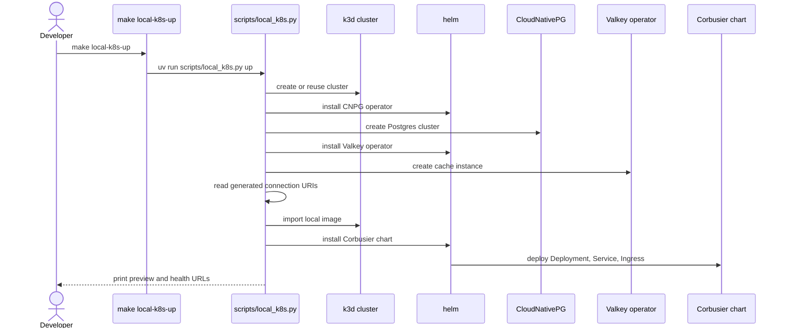

# Local k3d (Kubernetes in Docker) preview and Nile Valley integration for Corbusier

## Purpose

Define the local Kubernetes preview workflow for Corbusier so the same
container image and Helm chart can be used both in a developer-owned `k3d`
(Kubernetes in Docker) cluster and in the Nile Valley GitOps (Git-based
operations) pipeline.

## Goals

- Provide a single-command local preview workflow driven by `make
  local-k8s-up`.
- Keep the Corbusier chart compatible with FluxCD `HelmRelease` resources and
  Kustomize overlays.
- Reuse the same deployment contract locally and in Nile Valley so preview and
  production drift stays small.
- Keep platform services out of the application chart. Postgres, Valkey,
  ingress, and external secret controllers remain platform concerns.

## Non-goals

- Replace Corbusier's existing Rust test, lint, or formatting workflow.
- Ship production-scale tuning for autoscaling, multi-zone scheduling, or
  disaster recovery.
- Modify the Nile Valley platform repository from this branch.

## Constraints

- The container image must run as a non-root user and expose deterministic
  health endpoints.
- The chart must only deploy Corbusier resources plus optional
  `ExternalSecret` wiring for GitOps environments.
- The local preview script must use Python 3.13, `uv`, Cyclopts, and
  `plumbum`, matching the repository scripting standards.
- Local preview values must stay compatible with the Nile Valley app-chart
  conventions for security contexts, probes, labels, and secret binding.

## Design summary

The feature is made of three deliverables:

- A runtime container image that serves `/health/live` and `/health/ready`.
- A Helm chart under `charts/corbusier` that deploys the application with
  ingress, config, Secret binding, and optional `ExternalSecret` support.
- A local lifecycle script under `scripts/local_k8s.py` and
  `scripts/local_k8s/` that provisions `k3d`, installs CloudNativePG and
  Valkey, creates the Corbusier Secret, imports the local image, and installs
  the chart.

## Container image design

The repository root `Dockerfile` uses a multi-stage build:

- The build stage uses `rust:1.94-slim-bookworm` with `build-essential`,
  `libpq-dev`, `perl`, and `pkg-config` to compile the release binary.
- The runtime stage uses `debian:bookworm-slim`, installs `libpq5` and
  `ca-certificates`, creates a `corbusier` user, and runs the binary as
  non-root.
- The runtime exposes port `8080`, which matches the application default and
  the chart's `service.port`.

The runtime entry point uses Actix Web and exposes:

- `GET /health/live`
- `GET /health/ready`

Those endpoints are the stable probe contract for both local preview and Nile
Valley deployment.

## Helm chart design

### Scope and boundaries

The Corbusier chart deploys:

- `Deployment`
- `Service`
- `Ingress`
- `ConfigMap`
- `ServiceAccount`
- `PodDisruptionBudget`
- Optional `ExternalSecret`

It does not install CloudNativePG, Valkey, Traefik, cert-manager, or other
platform operators.

### Values contract

The chart values are designed around two environments:

- Local preview via `charts/corbusier/values.local.yaml`
- GitOps-managed overlays in Nile Valley

Key values:

- `image.repository`, `image.tag`, `image.pullPolicy`
- `service.portName`, `service.port`, `service.targetPort`, `service.type`
- `ingress.enabled`, `ingress.className`, `ingress.annotations`,
  `ingress.hosts`, `ingress.tls`
- `config`
- `existingSecretName`, `secretEnvFromKeys`, `allowMissingSecret`,
  `validateExistingSecret`
- `externalSecret.enabled`, `externalSecret.secretStoreRef.*`,
  `externalSecret.targetName`, `externalSecret.data`
- `resources`, `podSecurityContext`, `securityContext`
- `container.livenessProbe`, `container.readinessProbe`,
  `container.startupProbe`
- `serviceAccount.*`
- `pdb.*`

### Ingress behaviour

Local preview uses a hostless ingress rule so Traefik can route traffic from
the loopback-mapped `k3d` load balancer without a DNS entry:

```yaml
ingress:
  enabled: true
  hosts:
    - host: ""
      paths:
        - path: /
          pathType: Prefix
```

Nile Valley overlays can replace the empty host with preview or production DNS
names and add matching `tls` entries.

### Secret handling

The chart supports two secret sources:

- `existingSecretName` for a pre-created Secret, used by the local preview
  script.
- `externalSecret.*` for External Secrets Operator integration in GitOps
  environments.

Both paths ultimately provide `DATABASE_URL` and `VALKEY_URL` to the container
via `secretKeyRef`.

`validateExistingSecret` defaults to `false` so offline `helm template`
rendering stays clean. Set it to `true` when rendering against a live cluster
and you want Helm to verify that the referenced Secret and keys already exist.

## Local k3d workflow design

### CLI shape

`scripts/local_k8s.py` provides:

- `up`
- `down`
- `status`
- `logs`

Environment variables use the `CORBUSIER_K3D_` prefix:

- `CORBUSIER_K3D_CLUSTER`
- `CORBUSIER_K3D_NAMESPACE`
- `CORBUSIER_K3D_PORT`

### Cluster lifecycle

`up`:

1. Verifies `k3d`, `kubectl`, `helm`, and optionally `docker`.
2. Reuses an existing cluster when possible, failing if the requested ingress
   port conflicts with the existing one.
3. Installs CloudNativePG and Valkey operators.
4. Creates a single-instance CNPG cluster and Valkey instance in the
   application namespace.
5. Reads the generated connection material from operator-managed Secrets.
6. Creates the Corbusier application Secret.
7. Builds the local Docker image unless `--skip-build` is set.
8. Imports the image into `k3d`.
9. Installs the Corbusier Helm chart with `values.local.yaml`.
10. Prints the preview URL and follow-up commands.

`down` deletes the `k3d` cluster.

`status` prints pods, services, and ingress resources.

`logs` tails pod logs, with optional follow mode.

### Idempotence

The script is designed so `up` can be rerun:

- Existing namespaces are reused.
- Helm uses `upgrade --install`.
- The application Secret is applied declaratively.
- Existing clusters are reused when the ingress port matches.

## GitOps alignment

The same image and chart are intended for Nile Valley:

- CI can publish immutable image tags.
- FluxCD `HelmRelease` resources can point at the same chart and override
  image tag, ingress hostnames, resources, and `externalSecret` settings.
- Kustomize overlays can supply preview or production-specific values without
  changing the chart templates.

## Validation expectations

The intended observable success signals are:

- `make local-k8s-up` prints a preview URL.
- `curl http://127.0.0.1:<port>/health/live` returns HTTP 200.
- `make local-k8s-status` shows ready pods.
- `make local-k8s-down` deletes the cluster cleanly.

## Sequence diagram


