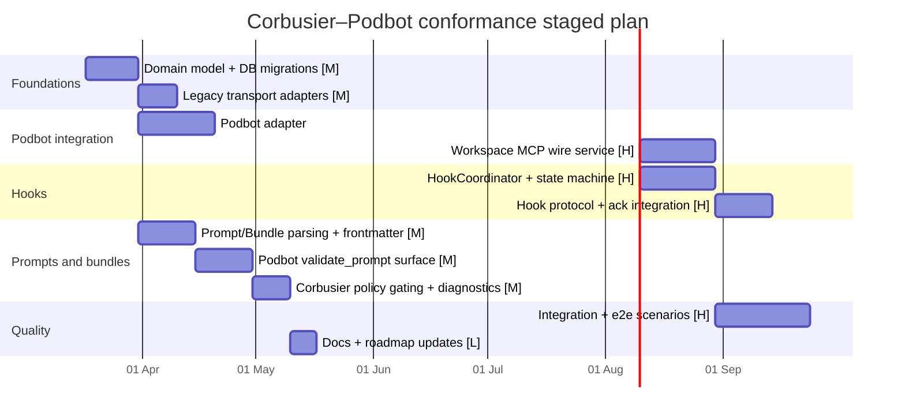
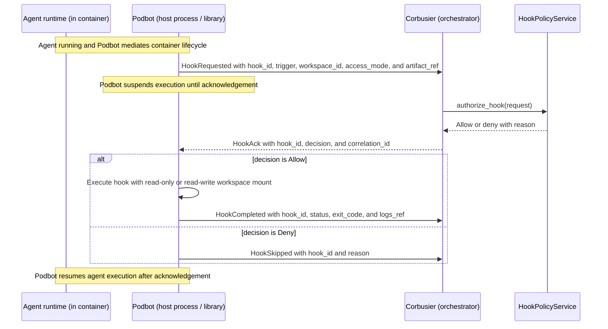

# Corbusier–Podbot Conformance Design for Agents, MCP Wires, and Hooks

## Executive summary

Corbusier can conform to the Podbot library API surface by treating Podbot as
the **single owner of container orchestration and sandbox wiring**, while
Corbusier retains **policy, registry, and orchestration authority**. This
matches Podbot’s stated dual-delivery model (CLI + embeddable library) and its
“stdout protocol-purity” guarantee for hosting mode.
citeturn28view0turn25view0

The highest-impact architectural change is to **split Corbusier’s tool plane
into a registry/control plane and a per-workspace “wire” plane**. The Podbot
MCP hosting design explicitly recommends that Corbusier remains the
policy/registry layer while Podbot owns transport bridging, auth token
injection, and lifecycle clean-up, presenting **Streamable HTTP** to the
container regardless of upstream source. citeturn25view0turn29search0

Under the user’s hook assumptions, Corbusier must add a **HookCoordinator**
that consumes Podbot hook events over a *podbot → orchestrator* channel and
deterministically acknowledges them, because Podbot suspends execution until
Corbusier acks. (This hook channel is not described in current Podbot docs; it
is a new integration requirement and must be specified/implemented explicitly
as part of the integration contract.)

Finally, to support consistent agent behaviour across backends, Corbusier
should introduce a **prompt + skill bundle abstraction** modelled on
Anthropic’s “skills as folders with YAML-frontmatter SKILL.md”, with harmonized
frontmatter across prompts/bundles/skills and Jinja2 (Goose-style)
interpolation, plus a **Podbot `validate_prompt` surface** that reports
ignored/rejected capabilities for a target agent runtime.
citeturn31view0turn30search15turn30search27

## Current state and required alignment

Corbusier is organised as hexagonal modules (domain/ports/adapters) with key
subsystems including `agent_backend` and `tool_registry`, and an explicit
`worker` module. citeturn21view0turn5view0 The roadmap shows that
*workspace encapsulation* and a *hook engine* remain planned (not delivered),
while the MCP server lifecycle and tool routing portions are already
implemented. citeturn24view0turn10view0

### Corbusier tool registry today

Corbusier already models an MCP server registry and lifecycle persistence:

- `mcp_servers` table stores a `transport` JSONB plus lifecycle and health
  state. citeturn10view0
- Tenant scoping is being added via `tenant_id` on `mcp_servers` with composite
  foreign keys to dependent tables. citeturn10view1
- `tool_registry/services` exports a `McpServerLifecycleService` and a
  `ToolDiscoveryRoutingService`. citeturn18view2turn17view0
- Tool-call parameter validation currently uses a lightweight structural
  checker (object type + required keys) rather than full JSON Schema.
  citeturn12view1

Corbusier’s design document still frames tool hosting as “MCP server hosting
with stdio and HTTP+SSE managers” and positions a tool router in Corbusier’s
call path. citeturn23view4turn23view2 Its initial lifecycle implementation
provides an `InMemoryMcpServerHost` adapter for deterministic tests, which
currently appears as the concrete “runtime host” adapter in the repo.
citeturn15view4

### Podbot contract constraints Corbusier must respect

Podbot’s design asserts three constraints that materially affect Corbusier
integration:

- Podbot is **both** CLI and embeddable Rust library; library functions return
  typed results and must not write directly to stdout/stderr. citeturn28view0
- In hosting mode, Podbot must preserve **stdout purity**: container-protocol
  bytes only, with diagnostics on stderr. citeturn28view0
- For ACP hosting, Podbot enforces **capability masking** by rewriting the ACP
  `initialize` exchange to remove `terminal/*` and `fs/*`, and may reject those
  calls if attempted. An explicit opt-in may allow delegation.
  citeturn28view0

On workspace strategy, Podbot’s config explicitly supports
`workspace.source = github_clone | host_mount`, and defines hard safety
requirements for host mounts (canonicalization, allowlisted roots, symlink
escape rejection). citeturn28view0

### MCP hosting alignment target

The Podbot MCP hosting design recommends:

- Corbusier chooses which MCP servers / wires a task may use (policy/registry),
- Podbot creates “wires”, performs bridging and clean-up, injects the resulting
  URL + auth material into the agent container,
- the agent consumes **Streamable HTTP** endpoints, even when the true source
  is stdio. citeturn25view0turn29search0turn29search7

This creates a **direct mismatch** with Corbusier’s current “tool registry &
router in the call path” mental model: if the agent container talks to MCP
wires directly, Corbusier cannot remain the runtime “router” for those tool
calls unless Podbot additionally proxies through Corbusier (not described).
This is a pivotal open design choice and must be made explicit in the
integration design:

- **Option A (recommended by Podbot docs):** agent container is the MCP client;
  Corbusier moves from “tool router” to “tool policy + wire provisioning +
  audit ingestion”. citeturn25view0
- **Option B (legacy Corbusier model):** Corbusier remains the caller; Podbot
  executes tools inside container and returns results to Corbusier. This would
  require a Podbot→Corbusier tool-call bridge API that is **unspecified** in
  current Podbot docs.

The rest of this document designs for **Option A**, because it matches the
primary Podbot MCP hosting design and avoids inventing an unstated Podbot
service. Where Option A implies new audit/telemetry pathways, those are called
out as required additions.

## Domain model changes

This section defines the concrete models Corbusier needs (or needs to evolve)
to align with Podbot’s design surface and the hook assumptions. All type
sketches are Rust-like and intentionally “library-facing” (serializable
request/response shapes, stable enums).

### AgentRuntimeSpec

Corbusier needs a runtime description that maps cleanly to Podbot’s
`agent.kind`, `agent.mode`, and optional custom command fields, plus an env
allowlist. citeturn28view0

```rust
/// Corbusier-owned description of the agent runtime to launch via Podbot.
#[derive(Clone, Debug, serde::Serialize, serde::Deserialize)]
pub struct AgentRuntimeSpec {
    pub kind: AgentKind,          // claude | codex | custom
    pub mode: AgentMode,          // podbot(interactive) | codex_app_server | acp
    pub command: Option<String>,  // required when kind=custom (per Podbot design)
    pub args: Vec<String>,        // required when kind=custom
    pub env_allowlist: Vec<String>,
    pub working_dir: Option<String>, // container path; default derived from workspace
}

#[derive(Clone, Debug, serde::Serialize, serde::Deserialize)]
pub enum AgentKind { Claude, Codex, Custom }

#[derive(Clone, Debug, serde::Serialize, serde::Deserialize)]
pub enum AgentMode { Interactive, CodexAppServer, Acp }
```

Conformance requirements:

- `AgentMode::Acp` must assume that `terminal/*` and `fs/*` are masked by
  Podbot and are not reliable capabilities. citeturn28view0
- `env_allowlist` must be enforced in Corbusier configuration generation, not
  left as an “advisory” field (Podbot treats this as a contract boundary).
  citeturn28view0

### WorkspaceSource

Corbusier needs to decide whether Podbot clones into a container-local volume
(`github_clone`) or bind-mounts a host workspace (`host_mount`). Podbot’s
existing config describes both modes and imposes safety policy for host mounts.
citeturn28view0

```rust
#[derive(Clone, Debug, serde::Serialize, serde::Deserialize)]
pub enum WorkspaceSource {
    GitHubClone {
        owner: String,
        repo: String,
        branch: String,
        // token material is not in this struct; it comes via Podbot GitHub config
    },
    HostMount {
        host_path: std::path::PathBuf,
        container_path: String, // absolute; default "/workspace"
        read_only: bool,        // strongly recommended default for prompts; tasks may opt-in
    },
}
```

**Unspecified detail:** Corbusier’s repo currently lacks a concrete “workspace
manager” implementation in code; the Corbusier design doc contains a conceptual
`EncapsulationProvider` but no corresponding crate module. The implementation
must create this module and decide whether Corbusier itself provisions the host
workspace directory (recommended for determinism) or delegates cloning to
Podbot (aligns with Podbot’s existing `github_clone` flow).

### McpEndpointSource

Corbusier’s persistent transport model should be updated to match Podbot’s
recommended `McpSource` shape: `Stdio`, `StdioContainer`, `StreamableHttp`,
with explicit repo volume sharing for helper containers. citeturn25view0

```rust
#[derive(Clone, Debug, serde::Serialize, serde::Deserialize)]
pub enum McpEndpointSource {
    Stdio {
        command: String,
        args: Vec<String>,
        env: Vec<(String, String)>,
        cwd: Option<String>,
    },
    StdioContainer {
        image: String,
        command: Vec<String>,
        env: Vec<(String, String)>,
        repo_access: RepoAccess, // none/ro/rw (for helper container only)
    },
    StreamableHttp {
        url: String,
        headers: Vec<(String, String)>, // injected upstream auth if needed
    },
}

#[derive(Clone, Debug, serde::Serialize, serde::Deserialize)]
pub enum RepoAccess { None, ReadOnly, ReadWrite }
```

This aligns with Podbot’s MCP hosting design, where Podbot normalizes the
agent-facing transport to Streamable HTTP even when the source is stdio.
citeturn25view0turn29search0turn29search7

**Required Corbusier schema change:** Corbusier’s existing
`mcp_servers.transport` JSONB column is flexible, but the *meaning* of stored
transports must evolve: stop modelling “HTTP+SSE” as first-class, and align
persisted transport shapes to *source definitions*
(stdio/stdio-container/streamable-http), leaving “agent-facing URL” as a
per-workspace wire artefact rather than a global server attribute.
citeturn10view0turn25view0

### HookArtifact and HookSubscription

Based on the user’s hook assumptions, Corbusier needs:

- a “hook artefact” model that Podbot can execute (single script OR tar OR
  optional container image),
- a subscription model that says which hooks should fire at which points for
  which workspaces,
- a runtime state model for acknowledgements.

```rust
#[derive(Clone, Debug, serde::Serialize, serde::Deserialize)]
pub struct HookArtifact {
    pub kind: HookArtifactKind,           // script | tar
    pub digest: Option<String>,           // strongly recommended; sha256:...
    pub container_image: Option<String>,  // optional override for execution environment
    pub entrypoint: Option<String>,       // optional; tar needs some entrypoint (unspecified)
}

#[derive(Clone, Debug, serde::Serialize, serde::Deserialize)]
pub enum HookArtifactKind {
    Script { path: String }, // workspace-relative or bundle-relative (policy decides)
    Tar { path: String },    // contains runnable content
}

#[derive(Clone, Debug, serde::Serialize, serde::Deserialize)]
pub struct HookSubscription {
    pub hook_name: String,
    pub triggers: Vec<HookTrigger>,
    pub workspace_access: WorkspaceAccessMode, // r/o or r/w mount policy for workspace volume
    pub env_allowlist: Vec<String>,
    pub timeout_ms: u64,
}

#[derive(Clone, Debug, serde::Serialize, serde::Deserialize)]
pub enum WorkspaceAccessMode { ReadOnly, ReadWrite }

#[derive(Clone, Debug, serde::Serialize, serde::Deserialize)]
pub enum HookTrigger {
    // Concrete trigger taxonomy is currently unspecified in Podbot docs;
    // Corbusier design doc lists commit/merge/deploy style governance triggers conceptually. citeturn23view4
    PreTurn,
    PostTurn,
    PreToolCall,
    PostToolCall,
    PreCommit,
    PreMerge,
    PreDeploy,
}
```

**Unspecified but required:** a concrete mapping between Corbusier’s workflow
events and hook triggers (including which component emits them) is not
implemented in Corbusier today, and Podbot has no hook spec in its current
design docs. You must author a binding spec inside the Corbusier–Podbot
integration layer that at minimum defines: trigger names, payload schema, ack
semantics, timeout/resume rules, and audit persistence fields.

### Prompt validation request/response and capability dispositions

Corbusier already has an agent capability model (`supports_streaming`,
`supports_tool_calls`, supported content types). citeturn19view0turn3view3
Podbot adds a runtime-enforced capability mask for ACP (`terminal/*`, `fs/*`).
citeturn28view0 To unify these, introduce prompt-surface capabilities and
dispositions.

```rust
#[derive(Clone, Debug, serde::Serialize, serde::Deserialize)]
pub struct ValidatePromptRequest {
    pub agent: AgentRuntimeSpec,
    pub prompt: PromptDocument,          // parsed frontmatter + body
    pub bundle_refs: Vec<BundleRef>,     // optional: skills/bundles used by the prompt
    pub assumed_mcp_wires: Vec<String>,  // names or ids referenced in frontmatter
    pub assumed_hooks: Vec<String>,      // hook names referenced in frontmatter
}

#[derive(Clone, Debug, serde::Serialize, serde::Deserialize)]
pub struct ValidatePromptResponse {
    pub ok: bool,
    pub effective_prompt: Option<EffectivePrompt>, // body + evaluated metadata after drops
    pub diagnostics: Vec<PromptDiagnostic>,
    pub capability_report: Vec<CapabilityDispositionReport>,
}

#[derive(Clone, Debug, serde::Serialize, serde::Deserialize)]
pub struct CapabilityDispositionReport {
    pub capability: String,              // e.g. "acp.terminal", "prompt.jinja2", "mcp.wire:weaver"
    pub disposition: CapabilityDisposition,
    pub details: Option<String>,
}

#[derive(Clone, Debug, serde::Serialize, serde::Deserialize)]
pub enum CapabilityDisposition {
    Supported,
    Ignored,     // capability will be dropped; prompt can proceed
    Rejected,    // capability required but unavailable; prompt must fail validation
    Unknown,     // validator cannot decide (should be rare)
}
```

This is the core of the requested “validate endpoint” behaviour: identify
capabilities the prompt requests that a specific agent runtime will ignore (or
reject), with explicit reasons.

## Ports, services, and refactors

This section specifies the concrete ports/traits and the refactors needed in
Corbusier.

### New ports/traits

Corbusier should add three new port families. They mirror the Podbot
recommended responsibility split (policy in Corbusier, wiring in Podbot).
citeturn25view0

#### PodbotAgentLauncher

A Corbusier port that wraps Podbot’s library orchestration into a stable
Corbusier interface.

```rust
#[async_trait::async_trait]
pub trait PodbotAgentLauncher: Send + Sync {
    async fn prepare_workspace(
        &self,
        ctx: &crate::context::RequestContext,
        workspace: &WorkspaceRuntimeSpec,
    ) -> Result<PreparedWorkspace, PodbotLaunchError>;

    async fn launch_agent(
        &self,
        ctx: &crate::context::RequestContext,
        request: LaunchAgentRequest,
    ) -> Result<LaunchedAgent, PodbotLaunchError>;

    async fn stop_agent(
        &self,
        ctx: &crate::context::RequestContext,
        agent_id: AgentInstanceId,
    ) -> Result<(), PodbotLaunchError>;
}
```

This port must be implemented as a Podbot adapter that does not violate
Podbot’s stdout-purity and no-direct-print requirements. citeturn28view0

#### WorkspaceMcpWires

A Corbusier port that calls Podbot’s MCP wire surface (as proposed in Podbot’s
MCP hosting design) and returns injection details. citeturn25view0

```rust
#[async_trait::async_trait]
pub trait WorkspaceMcpWires: Send + Sync {
    async fn create_wire(
        &self,
        ctx: &crate::context::RequestContext,
        req: CreateWorkspaceMcpWireRequest,
    ) -> Result<CreateWorkspaceMcpWireResponse, McpWireError>;

    async fn remove_wire(
        &self,
        ctx: &crate::context::RequestContext,
        wire_id: WireId,
    ) -> Result<(), McpWireError>;

    async fn list_wires(
        &self,
        ctx: &crate::context::RequestContext,
        workspace_id: WorkspaceId,
    ) -> Result<Vec<WorkspaceMcpWire>, McpWireError>;
}
```

This is the key boundary where Corbusier transitions from “MCP server lifecycle
manager” to “MCP wire provisioning manager”, matching Podbot’s design.
citeturn25view0

#### HookCoordinator, HookRegistry, HookPolicyService

Corbusier needs a workflow-governance subsystem consistent with its own design
goals (hook engine and encapsulation management appear as planned features).
citeturn23view1turn24view0 Under the user’s hook assumptions,
HookCoordinator must also coordinate acknowledgements to Podbot.

```rust
#[async_trait::async_trait]
pub trait HookRegistry: Send + Sync {
    async fn subscriptions_for(
        &self,
        ctx: &crate::context::RequestContext,
        scope: HookScope,
    ) -> Result<Vec<HookSubscription>, HookError>;
}

#[async_trait::async_trait]
pub trait HookPolicyService: Send + Sync {
    async fn authorize_hook(
        &self,
        ctx: &crate::context::RequestContext,
        request: HookRequestContext,
    ) -> Result<HookDecision, HookPolicyError>;
}

#[async_trait::async_trait]
pub trait HookCoordinator: Send + Sync {
    async fn on_podbot_hook_message(
        &self,
        ctx: &crate::context::RequestContext,
        msg: PodbotHookMessage, // integration type; see flows below
    ) -> Result<PodbotHookAck, HookError>;
}
```

**Unspecified detail:** the Podbot hook message schema and transport
(“podbot→orchestrator channel”) do not exist in current Podbot docs. This must
be implemented either as a typed callback channel in the embedding library or
an out-of-band transport (e.g. UDS) for CLI mode. Either way, it must not
violate Podbot hosting stdout purity. citeturn28view0

### Lifecycle and service refactors

#### Tool registry lifecycle split

Currently, Corbusier’s `tool_registry/services` exports
`McpServerLifecycleService` and `ToolDiscoveryRoutingService`.
citeturn18view2 Corbusier must split “server definition lifecycle” from
“workspace wiring lifecycle”:

- **Keep:** `McpServerLifecycleService` as the CRUD/health layer for globally
  registered MCP server *definitions* (sources), stored in
  `mcp_servers.transport`. citeturn10view0turn18view2
- **Add:** `WorkspaceMcpWireService` as the per-workspace provisioning layer
  that calls Podbot to create wires and persists the returned Streamable HTTP
  endpoints by workspace. citeturn25view0turn29search0
- **Change:** `ToolDiscoveryRoutingService` should no longer assume Corbusier
  is the runtime invoker for containerised agents (Option A). Instead it
  becomes:
  - a “catalogue service” used to materialize tool lists for UI/audit, and/or
  - a “bootstrap tool manifest builder” for agents (by creating wires and
    passing endpoints to agent startup).

This refactor also aligns with Corbusier’s design doc, which already
anticipates a workspace manager and Podbot adapter, but currently only at the
conceptual level. citeturn26view0turn24view0

#### Workspace-wire service & schema

Introduce new persistent entities:

- `workspaces` (or `workspace_runtimes`) that identifies a Podbot workspace /
  volume and correlates to `task_id` and possibly `conversation_id`. (Corbusier
  already has task lifecycle and agent sessions/handoffs persistence patterns.)
  citeturn24view0turn10view2
- `workspace_mcp_wires` with:
  - `workspace_id`
  - `wire_name` (stable name referenced by prompts)
  - `server_id` (FK to `mcp_servers`)
  - `agent_url` (Streamable HTTP URL returned from Podbot)
  - `headers` (auth headers returned from Podbot)
  - `status` and timestamps

This matches Podbot’s contract: Corbusier says *what to wire*; Podbot returns
*how the container reaches it* (URL + headers). citeturn25view0turn29search0

#### Hook coordinator state machine

Corbusier must store hook execution and acknowledgement for auditability
(consistent with its broader audit goals in tool calls and agent handoffs).
citeturn23view4turn10view2 A concrete minimal state machine for hook gating:

- `Pending` (hook requested by Podbot, not yet authorised)
- `Authorised` or `Denied` (after HookPolicyService decision)
- `Acked` (ack delivered to Podbot)
- `Completed` / `Failed` (if Podbot also emits completion events;
  **unspecified**)

Corbusier must guarantee idempotent ack behaviour: repeated hook request
messages (e.g. after restart) must not cause duplicate approvals.

### Concrete Corbusier file changes mapping

The following table maps existing Corbusier files (plus a few “new file”
touchpoints) to required refactors. File existence and module layout are
derived from the current repository tree.
citeturn5view0turn11view0turn19view0turn22view0

| File path                                               | Current responsibility                                                                                                                     | Proposed change                                                                                                                                                      | Risk / effort |
| ------------------------------------------------------- | ------------------------------------------------------------------------------------------------------------------------------------------ | -------------------------------------------------------------------------------------------------------------------------------------------------------------------- | ------------- |
| `src/lib.rs`                                            | Declares top-level modules (`agent_backend`, `tool_registry`, etc.). citeturn21view0                                                    | Add new modules: `workspace` (encapsulation), `hook_engine`, `prompt`, `bundle`, `podbot_adapter`.                                                                   | Med           |
| `src/main.rs`                                           | Stub entry point. citeturn21view1                                                                                                       | Replace with real server/daemon bootstrap only when Corbusier’s HTTP/event surfaces are delivered; not strictly required for library-integration work.               | Low           |
| `docs/corbusier-design.md`                              | High-level architecture incl. workspace management and `EncapsulationProvider` concept. citeturn26view0turn23view4                     | Update to reflect Podbot MCP wire model (Streamable HTTP), hook ack channel, prompt validation surface, and tool router role shift (Option A).                       | Med           |
| `docs/roadmap.md`                                       | Delivery plan; workspace encapsulation and hook engine remain planned. citeturn24view0                                                  | Add explicit milestones for Podbot wire provisioning + hook coordinator + prompt validation.                                                                         | Low           |
| `src/tool_registry/domain/transport.rs`                 | Transport modelling for MCP server connectivity (currently includes legacy shapes such as HTTP+SSE). citeturn3view0turn23view4         | Replace/alias to `McpEndpointSource` (`Stdio`, `StdioContainer`, `StreamableHttp`) and treat Streamable HTTP as the default agent-facing injection.                  | High          |
| `src/tool_registry/ports/host.rs`                       | Defines MCP server hosting port (start/stop/health/list_tools/call_tool). citeturn3view1turn23view4                                    | Deprecate for Podbot-hosted agents; keep only for tests/local. Introduce new ports `WorkspaceMcpWires` and (optionally) `McpCatalogReader` for registry UI.          | High          |
| `src/tool_registry/services/lifecycle/mod.rs`           | Service orchestration for MCP server lifecycle. citeturn3view2turn18view2                                                              | Split: definition lifecycle vs workspace-wire lifecycle. Move wire operations out of “server lifecycle” into `workspace/wires.rs` service.                           | High          |
| `src/tool_registry/services/discovery/log_and_audit.rs` | Tool discovery logging/audit capture. citeturn18view0                                                                                   | Convert to “registry audit” and “wire provisioning audit” for Option A; add ingestion hooks for Podbot-provided tool call logs if implemented (unspecified).         | Med/High      |
| `src/tool_registry/domain/validation.rs`                | Lightweight schema validation for tool parameters. citeturn12view1                                                                      | Extend or reuse for prompt input schema validation; consider adding full JSON Schema later (explicitly assess).                                                      | Med           |
| `src/tool_registry/adapters/runtime.rs`                 | In-memory MCP host adapter for tests. citeturn15view4                                                                                   | Keep; add Podbot-wire fakes for integration tests; do not overload this module with real Podbot wiring.                                                              | Low/Med       |
| `migrations/..._add_mcp_servers_table/up.sql`           | Adds `mcp_servers` with `transport` JSONB. citeturn10view0                                                                              | New migrations: `workspace_runtimes`, `workspace_mcp_wires`, `hook_executions`, prompt/bundle registries if persisted.                                               | Med           |
| `src/agent_backend/domain/capabilities.rs`              | Agent capability flags (`supports_streaming`, `supports_tool_calls`, content types). citeturn3view3turn19view0                         | Extend with `PromptSurfaceCapabilities` and ACP-related constraints; create capability-to-disposition mapping for validation.                                        | Med           |
| `src/agent_backend/services/registry.rs`                | Backend registry and discovery. citeturn20view0turn24view0                                                                             | Add runtime-spec resolution: map backend registry entries to `AgentRuntimeSpec` and launch via Podbot when backend is “podbot-hosted”.                               | Med           |
| `src/worker/*` and `src/bin/pg_worker.rs`               | Background work infrastructure. citeturn22view0turn5view3                                                                              | Add background sweeps: stale wire cleanup, hook timeout handling, and possibly Podbot reconcile loops.                                                               | Med           |

## Prompt, bundles, and validation

This section proposes a concrete prompt/bundle system that aligns with:

- Anthropic’s skill structure: “skills are folders” with a `SKILL.md`
  containing YAML frontmatter and instructions (minimum frontmatter keys:
  `name`, `description`). citeturn31view0
- Claude Code’s use of Markdown + YAML frontmatter for other agent-facing
  instruction artefacts (e.g. output styles). citeturn30search15
- Jinja2 template syntax for interpolation (`{{ ... }}` and ``), which
  Goose-style templating uses. citeturn30search27

### File taxonomy

1. **Skill** (Anthropic-compatible): directory `skills/<skill-id>/SKILL.md` +
   optional supporting files (`scripts/*`, `references/*`, etc.).
   citeturn31view0
2. **Prompt** (Corbusier/Podbot-compatible): a Markdown prompt that can be run
   by an agent, with YAML frontmatter harmonized with SKILL.md.
3. **Bundle**: a distributable package of skills + prompts + optional MCP
   server definitions + optional hook artefacts.

**Important design choice:** Keep SKILL.md *compatible* with Anthropic by
limiting required frontmatter to `name` and `description`, while permitting
additional namespaced keys under `x-corbusier`, `x-podbot`, etc. This preserves
progressive disclosure conventions while enabling extra metadata.
citeturn31view0turn30search3

### Harmonized frontmatter schema

Define a shared “frontmatter contract” used in:

- SKILL.md (compatible superset)
- PROMPT.md (new)
- BUNDLE.yaml (new; not necessarily Markdown)

Core keys:

- `apiVersion`: e.g. `corbusier.dev/v1alpha1`
- `kind`: `Skill | Prompt | Bundle`
- `name`: string (skill id / prompt id)
- `description`: string
- `inputs`: optional schema for prompt parameters
- `capabilities`: prompt-surface requirements (MCP wires, hooks, ACP)
- `mcp`: wire requirements (names and sources)
- `hooks`: subscriptions
- `x-*`: extension namespace blocks

### Prompt file example with Goose/Jinja2 interpolation

```markdown
---
apiVersion: corbusier.dev/v1alpha1
kind: Prompt
name: review-and-fix
description: Review a change set, run configured hooks, and propose a minimal fix.
inputs:
  schema:
    type: object
    required: [task_id]
    properties:
      task_id: { type: string }
      focus: { type: string, default: "correctness" }
capabilities:
  require:
    - mcp.wire:weaver
    - hook:pre-commit
  prefer:
    - mcp.wire:search
  forbid:
    - acp.terminal
    - acp.fs
mcp:
  wires:
    - name: weaver
      server_ref: "mcp_servers/weaver"
    - name: search
      server_ref: "mcp_servers/search"
hooks:
  subscribe:
    - hook_name: pre-commit
      trigger: pre_commit
      workspace_access: read_only
---
# Task: {{ inputs.task_id }}

Working directory: `{{ workspace.container_path }}`

## Instructions

1. Load the relevant files using Weaver (do **not** directly edit files).
2. Analyse the repo for {{ inputs.focus }} risks.
3. Before proposing a patch, ensure the `pre-commit` hook has been acknowledged and allowed by policy.
4. Produce:
   - a short diagnosis
   - a Weaver change plan
   - a validation plan
```

Jinja2 syntax and semantics for `{{ ... }}` substitution and ``
control flow are documented in the upstream Jinja template reference.
citeturn30search27

### Skill bundle abstraction

Model the bundle after Anthropic’s “skills as folders”, but extend it to
include *prompts*, *MCP definitions*, and *hook artefacts*.

Bundle layout:

```text
bundle/
  BUNDLE.yaml
  skills/<skill-id>/SKILL.md
  prompts/<prompt-id>.md
  mcp-servers/<server-id>.yaml
  hooks/<hook-id>.(sh|tar)
```

Example `BUNDLE.yaml`:

```yaml
apiVersion: corbusier.dev/v1alpha1
kind: Bundle
name: repo-quality-gates
description: A set of skills and prompts for governance and quality enforcement.
version: 0.1.0

skills:
  - id: linting
    path: skills/linting/SKILL.md
  - id: security-review
    path: skills/security-review/SKILL.md

prompts:
  - id: review-and-fix
    path: prompts/review-and-fix.md

mcp_servers:
  - id: weaver
    source:
      stdio:
        command: weaver-mcp
        args: ["--stdio"]
        env: []
  - id: search
    source:
      streamable_http:
        url: "https://search.internal.example/mcp"
        headers: []

hooks:
  - id: pre-commit
    artifact:
      kind: script
      path: hooks/pre-commit.sh
      digest: "sha256:..."
    workspace_access: read_only
```

**Unspecified detail:** Whether Corbusier persists bundles/prompts in its DB
versus loading from a workspace filesystem is not currently defined in
Corbusier. Given Podbot’s host-mount safety model, a practical first iteration
is “bundle lives in repo, Corbusier parses it from the mounted workspace”, then
move to a curated registry later. citeturn28view0turn24view0

### Podbot `validate_prompt` endpoint

Podbot should expose validation as:

- a library function for embedders (Corbusier),
- optionally, a CLI `podbot validate-prompt` that emits JSON for operators/CI.

Validation must at minimum enforce the ACP masking reality: if the prompt
requires terminal or fs ACP capabilities, validation should report them as
**ignored** or **rejected** depending on whether the prompt marked them as
required. citeturn28view0

Sample request:

```json
{
  "agent": {
    "kind": "custom",
    "mode": "acp",
    "command": "opencode",
    "args": ["acp"],
    "env_allowlist": ["OPENAI_API_KEY"],
    "working_dir": "/workspace"
  },
  "prompt": {
    "name": "review-and-fix",
    "frontmatter": { "capabilities": { "require": ["hook:pre-commit"], "forbid": ["acp.terminal"] } },
    "body": "..."
  },
  "bundle_refs": ["repo-quality-gates@0.1.0"],
  "assumed_mcp_wires": ["weaver", "search"],
  "assumed_hooks": ["pre-commit"]
}
```

Sample response (capability ignored but prompt remains valid):

```json
{
  "ok": true,
  "effective_prompt": {
    "body": "...",
    "applied_drops": ["acp.terminal", "acp.fs"]
  },
  "diagnostics": [
    {
      "severity": "warning",
      "code": "ACP_CAPABILITY_MASKED",
      "message": "Agent runs in ACP mode; terminal/* and fs/* are masked by Podbot and will be ignored.",
      "location": { "frontmatterPath": "capabilities" }
    }
  ],
  "capability_report": [
    { "capability": "acp.terminal", "disposition": "Ignored", "details": "Masked by Podbot ACP policy." },
    { "capability": "acp.fs", "disposition": "Ignored", "details": "Masked by Podbot ACP policy." },
    { "capability": "hook:pre-commit", "disposition": "Supported" }
  ]
}
```

## Security, migration, tests, and documentation

### Security and trust boundary changes

1. **Workspace access and host mounts**  
   If Corbusier uses `host_mount`, it must implement Podbot’s required path
   policy (canonicalize, allowlist roots, reject symlink escapes). Enforcement
   cannot be left solely to operators. citeturn28view0

2. **Environment secret passthrough**  
   Corbusier must treat `env_allowlist` as a hard gate for both agent runtime
   and hooks. Podbot’s design explicitly separates “credential injection” from
   “env allowlist” and requires secret redaction. citeturn28view0

3. **MCP transport framing and stdout purity**  
   For stdio MCP sources, MCP requires newline-delimited JSON-RPC messages with
   no embedded newlines, and no non-protocol bytes on stdout.
   citeturn29search7turn29search1 Podbot’s hosting design mirrors this
   “protocol purity” goal for its own hosting mode.
   citeturn28view0turn25view0 This implies:
   - do not log structured diagnostics onto MCP stdio streams,
   - isolate tool/hook logs into stderr or structured side channels.

4. **Repo access for helper containers**  
   Podbot’s MCP hosting design requires explicit `RepoAccess` for helper
   containers, defaulting to `None`, and distinguishes helper-container sharing
   from the agent container’s own workspace mount. citeturn25view0 Corbusier
   must surface this in policy/UI and persist it in the server definition
   schema.

5. **ACP delegation**  
   Corbusier must not rely on ACP’s “IDE-host tools” for file system or
   terminal operations when using Podbot-hosted agents; Podbot masks them by
   default. Any override to allow ACP delegation is a trust-boundary change
   that Corbusier should treat as policy-controlled and auditable.
   citeturn28view0

### Migration plan

A staged rollout should preserve functioning parts of Corbusier’s current tool
registry while introducing Podbot-wired operation safely.

- **Backwards compatibility adapters**  
  Corbusier currently models transport in `tool_registry/domain/transport.rs`
  with historical variants; add a compatibility layer:
  - map legacy `http_sse` records to `streamable_http` where possible
    (Streamable HTTP may optionally employ SSE for streaming, but the defining
    contract is Streamable HTTP). citeturn29search0turn25view0  
  - keep legacy parsing to avoid migration failures, but re-serialize to the
    new source model on update.

- **Legacy SSE adapter**  
  If Corbusier currently expects SSE as a first-class transport, treat it as
  deprecated and only supported via bridging layers (Podbot can optionally use
  SSE within Streamable HTTP; Corbusier should not model SSE as its own stable
  transport). citeturn29search0turn25view0 Any dedicated “SSE-only” support
  should be explicitly labelled legacy and isolated behind an adapter boundary.

- **Staged rollout**  
  1) Ship schema + domain-type changes; keep existing lifecycle tests green
     (using in-memory host). citeturn15view4turn10view0  
  2) Add Podbot-wire provisioning for one “golden path” MCP server and one
     workspace strategy (likely host_mount). citeturn28view0turn25view0  
  3) Enable prompt/bundle parsing and validation in “warn-only” mode
     (diagnostics logged/audited but not blocking).  
  4) Enforce policy gates and hook acknowledgements in “block” mode.

### Tests and QA requirements

Corbusier already emphasises deterministic testing via in-memory adapters and
structured audit trails. citeturn15view4turn23view4 Extend this with:

- **Unit tests**
  - transport conversion: legacy → new `McpEndpointSource`
  - prompt parsing + frontmatter validation
  - capability disposition mapping (ACP masked capabilities must produce
    deterministic diagnostics) citeturn28view0

- **Integration tests**
  - `WorkspaceMcpWires` fake that simulates Podbot returning Streamable HTTP
    endpoints and headers (URL + auth). citeturn25view0turn29search0
  - hook coordinator idempotency: duplicate hook requests after restart must
    not double-ack.

- **E2E tests (requires real Podbot + container engine)**
  - create workspace (host mount), create 2 MCP wires, launch ACP agent, ensure:
    - terminal/fs capabilities are masked (validate_prompt warns appropriately),
    - hooks suspend and resume correctly across ack,
    - failure/restart scenario: Corbusier restarts mid-hook; it resumes and
      acks exactly once.

### Documentation and roadmap updates

Corbusier documentation must reflect the doctrinal shift where Podbot owns
runtime mechanics:

- Update Corbusier design doc sections describing tool hosting and workspace
  encapsulation, replacing “HTTP+SSE manager” framing with “Podbot MCP wires
  presenting Streamable HTTP to agent containers”.
  citeturn23view4turn25view0turn29search0
- Update Corbusier roadmap to include:
  - Podbot wire provisioning milestone (under encapsulation/workspace
    management),
  - hook coordinator + ack loop milestone (hook engine),
  - prompt validation milestone (external interface + governance).
    citeturn24view0

### Implementation timeline



### Hook protocol message flow

This sequence diagram implements the required “Podbot sends hook messages;
execution suspends until Corbusier acknowledges” assumption, without violating
Podbot stdout purity (hook events travel over a dedicated library event
channel, not stdout). citeturn28view0



**Unspecified but necessary additions:** the “HookCompleted/HookSkipped”
messages and their payload fields are not part of current Podbot docs; include
them only if you choose to require post-hook auditing and failure propagation
beyond the single ack gate.

______________________________________________________________________

This design deliberately confines new “runtime privilege” (container wiring,
tool bridging, hook execution) to Podbot, while evolving Corbusier into a
policy-driven orchestrator that provisions workspaces and wires, validates
prompts/bundles against agent runtimes, and controls governance hooks via
explicit acknowledgements—matching the primary Podbot design intent and MCP
transport requirements.
citeturn25view0turn28view0turn29search0turn29search7turn31view0
