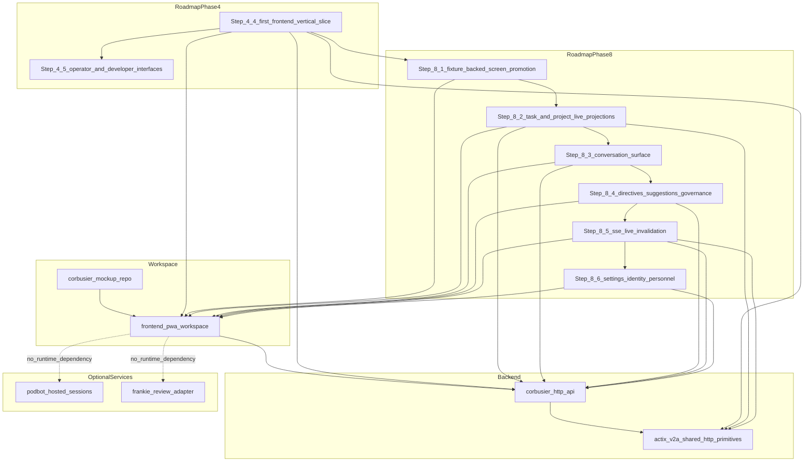

# RFC 0002: Deliver the first Corbusier front-end vertical slice

## Preamble

- **RFC number:** 0002
- **Status:** Proposed
- **Created:** 2026-04-04

## 1. Summary

Corbusier should deliver a deliberately narrow repository-owned `frontend-pwa/`
vertical slice centred on task intake and lifecycle.

The first slice should let a user:

- create a task from issue metadata,
- land directly on task detail,
- inspect the task’s origin, state, and references,
- transition task state, and
- attach branch or pull-request references when the live API surface supports
  them.

This slice should run against the live Corbusier HTTP API work already underway
in the repository. It should explicitly exclude dashboard views, task or
project list views, Kanban, Server-Sent Events (SSE), hosted agent sessions,
and review-adapter workflows.

The purpose of the slice is not feature breadth. The purpose is to validate the
production progressive web app (PWA) workspace, the minimum browser-to-API
contract, the mutation and detail-view pattern, and the local preview and
testing path before broader UI and read-model work begins.

## 2. Problem

Corbusier has a validated mockup direction, a repository-level PWA adoption
strategy, and an active HTTP API implementation path, but it does not yet have
a small real screen that proves the front end can drive live Corbusier
behaviour.

Without a narrow first slice, several risks accumulate:

- the mockup can remain a parallel design artefact instead of becoming the
  first production screen,
- the HTTP API can drift towards backend-shaped responses rather than
  browser-shaped contracts,
- the first front-end delivery can bloat into dashboard, SSE, pagination, and
  orchestration concerns all at once, and
- Podbot and Frankie can become accidental gatekeepers for the first browser
  proof even though neither is required for task intake and state change.

A first slice must therefore optimize for realness, not breadth.

## 3. Current state

Corbusier already has the strategic direction needed for this work:

- RFC 0001 already establishes that Corbusier should adopt a repository-owned
  `frontend-pwa/` workspace, promote screens incrementally from
  `corbusier-mockup`, and keep the first implementation deliberately narrow
  rather than attempting a wholesale port.
- The active HTTP API work already exposes authenticated, versioned task
  endpoints for creation, detail retrieval, state transition, and branch or
  pull-request association.
- The current API branch is strongest on task detail and task mutation, not on
  task lists, project lists, or SSE-backed live updates.
- The current HTTP authentication surface is suitable for a
  development-oriented browser seam, but it does not yet settle Corbusier’s
  final production auth model.

That combination makes a detail-first task slice the most practical first cut.

## 4. Goals and non-goals

### 4.1. Goals

- Establish `frontend-pwa/` inside the Corbusier repository as a
  production-owned workspace.
- Prove a live create → detail → transition task loop in the browser.
- Validate the minimum stable HTTP contract needed for a real PWA screen.
- Reuse shared `actix-v2a` transport-facing primitives where doing so reduces
  drift.
- Produce a slice that teaches Corbusier what later task lists, dashboards,
  conversation views, and SSE will actually need.

### 4.2. Non-goals

- Dashboard, activity feed, or system health surfaces.
- Task list, project list, Kanban, calendar, or timeline views.
- Conversation list or full conversation-management surfaces.
- SSE and live invalidation.
- Podbot-hosted sessions, workspace provisioning, Model Context Protocol (MCP)
  wire views, or hook acknowledgement.
- Frankie-backed review sync, reply submission, or review-derived task context.
- Final production auth, session, or browser credential policy.

## 5. Proposed design

### 5.1. Scope of the first slice

The first slice consists of one coherent browser workflow:

<!-- markdownlint-disable MD029 -->

1. Enter issue metadata and create a task.
2. Navigate immediately to the created task’s detail screen.
3. Render task state, issue origin, timestamps, and branch or pull-request
   references.
4. Offer valid task state transition actions.
5. Reflect the updated task after mutation.
6. Where supported by the live API, allow branch and pull-request association
   from the same detail screen.

<!-- markdownlint-enable MD029 -->

This is intentionally a detail-first slice. It does not attempt backlog
browsing, filtering, milestone views, or project-level aggregation.

### 5.2. Front-end workspace and stack shape

Corbusier should create a repository-owned `frontend-pwa/` workspace and
promote only the shell, providers, localization runtime, design tokens, and
task-related screens needed for this first slice.

The first slice should inherit the narrow state-management rule:

- route-local state first,
- TanStack Query for server state and mutation flows,
- Zustand only where state must outlive a subtree,
- no Dexie, XState, service worker, or offline persistence unless the first
  implementation proves a concrete need.

The first slice should optimize for legibility and low moving-part count.

### 5.3. HTTP contract for the slice

The slice should use the live task endpoints already present in Corbusier as
its backbone:

- task create,
- task detail read,
- task state transition,
- branch association, and
- pull-request association.

Where the slice touches transport conventions, Corbusier should adopt shared
`actix-v2a` helpers for error envelope, idempotency handling, and reusable
OpenAPI fragments before inventing Corbusier-local variants.

The slice must not block on shared pagination or shared SSE work, because
neither is required for the first detail-first task loop.

### 5.4. Auth and preview seam

The current HTTP API can support a development-oriented browser seam for this
slice, provided that the seam is clearly temporary.

Acceptable examples include:

- a same-origin development proxy, or
- development-only bearer-token injection for local preview.

This RFC does not attempt to settle long-term browser auth, session cookie
shape, or API-key policy. It only requires that the first slice have a
repeatable local run path.

### 5.5. Cross-repo dependency ledger

#### `actix-v2a`

**Dependency status:** narrow and conditional.

This slice should consume existing shared HTTP primitives where they stabilize
the contract, especially shared error, idempotency, and OpenAPI fragments.

This slice must **not** wait for `actix-v2a`’s shared SSE helper work, because
SSE is explicitly out of scope for the first slice.

#### `podbot`

**Dependency status:** explicitly non-blocking.

This slice must not depend on hosted-session launch, workspace strategy
selection, control-plane event streaming, MCP wire provisioning, hook
acknowledgement, or restart recovery.

Any UI action that implies live hosted execution belongs to a follow-on
workstream.

#### `frankie`

**Dependency status:** explicitly non-blocking.

This slice must not depend on review-thread identity, review sync contracts,
reply submission, or queued review writes.

Issue-derived task creation and task-level branch or pull-request association
are sufficient for the first browser slice.

### 5.6. Deliberately deferred seams

The first slice should leave clean extension points for later work on:

- task lists and backlog views,
- project-scoped task projections,
- conversation detail and conversation streaming,
- Podbot-backed “start work session” or “open hosted workspace” actions,
- Frankie-backed review context and review actions,
- richer contract work such as pagination and SSE replay.

The first slice should teach those later steps what is genuinely needed, rather
than speculating up front.

### 5.7. Dependency graph

Figure 1 maps the slice's dependency relationships across the frontend
workspace, backend contracts, optional services, and follow-on roadmap steps.
Solid arrows show required dependencies. Dashed arrows show services that are
related to the slice but intentionally excluded as runtime requirements.

<!-- markdownlint-disable MD031 -->
Figure 1: Vertical slice and follow-on roadmap dependency graph.

<!-- markdownlint-enable MD031 -->

## 6. Requirements

### 6.1. Functional requirements

- A user can create a task from issue metadata in the PWA.
- After create succeeds, the UI navigates directly to task detail.
- The task detail view renders origin, current state, and timestamps.
- A user can request a valid state transition and see the updated result.
- Where already supported by the live HTTP surface, a user can attach branch
  and pull-request references from task detail.

### 6.2. Technical requirements

- The slice lives in a repository-owned `frontend-pwa/` workspace.
- The slice has fixture-backed component coverage and at least one live
  browser-path test.
- The slice documents a local run path in-repo.
- The slice does not require Podbot or Frankie services to boot, test, or demo.
- The slice records all explicit deferrals to later UI, API, Podbot, and
  Frankie work.

## 7. Compatibility and migration

This RFC is additive.

It does not replace the broader PWA adoption strategy. It narrows the first
delivery unit inside that strategy.

The recommended order is:

<!-- markdownlint-disable MD029 -->

1. Create `frontend-pwa/` shell and task routes with temporary fixtures.
2. Stabilize the slice contract and shared transport conventions.
3. Replace fixtures with live task create/detail/transition calls.
4. Add browser-path regression coverage.
5. Record explicit deferrals and feed the learning into later UI and API steps.

<!-- markdownlint-enable MD029 -->

## 8. Alternatives considered

### 8.1. Dashboard-first slice

Rejected because it would force SSE, cross-aggregate read models, and
summary-card semantics into the first cut.

### 8.2. Task-list or Kanban-first slice

Rejected because the current live API surface is strongest on
create/detail/transition, not on paginated lists and projection DTOs.

### 8.3. Conversation-first slice

Rejected because it would mostly prove a message view and not the task and
workflow model that differentiates Corbusier.

### 8.4. Wait for Podbot and Frankie integration first

Rejected because it would make the first browser proof depend on much larger
hosted-session and review-adapter workstreams that are valuable but not
necessary for task intake and lifecycle.

## 9. Open questions

- Should the first slice adopt `actix-v2a` idempotency handling immediately for
  both task creation and task state transition, or phase it in after the first
  live browser path lands?
- Should branch and pull-request association land inside the first slice or in
  the immediate follow-on once create → detail → transition is stable?
- Should the first slice expose a minimal “recently opened tasks” landing
  shell, or remain strictly detail-first?

## 10. Recommendation

Adopt this RFC and deliver the first Corbusier front-end vertical slice as a
deliberately narrow task intake and lifecycle loop.

That path proves the repository-owned PWA workspace, the minimum browser
contract, and live task interaction with the least dependency surface, while
preserving clear seams for later work on projections, SSE, Podbot-backed hosted
execution, and Frankie-backed review context.

## Roadmap step placement

The roadmap should place this work as a **new Phase 4 step 4.4** under
“External integrations and interfaces”, then renumber the current “Operator and
developer user interfaces” block from `4.4` to `4.5`.

### 4.4. First front-end vertical slice: task intake and lifecycle loop

This step delivers the first repository-owned PWA workstream for Corbusier. Its
outcome is a live browser path that can create a task from issue metadata, land
on task detail, transition task state, and show branch or pull-request
association against the current HTTP API surface.

The learning objective for this step is to validate the minimum browser,
contract, auth, and preview shape required for a real Corbusier screen before
broader list views, dashboard work, SSE, hosted-session controls, or
review-adapter integrations are introduced.

Use the shared dependency labels below to keep this step readable:

- **Phase 4 actix-v2a core HTTP contract dependency:** shared `error`,
  `idempotency`, and `openapi` primitives from `actix-v2a`.

- **Phase 4 actix-v2a SSE dependency:** `actix-v2a` roadmap section 1.1–1.2,
  “Shared SSE helpers from ADR 001”. **Not required for this step.**

- **Phase 4 Podbot hosted-session dependency:** Podbot steps 4.5, 4.6, 4.7,
  4.9, and 4.11. **Not required for this step.**

- **Phase 4 Frankie review-adapter dependency:** Frankie steps 2.1.3–2.1.5,
  3.2.7, and 4.1.3. **Not required for this step.**

- [ ] **4.4.1. Create the repository-owned `frontend-pwa/` workspace and narrow
  task route shell.** Requires 4.2.1. See
  [RFC 0001](docs/rfcs/0001-adopt-corbusier-front-end-pwa.md) §5.1–§5.7.

  - Import only the task create and task detail screens, shared providers,
    localization runtime, and design tokens needed for this slice.
  - Keep state management to route-local state plus TanStack Query; do not add
    Dexie, XState, service worker caching, dashboard widgets, or conversation
    surfaces here.
  - **Success criteria:** `frontend-pwa/` boots locally, renders task create
    and task detail routes, and can run against fixture adapters without
    backend changes.

- [ ] **4.4.2. Stabilize the slice transport contract and development auth
  seam.** Requires 4.2.1 and the phase 4 actix-v2a core HTTP contract
  dependency. See [API Design](docs/corbusier-api-design.md) §HTTP API surface,
  pagination, SSE, and error contracts.

  - Adopt shared `actix-v2a` error envelope, idempotency handling, and reusable
    OpenAPI fragments where they touch the slice.
  - Document a development-only browser auth path for the current HTTP API
    surface without freezing the long-term production auth model.
  - Exclude the phase 4 actix-v2a SSE dependency from done criteria.
  - **Success criteria:** task create, task detail, and task transition
    endpoints have stable golden fixtures, error responses are contract-tested,
    and the browser auth seam is documented and repeatable.

- [ ] **4.4.3. Implement the live task create → detail → transition path in the
  PWA.** Requires 4.4.1 and 4.4.2.

  - Create a task from issue metadata via the live API.
  - Navigate to task detail from the create response and render origin, state,
    timestamps, and task references.
  - Surface valid task state transition actions and refresh the detail view on
    completion.
  - **Success criteria:** an end-to-end happy-path browser test proves create,
    navigate, transition, and reload against the running Corbusier API.

- [ ] **4.4.4. Add task branch and pull-request association actions to the
  detail view when the current HTTP surface supports them.** Requires 4.4.3.
  See [API Design](docs/corbusier-api-design.md) §Endpoint inventory — Tasks.

  - Reuse the existing task-detail screen rather than creating a second
    workflow entry point.
  - Keep review-thread, review-comment, and code-review context explicitly out
    of scope pending the phase 4 Frankie review-adapter dependency.
  - **Success criteria:** branch and pull-request association mutations are
    integration-tested and visible on task detail after reload.

- [ ] **4.4.5. Prove the slice is independent of hosted-session and
  review-adapter services.** Requires 4.4.3 and 4.4.4.

  - Ensure local preview, CI, and browser-path tests do not require Podbot
    services, hosted workspaces, MCP wires, Frankie sync, or review write
    queues.
  - Record explicit follow-on seams for Podbot-backed “start work session”
    actions and Frankie-backed review context or review actions.
  - **Success criteria:** the slice passes in CI with Corbusier alone, and
    deferred Podbot and Frankie integrations are listed in roadmap or RFC notes
    rather than hidden in TODO comments.

- [ ] **4.4.6. Capture the lessons of the first slice before broadening the
  interface surface.** Requires 4.4.5.

  - Update RFC and roadmap notes with what the slice proved about contract
    stability, browser auth, and task-detail composition.
  - Feed resulting follow-on work into the later task-management, conversation,
    and front-end API/read-model steps rather than expanding this step in place.
  - **Success criteria:** downstream work has explicit follow-on tasks for list
    views, richer projections, SSE, and hosted-session or review-adapter
    integrations.
